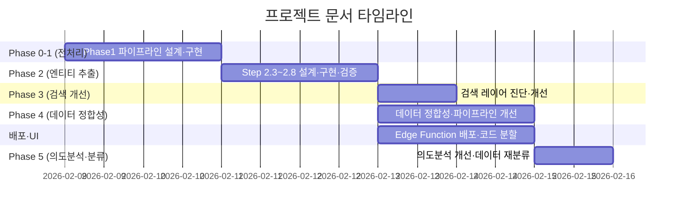

# 📚 Docs Index — 문서 버전 관리

> 최종 업데이트: 2026-02-15  
> 명명 규칙: `YYYYMMDD_Phase{N}_{주제}_{문서유형}.md`

---

## 문서 진행 타임라인



---

## 📂 plans/ — 구현 계획서 (32)

| #   | 날짜  | Phase | 파일명                                                                                                   | 주제                              |
| --- | ----- | ----- | -------------------------------------------------------------------------------------------------------- | --------------------------------- |
| 1   | 02-12 | 2     | [DB적재_RAG검증_실행계획서](plans/20260212_Phase2_DB적재_RAG검증_실행계획서.md)                          | Phase2 DB 적재 + RAG 검증 계획    |
| 2   | 02-12 | 4     | [GraphDB_데이터교정_상세구현계획서](plans/20260212_claude_GraphDB_데이터교정_상세구현계획서.md)          | GraphDB 데이터 교정 (Claude 작성) |
| 3   | 02-12 | 2     | [Phase2_재추출_보완구현계획서](plans/20260212_claude_Phase2_재추출_보완구현계획서.md)                    | Phase2 재추출 보완 (Claude 작성)  |
| 4   | 02-12 | -     | [φ정규화_검색개선_계획서](plans/20260212_다음세션_φ정규화_검색개선_계획서.md)                            | 정규화 + 검색 개선 다음 세션 계획 |
| 5   | 02-13 | 3C    | [chunk본문검색_구현계획서](plans/20260213_Phase3C_chunk본문검색_구현계획서.md)                           | Chunk 본문 검색 구현              |
| 6   | 02-13 | 3     | [다음단계_계획서](plans/20260213_Phase3_다음단계_계획서.md)                                              | Phase3 완료 후 다음 단계          |
| 7   | 02-13 | 3     | [섹션기반_계층탐색_구현계획서](plans/20260213_Phase3_섹션기반_계층탐색_구현계획서.md)                    | 섹션 기반 계층 탐색               |
| 8   | 02-13 | 3     | [이슈진단_및_수정계획서](plans/20260213_Phase3_이슈진단_및_수정계획서.md)                                | Phase3 이슈 진단 + 수정           |
| 9   | 02-13 | 4     | [데이터정합성_개선_구현계획서](plans/20260213_Phase4_데이터정합성_개선_구현계획서.md)                    | 데이터 정합성 개선                |
| 10  | 02-13 | -     | [질의명확화_대화형검색루프_구현계획서](plans/20260213_질의명확화_대화형검색루프_구현계획서.md)           | 질의 명확화 + 대화형 검색 루프    |
| 11  | 02-14 | 4C    | [파이프라인수정_상세구현계획서](plans/20260214_Phase4C-1_파이프라인수정_상세구현계획서.md)               | Phase4C 파이프라인 수정           |
| 12  | 02-14 | 4C    | [다음단계_실행계획서](plans/20260214_Phase4C_다음단계_실행계획서.md)                                     | Phase4C 다음 단계                 |
| 13  | 02-14 | 4C    | [추출파이프라인_개선_구현계획서](plans/20260214_Phase4C_추출파이프라인_개선_구현계획서.md)               | 추출 파이프라인 개선              |
| 14  | 02-14 | -     | [코드분할_상세계획서](plans/20260214_코드분할_상세계획서.md)                                             | Edge Function 코드 분할           |
| 15  | 02-14 | UI    | [명확화UI_드롭다운체크박스_구현계획서](plans/20260214_명확화UI_드롭다운체크박스_구현계획서.md)           | 명확화 UI 드롭다운/체크박스 개선  |
| 16  | 02-14 | UI    | [섹션클릭_하목표시_상세분석서](plans/20260214_UI_섹션클릭_하목표시_상세분석서.md)                        | 섹션 클릭 후 하목 표시 UI 설계    |
| 17  | 02-14 | -     | [TIG용접_키워드fallback_후속계획서](plans/20260214_TIG용접_키워드fallback_후속계획서.md)                 | TIG용접 키워드 폴백 후속 계획     |
| 18  | 02-14 | -     | [강관용접_데이터효율성_개선계획서](plans/20260214_강관용접_데이터효율성_개선계획서.md)                   | 강관용접 데이터 효율성 개선       |
| 19  | 02-14 | -     | [TIG용접_데이터개선_Walkthrough](plans/20260214_TIG용접_데이터개선_Walkthrough.md)                       | TIG용접 데이터 개선 Walkthrough   |
| 20  | 02-15 | 5     | [의도분석_3대개선_구현계획서](plans/20260215_의도분석_3대개선_구현계획서.md)                             | 의도분석 3대 개선 구현            |
| 21  | 02-15 | 5     | [의도분석_개선점_상세분석](plans/20260215_의도분석_개선점_상세분석.md)                                   | 의도분석 개선점 상세 분석         |
| 22  | 02-15 | 5     | [의도분석_프롬프트재설계_및_과잉코드감사](plans/20260215_의도분석_프롬프트재설계_및_과잉코드감사.md)     | 프롬프트 재설계 + 코드 감사       |
| 23  | 02-15 | 5     | [Phase25_Phase3_의도실행연결_구현계획서](plans/20260215_Phase25_Phase3_의도실행연결_구현계획서.md)       | Phase2.5~3 의도-실행 연결         |
| 24  | 02-15 | 5     | [의도분석_Phase12_코드검증보고서](plans/20260215_의도분석_Phase12_코드검증보고서.md)                     | 의도분석 Phase1-2 코드 검증       |
| 25  | 02-15 | 5     | [의도분석_Phase123_전체구현_테스트결과](plans/20260215_의도분석_Phase123_전체구현_테스트결과.md)         | 의도분석 Phase1-3 전체 테스트     |
| 26  | 02-15 | 5     | [의도분석_Phase12_구현완료_Walkthrough](plans/20260215_의도분석_Phase12_구현완료_Walkthrough.md)         | 의도분석 Phase1-2 Walkthrough     |
| 27  | 02-15 | 5     | [의도분석_프롬프트재설계_Walkthrough](plans/20260215_의도분석_프롬프트재설계_Walkthrough.md)             | 프롬프트 재설계 Walkthrough       |
| 28  | 02-15 | -     | [EdgeFunction_리팩토링_Walkthrough](plans/20260215_EdgeFunction_리팩토링_Walkthrough.md)                 | Edge Function 리팩토링 결과       |
| 29  | 02-15 | -     | [TIG용접_키워드폴백_구현과정_및_문제분석](plans/20260215_TIG용접_키워드폴백_구현과정_및_문제분석.md)     | TIG용접 키워드 폴백 문제 분석     |
| 30  | 02-15 | -     | [노무비산출_시스템_구현가능성_분석](plans/20260215_노무비산출_시스템_구현가능성_분석.md)                 | 노무비 산출 시스템 분석           |
| 31  | 02-15 | 5     | [품셈데이터_123차분류_재구조화_구현계획서](plans/20260215_품셈데이터_123차분류_재구조화_구현계획서.md)   | **1·2·3차 분류 재구조화**         |
| 32  | 02-15 | 5     | [Phase123_SubSection_DrillDown_Walkthrough](plans/20260215_Phase123_SubSection_DrillDown_Walkthrough.md) | **Sub Section Drill-Down 완료**   |

---

## 📂 reports/ — 결과 보고서 (23)

| #   | 날짜  | Phase | 파일명                                                                                                         | 주제                            |
| --- | ----- | ----- | -------------------------------------------------------------------------------------------------------------- | ------------------------------- |
| 1   | 02-12 | 2     | [DB적재_임베딩_실행결과](reports/20260212_Phase2_DB적재_임베딩_실행결과.md)                                    | DB 적재 + 임베딩 실행 결과      |
| 2   | 02-12 | 2     | [세션종합보고서](reports/20260212_Phase2_세션종합보고서.md)                                                    | Phase2 세션 종합                |
| 3   | 02-12 | 2     | [파이프라인_재실행_결과보고서](reports/20260212_Phase2_파이프라인_재실행_결과보고서.md)                        | 파이프라인 재실행 결과          |
| 4   | 02-12 | 4     | [RAG검증_결과보고서](reports/20260212_Phase4_RAG검증_결과보고서.md)                                            | RAG 검증 결과                   |
| 5   | 02-13 | -     | [EdgeFunction_배포_가이드](reports/20260213_EdgeFunction_배포_가이드.md)                                       | Edge Function 배포 가이드       |
| 6   | 02-13 | 2     | [세션종합보고서_LATEST](reports/20260213_Phase2_세션종합보고서_LATEST.md)                                      | Phase2 최종 세션 종합           |
| 7   | 02-13 | 2     | [파이프라인_실행결과](reports/20260213_Phase2_파이프라인_실행결과.md)                                          | 파이프라인 실행 결과            |
| 8   | 02-13 | 3C    | [chunk본문검색_테스트결과보고서](reports/20260213_Phase3C_chunk본문검색_테스트결과보고서.md)                   | Chunk 본문 검색 테스트 결과     |
| 9   | 02-13 | 3     | [이슈수정_결과보고서](reports/20260213_Phase3_이슈수정_결과보고서.md)                                          | Phase3 이슈 수정 결과           |
| 10  | 02-13 | 3     | [하위절탐색_구현결과](reports/20260213_Phase3_하위절탐색_구현결과.md)                                          | 하위절 탐색 구현 결과           |
| 11  | 02-13 | 4A    | [EdgeFunction_변경사항_보고서](reports/20260213_Phase4A_EdgeFunction_변경사항_보고서.md)                       | Edge Function 변경사항          |
| 12  | 02-13 | 4B    | [SQL패치_실행결과](reports/20260213_Phase4B_SQL패치_실행결과.md)                                               | SQL 패치 실행 결과              |
| 13  | 02-13 | 4     | [데이터정합성_분석보고서](reports/20260213_Phase4_데이터정합성_분석보고서.md)                                  | 데이터 정합성 분석              |
| 14  | 02-13 | -     | [QuickWin_구현결과](reports/20260213_QuickWin_구현결과.md)                                                     | Quick Win 구현 결과             |
| 15  | 02-13 | -     | [RAG_EdgeFunction배포_테스트결과](reports/20260213_RAG_EdgeFunction배포_테스트결과.md)                         | Edge Function 배포 테스트       |
| 16  | 02-13 | -     | [RAG답변품질_개선결과](reports/20260213_RAG답변품질_개선결과.md)                                               | RAG 답변 품질 개선              |
| 17  | 02-14 | 4B    | [VU형_구분전략_변경보고서](reports/20260214_Phase4B_VU형_구분전략_변경보고서.md)                               | VU형 구분 전략 변경             |
| 18  | 02-14 | 4C    | [DB전수스캔_결과보고서](reports/20260214_Phase4C-0_DB전수스캔_결과보고서.md)                                   | DB 전수 스캔 결과               |
| 19  | 02-14 | 4C    | [SQL수정_결과보고서](reports/20260214_Phase4C-3_SQL수정_결과보고서.md)                                         | SQL 수정 결과                   |
| 20  | 02-14 | -     | [명확화UI_드롭다운_개선_상세검토보고서](reports/20260214_명확화UI_드롭다운_개선_상세검토보고서.md)             | 명확화 UI 개선                  |
| 21  | 02-14 | -     | [의도분석_한영번역_구현보고서](reports/20260214_의도분석_한영번역_구현보고서.md)                               | 의도 분석 한영 번역             |
| 22  | 02-14 | UI    | [섹션클릭_코드검수보고서](reports/20260214_UI_섹션클릭_코드검수보고서.md)                                      | Step 1~3 코드 검수              |
| 23  | 02-15 | 5     | [Phase1_SubSection_DB마이그레이션_결과보고서](reports/20260215_Phase1_SubSection_DB마이그레이션_결과보고서.md) | **Sub Section DB 마이그레이션** |

---

## 📂 reviews/ — 검토·분석 (4)

| #   | 날짜  | 파일명                                                                                          | 주제                    |
| --- | ----- | ----------------------------------------------------------------------------------------------- | ----------------------- |
| 1   | 02-12 | [GraphDB_데이터교정_검토체크리스트](reviews/20260212_Anti_GraphDB_데이터교정_검토체크리스트.md) | GraphDB 교정 체크리스트 |
| 2   | 02-13 | [Gemini_vs_DeepSeek_비교](reviews/20260213_Gemini_vs_DeepSeek_비교.md)                          | LLM 비교 분석           |
| 3   | 02-13 | [검색레이어_공백분석](reviews/20260213_Phase3C_검색레이어_공백분석.md)                          | 검색 레이어 공백 분석   |
| 4   | 02-13 | [RAG답변품질_진단및해결책](reviews/20260213_RAG답변품질_진단및해결책.md)                        | RAG 품질 진단           |

---

## 📂 test-data/ — 테스트 데이터 (8)

| #   | 파일명                       | 용도                     |
| --- | ---------------------------- | ------------------------ |
| 1   | `test_A1_step1.json`         | Step1 검색 테스트        |
| 2   | `test_A2_step2.json`         | Step2 그래프 확장 테스트 |
| 3   | `test_A2_step2_fixed.json`   | Step2 수정 버전          |
| 4   | `test_B_direct.json`         | 직접 검색 테스트         |
| 5   | `test_clarify_response.json` | 명확화 응답 테스트       |
| 6   | `test_fullview_831_3.json`   | 전체보기 테스트          |
| 7   | `test_step2_response.json`   | Step2 응답               |
| 8   | `test_step3_response.json`   | Step3 응답               |

---

## 📂 archive/ — 초기 개발 문서 (37)

2026-02-09 ~ 02-11 기간의 Phase 0~2 초기 개발 문서 37개.  
상세 목록은 `archive/` 폴더를 직접 참조.

| 기간     | 문서 수 | 주요 내용                                         |
| -------- | ------- | ------------------------------------------------- |
| 02-09    | 1       | Phase1 전처리 파이프라인 구현계획                 |
| 02-10    | 5       | Phase1 이슈 분석, Phase2 설계, 데이터 퀄리티 검증 |
| 02-11    | 29      | Step 2.3~2.8 전 단계 설계·구현·검증·검토          |
| 날짜없음 | 2       | GraphRAG 검토보고서, phase 메타 문서              |

---

## 버전 관리 규칙

### 명명 규칙
```
YYYYMMDD_Phase{N}_{주제}_{문서유형}.md
```
- **날짜**: `YYYYMMDD` (작성일)
- **Phase**: `Phase1` ~ `Phase4C` (해당 시 생략 가능)
- **주제**: 핵심 키워드 (한글 OK)
- **문서유형**: `구현계획서` | `결과보고서` | `검토보고서` | `분석` | `가이드`

### 저장 위치 기준
| 유형          | 폴더         | 기준                                              |
| ------------- | ------------ | ------------------------------------------------- |
| 계획서        | `plans/`     | `*계획서.md`, `*계획.md`                          |
| 보고서        | `reports/`   | `*보고서.md`, `*결과*.md`, `*가이드.md`           |
| 검토·분석     | `reviews/`   | `*검토*.md`, `*비교*.md`, `*분석.md`, `*진단*.md` |
| 테스트 데이터 | `test-data/` | `test_*.json`                                     |
| 과거 문서     | `archive/`   | 완료된 Phase의 문서                               |

### 새 문서 작성 시
1. 위 명명 규칙에 따라 파일명 생성
2. 해당 유형 폴더에 저장
3. 이 `INDEX.md`에 해당 섹션 테이블에 행 추가
