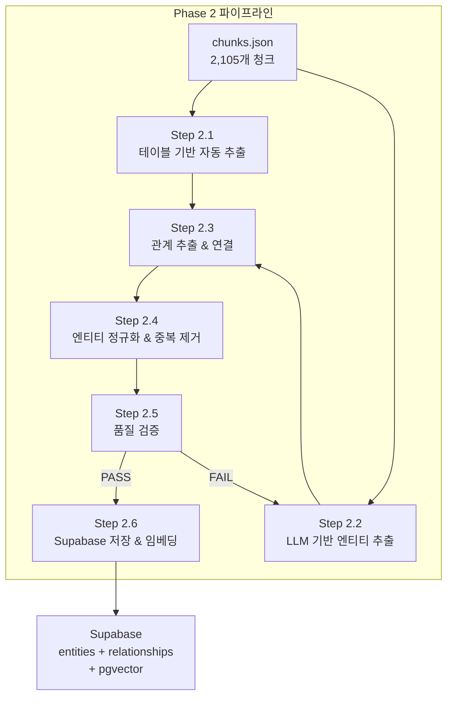

# Phase 2: 엔티티 & 관계 추출 — 상세 구현 계획서

> **문서 버전**: v1.0  
> **작성일**: 2026-02-10  
> **입력**: Phase 1 출력물 (`chunks.json` 2,105개 청크, `raw_sections.json`)  
> **출력**: `entities.json`, `relationships.json` → Supabase 저장  
> **기술 스택**: Python 3.12+, Gemini 2.0 Flash, Supabase pgvector, Pydantic

---

## 1. Phase 1 상태 요약 (전제 조건)

### 1.1 데이터 현황

| 항목        | 수치                             |
| ----------- | -------------------------------- |
| 총 청크     | **2,105개** (파서 강화 후)       |
| 총 테이블   | **2,992개** (파싱 성공률 100%)   |
| 매핑된 섹션 | 1,101개 (고유)                   |
| 5대 부문    | 공통·토목·건축·기계설비·유지관리 |
| 평균 토큰   | ~774                             |

### 1.2 Tier 2 품질 검증 결과 (최종)

| 항목             | 판정   | 수치  | Phase 2 영향                     |
| ---------------- | ------ | ----- | -------------------------------- |
| D1 텍스트 충실도 | ✅ PASS | 99.1% | 텍스트 기반 추출 신뢰 가능       |
| D2 테이블 정확도 | ⚠️ WARN | 91.7% | 테이블 기반 추출 시 8% 오차 가능 |
| D5 주석 추출     | ✅ PASS | 100%  | 주석/조건 추출 신뢰 가능         |
| D6 숫자 보존     | ⚠️ WARN | 85.9% | 수치 추출 시 14% 교차 검증 필요  |
| D7 부문 격리     | ✅ PASS | 0건   | 부문 간 혼동 없음                |

> **결론**: Phase 2 진입에 충분한 품질. D2/D6 WARN은 추출 후 검증 단계에서 보완.

---

## 2. 아키텍처 개요



---

## 3. 온톨로지 설계 (노드 & 엣지)

### 3.1 엔티티 타입 (7종)

| 타입          | 설명           | 예시                                   | 속성                                     |
| ------------- | -------------- | -------------------------------------- | ---------------------------------------- |
| **WorkType**  | 공종/작업 항목 | 콘크리트 타설, 철근 가공, 거푸집 설치  | `name, code, unit, description, spec`    |
| **Labor**     | 노무/인력      | 특별인부, 보통인부, 철근공, 콘크리트공 | `name, grade, unit_cost`                 |
| **Equipment** | 장비/기계      | 굴착기 0.6m³, 레미콘 6m³, 크레인 25t   | `name, spec, capacity, unit_cost`        |
| **Material**  | 자재/재료      | 시멘트, 골재, 철근 D13, 거푸집         | `name, spec, unit, unit_cost`            |
| **Section**   | 품셈 구조 단위 | 6-3-1 거푸집 공사                      | `section_id, title, department, chapter` |
| **Note**      | 주석/조건/할증 | [주]① 운반거리 1km 이내                | `content, type, conditions`              |
| **Standard**  | 적용 기준/규격 | KCS 14 20 10, KDS 14 20 10             | `name, code, version`                    |

### 3.2 관계 타입 (8종)

| 관계                   | 방향                    | 설명                 | 속성                       |
| ---------------------- | ----------------------- | -------------------- | -------------------------- |
| **REQUIRES_LABOR**     | WorkType → Labor        | 공종에 필요한 인력   | `quantity, unit, per_unit` |
| **REQUIRES_EQUIPMENT** | WorkType → Equipment    | 공종에 필요한 장비   | `quantity, unit, duration` |
| **USES_MATERIAL**      | WorkType → Material     | 공종에 사용하는 자재 | `quantity, unit, per_unit` |
| **BELONGS_TO**         | WorkType → Section      | 공종의 소속 섹션     | —                          |
| **HAS_NOTE**           | Section/WorkType → Note | 적용 조건/주석       | —                          |
| **REFERENCES**         | Section → Section       | 섹션 간 교차참조     | `context, ref_type`        |
| **APPLIES_STANDARD**   | WorkType → Standard     | 적용 규격            | —                          |
| **HAS_CHILD**          | Section → Section       | 상위-하위 섹션       | `level`                    |

---

## 4. Step별 상세 설계

### Step 2.1: 테이블 기반 자동 추출 (규칙 기반)

**목적**: 파싱된 테이블 구조(`tables[].headers`, `tables[].rows`)에서 규칙 기반으로 엔티티/관계를 추출.

**대상**: `A_품셈` 유형 테이블 (전체의 ~60%)

```python
# 테이블 유형별 추출 전략
EXTRACTION_STRATEGY = {
    "A_품셈": "rule_based",    # 헤더에 명칭/규격/단위/수량 → 직접 파싱
    "B_규모기준": "condition",  # 조건 노드로 변환
    "C_구분설명": "text",      # 텍스트 분류 (엔티티 추출 불필요)
    "D_기타": "llm_fallback",  # LLM 보조 추출
}
```

**구현 파일**: `phase2_extraction/step1_table_extractor.py`

```python
def extract_from_table(table: dict, section_meta: dict) -> ExtractionResult:
    """A_품셈 테이블에서 규칙 기반 엔티티 추출
    
    헤더 패턴 매칭:
    - '명칭' or '공종명' → WorkType.name
    - '규격' or '사양' → WorkType.spec / Equipment.spec
    - '단위' → unit
    - '수량' → quantity
    - '인력' or '인원' → Labor 엔티티 생성
    - '장비' → Equipment 엔티티 생성
    """
```

**기대 결과**:
- 커버리지: 전체 청크의 ~60% (테이블이 있는 청크)
- 정확도: ~95% (구조화된 데이터이므로 높음)
- 처리 시간: ~30초 (API 호출 없음)

---

### Step 2.2: LLM 기반 엔티티 추출

**목적**: 텍스트 영역 + D_기타 테이블에서 LLM으로 엔티티 추출.

**대상**: 전체 2,105개 청크 (테이블 추출 결과를 컨텍스트로 포함)

**모델**: Gemini 2.0 Flash (비용 효율 우선)

**구현 파일**: `phase2_extraction/step2_llm_extractor.py`

#### 프롬프트 설계

```python
EXTRACTION_PROMPT = """
당신은 건설공사 표준품셈의 구조화 데이터 추출 전문가입니다.

## 작업
아래 품셈 텍스트와 테이블에서 엔티티(공종, 노무, 장비, 자재, 주석)와 관계를 추출하세요.

## 메타데이터
- 섹션: {section_id} | {section_title}
- 부문: {department} | 장: {chapter}

## 텍스트
{chunk_text}

## 테이블 데이터
{table_json}

## 추출 규칙
1. 공종(WorkType): "~공사", "~타설", "~설치", "~가공" 등 작업 단위
2. 노무(Labor): "특별인부", "보통인부", "~공" (콘크리트공, 철근공, 비계공 등)
3. 장비(Equipment): 기계·장비명 + 규격 (예: "굴착기 0.6m³", "크레인 25t")
4. 자재(Material): 자재명 + 규격 (예: "철근 D13", "시멘트")
5. 주석(Note): [주], ①②③ 형태의 적용 조건
6. 수량은 반드시 단위와 함께 추출
7. 원본에 없는 정보를 생성하지 마세요 (할루시네이션 금지)

## 이미 추출된 테이블 기반 엔티티 (참고용, 중복 생성하지 마세요)
{already_extracted}

## 출력 형식
JSON 스키마를 따라 출력하세요.
"""
```

#### Pydantic 스키마

```python
class Entity(BaseModel):
    type: Literal["WorkType", "Labor", "Equipment", "Material", "Note", "Standard"]
    name: str
    properties: dict = {}
    confidence: float = Field(ge=0, le=1)

class Relationship(BaseModel):
    source: str          # 엔티티 이름
    target: str          # 엔티티 이름
    type: Literal[
        "REQUIRES_LABOR", "REQUIRES_EQUIPMENT", "USES_MATERIAL",
        "BELONGS_TO", "HAS_NOTE", "REFERENCES", "APPLIES_STANDARD"
    ]
    properties: dict = {}

class ChunkExtraction(BaseModel):
    entities: list[Entity]
    relationships: list[Relationship]
    summary: str              # 청크 1줄 요약
    confidence: float         # 전체 추출 신뢰도
```

#### 배치 처리 전략

```
처리 단위: 섹션(section_id) 기준 그룹화
동시 요청: 5개 (Gemini API rate limit 준수)
재시도: 3회 (지수 백오프)
실패 처리: failed_extractions.json에 기록 → 수동 검토

예상 시간: 2,105개 ÷ 5 concurrency × ~2초/청크 ≈ 14분
예상 비용: ~2.1M 입력 토큰 × $0.10/M = ~$0.21
```

---

### Step 2.3: 관계 추출 & 연결

**목적**: Step 2.1 + 2.2 결과를 통합하고 추가 관계를 생성.

**구현 파일**: `phase2_extraction/step3_relation_builder.py`

#### 자동 관계 생성

```python
# 1. 섹션 소속 관계 (BELONGS_TO)
#    모든 WorkType → 추출된 section_id의 Section 엔티티
for work_type in entities.filter(type="WorkType"):
    relations.add(BELONGS_TO(work_type, section))

# 2. 섹션 계층 관계 (HAS_CHILD)
#    toc_parsed.json의 섹션 계층 구조에서 자동 생성
#    "6-3" → "6-3-1", "6-3-2", ... 

# 3. 교차참조 관계 (REFERENCES)
#    chunks.json의 cross_references 필드 활용
for ref in chunk.get("cross_references", []):
    relations.add(REFERENCES(section, ref_section, context=ref["context"]))

# 4. 주석 관계 (HAS_NOTE)
#    chunks.json의 notes 필드 활용
for note in chunk.get("notes", []):
    relations.add(HAS_NOTE(section_or_worktype, Note(note)))
```

---

### Step 2.4: 엔티티 정규화 & 중복 제거

**목적**: 다른 청크에서 같은 대상을 다른 이름으로 추출한 경우 통합.

**구현 파일**: `phase2_extraction/step4_normalizer.py`

#### 정규화 규칙

| 케이스             | 예시                       | 처리                               |
| ------------------ | -------------------------- | ---------------------------------- |
| **공백 차이**      | "보통인부" vs "보통 인부"  | 공백 제거 후 비교 → 병합           |
| **규격 포함 여부** | "굴착기" vs "굴착기 0.6m³" | 규격 없는 것을 규격 있는 것에 병합 |
| **약어**           | "콘크리트" vs "Con'c"      | 약어 매핑 테이블 적용              |
| **단위 변환**      | "m³" vs "㎥"               | 유니코드 정규화                    |
| **동의어**         | "특별인부" vs "기능공"     | LLM 판단으로 매핑 (2차)            |

#### 중복 제거 전략

```python
def deduplicate_entities(entities: list[Entity]) -> list[Entity]:
    """
    1차: 정확 매칭 (name 정규화 후)
    2차: 유사도 매칭 (Jaccard > 0.8 or 편집거리 < 2)
    3차: LLM 판단 (유사 후보 묶음을 LLM에게 통합 여부 질의)
    """
```

---

### Step 2.5: 품질 검증

**목적**: 추출 결과가 기준을 충족하는지 검증.

**구현 파일**: `phase2_extraction/step5_extraction_validator.py`

#### 검증 항목

| #   | 검증 항목            | 기준                            | 방법                    |
| --- | -------------------- | ------------------------------- | ----------------------- |
| E1  | **엔티티 커버리지**  | ≥90% 청크에서 1개 이상 추출     | 빈 추출 비율 집계       |
| E2  | **관계 무결성**      | source/target이 entities에 존재 | 참조 유효성 검사        |
| E3  | **수량 단위 완전성** | 수량 있으면 단위 필수           | 필드 존재 검사          |
| E4  | **고아 노드**        | 관계 없는 엔티티 ≤5%            | 그래프 구조 검사        |
| E5  | **LLM 샘플 검증**    | 정확도 ≥90%                     | 50개 샘플 수동 대조     |
| E6  | **할루시네이션**     | 원본에 없는 엔티티 0%           | 엔티티명 원본 포함 검사 |

---

### Step 2.6: Supabase 저장 & 임베딩

**목적**: 검증된 엔티티/관계를 Supabase에 저장하고 벡터 임베딩 생성.

**구현 파일**: `phase2_extraction/step6_supabase_loader.py`

#### DB 스키마

```sql
-- 엔티티 테이블
CREATE TABLE graph_entities (
    id BIGINT GENERATED ALWAYS AS IDENTITY PRIMARY KEY,
    type TEXT NOT NULL,                    -- WorkType, Labor, Equipment, ...
    name TEXT NOT NULL,
    normalized_name TEXT NOT NULL,         -- 정규화된 이름 (검색용)
    properties JSONB DEFAULT '{}',
    source_chunk_ids TEXT[] DEFAULT '{}',  -- 추출 원본 청크 목록
    source_section_id TEXT,
    department TEXT,
    embedding VECTOR(768),                -- text-embedding-004
    created_at TIMESTAMPTZ DEFAULT NOW(),
    
    UNIQUE(type, normalized_name, source_section_id)
);

-- 관계 테이블
CREATE TABLE graph_relationships (
    id BIGINT GENERATED ALWAYS AS IDENTITY PRIMARY KEY,
    source_entity_id BIGINT REFERENCES graph_entities(id) ON DELETE CASCADE,
    target_entity_id BIGINT REFERENCES graph_entities(id) ON DELETE CASCADE,
    type TEXT NOT NULL,
    properties JSONB DEFAULT '{}',
    source_chunk_id TEXT,
    created_at TIMESTAMPTZ DEFAULT NOW()
);

-- 청크 테이블 (기존 unit_costs 형태 유지 + 확장)
CREATE TABLE graph_chunks (
    id BIGINT GENERATED ALWAYS AS IDENTITY PRIMARY KEY,
    chunk_id TEXT UNIQUE NOT NULL,
    section_id TEXT NOT NULL,
    department TEXT,
    chapter TEXT,
    title TEXT,
    content TEXT,                          -- text + tables 결합 텍스트
    metadata JSONB DEFAULT '{}',
    embedding VECTOR(768),
    created_at TIMESTAMPTZ DEFAULT NOW()
);

-- 인덱스
CREATE INDEX idx_entities_type ON graph_entities(type);
CREATE INDEX idx_entities_dept ON graph_entities(department);
CREATE INDEX idx_entities_name_fts ON graph_entities USING GIN (to_tsvector('simple', name));
CREATE INDEX idx_entities_embedding ON graph_entities USING hnsw (embedding vector_cosine_ops);
CREATE INDEX idx_relationships_type ON graph_relationships(type);
CREATE INDEX idx_relationships_source ON graph_relationships(source_entity_id);
CREATE INDEX idx_relationships_target ON graph_relationships(target_entity_id);
CREATE INDEX idx_chunks_section ON graph_chunks(section_id);
CREATE INDEX idx_chunks_embedding ON graph_chunks USING hnsw (embedding vector_cosine_ops);
```

#### 임베딩 생성

```
모델: text-embedding-004 (Google, 768차원)
대상: 
  - graph_entities.name + properties → 엔티티 임베딩
  - graph_chunks.content → 청크 임베딩
비용: ~$0.01 (1.6M 토큰 × $0.006/M)
```

---

## 5. 파일 구조

```
python_code/
├── phase1_output/              # Phase 1 출력 (입력)
│   ├── chunks.json             # 2,105개 청크
│   ├── raw_sections.json       # 원시 섹션
│   └── ...
│
├── phase2_extraction/          # ★ Phase 2 신규
│   ├── __init__.py
│   ├── config.py               # Phase 2 설정 (모델, 임계값, 경로)
│   ├── schemas.py              # Pydantic 스키마 (Entity, Relationship, ...)
│   ├── step1_table_extractor.py    # 테이블 기반 규칙 추출
│   ├── step2_llm_extractor.py      # LLM 기반 엔티티 추출
│   ├── step3_relation_builder.py   # 관계 추출 & 연결
│   ├── step4_normalizer.py         # 엔티티 정규화 & 중복 제거
│   ├── step5_extraction_validator.py  # 품질 검증
│   ├── step6_supabase_loader.py    # DB 저장 & 임베딩
│   ├── run_phase2.py               # 전체 파이프라인 실행
│   └── prompts/
│       ├── entity_extraction.txt   # 추출 프롬프트 템플릿
│       ├── relation_extraction.txt # 관계 추출 프롬프트
│       └── normalization.txt       # 정규화 프롬프트
│
├── phase2_output/              # ★ Phase 2 출력
│   ├── table_entities.json     # Step 2.1 결과
│   ├── llm_entities.json       # Step 2.2 결과
│   ├── merged_entities.json    # Step 2.4 정규화 결과
│   ├── relationships.json      # Step 2.3 관계
│   ├── extraction_report.json  # Step 2.5 검증 리포트
│   └── failed_extractions.json # 실패 건 목록
│
└── docs/
    └── 20260210_Phase2_엔티티관계추출_상세구현계획서.md  ← 이 문서
```

---

## 6. 구현 일정

| 단계      | 작업                                   | 예상 시간   | 의존성       |
| --------- | -------------------------------------- | ----------- | ------------ |
| **Day 1** | `schemas.py` + `config.py` 작성        | 1시간       | 없음         |
| **Day 1** | `step1_table_extractor.py` 구현        | 2시간       | schemas      |
| **Day 1** | 테이블 추출 검증 (샘플 50개)           | 30분        | step1        |
| **Day 2** | `step2_llm_extractor.py` 프롬프트 설계 | 1시간       | schemas      |
| **Day 2** | LLM 추출 프로토타입 (10개 샘플)        | 1시간       | step2        |
| **Day 2** | 프롬프트 튜닝 (few-shot 최적화)        | 1시간       | 프로토타입   |
| **Day 3** | 전체 배치 추출 실행                    | 30분        | 튜닝 완료    |
| **Day 3** | `step3_relation_builder.py` 구현       | 1시간       | step1+2      |
| **Day 3** | `step4_normalizer.py` 구현             | 1시간       | step3        |
| **Day 4** | `step5_extraction_validator.py` 구현   | 1시간       | step4        |
| **Day 4** | 샘플 100건 수동 검증                   | 1시간       | step5        |
| **Day 5** | Supabase 마이그레이션 (테이블 생성)    | 30분        | 없음         |
| **Day 5** | `step6_supabase_loader.py` 구현        | 1시간       | 마이그레이션 |
| **Day 5** | 임베딩 생성 & 업로드                   | 30분        | step6        |
| **총합**  |                                        | **~13시간** | **~5일**     |

---

## 7. 비용 추정

| 항목                     | 모델               | 토큰       | 비용       |
| ------------------------ | ------------------ | ---------- | ---------- |
| 엔티티 추출 (2,105 청크) | Gemini 2.0 Flash   | ~2.1M 입력 | **~$0.21** |
| 실패 건 재추출 (~100건)  | Gemini 2.0 Flash   | ~0.1M      | ~$0.01     |
| 정규화 LLM 판단 (~200건) | Gemini 2.0 Flash   | ~0.2M      | ~$0.02     |
| 임베딩 (엔티티+청크)     | text-embedding-004 | ~2M        | **~$0.01** |
| **총 비용**              |                    |            | **~$0.25** |

---

## 8. 리스크 & 대응

| 리스크                         | 가능성 | 영향 | 대응                                   |
| ------------------------------ | ------ | ---- | -------------------------------------- |
| **LLM 할루시네이션**           | 중간   | 높음 | 원본 대조 검증(E6) + confidence 필터링 |
| **테이블 파싱 오차 8%**        | 확인됨 | 중간 | D2 WARN 섹션은 LLM fallback으로 보완   |
| **엔티티 정규화 실패**         | 중간   | 중간 | LLM 2차 판단 + 수동 매핑 테이블        |
| **Gemini API Rate Limit**      | 낮음   | 낮음 | concurrency 5 + 지수 백오프            |
| **대용량 청크 추출 품질 저하** | 중간   | 낮음 | 2,000+ 토큰 청크 8개 별도 처리         |

---

## 9. 예상 결과 규모

GraphRAG 검토보고서 REV.01 기준 보정:

| 항목                 | 예상치                    |
| -------------------- | ------------------------- |
| 총 엔티티            | **8,000~12,000개**        |
| ├ WorkType           | ~2,500개                  |
| ├ Labor              | ~500개 (정규화 후)        |
| ├ Equipment          | ~800개                    |
| ├ Material           | ~1,500개                  |
| ├ Section            | ~1,100개 (기존 매핑 활용) |
| ├ Note               | ~2,000개                  |
| └ Standard           | ~500개                    |
| 총 관계              | **15,000~25,000개**       |
| ├ REQUIRES_LABOR     | ~5,000개                  |
| ├ REQUIRES_EQUIPMENT | ~3,000개                  |
| ├ USES_MATERIAL      | ~4,000개                  |
| ├ BELONGS_TO         | ~2,500개                  |
| ├ HAS_NOTE           | ~3,000개                  |
| ├ REFERENCES         | ~1,000개                  |
| └ 기타               | ~1,500개                  |

---

## 10. Phase 2 완료 기준

| 기준                   | 조건                                            |
| ---------------------- | ----------------------------------------------- |
| **E1** 엔티티 커버리지 | ≥90% 청크에서 1개 이상 엔티티 추출              |
| **E2** 관계 무결성     | source/target 참조 100% 유효                    |
| **E3** 고아 노드       | ≤5%                                             |
| **E4** 샘플 정확도     | 100건 수동 검증 ≥90%                            |
| **E5** 할루시네이션    | 원본에 없는 엔티티 ≤2%                          |
| **E6** Supabase 적재   | entities + relationships + embeddings 100% 저장 |

---

## 11. Phase 2 이후 연결 (Phase 3~5 미리보기)

```
Phase 2 완료 → graph_entities + graph_relationships + graph_chunks (Supabase)
    ↓
Phase 3: 그래프 검색 함수 구현
    - match_entities() — 벡터 유사도 검색
    - get_entity_neighbors() — N-hop 그래프 탐색
    - hybrid_graph_search() — 벡터 + 그래프 결합
    ↓
Phase 4: RAG 서빙
    - 기존 n8n 챗봇 v13 확장
    - 의도 분류 → 그래프 검색 or 벡터 검색 분기
    - 응답에 엔티티 관계 시각화 포함
```
