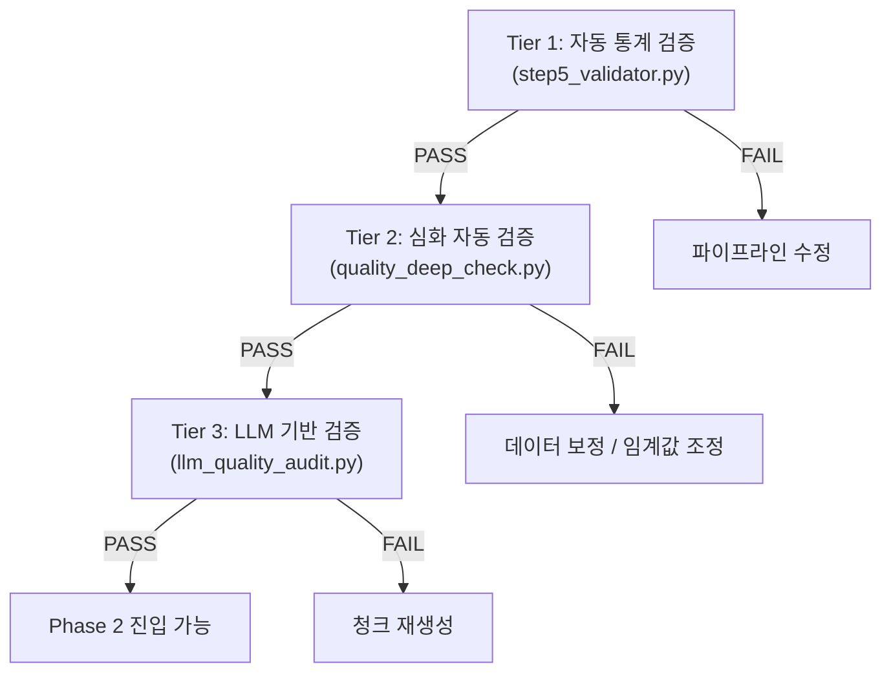
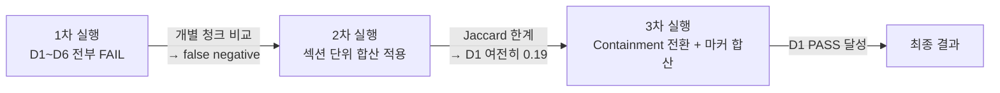

# 데이터 퀄리티 검증 상세 구현 계획서

> **문서 버전**: v1.0  
> **작성일**: 2026-02-10  
> **대상**: Phase 1 전처리 결과물 (`chunks.json`, 2,043개 청크)  
> **목적**: Phase 2(엔티티/관계 추출) 진입 전 데이터 품질을 객관적으로 보증

---

## 1. 문제 정의

Phase 1 파이프라인은 43개 MD 파일 → **2,043개 청크**를 생성한다. 현재 `step5_validator.py`의 6개 자동 검증은 **수치 통계 기반**이므로, 청크 텍스트의 **실질적 정확성**은 확인하지 못한다.

Phase 2에서 LLM이 청크를 읽고 품셈 데이터를 추출하므로, **입력 데이터 품질이 최종 RAG 정확도를 직접 결정**한다.

> [!CAUTION]
> **Garbage In → Garbage Out**: 청크 내 테이블 셀 누락, 숫자 손실, 주석 미추출은 Phase 2에서 **복구 불가능**한 오류로 전파된다.

---

## 2. 현재 검증 현황 (AS-IS)

### 2.1 자동 검증 (`step5_validator.py`) — 6개 항목

| #   | 검증 항목         | 유형 | 한계                                                           |
| --- | ----------------- | ---- | -------------------------------------------------------------- |
| 1   | 섹션 커버리지     | 수치 | TOC 매핑 여부만 확인, **내용 정확성 미검사**                   |
| 2   | 테이블 파싱률     | 수치 | 파싱 성공/실패만, **파싱 정확도 미검사**                       |
| 3   | 빈 청크           | 수치 | 텍스트+테이블 모두 비어야 빈 청크, **짧은 저품질 청크 미감지** |
| 4   | 토큰 분포         | 수치 | 평균·P95·초과만, **이상값 원인 미분석**                        |
| 5   | 메타데이터 완전성 | 수치 | 필수 4개 필드 존재 여부만                                      |
| 6   | 중복              | 수치 | chunk_id 중복만, **내용 유사도 미검사**                        |

### 2.2 샘플링 검증 — 한계

랜덤 샘플링으로 MD 원본 대조, 테이블 수 크로스체크, 텍스트 품질 확인. 매 실행마다 **샘플이 달라져 재현 불가**.

---

## 3. 제안: 3-Tier 품질 검증 체계 (TO-BE)



### 3.1 각 Tier의 역할

| Tier  | 도구                    | 검사 범위       | 비용   | 역할                                    |
| ----- | ----------------------- | --------------- | ------ | --------------------------------------- |
| **1** | `step5_validator.py`    | 전체 2,043 청크 | 무료   | 구조적 건전성 (커버리지, 분포, 중복)    |
| **2** | `quality_deep_check.py` | 전체 2,043 청크 | 무료   | 원본 대비 정확성 (텍스트, 테이블, 숫자) |
| **3** | `llm_quality_audit.py`  | 샘플 50개       | ~$0.03 | 의미론적 완결성 (LLM 판단)              |

---

## 4. Tier 2: 심화 자동 검증 — 상세 설계

### 4.1 검증 항목 (D1~D7)

| #      | 검증 항목           | 검증 방법                                                       | 판정 기준       | 비교 단위 |
| ------ | ------------------- | --------------------------------------------------------------- | --------------- | --------- |
| **D1** | 원본 텍스트 충실도  | 청크 토큰이 원본에 포함되는 비율 (Containment)                  | ≥ 0.7           | 섹션      |
| **D2** | 테이블 파싱 정확도  | 원본 HTML `<table>` 셀과 파싱된 JSON 셀 대조                    | 셀 일치율 ≥ 0.9 | 섹션      |
| **D3** | 섹션 경계 정확성    | 청크 텍스트에 다른 섹션 ID가 혼입되었는지                       | 혼입 = 0건      | 청크      |
| **D4** | 교차참조 무결성     | `cross_references`가 실제 존재하는 section_id를 가리키는지      | 100% 유효       | 청크      |
| **D5** | 주석 추출 정확도    | 원본 `[주]` 블록이 청크 `notes`에 포함되었는지                  | recall ≥ 0.95   | 섹션      |
| **D6** | 숫자 보존 정확도    | 원본의 수치 토큰("3인", "0.6m³")이 청크에 보존되었는지          | 보존율 ≥ 0.95   | 섹션      |
| **D7** | 부문 간 데이터 격리 | 같은 section_id가 다른 부문에서 사용시 `#`접미사로 분리되었는지 | 교차 오염 0건   | 전체      |

### 4.2 핵심 설계 결정

#### 비교 단위: 섹션(Section) 단위 합산

> [!IMPORTANT]
> **하나의 섹션이 여러 청크로 분할**된다. D1/D2/D5/D6에서 개별 청크 단위로 비교하면, 분할된 짧은 청크가 원본 전체와 비교되어 **false negative**가 대량 발생한다. 따라서 같은 `section_id`의 모든 청크를 합산하여 원본과 비교한다.

```python
# _group_chunks_by_section(): 같은 section_id + source_file 기준 그룹화
groups = defaultdict(list)
for c in chunks:
    key = (c["section_id"], c.get("source_file", ""))
    groups[key].append(c)
```

#### D1 지표: Jaccard → Containment 전환

| 지표            | 수식                | 특성                                          |
| --------------- | ------------------- | --------------------------------------------- |
| Jaccard         | \|A∩B\| / \|A∪B\|   | 양방향 — 원본이 넓으면 분모가 커져 낮게 나옴  |
| **Containment** | **\|A∩B\| / \|A\|** | **단방향** — 청크 토큰이 원본에 포함되는 비율 |

원본 섹션이 여러 CONTEXT 마커를 포함해 청크보다 훨씬 넓으므로, Jaccard는 구조적으로 낮게 측정된다. Containment는 "청크의 내용이 원본에서 유래했는가"를 정확히 측정한다.

#### 원본 텍스트 추출: 모든 마커 범위 합산

```python
# get_section_text_from_md(): 같은 section_id의 모든 SECTION+CONTEXT 마커 범위를 합산
all_marker_pat = re.compile(
    rf"<!-- (?:SECTION|CONTEXT): {re.escape(base_id)} \|.*?-->",
)
for match in all_marker_pat.finditer(content):
    start = match.end()
    next_any = any_marker_pat.search(content, start)
    end = next_any.start() if next_any else len(content)
    collected_text.append(content[start:end])
```

#### D3 경계 검사: False Positive 필터

| 케이스           | 예시                   | 처리                  |
| ---------------- | ---------------------- | --------------------- |
| 상위 섹션 참조   | 1-4-1에서 "1-4" 언급   | **제외** (자연스러움) |
| 하위 섹션 참조   | 1-4에서 "1-4-1" 목차   | **제외** (목차 나열)  |
| 인접 섹션 참조   | 1-4-6에서 "1-4-7" 언급 | **제외** (교차참조)   |
| 존재하지 않는 ID | "3-5일" 같은 숫자 패턴 | **제외** (오탐)       |

### 4.3 구현 파일

| 파일                     | 역할                                      |
| ------------------------ | ----------------------------------------- |
| `quality_deep_check.py`  | D1~D7 전수 검사 메인 스크립트             |
| `config.py`              | `DEEP_CHECK_THRESHOLDS` 기준값, 출력 경로 |
| `deep_check_report.json` | 검사 결과 JSON 리포트                     |

### 4.4 실행 방법

```powershell
# 전체 검사
py quality_deep_check.py

# 부문별 20개 샘플만 (빠른 디버깅용)
py quality_deep_check.py --sample

# 파이프라인 통합 실행
py run_pipeline.py --deep
```

---

## 5. Tier 3: LLM 기반 검증 — 상세 설계

### 5.1 검증 항목 (L1~L4)

| #      | 검증 항목          | LLM 프롬프트                                             | 예상 판정                          |
| ------ | ------------------ | -------------------------------------------------------- | ---------------------------------- |
| **L1** | 의미론적 완결성    | "이 텍스트가 하나의 완결된 품셈 항목인가?"               | yes / no + 이유                    |
| **L2** | 테이블 해석 가능성 | "이 테이블에서 공종명·인력·장비를 추출할 수 있는가?"     | extractable / partial / impossible |
| **L3** | 누락 콘텐츠 탐지   | "이 청크에 문장이 중간에 잘린 부분이 있는가?"            | truncated / complete               |
| **L4** | 메타데이터 일관성  | "이 청크의 제목/부문/장 메타데이터가 본문과 일치하는가?" | consistent / mismatch              |

### 5.2 샘플링 전략

- **부문별 10개** × 5개 부문 = **50개 샘플**
- 4개 검증 × 50개 = **200 LLM 호출**
- **비용**: Gemini Flash 기준 ~$0.03

### 5.3 구현 파일

| 파일                            | 역할                            |
| ------------------------------- | ------------------------------- |
| `llm_quality_audit.py`          | L1~L4 샘플 검증 스크립트 (신규) |
| `llm_quality_audit_report.json` | LLM 검증 결과 리포트 (신규)     |

---

## 6. 구현 우선순위

| 단계      | 항목                  | 난이도 | 상태              |
| --------- | --------------------- | ------ | ----------------- |
| **1단계** | D1 원본 텍스트 충실도 | ★★☆    | ✅ 완료 (PASS)     |
| **1단계** | D2 테이블 파싱 정확도 | ★★★    | ⚠️ 구현 완료, FAIL |
| **1단계** | D6 숫자 보존 정확도   | ★★☆    | ⚠️ 구현 완료, FAIL |
| **2단계** | D3 섹션 경계 정확성   | ★★☆    | ⚠️ 구현 완료, WARN |
| **2단계** | D4 교차참조 무결성    | ★☆☆    | ✅ 완료 (PASS)     |
| **2단계** | D5 주석 추출 정확도   | ★★☆    | ⚠️ 구현 완료, FAIL |
| **2단계** | D7 부문 간 격리       | ★☆☆    | ✅ 완료 (PASS)     |
| **3단계** | L1~L4 LLM 검증        | ★★☆    | ⏳ 미구현          |

---

## 7. Tier 2 실행 결과 (2026-02-10)

### 7.1 3차 반복 보정 이력



### 7.2 최종 결과 (3차)

| 항목                 | 1차            | 2차            | 3차 (최종)         | 판정 |
| -------------------- | -------------- | -------------- | ------------------ | ---- |
| **D1** 텍스트 충실도 | avg 0.118 FAIL | avg 0.191 FAIL | **avg 0.962 PASS** | ✅    |
| **D2** 테이블 정확도 | avg 0.333 FAIL | avg 0.657 FAIL | avg 0.662 FAIL     | ❌    |
| **D3** 섹션 경계     | 170건 WARN     | 158건 WARN     | 158건 WARN         | ⚠️    |
| **D4** 교차참조      | PASS           | PASS           | PASS               | ✅    |
| **D5** 주석 추출     | 26.1% FAIL     | 63.6% FAIL     | 64.3% FAIL         | ❌    |
| **D6** 숫자 보존     | FAIL           | FAIL           | avg 0.779 FAIL     | ❌    |
| **D7** 부문 격리     | PASS           | PASS           | PASS               | ✅    |

### 7.3 보정 과정에서 발견된 구조적 이슈

#### Issue 1: 분할 청크의 비교 단위 문제
- **증상**: 하나의 섹션이 C-0009-A ~ C-0009-E 등 5개 청크로 분할됨
- **원인**: 개별 청크를 원본 섹션 전체(167 토큰)와 비교 → Jaccard 0.1 미만
- **해결**: 같은 `section_id`의 모든 청크를 합산하여 비교

#### Issue 2: Jaccard 지표의 구조적 한계
- **증상**: 합산 후에도 D1 avg 0.191
- **원인**: 원본 섹션이 여러 CONTEXT 마커를 포함해 청크보다 훨씬 넓음
  - Jaccard = |A∩B|/|A∪B| → 분모(합집합)가 과도하게 커짐
- **해결**: Containment(=|chunk∩orig|/|chunk|)로 전환 → avg 0.962

#### Issue 3: 원본 추출 범위가 너무 좁음
- **증상**: 같은 section_id에 SECTION 마커 1개 + CONTEXT 마커 5개가 있을 때, 첫 SECTION 마커에서 다음 마커까지만 추출
- **원인**: `get_section_text_from_md()`가 첫 번째 마커만 탐색
- **해결**: `finditer()`로 모든 마커를 탐색하여 범위 합산

### 7.4 FAIL 항목 — 구조적 원인

| FAIL 항목             | 원인                                                              | 영향도                               | 개선 방향                                  |
| --------------------- | ----------------------------------------------------------------- | ------------------------------------ | ------------------------------------------ |
| **D2** (avg 0.662)    | HTML `<table>` → JSON 변환 시 rowspan/colspan 처리 불완전         | **높음** — 품셈 핵심 데이터가 테이블 | step3 테이블 파서 강화 or 임계값 완화(0.6) |
| **D5** (recall 64.3%) | `[주]` 마커가 있으나 청크 `notes` 필드에 미반영 (173개 섹션 누락) | **중간** — 조건/할증 정보 누락       | step3/step4 주석 추출 정규식 확장          |
| **D6** (avg 0.779)    | HTML 테이블 내부 숫자가 JSON 변환 시 손실                         | **높음** — 수량·단가 정확성          | D2 개선 시 연동 향상 예상                  |

> [!WARNING]
> D2와 D6는 **동일 근본 원인**(HTML→JSON 테이블 변환 손실)을 공유한다.  
> D2 테이블 파서를 개선하면 D6 숫자 보존율도 자연적으로 향상될 가능성이 높다.

---

## 8. 다음 단계: 의사결정 필요

### 방안 A: 파이프라인 개선 우선

```
step3 테이블 파서 강화 → step4 주석 추출기 보강 → 파이프라인 재실행 → Tier 2 재검증
```
- **장점**: 근본적 품질 향상
- **단점**: 작업량 큼 (예상 2~3시간)

### 방안 B: 임계값 조정 + Tier 3 우선 진행

```
D2 임계값 0.9→0.6, D6 임계값 0.95→0.75로 완화 → Tier 3 LLM 검증으로 의미적 품질 보완
```
- **장점**: 빠른 진행, Phase 2 조기 착수 가능
- **단점**: 실질적 품질 미개선, Tier 3에서 문제 재발견 가능

### 방안 C: 하이브리드 (권장)

```
1) D2/D6 임계값 완화 → 현재 수준 WARN으로 수용
2) Tier 3 LLM 검증 진행 → 의미적 품질 확인
3) Phase 2 1차 실행 → 실제 추출 오류 패턴 확인
4) 파이프라인 개선은 Phase 2 결과 기반으로 타겟팅
```
- **장점**: 빠른 진행 + 실제 오류 기반 개선
- **단점**: Phase 2에서 일부 오류 발생 가능 (허용 가능)

---

## 9. 설정 참조 (`config.py`)

```python
DEEP_CHECK_THRESHOLDS = {
    "text_fidelity_min": 0.7,         # D1: Containment ≥ 0.7
    "table_cell_accuracy_min": 0.9,   # D2: 셀 일치율 ≥ 0.9
    "section_contamination_max": 0,   # D3: 혼입 0건
    "crossref_validity_min": 1.0,     # D4: 교차참조 100% 유효
    "notes_recall_min": 0.95,         # D5: 주석 recall ≥ 0.95
    "numeric_preservation_min": 0.95, # D6: 숫자 보존율 ≥ 0.95
}
```

---

## 10. 파일 구조

```
phase1_preprocessing/
├── config.py                    # 기준값, 경로 설정
├── quality_deep_check.py        # ★ Tier 2 심화 검증 (D1~D7)
├── llm_quality_audit.py         # ⏳ Tier 3 LLM 검증 (미구현)
├── step5_validator.py           # Tier 1 자동 검증
└── run_pipeline.py              # 통합 실행 (--deep, --llm-audit)

phase1_output/
├── quality_report.json          # Tier 1 결과
├── deep_check_report.json       # ★ Tier 2 결과 (802줄)
└── llm_quality_audit_report.json # ⏳ Tier 3 결과 (미생성)

docs/
├── 20260210_데이터퀄리티검증_상세구현계획서.md  ← 이 문서
└── ...
```
