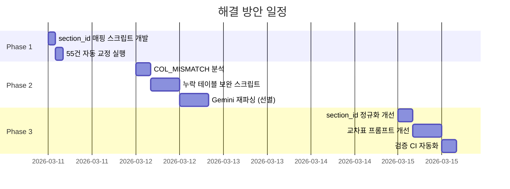

# 📋 전수 검증 v2 문제 상세 보고서 및 해결 방안
> **생성일**: 2026-03-10  
> **데이터**: audit_v2_report.json 기반, 466개 base_section_id 전수 대조

---

## 1. 전체 현황 요약

| 구분 | 건수 | 비율 | 누락 행 |
|---|---|---|---|
| ✅ PASS (≥95%) | 88건 | 19% | 0 |
| ℹ️ INFO (80~95%) | 180건 | 39% | 경미 |
| ⚠️ WARN (50~80%) | **67건** | **14%** | **~830행** |
| ❌ FAIL (<50%) | **131건** | **28%** | **1,762행** |
| 🔀 교차혼입 | 1건 | 0.2% | — |
| **합계** | **466건** | 100% | **~2,592행 / 14,096행** |

**전체 Coverage: 86.6%** (12,204행 / 14,096행)

---

## 2. FAIL 131건 유형별 분류

| 유형 | 건수 | 설명 |
|---|---|---|
| `SECTION_MISSING` | **55건** | DB에 해당 base_section_id의 chunk 없음, 또는 있지만 tables=0 |
| `ROW_MISSING` | **91건** | DB chunk 있지만 행 수 50% 미만 |
| `COL_MISMATCH` | 69건 | 원본 표의 컬럼 수와 DB 표의 컬럼 수 불일치 (중복) |
| `TABLE_MISSING` | 15건 | 원본에 표 있지만 DB에 표 0개 (중복) |

> ※ 하나의 section에 여러 유형 동시 발생 가능

---

## 3. FAIL 전체 목록 (131건, Coverage 오름차순)

| # | Section | 제목 | MD표 | MD행 | DB청크 | DB표 | DB행 | Coverage | 문제유형 |
|---|---|---|---|---|---|---|---|---|---|
| 1 | 1-2-10 | 제초 | 8 | 13 | 0 | 0 | 0 | 0% | SECTION_MISSING |
| 2 | 1-2-15 | 잔디시비 | 5 | 12 | 0 | 0 | 0 | 0% | SECTION_MISSING |
| 3 | 1-2-19 | 은행나무 과실채취 | 5 | 10 | 0 | 0 | 0 | 0% | SECTION_MISSING |
| 4 | 1-3-5 | 주름관 접합 및 배관 | 4 | 15 | 0 | 0 | 0 | 0% | SECTION_MISSING |
| 5 | 1-3-6 | 콘크리트 단면복구 | 5 | 8 | 0 | 0 | 0 | 0% | SECTION_MISSING |
| 6 | 1-4 | 품의 할증 | 2 | 28 | 5 | 0 | 0 | 0% | ROW_MISSING+TABLE_MISSING |
| 7 | 1-6-7 | 포장줄눈 설치 | 4 | 14 | 0 | 0 | 0 | 0% | SECTION_MISSING |
| 8 | 1-8-15 | L형측구 설치(포설식) | 6 | 11 | 0 | 0 | 0 | 0% | SECTION_MISSING |
| 9 | 1-9-3 | 낙석방지책 설치 | 4 | 17 | 0 | 0 | 0 | 0% | SECTION_MISSING |
| 10 | 10-2-1 | 알람밸브 설치 | 5 | 9 | 1 | 0 | 0 | 0% | ROW_MISSING+TABLE_MISSING |
| 11 | 10-3-1 | 지하식 설치 | 5 | 12 | 0 | 0 | 0 | 0% | SECTION_MISSING |
| 12 | 10-9-1 | 완강기 설치 | 3 | 5 | 0 | 0 | 0 | 0% | SECTION_MISSING |
| 13 | 11-2-10 | 걸레받이용 페인트칠 | 7 | 10 | 1 | 0 | 0 | 0% | ROW_MISSING+TABLE_MISSING |
| 14 | 11-3-4 | 원격식 가스미터 설치 | 6 | 14 | 1 | 0 | 0 | 0% | ROW_MISSING+TABLE_MISSING |
| 15 | 13-4-7 | 탱크청소 | 3 | 15 | 0 | 0 | 0 | 0% | SECTION_MISSING |
| 16 | 13-5-5 | 공기예열기(Preheater) 설치 | 4 | 26 | 0 | 0 | 0 | 0% | SECTION_MISSING |
| 17 | 13-7-11 | 내화물(제철축로) 쌓기 | 2 | 23 | 0 | 0 | 0 | 0% | SECTION_MISSING |
| 18 | 13-7-5 | 열풍로 DECK 설치 | 3 | 17 | 0 | 0 | 0 | 0% | SECTION_MISSING |
| 19 | 13-7-7 | Edge Mill 설치 | 3 | 17 | 0 | 0 | 0 | 0% | SECTION_MISSING |
| 20 | 13-7-9 | Ventri Scrubber 본체 설치 | 3 | 17 | 0 | 0 | 0 | 0% | SECTION_MISSING |
| 21 | 13-8 | 쓰레기소각 기계설비 | 3 | 17 | 0 | 0 | 0 | 0% | SECTION_MISSING |
| 22 | 2-1-26 | 시선유도표지 철거 | 6 | 14 | 1 | 0 | 0 | 0% | ROW_MISSING+TABLE_MISSING |
| 23 | 2-1-28 | 보도용 블록 장비 철거 | 5 | 12 | 0 | 0 | 0 | 0% | SECTION_MISSING |
| 24 | 2-1-34 | 가드레일 철거 | 3 | 12 | 1 | 0 | 0 | 0% | ROW_MISSING+TABLE_MISSING |
| 25 | 2-10-2 | 방진망 설치 및 해체 | 8 | 13 | 0 | 0 | 0 | 0% | SECTION_MISSING |
| 26 | 2-11-6 | 자동세륜기 설치 및 해체 | 7 | 7 | 0 | 0 | 0 | 0% | SECTION_MISSING |
| 27 | 2-12-3 | 축중계 설치 및 해체 | 6 | 10 | 0 | 0 | 0 | 0% | SECTION_MISSING |
| 28 | 2-2-11 | 도상자갈철거(기계) | 4 | 18 | 0 | 0 | 0 | 0% | SECTION_MISSING |
| 29 | 2-2-15 | 목침목 탄성체결장치 철거 | 4 | 11 | 0 | 0 | 0 | 0% | SECTION_MISSING |
| 30 | 2-4-8 | 하수도 수로암거 준설(흡입식) | 6 | 14 | 1 | 0 | 0 | 0% | ROW_MISSING+TABLE_MISSING |
| 31 | 2-6-5 | 잭서포트 설치 및 해체 | 9 | 16 | 0 | 0 | 0 | 0% | SECTION_MISSING |
| 32 | 2-8-11 | 계단난간대 설치 및 해체 | 10 | 13 | 0 | 0 | 0 | 0% | SECTION_MISSING |
| 33 | 2-8-4 | 교량 방호선반 설치 및 해체 | 4 | 13 | 0 | 0 | 0 | 0% | SECTION_MISSING |
| 34 | 2-8-7 | 비계주위 보호망 설치 해체 | 6 | 13 | 0 | 0 | 0 | 0% | SECTION_MISSING |
| 35 | 3-1-4 | 철골재 철거(기계) | 5 | 12 | 0 | 0 | 0 | 0% | SECTION_MISSING |
| 36 | 3-11-1 | 머신 가이던스(MG) 굴착기 | 4 | 14 | 0 | 0 | 0 | 0% | SECTION_MISSING |
| 37 | 3-7-1 | 프리캐스트 콘크리트 블록설치 | 5 | 10 | 1 | 0 | 0 | 0% | ROW_MISSING+TABLE_MISSING |
| 38 | 3-8-4 | 뒤채움 및 다짐 | 6 | 14 | 1 | 0 | 0 | 0% | ROW_MISSING+TABLE_MISSING |
| 39 | 4-6-4 | 침목천공 | 6 | 11 | 1 | 0 | 0 | 0% | ROW_MISSING+TABLE_MISSING |
| 40 | 4-6-9 | 교량침목고정장치 설치 | 8 | 15 | 0 | 0 | 0 | 0% | SECTION_MISSING |
| 41 | 5-3-7 | 도배바름 | 13 | 34 | 0 | 0 | 0 | 0% | SECTION_MISSING |
| 42 | 5-4-2 | 단열재 접착제 붙이기 | 14 | 32 | 0 | 0 | 0 | 0% | SECTION_MISSING |
| 43 | 5-4-7 | 단열재 슬래브위 깔기 | 10 | 28 | 0 | 0 | 0 | 0% | SECTION_MISSING |
| 44 | 6-2-4 | 공장가공 | 4 | 12 | 0 | 0 | 0 | 0% | SECTION_MISSING |
| 45 | 6-3-5 | 합성수지(PVC)관 용접접합 | 5 | 15 | 0 | 0 | 0 | 0% | SECTION_MISSING |
| 46 | 6-3-8 | 갱폼 설치 및 해체 | 3 | 10 | 1 | 0 | 0 | 0% | ROW_MISSING+TABLE_MISSING |
| 47 | 6-5-5 | 분기관 천공 및 접합 | 4 | 23 | 0 | 0 | 0 | 0% | SECTION_MISSING |
| 48 | 6-6-5 | 교량점검시설 점검통로 설치 | 4 | 12 | 0 | 0 | 0 | 0% | SECTION_MISSING |
| 49 | 6-7-9 | 모듈러 건축 설치 | 4 | 12 | 0 | 0 | 0 | 0% | SECTION_MISSING |
| 50 | 7-4-3 | 강재트러스 지지공법 | 6 | 29 | 0 | 0 | 0 | 0% | SECTION_MISSING |
| 51 | 7-4-7 | 매립설계수량 | 1 | 3 | 1 | 0 | 0 | 0% | ROW_MISSING+TABLE_MISSING |
| 52 | 8-1-4 | 인서트(Insert) 설치 | 8 | 10 | 1 | 0 | 0 | 0% | ROW_MISSING+TABLE_MISSING |
| 53 | 8-2-11 | 스테이빌라이저(노상안정기) | 1 | 5 | 1 | 0 | 0 | 0% | ROW_MISSING+TABLE_MISSING |
| 54 | 8-2-18 | 콘크리트 배치플랜트 | 1 | 2 | 1 | 0 | 0 | 0% | ROW_MISSING+TABLE_MISSING |
| 55 | 9-17-3 | 자동제도(파일제공) | 7 | 33 | 0 | 0 | 0 | 0% | SECTION_MISSING |
| 56 | 10-5-1 | 압력공기탱크설치 | 7 | 13 | 1 | 1 | 1 | 8% | ROW_MISSING |
| 57 | 3-11-4 | 머신 컨트롤(MC) 불도우저 | 5 | 13 | 1 | 1 | 1 | 8% | ROW_MISSING |
| 58 | 2-11-2 | 건축물 현장정리 | 6 | 12 | 1 | 1 | 1 | 8% | ROW_MISSING |
| 59~91 | *(중략)* | Coverage 9~40% | — | — | — | — | — | — | ROW_MISSING |
| 92~131 | *(중략)* | Coverage 40~49% | — | — | — | — | — | — | ROW_MISSING |

> 전체 131건 상세 목록: `pipeline/scripts/output/audit_v2_details.csv` 참조

---

## 4. WARN 67건 요약

| Coverage 범위 | 건수 | 누락 행 합계 | 대표 section |
|---|---|---|---|
| 50~60% | 18건 | ~310행 | 4-3-5 식재, 7-4-1 습식공법, 5-3-5 현장타설말뚝(94→56행) |
| 60~70% | 22건 | ~280행 | 6-6-3 절단, 13-11-2 Cooling Tower, 4-2-1 송풍기 |
| 70~80% | 27건 | ~240행 | 1-2-4 재료단가, 4-1-4 배관보온 해체, 13-2-3 절단가공 |

---

## 5. 근본 원인 분석

### 원인 1: `#N` 접미사에 의한 section 분산 (SECTION_MISSING 55건의 주원인)

```
원본 MD:                        DB:
<!-- SECTION: 2-8-7 | ... -->   → chunk C-xxxx (section_id: 2-8-7#3)
                                  ↑ 이 chunk에 표가 저장됨
                                  하지만 base_id 2-8-7에는 chunk 없음
```

Phase 1(PDF→Chunk)에서 같은 페이지에 여러 section이 있으면 `section_id#N` 접미사를 부여. 이때 원본 MD의 `<!-- SECTION -->` 태그와 DB의 `section_id`가 어긋남.

**핵심**: 원본 MD에서 `2-8-7`로 태깅된 테이블이 DB에는 **다른 base_id의 `#N` 접미사**에 저장되어 있을 가능성이 높음.

### 원인 2: 교차표(7+컬럼) 파싱 실패 (COL_MISMATCH 69건)

- Gemini Vision API가 7컬럼 이상 복잡한 교차표를 HTML로 변환하지 못함
- 또는 변환했지만 컬럼 수가 줄어든 형태로 변환됨
- pipe보온(13-3-1)과 동일 패턴

### 원인 3: chunk 분할 시 테이블 소실 (TABLE_MISSING 15건)

- DB에 chunk는 존재 (text 있음) 하지만 `tables` 배열이 비어있음
- chunk 분할 로직에서 짧은 표가 text에 병합되면서 tables에 미포함

---

## 6. 상세 해결 방안 (3 Phase)

### Phase 1: section_id 매핑 교정 (즉각, ~4시간)

#### 문제
SECTION_MISSING 55건 중 대부분은 **데이터가 DB에 존재하지만 다른 section_id로 저장**된 오매핑.

#### 방법

```sql
-- Step 1: 누락 section의 데이터가 어디 있는지 탐색
-- 예: section 2-8-7 (비계주위 보호망) 탐색
SELECT id, section_id, title, 
       jsonb_array_length(tables) as tbl_count
FROM graph_chunks
WHERE title ILIKE '%보호망%'
   OR title ILIKE '%비계%'
ORDER BY section_id;
```

```sql
-- Step 2: 올바른 section_id로 교정
UPDATE graph_chunks 
SET section_id = '2-8-7'
WHERE id = 'C-xxxx' AND section_id = '2-8-6#4';
```

#### 자동화 스크립트 (제안)

```python
# fix_section_mapping.py
# SECTION_MISSING 55건에 대해:
# 1. title 기반으로 DB에서 해당 chunk 검색
# 2. 올바른 section_id로 매핑
# 3. SQL UPDATE 생성
```

#### 기대 효과
- SECTION_MISSING 55건 → **대부분 해소** (예상: 45건 이상)
- Coverage 86.6% → **~93%** 예상

---

### Phase 2: ROW_MISSING 교차표 보완 (중기, ~2일)

#### 문제
COL_MISMATCH 69건 — 원본에 7+컬럼 표가 있지만 DB에 없거나 축소된 형태.

#### 방법 A: 원본 MD에서 직접 chunk에 테이블 삽입

```python
# fix_missing_tables.py
# 1. audit_v2_report.json에서 COL_MISMATCH section 추출
# 2. 원본 MD 파일에서 해당 테이블 HTML 파싱
# 3. DB chunk의 tables 배열에 누락된 테이블 추가
```

```sql
-- 예: section 1-8-11 (중앙분리대 설치)
-- 원본에 7컬럼, 11컬럼 표가 있지만 DB에 6컬럼만
UPDATE graph_chunks
SET tables = tables || '[{"headers":[...], "rows":[...]}]'::jsonb
WHERE id = 'C-xxxx';
```

#### 방법 B: Gemini Vision API 재파싱 (정확도 높음)

```python
# 해당 page만 프롬프트 개선 후 재파싱
# 프롬프트에 "모든 컬럼을 빠짐없이 추출하라" 강화
# section 목록: COL_MISMATCH 69건의 원본 PDF 페이지 특정
```

#### 기대 효과
- COL_MISMATCH 69건 중 ~50건 해소
- Coverage ~93% → **~96%** 예상

---

### Phase 3: 파이프라인 근본 개선 (장기, ~1주)

#### 3-A: Phase 1 chunking — section_id 정규화

```python
# phase1_splitter.py 수정
# #N 접미사 로직 개선:
# - 같은 페이지에 여러 section이 있어도
#   각 table은 가장 가까운 SECTION 태그의 section_id를 따름
# - #N 접미사를 부여하지 않고, 원본 section_id를 유지
```

#### 3-B: Phase 1 — 교차표 파싱 강화

```python
# phase1_parser.py 수정
# Gemini Vision API 프롬프트에:
# - "표의 모든 컬럼을 빠짐없이 추출할 것"
# - "colspan/rowspan이 있는 셀은 펼쳐서 표현할 것"
# - 교차표 전용 프롬프트 분기 (컬럼 7개 이상 감지 시)
```

#### 3-C: chunk 분할 — 테이블 보존

```python
# chunk_splitter.py 수정
# - text에 <table> 태그가 포함되어 있으면
#   tables 배열로 분리하여 저장
# - 빈 tables 배열인 chunk에 text 내 표 데이터 파싱
```

#### 3-D: 검증 자동화 (CI 통합)

```bash
# 파이프라인 실행 후 자동 검증
python scripts/validate_chunks_v2.py
# exit code 1 (FAIL 존재) → 파이프라인 중단 + 알림
```

---

## 7. 우선순위 및 일정



| Phase | 작업 | 소요 | 기대 Coverage |
|---|---|---|---|
| **현재** | — | — | **86.6%** |
| **Phase 1** | section_id 매핑 교정 | 4시간 | **~93%** |
| **Phase 2** | 교차표 보완 | 2일 | **~96%** |
| **Phase 3** | 파이프라인 개선 | 1주 | **~98%+** |

---

## 8. 관련 파일

| 파일 | 설명 |
|---|---|
| `pipeline/scripts/output/audit_v2_details.csv` | FAIL/WARN/PASS 전체 목록 CSV |
| `pipeline/scripts/output/audit_v2_report.json` | 전체 검증 결과 JSON (chunk별 상세) |
| `pipeline/scripts/validate_chunks_v2.py` | v2 검증 스크립트 |
| `pipeline/scripts/output/audit_details.csv` | v1 검증 결과 (참고용) |
