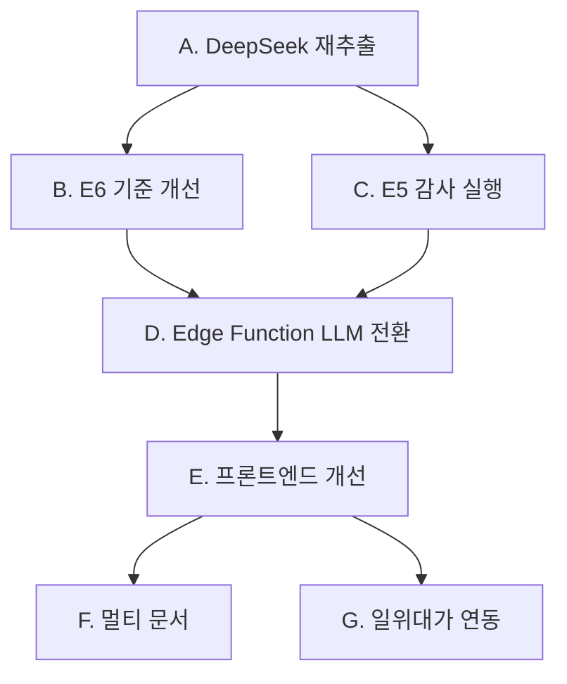

# 다음 단계 계획서 (Phase 3)

> **작성일**: 2026-02-13  
> **현재 상태**: Phase 2 파이프라인 완료, Quick Win 정리 완료  
> **DB 현황**: 엔티티 13,387 / 관계 24,323 / 청크 2,105

---

## 개요

Phase 2에서 품셈서 PDF → 그래프 DB 적재까지 완료. 이제 **데이터 품질 고도화**와 **RAG 챗봇 서비스 강화**에 집중한다.

---

## 우선순위 1: 데이터 품질 고도화

### A. DeepSeek 기반 Step2 순수 재추출

| 항목 | 내용 |
|---|---|
| **목적** | 현재 Step2 결과는 Gemini 세션 재활용 — DeepSeek-V3 품질 비교 |
| **방법** | `step2_llm_extractor.py`에서 기존 결과 JSON 삭제 후 재실행 |
| **비용** | DeepSeek-V3: ~1,702 청크 × $0.27/M output ≈ $0.5 이하 |
| **기대효과** | JSON 구조화 정확도 비교, 할루시네이션(E6) 개선 여부 확인 |
| **소요시간** | ~30분 (API 호출 + pipeline step3~7) |

### B. E6 할루시네이션 검증 기준 개선

| 항목 | 내용 |
|---|---|
| **현황** | E6 FAIL 46.3% — 그 중 LLM추론 67건, 진짜 의심 26건 |
| **문제** | LLM이 테이블 코드에서 추론한 엔티티를 할루시네이션으로 오판 |
| **수정 방향** | `step5_extraction_validator.py`에서 LLM추론과 진짜 의심 분리 집계 |
| **구현** | 의심 건만 별도 리포트, 임계값 40% → 의심 기준으로 재조정 |

### C. Step5 E5 LLM 샘플 감사 실행

| 항목 | 내용 |
|---|---|
| **현황** | `--skip-e5`로 스킵한 상태 |
| **방법** | DeepSeek-V3 기반으로 50건 샘플 감사 실행 |
| **비용** | ~$0.1 |

---

## 우선순위 2: RAG 챗봇 서비스 강화

### D. RAG Edge Function LLM 전환 (Gemini → DeepSeek)

| 항목 | 내용 |
|---|---|
| **목적** | 답변 생성 비용 절감 + 일관된 LLM 정책 |
| **현황** | 현재 Edge Function은 Gemini Flash로 답변 생성 |
| **방법** | Edge Function 내 LLM 호출을 OpenAI SDK 호환 DeepSeek 엔드포인트로 교체 |
| **위험** | 답변 품질 변화 가능 — A/B 비교 필요 |

### E. 챗봇 프론트엔드 개선

| 항목 | 내용 |
|---|---|
| **현황** | `pumsem-chat.pages.dev` — 기본 챗 UI |
| **개선 방향** | 출처 표시 강화, 표번호 링크, 관련 항목 추천 |
| **구현** | Cloudflare Pages에 배포된 프론트엔드 수정 |

---

## 우선순위 3: 확장

### F. 멀티 문서 지원

| 항목 | 내용 |
|---|---|
| **목적** | 추가 품셈 서적/개정판 데이터 투입 |
| **방법** | Phase 1 OCR부터 전체 파이프라인 반복 |
| **고려사항** | entity_id 충돌 방지, 문서별 메타데이터 태깅 |

### G. 일위대가 연동 강화

| 항목 | 내용 |
|---|---|
| **목적** | "강관용접 비용" 질의 시 자동 단가 산출 |
| **방법** | 기존 Supabase item_names/pumsem 테이블과 graph_entities 크로스 매칭 |

---

## 실행 순서 제안

| 단계 | 예상 소요 | 비용 |
|---|---|---|
| A. DeepSeek 재추출 | 30분 | ~$0.5 |
| B. E6 기준 개선 | 20분 | $0 |
| C. E5 감사 | 10분 | ~$0.1 |
| D. Edge Function 전환 | 30분 | $0 |
| E. 프론트엔드 개선 | 1~2시간 | $0 |
| F. 멀티 문서 | 2~3시간 | 문서 수 × $0.5 |
| G. 일위대가 연동 | 1~2시간 | $0 |

---

## 즉시 실행 가능 항목

다음 세션에서 바로 시작할 수 있는 항목:

1. **A → B → C** (데이터 품질 고도화) — 총 ~1시간
2. **D** (Edge Function 전환) — 30분, 독립 실행 가능
