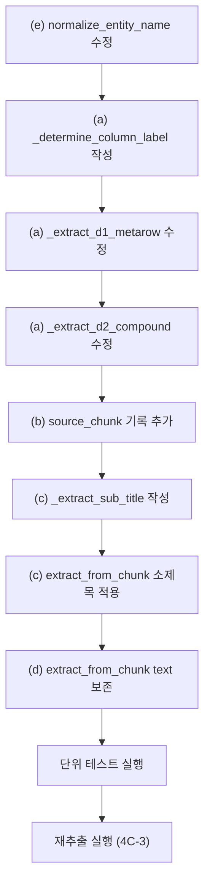

# Phase 4C-1: 추출 파이프라인 수정 — 상세 구현 계획서

> **일시**: 2026-02-14 09:23 KST  
> **근거**: Phase 4C-0 DB 전수 스캔 결과 보고서  
> **대상 파일**: `phase2_extraction/step1_table_extractor.py` (1,061줄, 21개 함수)  
> **목표**: SCH 오기 38개 섹션(1,060건)의 근본 원인을 제거하고, 부수적 구조 결함을 동시에 수정한다.

---

## 수정 범위 요약

| 수정 항목                    | 영향 함수                                                 | 신규/수정 | 영향 건수 | 난이도 |
| ---------------------------- | --------------------------------------------------------- | --------- | --------- | ------ |
| **(a) SCH 조건부 적용**      | `_extract_d1_metarow`, `_extract_d2_compound` + 신규 함수 | 수정+신규 | 1,060건   | 🟡 중간 |
| **(b) source_chunk 기록**    | 모든 Entity 생성 함수 (4개)                               | 수정      | 4,733건   | 🟢 낮음 |
| **(c) 소제목(V형/U형) 반영** | `extract_from_chunk` + 신규 함수                          | 수정+신규 | 124건     | 🟢 낮음 |
| **(d) chunk text 보존**      | `extract_from_chunk`                                      | 수정      | ~895건    | 🟢 낮음 |
| **(e) 공백 정규화 강화**     | `normalize_entity_name`                                   | 수정      | ~180건    | 🟢 낮음 |

---

## (a) SCH 조건부 적용 — 핵심 수정

### 근본 원인

```python
# _extract_d1_metarow() L329 — 현재 코드
sch_label = f'SCH {sch_h}' if re.match(r'^\d+$', str(sch_h)) else sch_h
wt_name = f"{section_title} ({pipe_size}, {sch_label})"

# _extract_d2_compound() L452 — 현재 코드
sch_label = f'SCH {sch}'
wt_name = f"{section_title} ({pipe_label}, {sch_label})"
```

**문제**: 숫자 열 헤더를 **무조건** `SCH`로 해석. 원본 열의 실제 의미(두께, 직종, 횟수 등)를 무시함.

### 수정 전략

매트릭스 테이블의 열 헤더 의미를 결정하는 전용 함수 `_determine_column_label()`을 작성하고, 기존 하드코딩된 `SCH` 라벨링을 이 함수로 대체한다.

### 신규 함수: `_determine_column_label()`

```python
# 위치: L229 부근 (extract_from_matrix_table 직전에 배치)

# ── 정상 SCH 사용 섹션 화이트리스트 ──
_SCH_WHITELIST_SECTIONS = frozenset([
    '13-2-3',   # 강관용접
    '13-1-1',   # 플랜트 배관 설치
    '13-1-2',   # 관만곡 설치
    '13-2-1',   # 강관절단
])

_SCH_WHITELIST_KEYWORDS = frozenset([
    '강관용접', '배관 설치', '배관설치', '관만곡', '강관절단',
])


def _determine_column_label(
    column_header: str,
    section_id: str,
    section_title: str,
    meta_row: dict | None = None,
) -> str:
    """매트릭스 테이블 열 헤더의 실제 의미를 결정한다.

    Why: 매트릭스 테이블의 숫자 열 헤더는 섹션마다 의미가 다르다.
    - 강관/배관 섹션 → SCH (Schedule Number)
    - 기타 섹션 → 그 숫자 자체가 의미를 가짐 (두께, 인원수, ID 등)

    설계 원칙:
    - 화이트리스트 기반: SCH 정상 섹션 4개만 명시적으로 허용
    - 나머지는 메타행/열 헤더의 원본 값을 그대로 사용
    - 새 섹션 추가 시 화이트리스트 갱신만으로 대응 가능

    Args:
        column_header: 원본 열 헤더 (e.g., '20', '40', '80', '용접공')
        section_id: 섹션 ID (e.g., '13-2-3')
        section_title: 섹션 제목 (e.g., '강관용접')
        meta_row: D1 패턴의 메타행 dict (직종 매핑 등)

    Returns:
        라벨 문자열. 예시:
        - 강관용접 → 'SCH 40'
        - 크러셔 → '139076' (숫자 그대로)
        - 수치지도 → '측량 기술자' (메타행 값 그대로)
    """
    is_numeric = re.match(r'^\d+$', str(column_header).strip())

    # ── Case 1: 화이트리스트 섹션 → SCH 라벨 ──
    if section_id in _SCH_WHITELIST_SECTIONS:
        if is_numeric:
            return f'SCH {column_header}'
        return str(column_header)

    # ── Case 2: 키워드 기반 보조 판별 (화이트리스트 누락 방어) ──
    title_normalized = section_title.replace(' ', '')
    if any(kw in title_normalized for kw in _SCH_WHITELIST_KEYWORDS):
        if is_numeric:
            return f'SCH {column_header}'
        return str(column_header)

    # ── Case 3: 비화이트리스트 → 원본 값 그대로 ──
    # 숫자 열 헤더라도 SCH를 붙이지 않음
    return str(column_header)
```

### 적용 위치 1: `_extract_d1_metarow()` 수정

```diff
# L318-330 부근 수정

  for sch_h in sch_headers:
      entity_name = sch_to_entity_name.get(sch_h, '')
      if not entity_name:
          continue

      qty_val, raw_val = parse_cell_value(row.get(sch_h))
      if qty_val is None or qty_val == 0:
          continue

      # WorkType = 섹션 제목 + 규격
-     sch_label = f'SCH {sch_h}' if re.match(r'^\d+$', str(sch_h)) else sch_h
-     wt_name = f"{section_title} ({pipe_size}, {sch_label})"
+     col_label = _determine_column_label(sch_h, section_id, section_title, meta_row)
+     wt_name = f"{section_title} ({pipe_size}, {col_label})"

      wt_entity = Entity(
          type=EntityType.WORK_TYPE,
          name=wt_name,
-         spec=f"{pipe_size} {sch_label}",
+         spec=f"{pipe_size} {col_label}",
          source_chunk_id=chunk_id,
          source_section_id=section_id,
          source_method="table_rule",
          confidence=1.0,
      )
```

### 적용 위치 2: `_extract_d2_compound()` 수정

```diff
# L447-458 부근 수정

  for orig_header, sch, job_name, unit in parsed_headers:
      qty_val, _ = parse_cell_value(row.get(orig_header))
      if qty_val is None or qty_val == 0:
          continue

-     sch_label = f'SCH {sch}'
-     wt_name = f"{section_title} ({pipe_label}, {sch_label})"
+     col_label = _determine_column_label(sch, section_id, section_title)
+     wt_name = f"{section_title} ({pipe_label}, {col_label})"

      wt_entity = Entity(
          type=EntityType.WORK_TYPE,
          name=wt_name,
-         spec=f"{pipe_label} {sch_label}",
+         spec=f"{pipe_label} {col_label}",
          source_chunk_id=chunk_id,
          source_section_id=section_id,
          source_method="table_rule",
          confidence=1.0,
      )
```

### 파급 효과 분석 (A3)

| 파급 영역            | 영향                                                    | 대응                                                     |
| -------------------- | ------------------------------------------------------- | -------------------------------------------------------- |
| **엔티티 이름 변경** | 38개 섹션의 WorkType 이름이 `SCH X` → 실제 라벨로 변경  | 해당 섹션의 entities + relationships 전부 삭제 후 재생성 |
| **임베딩 불일치**    | 이름이 바뀌면 기존 `embedding` 벡터와 불일치            | 재추출 시 임베딩도 재생성                                |
| **검색 쿼리 영향**   | 기존 "SCH 40" 검색 → 강관/배관 섹션만 매칭됨 (정확해짐) | 회귀 테스트로 확인                                       |
| **Edge Function**    | `rag-chat/index.ts`에서 entity name 참조 → 자동 반영    | 코드 수정 불필요                                         |
| **4개 정상 섹션**    | 화이트리스트로 보호 → SCH 라벨 유지                     | 회귀 테스트 필수                                         |

---

## (b) source_chunk 기록 — 전체 엔티티에 chunk_id 기록

### 현황

현재 모든 WorkType 엔티티의 `properties.source_chunk`가 `null` (4,733건 전부).

### 수정 방법

Entity 생성하는 **4개 함수** 전부에서 `properties`에 `source_chunk` 추가:

```python
# 수정 대상 4개 함수 내의 모든 Entity() 생성 지점

# ── extract_from_a_table() ──
# L585 부근
wt_entity = Entity(
    type=EntityType.WORK_TYPE,
    name=work_type_name,
    spec=spec_val,
    unit=unit_val,
    source_chunk_id=chunk_id,  # ← 이미 있음 (스키마 필드)
    source_section_id=section_id,
    source_method="table_rule",
)
# → properties에 source_chunk 추가는 extract_from_chunk() 레벨에서 일괄 처리

# ── extract_from_chunk() L967-972 ──
# 기존: unit_basis만 properties에 추가
# 수정: source_chunk도 추가
```

### 실제 수정 위치: `extract_from_chunk()` L967-972

```diff
  # unit_basis → properties
  unit_basis = chunk.get("unit_basis", "")
  if unit_basis:
      for e in all_entities:
          if e.type == EntityType.WORK_TYPE:
              e.properties["unit_basis"] = unit_basis

+ # source_chunk → properties (전체 엔티티)
+ for e in all_entities:
+     if e.type == EntityType.WORK_TYPE:
+         e.properties["source_chunk"] = chunk_id
```

> Why: 개별 함수가 아닌 `extract_from_chunk()` 레벨에서 일괄 처리하면, 수정 위치가 1곳으로 집중되어 누락 위험이 없다.

### 파급 효과 (A3)

- DB에 새 속성 추가 (optional). 기존 데이터와 호환 문제 없음
- Edge Function에서 `source_chunk` 참조 코드 없음 → 무관
- 향후 디버깅/추적에 활용 가능

---

## (c) 소제목(V형/U형) 반영

### 현황

- **적용 대상**: `13-2-4` (강판 전기아크용접) 1개 섹션만
- Phase 4B에서 SQL 패치로 V형/U형 태깅 완료
- 파이프라인에 반영하면 재추출 시 자동 적용됨

### 신규 함수: `_extract_sub_title()`

```python
# 위치: L860 부근 (extract_from_chunk 직전에 배치)

def _extract_sub_title(chunk_text: str) -> str | None:
    """chunk 텍스트에서 소제목(X형) 추출.

    예: '1. 전기아크용접(V형)' → 'V형'
        '2. 전기아크용접(U형)' → 'U형'

    Why: 하나의 섹션 안에 여러 하위 분류(V형, U형 등)가 있을 때,
    각 테이블의 데이터를 구분하기 위한 접미어를 추출한다.
    4C-0 스캔 결과 13-2-4 섹션만 해당.
    """
    if not chunk_text:
        return None

    # 패턴: "N. 공종명(X형)" 형태에서 X형 추출
    pattern = r'\d+\.\s*\S+\(([^)]+형)\)'
    match = re.search(pattern, chunk_text)
    if match:
        return match.group(1)
    return None
```

### `extract_from_chunk()` 수정

```diff
  def extract_from_chunk(chunk: dict) -> ChunkExtraction:
      """단일 청크의 모든 테이블에서 엔티티/관계 추출"""
      chunk_id = chunk["chunk_id"]
      section_id = chunk["section_id"]
      department = chunk.get("department", "")
      chapter = chunk.get("chapter", "")
      title = chunk.get("title", "")
+     chunk_text = chunk.get("text", "")
+
+     # 소제목 추출 (V형, U형 등)
+     sub_title = _extract_sub_title(chunk_text)

      all_entities: list[Entity] = []
      all_relationships: list[Relationship] = []
      all_warnings: list[str] = []

      # ... (기존 테이블 순회 로직) ...

+     # 소제목 접미어 적용: WorkType 이름에 "섹션명" → "섹션명-V형" 변환
+     if sub_title:
+         for e in all_entities:
+             if e.type == EntityType.WORK_TYPE and title in e.name:
+                 e.name = e.name.replace(
+                     f"{title}(",
+                     f"{title}-{sub_title}(",
+                     1,  # 첫 번째 매칭만
+                 )
+                 e.properties["sub_title"] = sub_title
+
+         # 관계의 source도 갱신
+         for r in all_relationships:
+             if r.source_type == EntityType.WORK_TYPE and title in r.source:
+                 r.source = r.source.replace(
+                     f"{title}(",
+                     f"{title}-{sub_title}(",
+                     1,
+                 )
```

### 결과 예시

```
# 수정 전
강판 전기아크용접 (3, 인력(인))    ← V형인지 U형인지 구분 불가

# 수정 후
강판 전기아크용접-V형 (3, 인력(인))  ← V형으로 명확히 구분
강판 전기아크용접-U형 (5, 인력(인))  ← U형으로 명확히 구분
```

---

## (d) chunk text 보존

### 현황

895/2,105 chunk (42.5%)의 텍스트가 비어있음. `extract_from_chunk()`에서 text를 반환하지 않는 것이 원인.

### 수정 위치: `extract_from_chunk()` 내 ChunkExtraction 반환부

```diff
  # L976-987 수정
+
+ # 빈 텍스트 chunk에 대해 테이블 요약 텍스트 자동 생성
+ chunk_text_out = chunk_text
+ if not chunk_text_out and tables:
+     summaries = []
+     for t in tables:
+         t_headers = t.get("headers", [])
+         t_rows = t.get("rows", [])
+         header_str = ", ".join(h for h in t_headers[:5] if h)
+         summaries.append(f"{title} / {t.get('type', '테이블')}. 열: {header_str}. {len(t_rows)}행.")
+     chunk_text_out = " | ".join(summaries)

  return ChunkExtraction(
      chunk_id=chunk_id,
      section_id=section_id,
      department=department,
      chapter=chapter,
      title=title,
      entities=all_entities,
      relationships=all_relationships,
      confidence=confidence,
      source_method="table_rule",
      warnings=all_warnings,
+     text=chunk_text_out,
  )
```

> [!WARNING]
> `ChunkExtraction` 스키마에 `text` 필드가 없으면 `schemas.py`에 추가 필요.  
> 또한 이 텍스트가 DB `graph_chunks.text`에 반영되려면 `step5_uploader.py`의 upsert 로직도 확인 필요.

---

## (e) 공백 정규화 강화

### 현황

현재 `normalize_entity_name()` (L143-157)은 **한글 사이의 단일 공백**만 제거한다.

```python
# 현재 로직 L156
result = re.sub(r'(?<=[\uAC00-\uD7AF])\s(?=[\uAC00-\uD7AF])', '', stripped)
```

이 로직은 `인 력` → `인력`은 처리하지만, `42 kg/cm2` → `42kg/cm2`는 처리하지 못한다.

### 수정

```diff
  def normalize_entity_name(name: str) -> str:
      """엔티티 이름 정규화

      Why: 품셈 원본에서 "보 통 인 부" → "보통인부" 등 불필요한 공백 제거
      또한 "〃" (반복 부호) 같은 특수 케이스 처리
      """
      stripped = name.strip()
      if stripped in LABOR_NORMALIZE_MAP:
          return LABOR_NORMALIZE_MAP[stripped]

      # 한글 사이 단일 공백 제거: "보 통 인 부" → "보통인부"
      result = re.sub(r'(?<=[\uAC00-\uD7AF])\s(?=[\uAC00-\uD7AF])', '', stripped)

+     # 숫자와 단위 사이 공백 정규화: "42 kg/cm2" → "42kg/cm2"
+     result = re.sub(r'(\d+)\s+(kg|mm|cm|m|t|inch|℃|°)', r'\1\2', result)
+
+     # 연속 공백 → 단일 공백
+     result = re.sub(r'\s{2,}', ' ', result)

      return result
```

### 파급 효과 (A3)

| 파급 영역                 | 영향                                                                 | 대응                                                                    |
| ------------------------- | -------------------------------------------------------------------- | ----------------------------------------------------------------------- |
| **기존 엔티티 이름 변경** | "42 kg/cm2" → "42kg/cm2"로 변경 시 기존 관계 깨짐                    | 재추출 대상 섹션에서만 적용 (이미 삭제→재생성)                          |
| **강판 전기아크용접**     | "인 력" vs "인력" 문제 → Phase 4B의 V/U형 구분에서 이 차이를 활용 중 | 재추출 후에는 정규화된 이름 사용, V/U형은 `sub_title`로 구분하므로 무관 |
| **기존 검색 쿼리**        | 사용자가 "42kg/cm2"로 검색 시 정확히 매칭                            | 개선됨                                                                  |

---

## 실행 순서



### 상세 순서

| Step | 수정 내용                                            | 함수/위치      | 비고                 |
| ---- | ---------------------------------------------------- | -------------- | -------------------- |
| 1    | `normalize_entity_name` 공백 정규화 강화             | L143-157       | 기반 함수, 먼저 수정 |
| 2    | `_SCH_WHITELIST_SECTIONS` 상수 추가                  | L229 부근 신규 | 화이트리스트 정의    |
| 3    | `_determine_column_label()` 함수 추가                | L229 부근 신규 | 핵심 로직            |
| 4    | `_extract_d1_metarow()` — `sch_label` → `col_label`  | L329-330       | 호출부 교체          |
| 5    | `_extract_d2_compound()` — `sch_label` → `col_label` | L452-453       | 호출부 교체          |
| 6    | `extract_from_chunk()` — `source_chunk` 일괄 기록    | L967-972       | properties 추가      |
| 7    | `_extract_sub_title()` 함수 추가                     | L860 부근 신규 | 소제목 추출          |
| 8    | `extract_from_chunk()` — 소제목 접미어 적용          | L867-873       | 이름 변환            |
| 9    | `extract_from_chunk()` — 빈 text 보충                | L976-987       | 텍스트 생성          |

---

## 검증 계획

### 단위 테스트 (파이프라인 수정 후, 재추출 전)

```python
# test_column_label.py

def test_sch_whitelist():
    """강관 섹션은 SCH 라벨 유지"""
    assert _determine_column_label('40', '13-2-3', '강관용접') == 'SCH 40'
    assert _determine_column_label('80', '13-1-1', '플랜트 배관 설치') == 'SCH 80'
    assert _determine_column_label('100', '13-2-1', '강관절단') == 'SCH 100'

def test_non_sch_sections():
    """비강관 섹션은 SCH 라벨 없이 원본 그대로"""
    assert _determine_column_label('139076', '8-2-12', '크러셔') == '139076'
    assert _determine_column_label('1회', '8-1-1#4', '냉동기 반입') == '1회'
    assert _determine_column_label('측량 기술자', '9-5-4', '수치지도 작성') == '측량 기술자'

def test_sub_title_extraction():
    """소제목 추출 동작 확인"""
    assert _extract_sub_title('1. 전기아크용접(V형)') == 'V형'
    assert _extract_sub_title('2. 전기아크용접(U형)') == 'U형'
    assert _extract_sub_title('일반 텍스트') is None

def test_normalize_space():
    """공백 정규화"""
    assert normalize_entity_name('인 력') == '인력'
    assert normalize_entity_name('42 kg/cm2') == '42kg/cm2'
    assert normalize_entity_name('보 통 인 부') == '보통인부'
```

### DB 회귀 테스트 (재추출 후)

| 쿼리                            | 기대 결과                                      |
| ------------------------------- | ---------------------------------------------- |
| `강관용접 200mm SCH 40`         | 기존과 동일 (SCH 유지) ✅                       |
| `크러셔 100`                    | `크러셔(100, 139076)` — SCH 제거됨 ✅           |
| `수치지도 작성`                 | `수치지도 작성(…, 측량 기술자)` — SCH 제거됨 ✅ |
| `강판 전기아크용접 V형 두께 10` | `강판 전기아크용접-V형(10, …)` — V형 구분 ✅    |
| `콘크리트 타설`                 | 영향 없음 ✅                                    |

---

## 리스크 매트릭스

| 리스크                                      | 확률 | 영향 | 대응                                     |
| ------------------------------------------- | ---- | ---- | ---------------------------------------- |
| 화이트리스트 누락 (새 강관 섹션)            | 낮음 | 중간 | `_SCH_WHITELIST_KEYWORDS` 보조 판별      |
| 소제목 정규식 미매칭                        | 낮음 | 낮음 | 미매칭 시 접미어 생략 (기존 동작 유지)   |
| `ChunkExtraction` 스키마에 `text` 필드 없음 | 중간 | 낮음 | `schemas.py` 확인 후 필요 시 추가        |
| 재추출 시 임베딩 불일치                     | 높음 | 높음 | 이름 변경 엔티티 임베딩 재생성 스텝 추가 |
| 공백 정규화로 인한 의도치 않은 병합         | 낮음 | 중간 | 숫자+단위 패턴만 타겟팅, 보수적 적용     |

---

## 실행 전 확인 사항

> [!CAUTION]
> 아래 항목은 구현 착수 전 확인이 필요합니다.

1. **`schemas.py`의 `ChunkExtraction` 클래스에 `text` 필드 존재 여부** → 없으면 추가 필요
2. **`step5_uploader.py`에서 `graph_chunks.text` 업데이트 로직 확인** → chunk text를 DB에 기록하는지 여부
3. **임베딩 재생성 방법**: `step3_embedder.py` 또는 별도 스크립트로 처리할지 결정
4. **재추출 실행 방식**: 38개 섹션을 한번에 vs 배치로 나눠서 처리할지 결정
