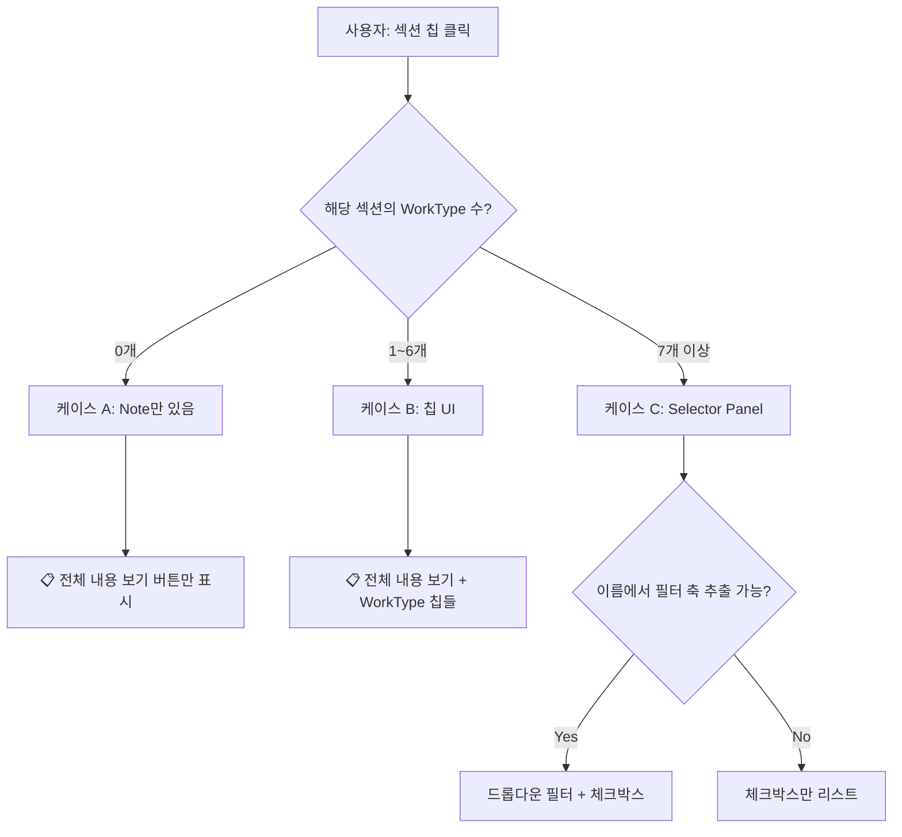
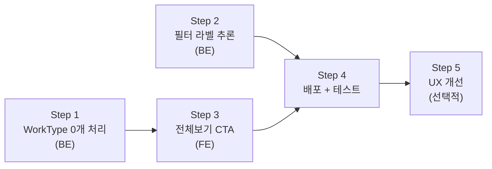

# 섹션 클릭 후 하목 표시 UI 설계 — 상세 분석

**작성일**: 2026-02-14  
**Phase**: UI  
**대상 파일**: `clarify.ts`, `index.ts` (백엔드), `index.html` (프론트엔드)  
**선행 계획서**: [명확화UI_드롭다운체크박스_구현계획서](20260214_명확화UI_드롭다운체크박스_구현계획서.md)

---

## 1. DB 데이터 구조 분석

### 잡철물 제작 (사용자 스크린샷 기준)

| 섹션      | 부문     | Section | WorkType | Note |
| --------- | -------- | ------- | -------- | ---- |
| `8-3-1#3` | 건축     | 1       | **0개**  | 11개 |
| `9-1-2#3` | 기계설비 | 1       | **6개**  | 6개  |

#### 8-3-1#3 (건축) — WorkType 없음, Note만 존재

Note만 있는 이유: 이 절은 "기준/주의사항"만 기술하고 세부 작업유형이 별도 분절되지 않은 구조.

#### 9-1-2#3 (기계설비) — WorkType 6개

| WorkType | 이름 패턴               |
| -------- | ----------------------- |
| W-1564   | 규격철물 설치\_경량철재 |
| W-1566   | 규격철물 설치\_일반철재 |
| W-4064   | 제품 설치\_경량철재     |
| W-4066   | 제품 설치\_일반철재     |
| W-5264   | 현장제작 설치\_경량철재 |
| W-5266   | 현장제작 설치\_일반철재 |

> **패턴**: `작업명_재질유형` → `subtype` 필터 축으로 추출 가능

---

### 전체 DB에서 다량 WorkType 섹션 (TOP 10)

| 섹션   | WorkType 수 | 이름 패턴 예시                 |
| ------ | ----------- | ------------------------------ |
| 13-1-5 | **180**     | `Flange 취부(100mm, 21kg/cm2)` |
| 9-5-4  | 148         | —                              |
| 13-1-1 | 125         | —                              |
| 13-2-4 | 124         | —                              |
| 13-2-3 | **122**     | `강관용접(200, SCH 40)`        |
| 13-2-6 | 100         | —                              |
| 8-2-12 | 91          | —                              |
| 9-3-4  | 88          | —                              |

---

## 2. UI 케이스 분류

### 케이스 분류표



---

### 케이스 A: WorkType 0개 (예: 8-3-1#3 건축 잡철물)

**현재 문제**: 클릭 시 아무 하목이 없어서 빈 결과 반환 가능

**해결 UI**:
```
┌──────────────────────────────────────────────────────┐
│ 🏢 건축부문 > 제8장 금속공사 > 잡철물 제작 및 설치   │
│                                                      │
│  이 절은 기준 및 주의사항만 포함되어 있습니다.       │
│                                                      │
│  ┌──────────────────────────────┐                    │
│  │ 📋 전체 내용 보기            │                    │
│  └──────────────────────────────┘                    │
└──────────────────────────────────────────────────────┘
```

→ `전체 내용 보기` 클릭 시 `section_id=8-3-1#3`로 전체 Note 조회

---

### 케이스 B: WorkType 1~6개 (예: 9-1-2#3 기계설비 잡철물)

```
┌──────────────────────────────────────────────────────┐
│ 🏭 기계설비부문 > 제9장 기타공사 > 잡철물 제작 및 설치│
│    6개 작업으로 분류되어 있습니다.                    │
│                                                      │
│  📋 전체 내용 보기                                   │
│  🔹 규격철물 설치_경량철재                            │
│  🔹 규격철물 설치_일반철재                            │
│  🔹 제품 설치_경량철재                                │
│  🔹 제품 설치_일반철재                                │
│  🔹 현장제작 설치_경량철재                            │
│  🔹 현장제작 설치_일반철재                            │
└──────────────────────────────────────────────────────┘
```

→ 기존 칩 UI 유지 (6개 이하는 한눈에 파악 가능)

---

### 케이스 C: WorkType 7개 이상 (예: 13-1-5 Flange 취부 180개)

**핵심 과제**: 180개 항목을 어떻게 탐색 가능하게 만드는가?

#### 이름 패턴 분석 → 필터 축 추출

| 이름 패턴                        | 추출 결과                         | 필터 축                 |
| -------------------------------- | --------------------------------- | ----------------------- |
| `Flange 취부(100mm, 21kg/cm2)`   | spec1=`100mm`, spec2=`21kg/cm2`   | 구경(mm) × 압력(kg/cm2) |
| `강관용접(200, SCH 40)`          | diameter=`200`, sch=`40`          | 호칭경(mm) × SCH        |
| `규격철물 설치_경량철재`         | subtype=`경량철재`                | 유형                    |
| `냉동기 반입(2RT, 공기호이스트)` | spec1=`2RT`, spec2=`공기호이스트` | 용량 × 장비             |

#### Selector Panel UI

```
┌──────────────────────────────────────────────────────┐
│ 🔍 Flange 취부 — 규격 선택 (180개)                   │
├──────────────────────────────────────────────────────┤
│  ┌──────────────┐  ┌──────────────────┐              │
│  │ 규격1      ▼ │  │ 규격2          ▼ │              │
│  │ -- 전체 --   │  │ -- 전체 --       │              │
│  │ 100mm        │  │ 10.5kg/cm2       │              │
│  │ 125mm        │  │ 21kg/cm2         │              │
│  │ 150mm        │  │ 28kg/cm2         │              │
│  │ 200mm        │  │ 42kg/cm2         │              │
│  │ 250mm        │  │ 63kg/cm2         │              │
│  └──────────────┘  └──────────────────┘              │
├──────────────────────────────────────────────────────┤
│  매칭: 9건                                           │
│  ☐ Flange 취부(100mm, 10.5kg/cm2)                   │
│  ☐ Flange 취부(100mm, 21kg/cm2)                     │
│  ☐ Flange 취부(100mm, 28kg/cm2)                     │
│  ☐ Flange 취부(100mm, 42kg/cm2)                     │
│  ☐ Flange 취부(100mm, 63kg/cm2)                     │
│  ...                                                 │
├──────────────────────────────────────────────────────┤
│ 0개 선택됨                    [✅ 선택 완료]          │
└──────────────────────────────────────────────────────┘
```

#### 필터 없는 다수 항목 (이름 패턴 불일치 시)

```
┌──────────────────────────────────────────────────────┐
│ 🔍 배관지지대 설치 — 항목 선택 (42개)                │
├──────────────────────────────────────────────────────┤
│  ☐ 배관지지대 설치 타입A                             │
│  ☐ 배관지지대 설치 타입B                             │
│  ☐ 배관지지대 설치 타입C                             │
│  ... (스크롤)                                        │
├──────────────────────────────────────────────────────┤
│ 0개 선택됨                    [✅ 선택 완료]          │
└──────────────────────────────────────────────────────┘
```

→ 필터 없이 체크박스 리스트만 표시 (이미 구현됨)

---

## 3. 현재 구현 vs 미구현

| 기능                                          | 상태     | 비고                                                        |
| --------------------------------------------- | -------- | ----------------------------------------------------------- |
| 케이스 C: 필터 + 체크박스 Panel (>6 WorkType) | ✅ 구현됨 | 금일 범용화 완료                                            |
| 케이스 B: 칩 UI (≤6 WorkType)                 | ✅ 구현됨 | 기존 동작                                                   |
| 케이스 A: WorkType 0개 → 전체보기만 표시      | ⚠️ 부분   | 현재 `full_view` 칩은 있으나, WorkType 0개 시 메시지가 빈약 |
| 섹션 칩 클릭 → Step 2 트리거                  | ✅ 구현됨 | `section_id`로 하목 조회                                    |
| `parseWorkTypeName` 범용 파싱                 | ✅ 구현됨 | 4패턴 (diameter/sch, spec1/spec2, spec1, subtype)           |
| `extractFilterAxes` 동적 축                   | ✅ 구현됨 | 모든 spec key 자동 집계                                     |

> [!IMPORTANT]
> **핵심 미구현 항목**: 케이스 A(WorkType 0개 섹션)에서 적절한 메시지와 `전체 보기` 유도가 필요합니다. 현재는 Step 2에서 WorkType을 못 찾으면 빈 결과가 나올 수 있습니다.

---

## 4. 구현 필요 사항

### 4-1. 백엔드: Step 2에서 WorkType 0개 처리

`clarify.ts`/`index.ts`의 `graphClarify(analysis, sectionId)` 경로에서:

```
조건: sectionId 있음 + WorkType 0개 + Note 있음
→ "이 절은 기준 및 주의사항만 포함되어 있습니다" 메시지
→ full_view 옵션만 반환
```

### 4-2. 필터 축 라벨 개선

현재 `spec1`/`spec2`로 표시되는 것을 데이터에서 의미 있는 라벨로 자동 추론:

| 패턴 예시    | spec1 값 유형 | 자동 라벨 |
| ------------ | ------------- | --------- |
| `100mm`      | 숫자+mm       | 구경(mm)  |
| `10.5kg/cm2` | 숫자+kg/cm2   | 압력      |
| `SCH 40`     | SCH 접두사    | SCH       |
| `경량철재`   | 한글 텍스트   | 유형      |

### 4-3. 프론트엔드: 전체 보기 버튼 스타일 개선

케이스 A에서는 `📋 전체 내용 보기` 버튼을 더 눈에 띄게 (단일 CTA 버튼) 표시.

---

## 5. 구현 순서 (Implementation Roadmap)

### Step 1: 백엔드 — WorkType 0개 섹션 처리 (케이스 A)

> **의존성**: 없음 (독립 작업)

| 항목            | 내용                                                                                                                       |
| --------------- | -------------------------------------------------------------------------------------------------------------------------- |
| **수정 파일**   | `clarify.ts`, `index.ts`                                                                                                   |
| **변경 내용**   | `graphClarify(analysis, sectionId)` 경로에서 WorkType 0개일 때 Note 존재 여부 확인 → 안내 메시지 + `full_view` 옵션만 반환 |
| **핵심 로직**   | `sectionId 있음 + workTypes.length === 0 + notes.length > 0` → `"이 절은 기준/주의사항 {N}건을 포함하고 있습니다"`         |
| **예상 작업량** | ~20줄 수정 (clarify.ts + index.ts)                                                                                         |

---

### Step 2: 필터 축 라벨 자동 추론

> **의존성**: 없음 (독립 작업, Step 1과 병렬 가능)

| 항목            | 내용                                                                                            |
| --------------- | ----------------------------------------------------------------------------------------------- |
| **수정 파일**   | `clarify.ts`, `index.ts`                                                                        |
| **변경 내용**   | `extractFilterAxes()` 내 `labelMap`을 정적 매핑 대신 **값 패턴 기반 자동 추론**으로 변경        |
| **핵심 로직**   | 값 샘플 분석: `숫자+mm` → `구경(mm)`, `숫자+kg/cm2` → `압력`, `SCH 숫자` → `SCH`, 한글 → `유형` |
| **예상 작업량** | ~30줄 수정 (inferLabel 함수 신규 + labelMap 교체)                                               |

```typescript
// 예시: 값 패턴 기반 라벨 추론
function inferAxisLabel(key: string, values: string[]): string {
    const sample = values[0];
    if (/^\d+mm$/.test(sample)) return '구경(mm)';
    if (/kg\/cm2$/.test(sample)) return '압력(kg/cm2)';
    if (/^SCH/.test(sample)) return 'SCH';
    if (/^\d+$/.test(sample)) return '호칭경';
    // fallback to labelMap
    return { diameter:'호칭경(mm)', sch:'SCH', subtype:'유형' }[key] || key;
}
```

---

### Step 3: 프론트엔드 — 케이스 A 전체보기 버튼 스타일 개선

> **의존성**: Step 1 완료 필요 (백엔드에서 적절한 메시지 반환해야 프론트에서 렌더링)

| 항목            | 내용                                                                            |
| --------------- | ------------------------------------------------------------------------------- |
| **수정 파일**   | `index.html`                                                                    |
| **변경 내용**   | WorkType 0개 + `full_view` 칩만 있을 때 단일 CTA 버튼으로 강조 표시             |
| **핵심 로직**   | `options.length === 1 && options[0].option_type === 'full_view'` → 큰 버튼 렌더 |
| **예상 작업량** | ~15줄 CSS + ~10줄 JS                                                            |

---

### Step 4: 배포 + 통합 테스트

> **의존성**: Step 1~3 모두 완료

| 항목            | 내용                                       |
| --------------- | ------------------------------------------ |
| **작업**        | Edge Function 배포 + Cloudflare Pages 배포 |
| **테스트 쿼리** |                                            |

| 쿼리                             | 기대 결과                                    | 검증 케이스   |
| -------------------------------- | -------------------------------------------- | ------------- |
| `"잡철물 제작"` → `8-3-1#3` 선택 | 안내 메시지 + 📋 전체보기 CTA                 | 케이스 A      |
| `"잡철물 제작"` → `9-1-2#3` 선택 | 전체보기 + 6개 칩                            | 케이스 B      |
| `"강관용접"`                     | Selector Panel + 호칭경/SCH 필터 (라벨 개선) | 케이스 C      |
| `"Flange 취부"`                  | Selector Panel + 구경(mm)/압력(kg/cm2) 필터  | 케이스 C 라벨 |
| `"콘크리트 타설"`                | Selector Panel + 자동 추론 라벨              | 케이스 C 범용 |

---

### Step 5: 필터 드롭다운 UX 개선 (선택적)

> **의존성**: Step 4 완료 후 UX 피드백 기반

| 항목          | 내용                                                                                   |
| ------------- | -------------------------------------------------------------------------------------- |
| **수정 파일** | `index.html`                                                                           |
| **개선 후보** | ① 필터 선택 시 실시간 매칭 건수 업데이트 ② 체크박스 전체선택/해제 ③ 모바일 반응형 개선 |
| **판단 기준** | Step 4 테스트 후 실제 UX 문제 발견 시 진행                                             |

---

### 구현 순서 요약



| Step | 작업                     | 예상 작업량   | 우선순위 |
| ---- | ------------------------ | ------------- | -------- |
| 1    | WorkType 0개 처리 (BE)   | ~20줄         | 🔴 필수   |
| 2    | 필터 라벨 자동 추론 (BE) | ~30줄         | 🟡 권장   |
| 3    | 전체보기 CTA 스타일 (FE) | ~25줄         | 🟡 권장   |
| 4    | 배포 + 통합 테스트       | 배포 명령 3회 | 🔴 필수   |
| 5    | 필터 UX 개선             | TBD           | 🟢 선택   |
