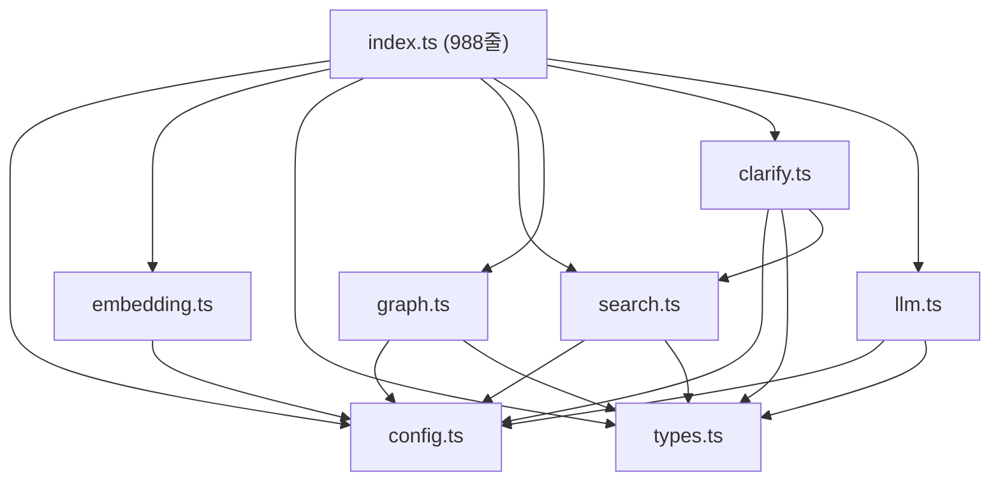

# Edge Function 리팩토링 Walkthrough

> **작업일**: 2026-02-14 ~ 2026-02-15
> **목표**: `index.ts` (2,989줄)의 중복 코드를 모듈 파일로 분리하여 유지보수성 향상

---

## Phase 1: 모듈 동기화 ✅

| 파일         | 변경 내용                                                   |
| ------------ | ----------------------------------------------------------- |
| `types.ts`   | `AnswerOptions`, `LaborCostEntry` 인터페이스 추가           |
| `search.ts`  | `buildSearchTerms` 함수 추가                                |
| `graph.ts`   | `fetchLaborCosts` 함수 추가                                 |
| `clarify.ts` | `analyzeIntent` 동기화, `normalizeSpec` 추가                |
| `llm.ts`     | `generateAnswer` AnswerOptions 파라미터 + intent별 프롬프트 |

---

## Phase 2: index.ts 모듈 Import 전환 ✅

### 핵심 결과

| 항목               | Before |         After |
| ------------------ | -----: | ------------: |
| **index.ts 줄 수** |  2,989 |           988 |
| **축소율**         |      — |       **67%** |
| **모듈 파일 수**   |      7 | 7 (변경 없음) |

### 변경 파일

#### `index.ts`
- 중복 타입/함수를 모듈 import로 대체
- **유지**: `buildContext` + `handleChat` + `Deno.serve`
- **제거**: 타입 정의, 검색 파이프라인, 그래프/일위대가, 의도분석/명확화, LLM

#### `config.ts`
- `ALLOWED_SUFFIXES` 추가 (Cloudflare Pages preview URL 지원)
- `getCorsHeaders` 업데이트 (suffix 패턴 체크)

#### `clarify.ts`
- `normalizeSpec` 함수 추가 (인치→mm, 파이→mm, SCH 띄어쓰기 정규화)

### 모듈 의존성 구조



---

## Phase 3: 배포 및 검증 ✅

| 단계                 | 결과                               |
| -------------------- | ---------------------------------- |
| 파일 복사 (8개)      | ✅ `sb_deploy` 디렉토리에 복사 완료 |
| Edge Function 배포   | ✅ `rag-chat` 108kB 배포 성공       |
| 동작 테스트 ("안녕") | ✅ **Status 200** 정상 응답         |

---

## 파일 목록 (최종)

```
edge-function/
├── index.ts      ← 엔트리포인트 (988줄, buildContext + handleChat + Deno.serve)
├── types.ts      ← 공통 타입/인터페이스
├── config.ts     ← 환경변수, Supabase 클라이언트, CORS, Rate Limit
├── embedding.ts  ← Gemini 임베딩 생성
├── search.ts     ← 벡터/키워드/타겟/청크 검색
├── graph.ts      ← 그래프 확장, 일위대가, 청크 조회
├── llm.ts        ← 시스템 프롬프트, 답변 생성 (DeepSeek/Gemini)
└── clarify.ts    ← 의도 분석, 그래프 명확화, 규격 정규화
```
