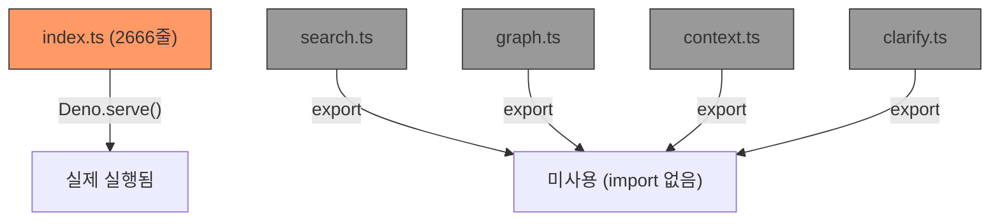

# TIG용접 키워드 폴백 구현 과정 및 문제점 분석

> 작성일: 2026-02-15  
> 관련 파일: `edge-function/index.ts`, `edge-function/search.ts`, `edge-function/graph.ts`, `edge-function/context.ts`

---

## 1. 배경 및 목표

### 1.1 문제 현상
"TIG용접 품셈" 쿼리 시, 기대 결과인 **13-2-3 (특수용접)** 대신 **13-2-4 (강판전기아크용접)** 하위 항목이 반환됨.

### 1.2 원인 가설
- DB 내 TIG 관련 엔티티명: `TIG(Tungsten Inert Gas)용접` (W-0631)
- ILIKE 패턴 `%TIG용접%`은 "TIG"와 "용접" 사이에 `(Tungsten Inert Gas)`가 삽입되어 **매칭 실패**
- 벡터 유사도 검색에서 "TIG용접"이 "강판전기아크용접" 관련 엔티티와 높은 유사도를 보임

### 1.3 목표
약칭(TIG, MIG 등) → 정식 명칭 확장 로직을 추가하여, ILIKE 검색 시 `%TIG(Tungsten Inert Gas)%` 패턴도 병렬 검색하도록 보완.

---

## 2. 구현 과정 (Phase 3)

### 2.1 Phase 1-2 (선행 작업, 완료)

| Phase | 파일            | 내용                                                                                         | 상태   |
| ----- | --------------- | -------------------------------------------------------------------------------------------- | ------ |
| 1     | `graph.ts`      | TIG WorkType에 `REQUIRES_LABOR` 관계 없을 때 `unit_costs` 원본 텍스트 fallback (`RAW_TABLE`) | ✅ 완료 |
| 1     | `context.ts`    | `RAW_TABLE` 렌더링 + Matrix 패턴 감지/통합 테이블 출력                                       | ✅ 완료 |
| 2     | 매트릭스 테스트 | `강관용접 200mm SCH 40` 테스트 → 663개 관계 확장, 14782 LLM 토큰                             | ✅ 검증 |

### 2.2 Phase 3: TIG 키워드 폴백 (진행중)

#### Step 1: `search.ts`에 약칭 확장 로직 추가

```typescript
// 추가된 코드 (search.ts)

const ABBREVIATION_MAP: Record<string, string[]> = {
    "TIG": ["TIG(Tungsten Inert Gas)", "Tungsten Inert Gas"],
    "MIG": ["MIG(Metal Inert Gas)", "Metal Inert Gas"],
    "MAG": ["MAG(Metal Active Gas)", "Metal Active Gas"],
    "CO2": ["CO2 아크", "CO₂"],
    "SMAW": ["SMAW(Shielded Metal Arc Welding)", "피복아크용접"],
    "SAW": ["SAW(Submerged Arc Welding)", "서브머지드아크용접"],
};

function expandAbbreviations(question: string): string[] {
    const expanded: string[] = [];
    for (const [abbr, aliases] of Object.entries(ABBREVIATION_MAP)) {
        if (question.toUpperCase().includes(abbr)) {
            expanded.push(...aliases);
        }
    }
    return expanded;
}
```

**적용 위치:**
1. `keywordFallbackSearch()` — orClauses에 약칭 확장 패턴 추가
2. `targetSearch()` 1단계 — 약칭 확장 폴백 분기 추가

#### Step 2: 배포 및 테스트

| 시도 | 배포                    | 결과                    | 원인                             |
| ---- | ----------------------- | ----------------------- | -------------------------------- |
| 1차  | v60 (search.ts만)       | `No change found`       | Supabase CLI 번들 해시 동일 판정 |
| 2차  | v61 (index.ts 강제변경) | `Deploying (100.1kB)` ✅ | 여전히 13-2-4 반환               |
| 3차  | v62 (index.ts 수정)     | `Deploying (100.9kB)` ✅ | 여전히 13-2-4 반환               |

#### Step 3: 근본 원인 발견

> **`index.ts`가 `search.ts`를 import하지 않음!**

```
edge-function/
├── index.ts      ← 2666줄, 모든 로직 인라인 (실제 배포됨) ✅
├── search.ts     ← 별도 모듈 (import 안 됨, 배포에 포함되나 번들링 시 사용 안 됨) ❌
├── graph.ts      ← 별도 모듈 (import 안 됨) ❌
├── context.ts    ← 별도 모듈 (import 안 됨) ❌
├── clarify.ts    ← 별도 모듈 (import 안 됨) ❌
└── ...
```

**핵심**: `index.ts`에 동일한 함수명(`searchEntities`, `keywordFallbackSearch`, `targetSearch`, `graphClarify` 등)이 **인라인으로 중복 정의**되어 있음. `search.ts` 등 별도 모듈 파일은 리팩토링 목적으로 분리했으나, `index.ts`에서 import하지 않아 **실제 런타임에 사용되지 않음**.

#### Step 4: index.ts 수정

`search.ts`가 아닌 **`index.ts` 내부**에 직접 약칭 확장 로직 추가:

| 위치       | 함수                                         | 수정 내용                       | 상태   |
| ---------- | -------------------------------------------- | ------------------------------- | ------ |
| L285-310   | `ABBREVIATION_MAP` + `expandAbbreviations()` | 함수 정의 추가                  | ✅ 완료 |
| L320-332   | `keywordFallbackSearch()`                    | abbrExpansions + orClauses 삽입 | ✅ 완료 |
| L1733-1849 | `targetSearch()`                             | 약칭 확장 폴백 **미적용**       | ❌ 미완 |
| L1405-1412 | `graphClarify()` 전략2                       | 약칭 확장 **미적용**            | ❌ 미완 |

---

## 3. 현재 문제점 상세 분석

### 3.1 아키텍처 문제: 이중 코드베이스



> [!CAUTION]
> `search.ts`, `graph.ts`, `context.ts`, `clarify.ts`에 대한 모든 수정은 **실제 Edge Function에 반영되지 않음**.
> 이전 Phase 1-2의 `graph.ts`, `context.ts` 수정도 동일하게 미반영 상태.

### 3.2 검색 흐름에서 TIG가 누락되는 4개 병목 지점

"TIG용접 품셈" 쿼리의 실제 실행 경로:

```
[사용자 입력] "TIG용접 품셈"
    ↓
[의도 분석] analyzeIntent() → intent="clarify_needed", work_name="TIG용접"
    ↓
[graphClarify] (sectionId 없음 → Step 1 경로)
    ↓
[전략 1] Section 이름 ILIKE "%TIG용접%" → Section에 "TIG용접" 없음 → 0건 ❌
    ↓
[전략 2] WorkType 이름 ILIKE "%TIG용접%" → "TIG(Tungsten Inert Gas)용접"은 매칭 안 됨 ❌
    ↓
[전략 3] keyword 독립 검색 → "용접"은 ACTION_VERBS로 제외, "TIG"만 검색
         → "%TIG%" 매칭 → 강판-강관 관련 섹션도 포함되어 오염 가능성
    ↓
[점수화] "강판전기아크용접" 관련 결과가 상위에 올라옴
    ↓
[반환] clarify → 13-2-4 옵션 제시
```

#### 병목 ①: `graphClarify` 전략 2 — ILIKE 패턴 미매칭 (L1405-1412)

```typescript
// 현재 코드 (index.ts L1406)
const workPattern = "%" + searchTerms.join("%") + "%";
// → "%TIG용접%"

// DB 엔티티: "TIG(Tungsten Inert Gas)용접"
// ILIKE "%TIG용접%" → 실패 (TIG와 용접 사이에 괄호 내용 존재)
```

**해결 필요**: `graphClarify` 전략 2에 약칭 확장 OR절 추가.

#### 병목 ②: `targetSearch` 2단계 — 동일한 ILIKE 미매칭 (L1777-1810)

```typescript
// 현재 코드 (index.ts L1783)
const pattern = "%" + searchTerms.join("%") + "%";
// → "%TIG용접%" → 동일하게 실패
```

**해결 필요**: `targetSearch` 2단계에 약칭 확장 OR절 추가.

#### 병목 ③: `searchEntities` — specNumbers 조건 (L226)

```typescript
// 현재 코드 (index.ts L225-226)
const specNumbers = extractSpecNumbers(question);
if (specNumbers.length > 0) {  // "TIG용접 품셈"에는 숫자 없음 → false
    // keywordFallbackSearch 실행되지 않음!
}
```

**해결 필요**: `specNumbers`가 없더라도 약칭이 감지되면 폴백 실행.

#### 병목 ④: `graphClarify` 전략 3 — ACTION_VERBS 제외 (L1372-1427)

```typescript
// "용접"이 ACTION_VERBS에 포함 → 독립 검색 대상에서 제외
// "TIG"만 독립 검색 → "%TIG%" ILIKE로 넓은 범위 매칭
const ACTION_VERBS = new Set(["제작", "설치", ..., "용접", ...]);
```

이 자체는 오염 방지 목적이므로 수정 불필요하나, 전략 2에서 약칭 확장이 되면 이 단계까지 도달하지 않으므로 해결됨.

### 3.3 전체 해결이 필요한 수정 사항 (현재 미완료)

| #   | 위치                  | 함수                 | 필요한 수정                 | 영향도                                     |
| --- | --------------------- | -------------------- | --------------------------- | ------------------------------------------ |
| 1   | `index.ts` L1405-1412 | `graphClarify` 전략2 | 약칭 확장 OR절 추가         | **Critical** — clarify 경로의 주 검색 전략 |
| 2   | `index.ts` L1777-1810 | `targetSearch` 2단계 | 약칭 확장 OR절/폴백 추가    | **High** — search 경로의 키워드 검색       |
| 3   | `index.ts` L225-244   | `searchEntities`     | 약칭 감지 시 폴백 조건 추가 | **Medium** — search 경로의 벡터+키워드     |

> [!IMPORTANT]
> `keywordFallbackSearch()`에 이미 추가한 약칭 확장 코드(v62)는 **searchEntities에서 specNumbers가 있을 때만** 실행되므로, "TIG용접"처럼 규격이 없는 쿼리에서는 무의미.

### 3.4 의도 분석 경로 문제

"TIG용접 품셈" 쿼리가 `clarify_needed` 의도로 분류되면 `graphClarify()`가 실행되고, `search` 의도로 분류되면 `targetSearch()`가 실행됨. **두 경로 모두** 약칭 확장이 필요.

```
intent="clarify_needed" → graphClarify() → 전략2 수정 필요 ①
intent="search"         → targetSearch() → 2단계 수정 필요 ②
                        → searchEntities() → 조건 수정 필요 ③
```

---

## 4. 해결 방안 (미구현)

### 방안 A: 개별 병목 수정 (권장)

각 병목 지점에 약칭 확장 로직을 직접 삽입:

```typescript
// 예시: graphClarify 전략 2 수정 (L1405-1412)
const workPattern = "%" + searchTerms.join("%") + "%";
const abbrExpansions = expandAbbreviations(searchTerms.join(" "));
const orClauses = [
    `name.ilike.${workPattern}`,
    `properties->>'korean_alias'.ilike.${workPattern}`
];
for (const alias of abbrExpansions) {
    orClauses.push(`name.ilike.%${alias}%`);
}

const { data: workTypes } = await supabase
    .from("graph_entities")
    .select("id, name, type, source_section, properties")
    .eq("type", "WorkType")
    .or(orClauses.join(","))
    .limit(200);
```

### 방안 B: 구조적 리팩토링 (장기)

`index.ts`의 인라인 코드를 모듈로 분리:
- `index.ts` → `search.ts`, `graph.ts`, `context.ts`, `clarify.ts` import
- 중복 코드 제거
- 단일 소스 관리

> [!WARNING]
> 방안 B는 대규모 리팩토링으로, 기존 기능 회귀 위험이 있어 충분한 테스트가 필요.

---

## 5. 이전 Phase 수정 사항의 반영 상태

| Phase | 파일         | 수정 내용                                 | `index.ts` 반영 여부                  |
| ----- | ------------ | ----------------------------------------- | ------------------------------------- |
| 1     | `graph.ts`   | TIG raw table fallback                    | ❌ **미반영** (graph.ts import 없음)   |
| 1     | `context.ts` | Matrix 테이블 + RAW_TABLE 렌더링          | ❌ **미반영** (context.ts import 없음) |
| 3     | `search.ts`  | 약칭 확장 (keywordFallback, targetSearch) | ❌ **미반영** (search.ts import 없음)  |
| 3     | `index.ts`   | ABBREVIATION_MAP + expandAbbreviations    | ✅ 반영 (v62)                          |
| 3     | `index.ts`   | keywordFallbackSearch 약칭 확장           | ✅ 반영 (v62, 단 실행 조건 미충족)     |
| 3     | `index.ts`   | graphClarify 전략2 약칭 확장              | ❌ **미반영**                          |
| 3     | `index.ts`   | targetSearch 약칭 확장                    | ❌ **미반영**                          |

> [!CAUTION]
> **Phase 1의 `graph.ts`, `context.ts` 수정도 `index.ts`에 반영되지 않은 상태.**  
> 강관용접 매트릭스 테스트(Phase 2)가 성공한 이유는, `index.ts`의 기존 인라인 코드가 이미 유사한 로직을 포함하고 있었기 때문일 수 있음. 이 부분은 추가 검증 필요.

---

## 6. 다음 단계

1. **`index.ts` 내 `graphClarify` 전략 2** (L1405-1412)에 약칭 확장 OR절 추가
2. **`index.ts` 내 `targetSearch` 2단계** (L1777-1810)에 약칭 확장 OR절 추가
3. 배포 후 "TIG용접 품셈" 테스트 → 13-2-3 반환 확인
4. Phase 1 수정 (`graph.ts`, `context.ts`)의 `index.ts` 반영 여부 검증
5. 장기적으로 `index.ts` ↔ 모듈 파일 이중 구조 정리 검토
