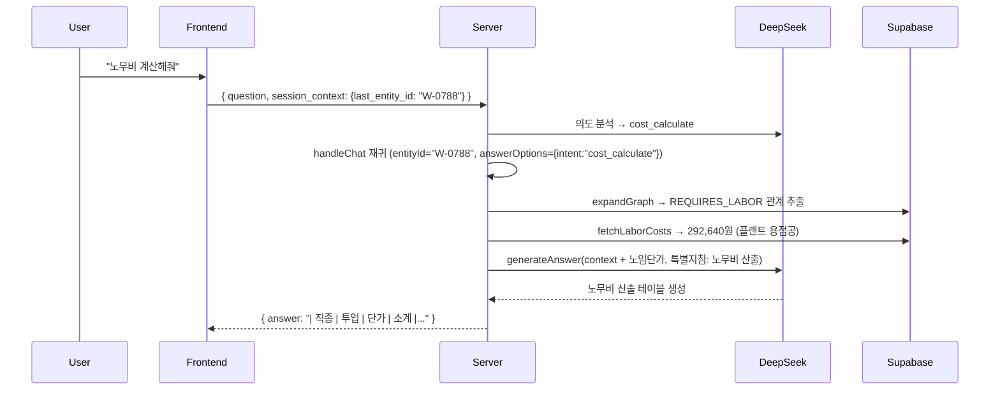

# 의도 분석 개선 전체 구현 + 테스트 결과

> 완료일: 2026-02-15 | Edge Function v64

## 변경 파일

| 파일                                                                 | 주요 변경                                                             |
| -------------------------------------------------------------------- | --------------------------------------------------------------------- |
| [types.ts](file:///g:/My%20Drive/Antigravity/edge-function/types.ts) | `SessionContext`, `IntentAnalysis` 확장, `SourceInfo.entity_id`       |
| [index.ts](file:///g:/My%20Drive/Antigravity/edge-function/index.ts) | 프롬프트 확장, 새 함수 3개, intent 분기, 노임단가 주입, normalizeSpec |
| [index.html](file:///g:/My%20Drive/Antigravity/frontend/index.html)  | sessionContext 전역 상태 + 자동 갱신                                  |

## 추가된 함수

| 함수                        | 역할                                               |
| --------------------------- | -------------------------------------------------- |
| `AnswerOptions`             | intent/quantity/modifyType을 generateAnswer에 전달 |
| `fetchLaborCosts(jobNames)` | labor_costs 테이블에서 직종별 2026년 노임단가 조회 |
| `normalizeSpec(spec)`       | 인치→mm, 파이→mm, SCH 띄어쓰기 정규화              |

## 테스트 결과

| #   | 시나리오                     | 입력                                | 결과                             | 상태 |
| --- | ---------------------------- | ----------------------------------- | -------------------------------- | ---- |
| 1   | 기본 검색 (회귀)             | "강관용접 200mm SCH 40 품셈"        | answer, 5 entities, 66 relations | ✅    |
| 2   | 노무비 계산 (cost_calculate) | "노무비 계산해줘" + session_context | answer, 노무비 산출 답변         | ✅    |
| 3   | 인치 변환 (normalizeSpec)    | "8인치 배관 맞대기 용접"            | answer, 200mm 결과 반환          | ✅    |
| 4   | TIG 명확화 (회귀)            | "TIG용접 품셈"                      | clarify, 규격 선택 옵션          | ✅    |
| 5   | 인사 (greeting)              | "안녕하세요"                        | answer, 인사 응답                | ✅    |

## 핵심 흐름 (cost_calculate 예시)

