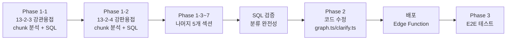

# 품셈 데이터 1·2·3차 분류 재구조화 구현 계획서

## 🎯 목표

원본 품셈의 계층 구조(1차: 절 → 2차: 하위절/공법 → 3차: 규격)를 `graph_entities`에 반영하여, 검색·분류·출력의 정확도를 향상시킨다.

> [!IMPORTANT]  
> **방안 C(properties에 `sub_section` 속성 추가)** 채택.  
> 기존 엔티티 구조를 유지하면서, 각 WorkType의 `properties` JSONB에 `sub_section` 필드를 추가하는 최소 침습 방식.

---

## 변경 범위 요약

| 대상                                                                     | 변경 유형                                             | 영향                |
| ------------------------------------------------------------------------ | ----------------------------------------------------- | ------------------- |
| `graph_entities` (DB)                                                    | WorkType `properties`에 `sub_section` 추가            | 7개 섹션, ~620개 WT |
| [graph.ts](file:///g:/My%20Drive/Antigravity/edge-function/graph.ts)     | `expandSectionWorkTypes`에서 sub_section 기반 그룹화  | 출력 시 절별 분리   |
| [clarify.ts](file:///g:/My%20Drive/Antigravity/edge-function/clarify.ts) | `graphClarify` Step 2에 2차 분류 drill-down 계층 추가 | 선택지 UX 개선      |
| [context.ts](file:///g:/My%20Drive/Antigravity/edge-function/context.ts) | 출력 시 sub_section 그룹 라벨 표시                    | 결과 가독성         |

---

## Phase 1: DB 마이그레이션 — `sub_section` 속성 추가

### 매핑 전략

각 섹션별로 `source_chunk_ids` 또는 WorkType 이름 패턴을 기반으로 `sub_section`을 판별.

> [!NOTE]
> `source_chunk_ids`는 graph_chunks의 chunk ID로, 각 절의 테이블이 별도 청크에 저장됨.  
> 예: C-0956-A~C는 V형, C-0956-D~F는 U형 등 — 이 매핑을 활용.

---

### [MODIFY] graph_entities (DB migration)

#### 1. 13-2-3 강관용접 — 전기아크/TIG 구분 (122개 WT)

```sql
-- 전기아크용접: TIG가 아닌 모든 WorkType
UPDATE graph_entities
SET properties = properties || '{"sub_section": "1. 전기아크용접", "sub_section_no": 1}'::jsonb
WHERE source_section = '13-2-3'
  AND type = 'WorkType'
  AND name NOT ILIKE '%TIG%'
  AND (properties->>'sub_section') IS NULL;

-- TIG용접
UPDATE graph_entities
SET properties = properties || '{"sub_section": "2. TIG용접", "sub_section_no": 2}'::jsonb
WHERE source_section = '13-2-3'
  AND type = 'WorkType'
  AND name ILIKE '%TIG%'
  AND (properties->>'sub_section') IS NULL;
```

#### 2. 13-2-4 강판 전기아크용접 — V/U/H/X/Fillet (124개 WT)

원문 구조와 `source_chunk_ids`의 대응:

| 하위 절   | chunk 범위 | 두께 범위 | 특징                                       |
| --------- | ---------- | --------- | ------------------------------------------ |
| 1. V형    | C-0956-A~C | 3~15mm    | `인 력(인)` 표기, 하/횡/입 3자세           |
| 2. U형    | C-0956-D   | 15~70mm   | `하향한면용접(인)` `하향양면용접(인)` 표기 |
| 3. H형    | C-0956-G   | 15~70mm   | U형과 동일 컬럼 구조                       |
| 4. X형    | C-0956-J~K | 16~70mm   | U형과 동일 컬럼 구조                       |
| 5. Fillet | C-0956-L~N | 3~12mm    | `인 력(인)` 표기, 3자세                    |

```sql
-- V형: chunk A~C에만 있는 WT (두께 3~15mm, 인 력(인) / 소요전력 패턴)
UPDATE graph_entities
SET properties = properties || '{"sub_section": "1. 전기아크용접(V형)", "sub_section_no": 1}'::jsonb
WHERE source_section = '13-2-4'
  AND type = 'WorkType'
  AND (properties->>'sub_section') IS NULL
  AND properties->'source_chunk_ids' @> '["C-0956-A"]'::jsonb;
-- C-0956-B, C에도 동일 적용 (V형)
UPDATE graph_entities
SET properties = properties || '{"sub_section": "1. 전기아크용접(V형)", "sub_section_no": 1}'::jsonb
WHERE source_section = '13-2-4' AND type = 'WorkType'
  AND (properties->>'sub_section') IS NULL
  AND (properties->'source_chunk_ids' @> '["C-0956-B"]'::jsonb
    OR properties->'source_chunk_ids' @> '["C-0956-C"]'::jsonb)
  AND NOT (properties->'source_chunk_ids' @> '["C-0956-D"]'::jsonb)
  AND NOT (properties->'source_chunk_ids' @> '["C-0956-G"]'::jsonb)
  AND NOT (properties->'source_chunk_ids' @> '["C-0956-L"]'::jsonb
    OR properties->'source_chunk_ids' @> '["C-0956-M"]'::jsonb
    OR properties->'source_chunk_ids' @> '["C-0956-N"]'::jsonb);

-- U형: chunk D 전용
UPDATE graph_entities
SET properties = properties || '{"sub_section": "2. 전기아크용접(U형)", "sub_section_no": 2}'::jsonb
WHERE source_section = '13-2-4' AND type = 'WorkType'
  AND (properties->>'sub_section') IS NULL
  AND properties->'source_chunk_ids' @> '["C-0956-D"]'::jsonb
  AND NOT properties->'source_chunk_ids' @> '["C-0956-A"]'::jsonb;

-- H형: chunk G 전용
UPDATE graph_entities
SET properties = properties || '{"sub_section": "3. 전기아크용접(H형)", "sub_section_no": 3}'::jsonb
WHERE source_section = '13-2-4' AND type = 'WorkType'
  AND (properties->>'sub_section') IS NULL
  AND properties->'source_chunk_ids' @> '["C-0956-G"]'::jsonb
  AND NOT properties->'source_chunk_ids' @> '["C-0956-A"]'::jsonb;

-- X형: chunk J, K 전용
UPDATE graph_entities
SET properties = properties || '{"sub_section": "4. 전기아크용접(X형)", "sub_section_no": 4}'::jsonb
WHERE source_section = '13-2-4' AND type = 'WorkType'
  AND (properties->>'sub_section') IS NULL
  AND (properties->'source_chunk_ids' @> '["C-0956-J"]'::jsonb
    OR properties->'source_chunk_ids' @> '["C-0956-K"]'::jsonb);

-- Fillet: chunk L, M, N 관련 (V형과 겹치지 않는 것)
UPDATE graph_entities
SET properties = properties || '{"sub_section": "5. 전기아크용접(Fillet)", "sub_section_no": 5}'::jsonb
WHERE source_section = '13-2-4' AND type = 'WorkType'
  AND (properties->>'sub_section') IS NULL
  AND (properties->'source_chunk_ids' @> '["C-0956-L"]'::jsonb
    OR properties->'source_chunk_ids' @> '["C-0956-M"]'::jsonb
    OR properties->'source_chunk_ids' @> '["C-0956-N"]'::jsonb);

-- 복수 chunk에 걸친 WT (D+G 등) → 이름/두께 기반 2차 판별 필요
-- 남은 미분류 WT 확인 후 수동 매핑
```

#### 3. 13-1-5 Flange 취부 — Screwed/Seal Welded/Slip-on (179개 WT)

```sql
-- source_chunk_ids 패턴 확인 필요 → 실행 전 먼저 분포 확인
-- 대안: 이름 패턴 기반 (Flange 취부 원문에서 각 Type의 구경 범위가 다름)
-- → Phase 1 실행 시 원문 분석 후 매핑 SQL 작성
```

#### 4~7. 나머지 섹션

13-1-3 밸브 취부, 13-1-4 Fitting 취부, 13-5-13 Boiler Feed Pump, 13-2-6 응력제거도  
동일 접근법으로 `source_chunk_ids` 또는 이름 패턴으로 매핑.

> [!WARNING]
> 13-2-4처럼 chunk ID가 명확히 나뉘지 않는 섹션이 있을 수 있음.  
> 각 섹션 실행 전 반드시 `source_chunk_ids` 분포를 확인하고, 필요 시 이름/두께 패턴으로 보정.

---

## Phase 2: Edge Function 코드 수정

### [MODIFY] [graph.ts](file:///g:/My%20Drive/Antigravity/edge-function/graph.ts)

**`expandSectionWorkTypes` 함수 (L25~125)**

현재 동작: `source_section`이 같은 WorkType을 전부 조회 (limit 30)

변경:
- `sub_section` 속성이 있는 경우, **sub_section별로 그룹화**하여 반환
- `properties.work_type_name`에 `sub_section` 접두사 추가 (예: `[V형] 강판용접(10, 두께)`)

```typescript
// 변경 개요:
// 1. workTypes 조회 후, sub_section 속성 존재 여부 확인
// 2. sub_section별 그룹화 → 각 그룹의 대표 라벨을 work_type_name에 주입
// 3. 기존 limit(30) → sub_section이 있으면 전체 조회 후 필터링
```

---

### [MODIFY] [clarify.ts](file:///g:/My%20Drive/Antigravity/edge-function/clarify.ts)

**`graphClarify` Step 2 (L375~536)**

현재 동작: Section 선택 → 해당 section의 모든 WorkType 나열

변경: **Section → SubSection → WorkType** 3단계 drill-down

```
Step 1: 섹션(분야) 선택 — 변경 없음
Step 2: sectionId 있음
  2-a: sub_section이 있는 WorkType이 2개+ → sub_section 선택지 표시
  2-b: sub_section 선택 후 → 해당 sub_section의 WorkType만 나열
  2-c: sub_section이 없으면 → 기존 동작 유지
```

```typescript
// Step 2 변경 개요:
// 1. WorkType 조회 결과에서 distinct sub_section 추출
// 2. sub_section 2개 이상 → sub_section 선택 옵션 표시
//    (예: "1. 전기아크용접", "2. TIG용접")
// 3. sub_section 문자열을 query 파라미터로 전달
// 4. query에 sub_section 포함 시 → 필터링
```

---

### [MODIFY] [context.ts](file:///g:/My%20Drive/Antigravity/edge-function/context.ts)

**인력/장비 테이블 출력 시 sub_section 그룹 라벨**

변경:
- `work_type_name`에 주입된 sub_section 정보로 자동 구분선/헤더 삽입

---

## Phase 3: 검증 계획

### 자동화 검증 (SQL)

```sql
-- 1. sub_section 분포 검증 (미분류 0건이어야 함)
SELECT source_section,
  count(*) FILTER (WHERE properties->>'sub_section' IS NOT NULL) AS classified,
  count(*) FILTER (WHERE properties->>'sub_section' IS NULL) AS unclassified
FROM graph_entities
WHERE source_section IN ('13-2-3','13-2-4','13-1-5','13-1-3','13-1-4','13-5-13','13-2-6')
  AND type = 'WorkType'
GROUP BY source_section;

-- 2. sub_section 값 분포 검증
SELECT source_section, properties->>'sub_section' AS sub_section, count(*)
FROM graph_entities
WHERE source_section IN ('13-2-3','13-2-4')
  AND type = 'WorkType'
  AND properties->>'sub_section' IS NOT NULL
GROUP BY source_section, properties->>'sub_section'
ORDER BY source_section, properties->>'sub_section_no';
```

### 수동 검증 (챗봇 E2E)

배포 후 아래 시나리오를 직접 테스트:

1. **"강관용접 품셈"** 입력 → ✅ "전기아크용접" / "TIG용접" 2차 선택지가 표시되는지 확인
2. **"강판 V형 용접"** 입력 → ✅ V형 WorkType만 필터링되어 표시되는지 확인
3. **"Flange 취부"** 입력 → ✅ Screwed / Seal Welded / Slip-on 3가지 선택지 표시
4. **기존 쿼리 호환**: "강관용접 200 SCH 40" → ✅ 기존과 동일하게 단일 결과 반환 (비파괴 확인)

---

## 실행 순서



## 리스크

| 리스크                                | 완화                                                         |
| ------------------------------------- | ------------------------------------------------------------ |
| chunk ID 매핑 오류 → 잘못된 절에 분류 | 각 섹션 실행 전 원문과 chunk 대조 검증                       |
| 복수 chunk에 걸친 WT → 판별 불가      | 이름 패턴(두께 범위, 한면/양면 키워드)으로 2차 판별          |
| 기존 검색/출력 동작 변경              | `sub_section`이 없는 섹션은 기존 로직 100% 유지, 조건부 분기 |
