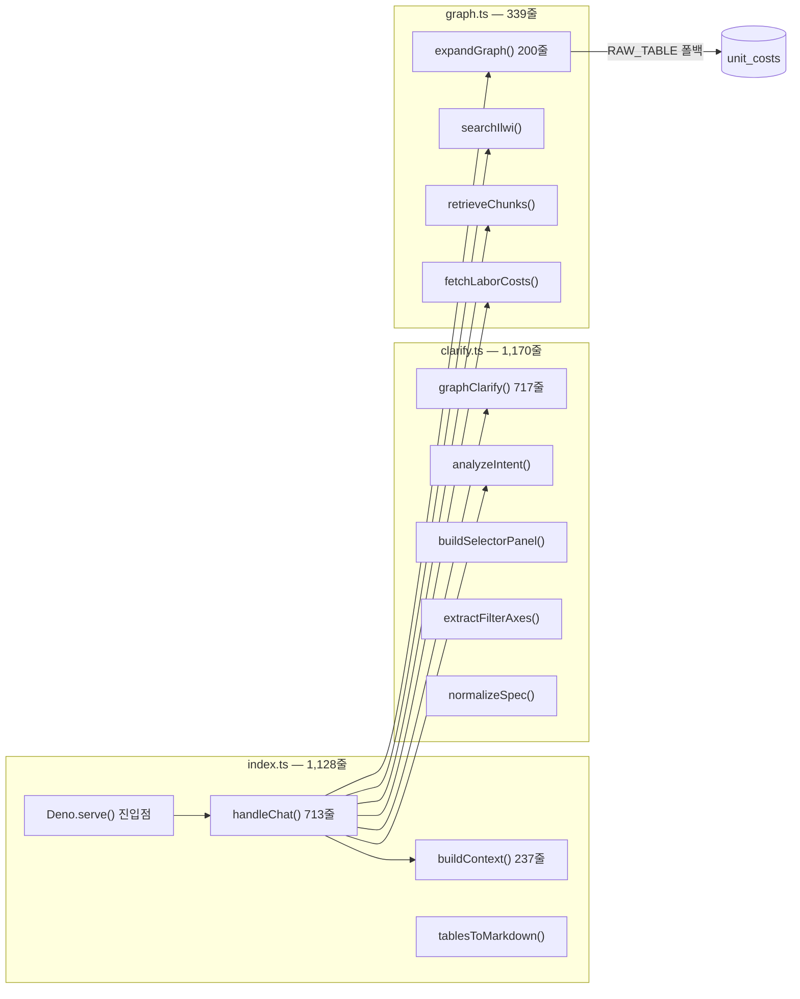
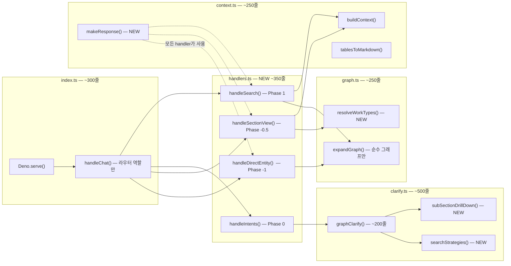

# Edge Function 리팩토링 개선 계획서

> 기준일: 2026-02-16  
> 대상: `edge-function/` (index.ts 1,128줄, clarify.ts 1,170줄, graph.ts 339줄)  
> 진단 보고서: [20260216_EdgeFunction_과설계_진단보고서.md](file:///g:/My%20Drive/Antigravity/docs/reports/20260216_EdgeFunction_%EA%B3%BC%EC%84%A4%EA%B3%84_%EC%A7%84%EB%8B%A8%EB%B3%B4%EA%B3%A0%EC%84%9C.md)

---

## 1. 현재 구조 (AS-IS)



### 핵심 문제: 책임 과집중

| 함수           | 담당 책임 수 | 주요 책임                                                                                            |
| -------------- | -----------: | ---------------------------------------------------------------------------------------------------- |
| `handleChat`   |      **7개** | 의도 라우팅, Phase -1 처리, Phase -0.5 처리, full_view 폴백, Section-Only 분기, 검색+확장, 응답 조립 |
| `graphClarify` |      **5개** | 검색어 정규화, Step 2 sub_section, 4전략 검색, 관련성 점수, 3케이스 분기                             |
| `expandGraph`  |      **3개** | 1-hop 관계 조회, Section 확장, RAW_TABLE 폴백                                                        |

---

## 2. 목표 구조 (TO-BE)



---

## 3. 리팩토링 단계별 상세 계획

### Phase 1: 유틸리티 추출 (파급 효과 없음)

> **예상 변경량**: ~150줄 감소, 기능 변경 없음

#### 1-1. `makeResponse()` 헬퍼 추출

현재 `handleChat` 내에서 6회 반복되는 응답 객체 조립을 단일 함수로 통합합니다.

**Before** (6곳에 반복):
```typescript
return {
    type: "answer",
    answer: llmResult.answer,
    sources: [...],
    search_info: {
        entities_found: entities.length,
        relations_expanded: relationsAll.reduce((sum, r) => sum + r.length, 0),
        ilwi_matched: ilwiResults.length,
        chunks_retrieved: chunks.length,
        latency_ms: Date.now() - startTime,
        token_usage: {
            embedding_tokens: embeddingTokens,
            llm_input_tokens: llmResult.inputTokens,
            llm_output_tokens: llmResult.outputTokens,
            total_tokens: totalTokens,
            estimated_cost_krw: parseFloat((totalTokens * 0.0002).toFixed(2)),
        },
    },
};
```

**After**:
```typescript
// context.ts에 추가
function makeResponse(opts: {
    type: "answer" | "clarify";
    answer: string;
    sources?: SourceInfo[];
    startTime: number;
    entities?: EntityResult[];
    relations?: RelatedResource[][];
    ilwi?: IlwiItem[];
    chunks?: ChunkResult[];
    llmResult?: LLMResult;
    embeddingTokens?: number;
    clarification?: ClarifyInfo;
}): ChatResponse {
    const { type, answer, sources = [], startTime } = opts;
    const relCount = opts.relations?.reduce((s, r) => s + r.length, 0) || 0;
    const totalTokens = (opts.embeddingTokens || 0) 
        + (opts.llmResult?.inputTokens || 0) 
        + (opts.llmResult?.outputTokens || 0);

    return {
        type,
        answer,
        sources,
        search_info: {
            entities_found: opts.entities?.length || 0,
            relations_expanded: relCount,
            ilwi_matched: opts.ilwi?.length || 0,
            chunks_retrieved: opts.chunks?.length || 0,
            latency_ms: Date.now() - startTime,
            ...(opts.llmResult ? {
                token_usage: {
                    embedding_tokens: opts.embeddingTokens || 0,
                    llm_input_tokens: opts.llmResult.inputTokens,
                    llm_output_tokens: opts.llmResult.outputTokens,
                    total_tokens: totalTokens,
                    estimated_cost_krw: parseFloat((totalTokens * 0.0002).toFixed(2)),
                }
            } : {}),
        },
        ...(opts.clarification ? { clarification: opts.clarification } : {}),
    };
}
```

**적용 위치**: `handleChat` L396, L617, L631, L682, L700, L1008 등  
**효과**: 각 반환문이 ~20줄 → ~5줄로 축소

---

#### 1-2. `subSectionDrillDown()` 함수 추출

`graphClarify` Step 2 (L496~545)와 케이스 A (L984~1034)에서 **거의 동일하게 중복**되는 sub_section drill-down 로직을 단일 함수로 추출합니다.

**추출할 함수**:
```typescript
// clarify.ts에 추가
function subSectionDrillDown(
    workTypes: any[],
    sectionPath: string,
    sectionId: string,
    sectionName: string
): ClarifyResult | null {
    // sub_section별 분포 확인
    const subMap = new Map<string, any[]>();
    for (const wt of workTypes) {
        const sub = wt.properties?.sub_section || null;
        if (sub) {
            if (!subMap.has(sub)) subMap.set(sub, []);
            subMap.get(sub)!.push(wt);
        }
    }

    if (subMap.size < 2) return null;  // sub_section 2개 미만 → 적용 안 함

    const options: ClarifyOption[] = [];

    // "전체 내용 보기"
    options.push({
        label: `📋 ${sectionName} 전체 내용 보기`,
        query: `${sectionName} 전체 품셈`,
        section_id: sectionId,
        option_type: "full_view",
    });

    // sub_section별 옵션 (sub_section_no 순)
    const sorted = [...subMap.entries()].sort((a, b) => {
        const noA = a[1][0]?.properties?.sub_section_no || 99;
        const noB = b[1][0]?.properties?.sub_section_no || 99;
        return Number(noA) - Number(noB);
    });

    for (const [subName, subWTs] of sorted) {
        options.push({
            label: `📂 ${subName} (${subWTs.length}건)`,
            query: `${sectionName} ${subName} 품셈`,
            section_id: `${sectionId}:sub=${encodeURIComponent(subName)}`,
            option_type: "section" as any,
        });
    }

    return {
        message: `**${sectionPath}** 품셈에는 ${subMap.size}개 분류(총 ${workTypes.length}개 작업)가 있습니다.\n분류를 선택해 주세요.`,
        options,
    };
}
```

**현재 중복 위치**:
- `graphClarify` Step 2: [L496~545](file:///g:/My%20Drive/Antigravity/edge-function/clarify.ts#L496-L545)
- `graphClarify` 케이스 A: [L984~1034](file:///g:/My%20Drive/Antigravity/edge-function/clarify.ts#L984-L1034)

**효과**: ~50줄 중복 제거

---

### Phase 2: 폴백 체인 단순화 (중간 난이도)

> **예상 변경량**: ~130줄 감소, 로직 4단계 → 1함수

#### 2-1. `resolveWorkTypes()` 함수 추출

`handleChat` Phase -0.5 full_view 내의 4단계 폴백 체인을 단일 함수로 추출합니다.

**현재** (L450~577, 127줄):
```
Step 1: WorkType eq 정확 매칭
Step 2: cross-reference (형제 섹션)
Step 3: 하위 절 children (ilike prefix-)
Step 4: Section 자체 확장
```

**리팩토링**:
```typescript
// graph.ts에 추가
async function resolveWorkTypes(
    sectionId: string,
    chunkTitle?: string
): Promise<{ entities: EntityResult[]; relations: RelatedResource[][] }> {
    // 전략 1: 정확 매칭
    const { data: exactWTs } = await supabase
        .from("graph_entities")
        .select("id, name, type, properties, source_section")
        .eq("type", "WorkType")
        .eq("source_section", sectionId)
        .limit(20);

    if (exactWTs && exactWTs.length > 0) {
        return await expandAndReturn(exactWTs);
    }

    // 전략 2: cross-reference (동일 title의 다른 section)
    if (chunkTitle) {
        const { data: siblings } = await supabase
            .from("graph_chunks")
            .select("section_id")
            .eq("title", chunkTitle);
        
        const sibSectionIds = [...new Set(
            (siblings || []).map(s => s.section_id).filter(sid => sid !== sectionId)
        )];

        if (sibSectionIds.length > 0) {
            const { data: sibWTs } = await supabase
                .from("graph_entities")
                .select("id, name, type, properties, source_section")
                .eq("type", "WorkType")
                .in("source_section", sibSectionIds)
                .limit(30);

            if (sibWTs && sibWTs.length > 0) {
                return await expandAndReturn(sibWTs, 0.95);
            }
        }
    }

    // 전략 3: 하위 절 children
    const base = sectionId.includes('#') ? sectionId.split('#')[0] : sectionId;
    const { data: childWTs } = await supabase
        .from("graph_entities")
        .select("id, name, type, properties, source_section")
        .eq("type", "WorkType")
        .ilike("source_section", `${base}-%`)
        .limit(50);

    if (childWTs && childWTs.length > 0) {
        return await expandAndReturn(childWTs, 0.98);
    }

    // 전략 4: Section 자체 확장 (최후 수단)
    const { data: sectionEntity } = await supabase
        .from("graph_entities")
        .select("id, name, type, properties, source_section")
        .eq("type", "Section")
        .eq("source_section", sectionId)
        .limit(1);

    if (sectionEntity && sectionEntity.length > 0) {
        const se = sectionEntity[0];
        const rels = await expandGraph(se.id, "Section");
        return {
            entities: [{ ...se, similarity: 1.0 } as EntityResult],
            relations: [rels],
        };
    }

    return { entities: [], relations: [] };
}

// 내부 헬퍼
async function expandAndReturn(
    rawWTs: any[],
    similarity = 1.0
): Promise<{ entities: EntityResult[]; relations: RelatedResource[][] }> {
    const entities = rawWTs.map(wt => ({
        id: wt.id, name: wt.name, type: wt.type,
        properties: wt.properties || {},
        source_section: wt.source_section,
        similarity,
    })) as EntityResult[];

    const rels = await Promise.all(
        entities.map(e => expandGraph(e.id, e.type))
    );

    return { entities, relations: rels };
}
```

**적용 후 handleChat** (127줄 → ~5줄):
```typescript
const { entities: wtEntities, relations: relationsAll } = 
    await resolveWorkTypes(sectionId, chunk.title);
```

---

#### 2-2. handleChat Section-Only 분기 제거

`handleChat` L816~904의 Section-Only 분기는 `graphClarify`의 Step 1과 중복됩니다.

**Before**: handleChat에서 직접 섹션 선택 칩 생성 (L823~867)  
**After**: `graphClarify`에 위임

```diff
- // [2-1] 검색 결과가 Section만 있으면 → Phase 3 방식으로 처리
- const sectionOnly = entities.length > 0 && entities.every(e => e.type === "Section");
- if (sectionOnly) {
-     ... (88줄 제거)
- }
+ // Section만 매칭 → clarify로 위임
+ const sectionOnly = entities.length > 0 && entities.every(e => e.type === "Section");
+ if (sectionOnly) {
+     const clarifyResult = await graphClarify(analysis);
+     return makeResponse({
+         type: "clarify", answer: clarifyResult.message,
+         startTime, clarification: { options: clarifyResult.options, ... }
+     });
+ }
```

---

### Phase 3: RAW_TABLE 폴백 분리 (SRP 개선)

> **예상 변경량**: 25줄 이동, 책임 분리

`expandGraph` 내부의 `unit_costs` ILIKE 검색을 제거하고, 필요 시 `buildContext`에서 별도 처리합니다.

**현재**: [graph.ts L102~127](file:///g:/My%20Drive/Antigravity/edge-function/graph.ts#L102-L127)에서 `unit_costs` 테이블 검색  
**이동**: `index.ts`의 context 조합 단계에서 **Labor 관계가 0인 entity**에 한해 unit_costs 폴백 실행

```diff
// expandGraph에서 제거
- if (!hasLaborRel && !(wtProps.quantity && wtProps.unit)) {
-     const { data: rawData } = await supabase
-         .from("unit_costs").select("content, name")...
- }

// index.ts buildContext 또는 handleChat에서 추가
+ const noLaborEntities = entities.filter(e => {
+     const hasLabor = relationsAll.flat().some(r =>
+         r.relation === "REQUIRES_LABOR" && r.properties?.work_type_name?.includes(e.name));
+     return !hasLabor;
+ });
+ if (noLaborEntities.length > 0) {
+     // unit_costs 폴백 실행 (별도 함수)
+     const rawContext = await fetchRawTableFallback(noLaborEntities);
+     context += rawContext;
+ }
```

---

## 4. 리팩토링 전후 비교

### 파일 규모

| 파일        |   AS-IS |                          TO-BE | 변화      |
| ----------- | ------: | -----------------------------: | --------- |
| index.ts    | 1,128줄 |                     **~650줄** | ▼42%      |
| clarify.ts  | 1,170줄 |                     **~930줄** | ▼20%      |
| graph.ts    |   339줄 |                     **~290줄** | ▼14%      |
| context.ts  |       — | **~280줄** (makeResponse 포함) | 유틸 통합 |
| handlers.ts |       — |   **~350줄** (Phase별 분리 시) | 선택 사항 |

### 함수 규모

| 함수           | AS-IS |                       TO-BE |
| -------------- | ----: | --------------------------: |
| `handleChat`   | 713줄 |    **~250줄** (라우터 역할) |
| `graphClarify` | 717줄 |      **~500줄** (중복 제거) |
| `expandGraph`  | 200줄 | **~150줄** (RAW_TABLE 분리) |

### 단위 테스트 용이성

| 항목                  | AS-IS                            | TO-BE                     |
| --------------------- | -------------------------------- | ------------------------- |
| `makeResponse`        | 테스트 불가 (인라인)             | ✅ 단독 테스트 가능        |
| `subSectionDrillDown` | 테스트 불가 (함수 내부)          | ✅ 입력→출력 검증 가능     |
| `resolveWorkTypes`    | 테스트 불가 (127줄 if-else 내부) | ✅ 전략별 단위 테스트 가능 |

---

## 5. 실행 순서 및 리스크

|     단계      | 작업                         | 예상 시간 | 파급 효과                     | 배포 필요 |
| :-----------: | ---------------------------- | --------- | ----------------------------- | :-------: |
| **Phase 1-1** | `makeResponse()` 추출        | 30분      | ❌ 없음                        |     ✅     |
| **Phase 1-2** | `subSectionDrillDown()` 추출 | 20분      | ❌ 없음                        |     ✅     |
| **Phase 2-1** | `resolveWorkTypes()` 추출    | 40분      | ⚠️ full_view 동작 검증 필요    |     ✅     |
| **Phase 2-2** | Section-Only 분기 제거       | 20분      | ⚠️ graphClarify 위임 동작 검증 |     ✅     |
|  **Phase 3**  | RAW_TABLE 폴백 이동          | 30분      | ⚠️ TIG용접 등 폴백 케이스 검증 |     ✅     |

> [!IMPORTANT]
> **Phase 1은 순수 추출(Extract Method)이므로 파급 효과 없음.**
> Phase 2~3은 로직 이동이므로 각 단계 배포 후 API 테스트 필수.

---

## 6. 검증 계획

### 각 Phase 배포 후 테스트 시나리오

| 시나리오                  | 테스트 쿼리                         | 검증 포인트               |
| ------------------------- | ----------------------------------- | ------------------------- |
| Phase -1 (entity_id 직접) | `entity_id=W-0846,W-0868,W-0872`    | 50/65/80 SCH20 정확 출력  |
| full_view                 | `section_id=13-2-3`, 전체 보기      | 원문 + WorkType 관계 표시 |
| clarify (단일 섹션)       | "강관용접 품셈"                     | sub_section 선택지 표시   |
| clarify (복수 섹션)       | "잡철물 제작"                       | 2개 분야 섹션 선택        |
| 자연어 검색               | "강관용접 200mm SCH 40"             | 직접 답변 생성            |
| RAW_TABLE 폴백            | "TIG용접 품셈" → 규격 선택          | 인력 데이터 표시          |
| sub_section drill-down    | "강관용접" → "1. 전기아크용접" 선택 | 하위 WorkType 표시        |

### 회귀 테스트 자동화 (선택)

```bash
# 주요 시나리오 API 호출 스크립트 (PowerShell)
$tests = @(
    @{name="direct_entity"; body='{"question":"강관용접 50 SCH20","entity_id":"W-0846"}'},
    @{name="section_view"; body='{"question":"전체","section_id":"13-2-3"}'},
    @{name="clarify_multi"; body='{"question":"잡철물 제작 품셈"}'},
    @{name="search_direct"; body='{"question":"강관용접 200mm SCH 40 품셈"}'}
)
# 각 테스트 실행 후 응답 type과 answer 길이 비교
```

---

## 7. 의사결정 필요 사항

> [!CAUTION]
> 아래 항목은 리팩토링 범위와 방향에 영향을 미치므로 결정이 필요합니다.

1. **handlers.ts 분리 여부**: `handleChat`을 Phase별 handler로 분리할 것인지, 아니면 기존 파일 내에서 함수 추출만 할 것인지?
   - **분리**: 더 깔끔하지만 import 경로 변경 필요
   - **비분리**: 변경 최소화, handleChat 내부에서 함수 호출로 전환

2. **Phase 3 (RAW_TABLE) 실행 여부**: TIG용접 폴백이 실제로 발동하는 빈도가 확인되지 않음. 로그 분석 후 결정할 수도 있음.

3. **실행 시점**: 전체를 한 번에 리팩토링 vs Phase 1만 먼저 실행?
