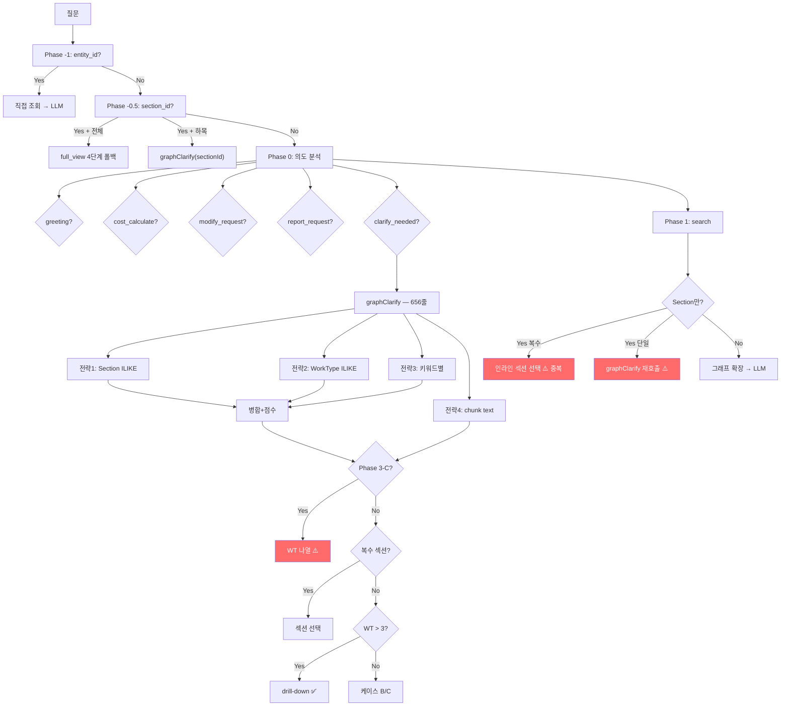
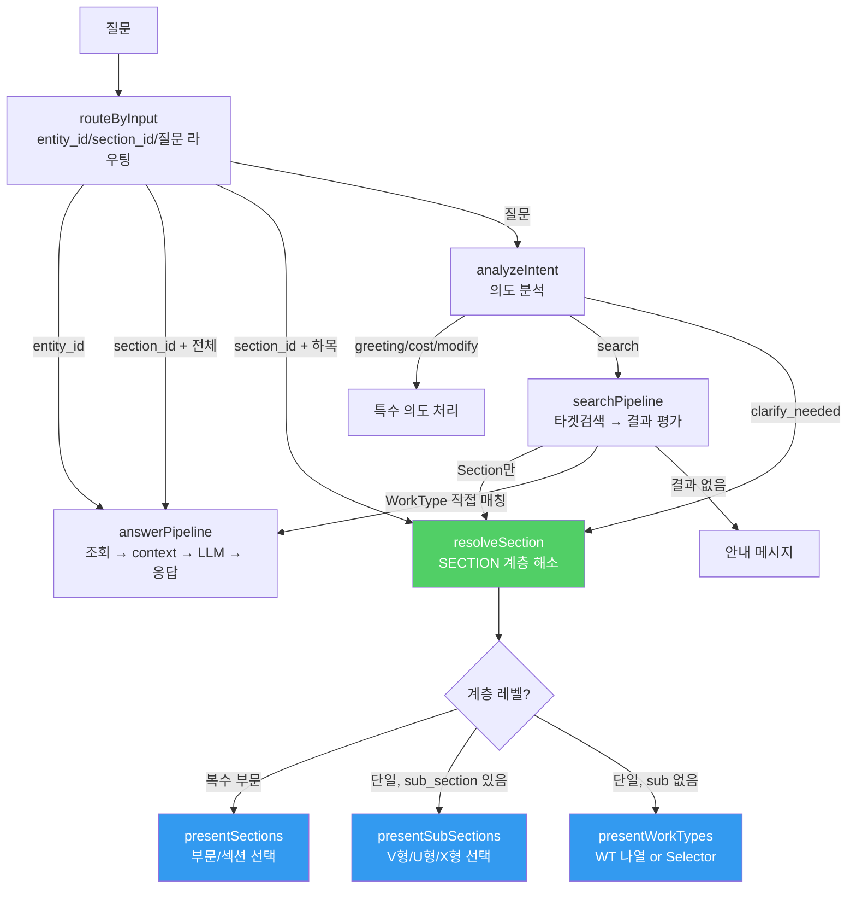

# Edge Function 아키텍처 재설계 — 상세 구현 계획서

> 작성일: 2026-02-18 | 대상: `edge-function/` 9개 파일

---

## 1. 현재 아키텍처의 구조적 문제

### 근본 원인: 데이터 구조와 코드 구조의 불일치

PDF는 **계층적(Hierarchical)**으로 파싱됨:
```
부문(Department) → 장(Chapter) → 절(Section) → sub_section → WorkType
```

하지만 코드는 **평면적(Flat)**으로 처리:
```
4개 검색 전략 × 6개+ 분기 = 어떤 전략이 먼저 결과를 반환하느냐에 따라 다른 경로
```

### 핵심 문제 요약

| 문제                | 현상                                                                                            | 영향                            |
| ------------------- | ----------------------------------------------------------------------------------------------- | ------------------------------- |
| **갈래 파편화**     | `graphClarify` 내 Phase 3-C, Step 1/2, 케이스 A/B/C 등 6개+ 분기가 각자 다른 방식으로 응답 생성 | 한 곳 수정 → 다른 경로에서 회귀 |
| **검색-표시 결합**  | 4개 검색 전략과 표시 로직이 뒤엉켜 있음                                                         | 검색 순서에 따라 UI가 달라짐    |
| **계층 무시**       | sub_section drill-down을 일부 경로에서만 호출                                                   | 전기아크용접 등에서 분류 누락   |
| **handleChat 비대** | 581줄에 8개 Phase가 하나의 함수에 밀집                                                          | 새 기능 추가 시 복잡도 급증     |

### 현재 코드 흐름 (문제시되는 구조)



> [!CAUTION]
> 빨간색(⚠️) 경로에서 sub_section drill-down 누락, handleChat↔graphClarify 중복, 예측 불가능한 진입 경로 문제 발생

---

## 2. 새 아키텍처: SECTION 계층 기반 단일 파이프라인

### 설계 원칙

| 원칙                | 설명                                                    |
| ------------------- | ------------------------------------------------------- |
| **Single Pipeline** | `질문 → 식별 → 분류 → 응답`의 하나의 선형 흐름          |
| **계층 우선**       | Section → sub_section → WorkType 순서로 항상 drill-down |
| **검색-표시 분리**  | 검색(resolve)과 표시(present)를 독립 함수로 분리        |
| **단일 책임**       | 각 함수가 하나의 역할만 수행 (50~100줄 이내)            |

### 새 코드 흐름



### 핵심 변경: `resolveSection` 함수 (현재의 4전략 + 6분기 → 1함수)

```typescript
// ─── 새 함수: SECTION 계층 해소 ───
// 입력: work_name, keywords, sectionId(선택)
// 출력: { level, sections, subSections, workTypes }
async function resolveSection(
    analysis: IntentAnalysis,
    sectionId?: string
): Promise<ResolveResult>
```

**`resolveSection`이 하는 일:**

```
입력(work_name, keywords)
  ↓
1. Section 식별 (ILIKE → 1건 or N건)
  ↓
2. N건이면 → { level: 'multi_section', sections: [...] }
  ↓
3. 1건이면 → 해당 Section의 전체 WorkType 조회
  ↓
4. sub_section 존재? → { level: 'sub_section', subSections: [...] }
  ↓
5. sub_section 없음 → { level: 'worktype', workTypes: [...] }
```

**현재 코드와의 차이:**
- 현재: 4개 전략이 각각 결과를 모으고, 병합 후, 어떤 결과가 있느냐에 따라 6개 분기
- 새 구조: **Section 식별 → 하나의 계층 순회** (검색 전략은 `resolveSection` 내부에서만 사용)

---

## 3. 구현 계획 — 4단계

### Phase 1: `resolveSection` + 표시 함수 추출 (핵심)

`graphClarify`의 656줄을 **3개 함수**로 분해:

#### [NEW] [resolve.ts](file:///g:/My%20Drive/Antigravity/edge-function/resolve.ts)

| 함수               | 역할                                                  | 예상 줄 수 |
| ------------------ | ----------------------------------------------------- | ---------- |
| `resolveSection()` | 검색 전략 실행 → Section/WorkType 계층 해소           | ~120줄     |
| `presentClarify()` | ResolveResult → ClarifyResult 변환 (메시지+옵션 조립) | ~80줄      |

```typescript
// ─── resolveSection: 검색 + 계층 해소 ───
interface ResolveResult {
    level: 'multi_section' | 'sub_section' | 'worktype' | 'empty';
    sections: SectionInfo[];        // 매칭된 섹션(들)
    subSections?: SubSectionInfo[]; // sub_section 분류
    workTypes: WorkTypeInfo[];      // 해당 범위의 전체 WorkType
    sectionMeta: Map<string, ChunkMeta>; // 부문/장/절 메타
}

async function resolveSection(
    analysis: IntentAnalysis,
    sectionId?: string
): Promise<ResolveResult> {
    // Step 1: Section 탐색 (기존 전략 1-A, 1-B 통합)
    //   sectionId 있으면 → 직접 사용
    //   없으면 → ILIKE 검색 (work_name 기반)
    
    // Step 2: WorkType 조회 (기존 전략 2~3 통합)
    //   매칭된 Section의 source_section → WorkType 전체 조회
    
    // Step 3: 계층 판정
    //   sections > 1 → 'multi_section'
    //   sub_section 2종+ → 'sub_section'
    //   else → 'worktype'
    
    // 기존 전략 4(chunk text)는 Step 1~2에서 결과가 0건일 때만 실행
}


// ─── presentClarify: 계층 결과 → UI 옵션 변환 ───
function presentClarify(
    resolved: ResolveResult,
    searchTerms: string[],
    workName: string | null
): ClarifyResult {
    switch (resolved.level) {
        case 'multi_section':
            return presentSections(resolved);      // 부문 선택 칩
        case 'sub_section':
            return presentSubSections(resolved);   // V형/U형/X형 칩
        case 'worktype':
            return presentWorkTypes(resolved);     // WT 나열 + Selector
        case 'empty':
            return { message: '...', options: [] };
    }
}
```

#### [MODIFY] [clarify.ts](file:///g:/My%20Drive/Antigravity/edge-function/clarify.ts)

- `graphClarify` 656줄 → **~50줄** (resolveSection + presentClarify 호출)
- 기존 4전략 검색 코드 → `resolve.ts`로 이동
- 기존 케이스 A/B/C 분기 → `presentClarify`로 이동
- `analyzeIntent`, `extractSpec`, `normalizeSpec` 등은 그대로 유지
- `subSectionDrillDown`, `buildSelectorPanel`, `extractFilterAxes` → `resolve.ts`로 이동

```typescript
// 리팩토링 후의 graphClarify (약 50줄)
export async function graphClarify(
    analysis: IntentAnalysis,
    sectionId?: string
): Promise<ClarifyResult> {
    const resolved = await resolveSection(analysis, sectionId);
    const searchTerms = buildSearchTerms(analysis.work_name, analysis.keywords);
    return presentClarify(resolved, searchTerms, analysis.work_name);
}
```

---

### Phase 2: `handleChat` 파이프라인화

`handleChat` 581줄을 **4개 함수**로 분해:

#### [MODIFY] [index.ts](file:///g:/My%20Drive/Antigravity/edge-function/index.ts)

| 함수                 | 역할                                            | 예상 줄 수 |
| -------------------- | ----------------------------------------------- | ---------- |
| `handleChat()`       | 라우터 (입력 → 적절한 파이프라인 호출)          | ~60줄      |
| `answerPipeline()`   | entity 조회 → graph 확장 → context → LLM → 응답 | ~100줄     |
| `fullViewPipeline()` | section 전체 원문 → context → LLM → 응답        | ~80줄      |
| `searchPipeline()`   | 임베딩 검색 → 결과 평가 → answer or clarify     | ~80줄      |

```typescript
// 리팩토링 후의 handleChat (약 60줄)
async function handleChat(
    question: string, history: ChatMessage[],
    entityId?: string, sectionId?: string, 
    session?: SessionContext, answerOpts?: AnswerOptions
): Promise<ChatResponse> {
    const startTime = Date.now();

    // 1. 직접 조회 (entity_id 전달됨)
    if (entityId) return answerPipeline(entityId, question, history, startTime, answerOpts);

    // 2. 섹션 드릴다운 (section_id 전달됨)
    if (sectionId) {
        if (isFullView(question)) return fullViewPipeline(sectionId, question, history, startTime);
        const resolved = await resolveSection({ ...buildAnalysis(question), intent: 'clarify_needed' }, sectionId);
        return makeClarifyResponse(presentClarify(resolved, ...), startTime, ...);
    }

    // 3. 의도 분석
    const analysis = await analyzeIntent(question, history, session);

    // 4. 특수 의도 라우팅
    if (analysis.intent === 'greeting') return greetingResponse(startTime);
    if (analysis.intent === 'cost_calculate') return answerPipeline(session.last_entity_id, ...);
    if (analysis.intent === 'modify_request') return handleModify(analysis, session, ...);
    if (analysis.intent === 'report_request') return answerPipeline(session.last_entity_id, ...);

    // 5. clarify → resolveSection 단일 경로
    if (analysis.intent === 'clarify_needed') {
        const resolved = await resolveSection(analysis);
        return makeClarifyResponse(presentClarify(resolved, ...), startTime, ...);
    }

    // 6. search → searchPipeline
    return searchPipeline(analysis, question, history, startTime, answerOpts);
}
```

**`searchPipeline` 변경 포인트:**
- 현재: Section만 매칭 시 인라인으로 섹션 선택 칩을 생성하거나 graphClarify 재호출 — 이것이 `resolveSection`과 중복되는 핵심 원인
- 새 구조: Section만 매칭 시 → `resolveSection`으로 위임

```typescript
async function searchPipeline(analysis, question, history, startTime, answerOpts) {
    const embedding = await generateEmbedding(question);
    const entities = await targetSearch(analysis, embedding, question);
    
    // Section만 매칭 → resolveSection으로 위임 (기존 인라인 분기 제거)
    if (entities.every(e => e.type === 'Section')) {
        const resolved = await resolveSection(analysis);
        return makeClarifyResponse(presentClarify(resolved, ...), startTime, ...);
    }
    
    if (entities.length === 0) return noResultResponse(question, history, startTime);
    
    // WorkType 직접 매칭 → answer
    return answerPipeline(entities, question, history, startTime, answerOpts);
}
```

---

### Phase 3: 불필요 코드 제거 + 정리

| 제거 대상                                        | 현재 위치    | 이유                           |
| ------------------------------------------------ | ------------ | ------------------------------ |
| `handleChat` L744~806 (Section-Only 인라인 분기) | `index.ts`   | `resolveSection`으로 통합      |
| `graphClarify` Phase 3-C (L920~982)              | `clarify.ts` | `presentClarify`에서 일관 처리 |
| `graphClarify` 케이스 A/B/C (L1006~1128)         | `clarify.ts` | `presentClarify`에서 일관 처리 |
| `graphClarify` 4전략 검색 (L640~870)             | `clarify.ts` | `resolveSection`으로 이동      |
| full_view 4단계 폴백 (L397~602)                  | `index.ts`   | `fullViewPipeline`으로 추출    |

---

### Phase 4: 검증

#### 자동화 테스트 (7개 시나리오)

| #   | 쿼리                 | 기대 결과                       |
| --- | -------------------- | ------------------------------- |
| 1   | `안녕`               | type=answer, greeting           |
| 2   | `강관용접 품셈`      | type=clarify, options=3         |
| 3   | `전기아크용접`       | type=clarify, **5 sub_section** |
| 4   | `TIG용접 품셈`       | type=clarify, options≥8         |
| 5   | `텍스 설치 품셈`     | type=clarify, 복수 섹션         |
| 6   | `W-0788`             | type=answer, 1 source           |
| 7   | `콘크리트 타설 인력` | type=answer                     |

#### 회귀 방지: 경로 커버리지

현재 문제의 핵심은 **"어떤 경로를 타는지 모른다"**입니다. 새 구조에서는:

```typescript
// resolveSection 결과에 _path 로그 추가
console.log(`[resolveSection] level=${resolved.level}, sections=${resolved.sections.length}, wts=${resolved.workTypes.length}`);
```

모든 clarify 응답이 **하나의 `resolveSection`**을 거치므로, 이 로그 하나로 경로 추적 가능.

---

## 4. 코드 규모 예측

| 파일                 | 현재         | Phase 1 후   | Phase 2 후   | 최종                    |
| -------------------- | ------------ | ------------ | ------------ | ----------------------- |
| **index.ts**         | 998줄        | 998줄        | ~600줄       | **~600줄**              |
| **clarify.ts**       | 1,166줄      | ~600줄       | ~600줄       | **~600줄**              |
| **resolve.ts** [NEW] | —            | ~300줄       | ~300줄       | **~300줄**              |
| search.ts            | 421줄        | 421줄        | 421줄        | 421줄                   |
| graph.ts             | 339줄        | 339줄        | 339줄        | 339줄                   |
| context.ts           | 372줄        | 372줄        | 372줄        | 372줄                   |
| **합계**             | **~3,300줄** | **~3,030줄** | **~2,630줄** | **~2,630줄** (**-20%**) |

> [!IMPORTANT]
> 줄 수 감소보다 중요한 것: **clarify 경로가 6개 → 1개로 통합**되어 "하나 고치면 하나 깨지는" 문제가 구조적으로 해소됩니다.

---

## 5. 위험 요소 및 대응

| 위험                            | 확률 | 대응                                                                                         |
| ------------------------------- | ---- | -------------------------------------------------------------------------------------------- |
| Phase 1에서 기존 검색 품질 저하 | 중   | 기존 4전략을 제거하지 않고 `resolveSection` 내부에서 동일 순서로 호출. 전략 자체는 변경 없음 |
| Phase 2에서 의도별 분기 누락    | 낮   | 기존 handleChat의 모든 intent를 체크리스트로 관리                                            |
| LLM 의도 분석 결과와의 호환성   | 낮   | `analyzeIntent`는 변경하지 않음. 출력 인터페이스(`IntentAnalysis`) 동일 유지                 |
| 배포 중 다운타임                | 없음 | Supabase Edge Function은 무중단 배포 (이전 버전 유지)                                        |

---

## 6. 구현 순서 및 일정

| 단계        | 작업                                           | 의존성         |
| ----------- | ---------------------------------------------- | -------------- |
| **Phase 1** | `resolve.ts` 신규 생성 + graphClarify 리팩토링 | 없음           |
| **Phase 2** | `handleChat` 파이프라인화                      | Phase 1 완료   |
| **Phase 3** | 불필요 코드 제거 + 정리                        | Phase 1~2 완료 |
| **Phase 4** | 7개 시나리오 검증 + 배포                       | Phase 3 완료   |

> [!WARNING]
> **Phase 1~2는 Big-Bang 교체가 아닙니다.** 각 Phase 완료 후 배포+검증하여, 문제 시 해당 Phase만 롤백합니다.

---

## User Review Required

> [!IMPORTANT]
> 1. **`resolve.ts` 신규 파일 추가**: 기존 `clarify.ts`의 검색+분기 로직을 분리하는 것이 핵심. 동의하시나요?
> 2. **기존 4전략(ILIKE, 토큰분리, 키워드별, chunk text)**: 전략 자체는 유지하되 `resolveSection` 내부로 이동. 전략 제거/변경은 이번 범위에 포함하지 않습니다.
> 3. **Phase 단위 배포**: Phase 1 완료 후 배포+검증, Phase 2 완료 후 배포+검증 — 단계별로 진행합니다.
