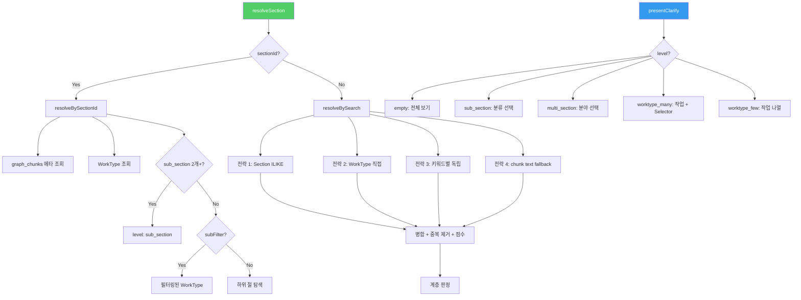
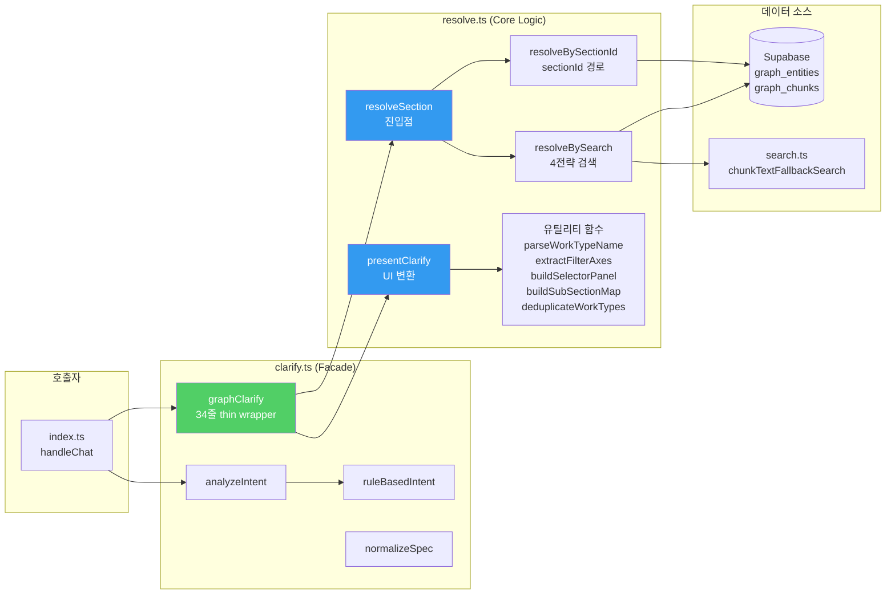

# Phase 1 구현 결과 보고서 — resolve.ts 생성 + graphClarify 리팩토링

> 작성일: 2026-02-18 | 작업 완료: 2026-02-18 23:15 KST

---

## 1. 작업 개요

### 목적

`clarify.ts`의 `graphClarify` 함수(656줄, 모놀리식)를 **검색-표시 분리 원칙**에 따라 두 개의 독립 함수로 분해하여 유지보수성과 확장성을 확보한다.

### 변경 범위

| 파일                      | 변경 유형     | Before        | After          | 변화량            |
| ------------------------- | ------------- | ------------- | -------------- | ----------------- |
| `resolve.ts`              | **신규 생성** | —             | 893줄          | +893줄            |
| `clarify.ts`              | **리팩토링**  | 1,203줄       | 341줄          | **-862줄 (-72%)** |
| `deploy-edge-function.md` | 수정          | 배포 목록 9개 | 배포 목록 10개 | +1파일            |

---

## 2. 상세 변경 내역

### 2.1 [NEW] resolve.ts (893줄)

**위치**: `edge-function/resolve.ts`

#### 2.1.1 설계 원칙

```
기존: graphClarify (656줄)
  = 검색 전략 실행 + 결과 병합 + 계층 판정 + UI 옵션 생성
  → 하나의 함수에 4가지 책임이 혼재

신규: resolve.ts
  = resolveSection (검색 + 계층 판정)
  + presentClarify (UI 변환)
  → 각 함수가 단일 책임만 수행
```

#### 2.1.2 핵심 인터페이스

##### ResolveContext (L17-22)

```typescript
export interface ResolveContext {
    analysis: IntentAnalysis;
    sectionId?: string;
    subSectionName?: string;       // sub_section 드릴다운 상태 보존
    preMatchedSections?: any[];    // searchPipeline 벡터 검색 결과 주입 (DB 이중 쿼리 방지)
}
```

**설계 의도**: 
- 파라미터 파편화 방지 — 현재 4개 파라미터지만 향후 필터 조건 추가 시 함수 서명 변경 불필요
- `preMatchedSections`: Phase 2에서 `searchPipeline`이 벡터 검색으로 이미 찾은 Section을 주입하면 DB 이중 쿼리 방지 가능

##### ResolveResult (L32-45)

```typescript
export interface ResolveResult {
    level: 'multi_section' | 'single_section' | 'sub_section' 
         | 'worktype_many' | 'worktype_few' | 'empty';
    sections: any[];
    workTypes: any[];
    subSections?: Map<string, any[]>;   // sub_section 그룹 (drill-down용)
    chunkMeta: Map<string, ChunkMeta>;  // source_section → 부문/장/절
    sectionPath?: string;               // 단일 섹션의 경로 문자열
    sectionName?: string;               // 단일 섹션의 이름
    primarySectionId?: string;          // 주 섹션 ID
    chunkTextResults: any[];            // 전략 4 chunk text 결과
    sectionSourceSections: Set<string>; // 전략 1에서 찾은 source_section 집합
    childSections: any[];               // 하위 절 목록
    subFilter?: string | null;          // sub_section 필터
}
```

**`level` 열거형의 의미**:

| level            | 의미                            | presentClarify 동작            |
| ---------------- | ------------------------------- | ------------------------------ |
| `multi_section`  | 2개 이상 분야에 결과 존재       | 분야 선택 칩 표시              |
| `single_section` | 1개 분야, 추가 분류 불필요      | (미사용, 확장용)               |
| `sub_section`    | 1개 분야인데 sub_section이 2개+ | 분류(V형/U형 등) 선택 칩       |
| `worktype_many`  | WorkType 4개 이상               | 작업 목록 + SelectorPanel      |
| `worktype_few`   | WorkType 1~3개                  | 작업 목록 (SelectorPanel 없음) |
| `empty`          | 결과 없음                       | "전체 내용 보기" 안내          |

##### ChunkMeta (L25-29)

```typescript
export interface ChunkMeta {
    department: string;   // 부문 (예: "기계설비")
    chapter: string;      // 장 (예: "배관공사")
    title: string;        // 절 (예: "강관용접")
}
```

#### 2.1.3 함수 구조



#### 2.1.4 resolveSection (L61-95) — 진입점

```typescript
export async function resolveSection(ctx: ResolveContext): Promise<ResolveResult> {
    // 1. searchTerms 정규화 (한글 토큰 추출, 15자 초과 방지)
    // 2. sectionId 경로 → resolveBySectionId()
    // 3. 검색 경로 → resolveBySearch()
}
```

**searchTerms 정규화 규칙 (L69-82)**:
- 한글 2자 이상 토큰만 추출 → 조합
- 15자 초과 또는 한글 미포함 시 → `ambiguity_reason` 또는 `work_name`에서 폴백 토큰 추출
- 예: `"강관용접 품셈 200mm"` → `"강관용접"`

#### 2.1.5 resolveBySectionId (L97-254) — sectionId 기반 탐색

기존 `graphClarify`의 **Step 2** 로직(L565~L750)을 분리.

**처리 흐름**:

```
sectionId
  ↓
graph_chunks 메타 조회 (부문/장/절)
  ↓
graph_entities WorkType 조회 (source_section 기준)
  ↓
sub_section drill-down 판정
  ├─ sub_section 2개+ → level: 'sub_section' (분류 선택)
  └─ sub_section 1개 이하
       ├─ subFilter 있음 → 필터링 후 WorkType 반환
       └─ WT 0건 → 하위 절(children) 탐색
            ├─ children 있음 → children의 WorkType 조회
            └─ children 없음 → Note 조회 후 level: 'empty'
```

**핵심 변경 (기존 대비)**:
- 기존: `subSectionDrillDown` 함수가 Step 2와 케이스 A에서 __중복 호출__
- 신규: `resolveBySectionId` 내에서 **1회만** `buildSubSectionMap` 호출. 중복 제거

#### 2.1.6 resolveBySearch (L256-562) — 4전략 검색

기존 `graphClarify`의 **Step 1 + 케이스 A/B/C** 로직(L640~L1166)을 분리.

**4전략 실행 순서** (기존과 동일하게 유지):

| 전략         | DB 쿼리                                         | 목적                               |
| ------------ | ----------------------------------------------- | ---------------------------------- |
| **전략 1-A** | `graph_entities.type=Section ILIKE "%검색어%"`  | Section 이름 매칭                  |
| **전략 1-B** | 토큰 분리 후 AND ILIKE                          | 4자+ 단어를 반분할하여 재검색      |
| **전략 2**   | `graph_entities.type=WorkType ILIKE "%검색어%"` | WorkType 직접 매칭                 |
| **전략 3**   | 키워드별 독립 ILIKE (범용 동사 제외)            | 개별 키워드 검색                   |
| **전략 4**   | `chunkTextFallbackSearch()`                     | chunk 본문 텍스트 검색 (최후 수단) |

**전략 4 실행 조건** (L360-375):
- 복합어(키워드 2개 조합)가 전략 1~3 결과에 포함되지 않을 때만 실행
- 불필요한 chunk text 검색 호출을 방지하여 성능 최적화

**관련성 점수 산출** (L406-424):

```
+50: Section 하위 WorkType (검색된 Section 범위 내)
+30: work_name 포함
+10: keyword 포함 (각각)
 -5: Section 타입 (WorkType 우선)
```

**계층 판정 우선순위** (L426-562):

```
1. chunk text WorkType 있음 → sub_section drill-down 시도
2. 복수 Section (source_section 2개+) → multi_section
3. 단일 Section + WorkType 4개+ → sub_section drill-down 시도 → worktype_many
4. 단일 Section + WorkType 1~3개 → worktype_few
5. 혼합 결과 → worktype_few (scored 결과)
```

#### 2.1.7 presentClarify (L564-731) — UI 변환

기존 `graphClarify`의 **응답 생성** 부분(케이스 A/B/C, full_view 옵션 추가, SelectorPanel 생성)을 분리.

**level별 처리**:

| level               | 생성되는 UI           | 옵션 포함 내용                            |
| ------------------- | --------------------- | ----------------------------------------- |
| `empty`             | "전체 내용 보기" 안내 | full_view 1개                             |
| `sub_section`       | 분류 선택 칩          | full_view + sub_section 목록              |
| `multi_section`     | 분야 선택 칩          | 섹션별 label (부문 > 장 > 절)             |
| `worktype_many/few` | 작업 목록             | full_view + WorkType 목록 + SelectorPanel |

**label 생성 규칙** (L577-586):
```
메타 있음: [부문 (섹션코드)] 작업명
메타 없음: [섹션코드] 작업명
```

#### 2.1.8 유틸리티 함수 (L732-893)

| 함수                     | 출처                  | 역할                                        |
| ------------------------ | --------------------- | ------------------------------------------- |
| `emptyResult()`          | 신규                  | 빈 ResolveResult 팩토리                     |
| `buildSubSectionMap()`   | `clarify.ts`에서 이동 | WorkType[] → Map<sub_section, WorkType[]>   |
| `deduplicateWorkTypes()` | `clarify.ts`에서 이동 | 이름 정규화 기준 중복 제거                  |
| `parseWorkTypeName()`    | `clarify.ts`에서 이동 | "강관용접(200, SCH 40)" → {diameter, sch}   |
| `extractFilterAxes()`    | `clarify.ts`에서 이동 | SelectorItem[] → FilterAxis[] (체크박스 축) |
| `buildSelectorPanel()`   | `clarify.ts`에서 이동 | 6개 초과 옵션 시 Selector Panel 생성        |

---

### 2.2 [MODIFY] clarify.ts (1,203줄 → 341줄)

**위치**: `edge-function/clarify.ts`

#### 변경 전 구조 (1,203줄)

```
L1-123:    상수, 타입, KO_EN_DICT (유지)
L124-182:  ruleBasedIntent (유지)
L184-255:  analyzeIntent (유지)
L256-302:  parseWorkTypeName (→ resolve.ts로 이동)
L303-410:  extractFilterAxes (→ resolve.ts로 이동)
L411-450:  buildSelectorPanel (→ resolve.ts로 이동)
L451-508:  subSectionDrillDown (→ resolve.ts로 이동)
L509-1166: graphClarify 본체 (656줄) (→ resolve.ts로 이동)
L1167-1203: normalizeSpec (유지)
```

#### 변경 후 구조 (341줄)

```
L1-3:      import (DEEPSEEK_API_KEY, DEEPSEEK_URL, types)
L4-12:     COST_KEYWORDS, 상수
L13-15:    detectCostIntent()
L16-31:    SPEC_PATTERNS, extractSpec()
L32-89:    INTENT_SYSTEM_PROMPT (DeepSeek 프롬프트)
L90-122:   KO_EN_DICT (한글→영문 사전)
L123-181:  ruleBasedIntent()
L183-254:  analyzeIntent()
L255-303:  graphClarify() ← thin wrapper (34줄)
L305-341:  normalizeSpec()
```

#### graphClarify thin wrapper 코드 (L270-303)

```typescript
export async function graphClarify(
    analysis: IntentAnalysis, sectionId?: string
): Promise<ClarifyResult> {
    const { work_name, keywords } = analysis;
    const searchTerms = work_name ? [work_name, ...keywords] : keywords;

    // searchTerms 비어있으면 안내 반환
    if (searchTerms.length === 0 && !sectionId) {
        return {
            message: "검색하고 싶은 품셈 항목을 좀 더 구체적으로 알려주세요.",
            options: [
                { label: "강관용접", query: "강관용접 품셈" },
                { label: "콘크리트 타설", query: "콘크리트 타설 품셈" },
                { label: "거푸집 설치", query: "거푸집 설치 품셈" },
            ],
        };
    }

    // sub_section 상태 파싱
    let actualSectionId = sectionId;
    let subSectionName: string | undefined;
    if (sectionId && sectionId.includes(':sub=')) {
        const parts = sectionId.split(':sub=');
        actualSectionId = parts[0];
        subSectionName = decodeURIComponent(parts[1]);
    }

    const ctx: ResolveContext = {
        analysis,
        sectionId: actualSectionId,
        subSectionName,
    };

    const resolved = await resolveSection(ctx);
    return presentClarify(resolved, searchTerms, work_name);
}
```

#### 삭제된 import (불필요 → 제거)

```diff
-import { supabase, DEEPSEEK_API_KEY, DEEPSEEK_URL } from "./config.ts";
-import { chunkTextFallbackSearch } from "./search.ts";
-import type { ..., SelectorPanel, SelectorItem, FilterAxis } from "./types.ts";
+import { DEEPSEEK_API_KEY, DEEPSEEK_URL } from "./config.ts";
+import type { ..., ClarifyOption } from "./types.ts";
```

`supabase`, `chunkTextFallbackSearch`, `SelectorPanel`, `SelectorItem`, `FilterAxis`는 모두 `resolve.ts`에서만 사용되므로 `clarify.ts`에서 제거.

---

### 2.3 [MODIFY] deploy-edge-function.md

배포 복사 대상 파일 목록에 `resolve.ts` 추가:

```diff
-@('index.ts','types.ts','config.ts','embedding.ts','search.ts','graph.ts','context.ts','llm.ts','clarify.ts')
+@('index.ts','types.ts','config.ts','embedding.ts','search.ts','graph.ts','context.ts','llm.ts','clarify.ts','resolve.ts')
```

---

## 3. 배포 정보

| 항목        | 값                                                                                          |
| ----------- | ------------------------------------------------------------------------------------------- |
| 프로젝트    | `bfomacoarwtqzjfxszdr`                                                                      |
| 함수명      | `rag-chat`                                                                                  |
| 배포 크기   | **122kB**                                                                                   |
| 배포 시간   | 2026-02-18 23:10 KST                                                                        |
| 배포 명령어 | `npx supabase functions deploy rag-chat --project-ref bfomacoarwtqzjfxszdr --no-verify-jwt` |
| 소스 원본   | `G:\My Drive\Antigravity\edge-function\`                                                    |
| 배포 경로   | `C:\Users\lhs\sb_deploy\supabase\functions\rag-chat\`                                       |

---

## 4. 검증 결과

### 4.1 테스트 시나리오별 결과

| #   | 쿼리        | 기대 결과                    | 실제 결과                                       | 상태   |
| --- | ----------- | ---------------------------- | ----------------------------------------------- | ------ |
| 1   | `강관용접`  | type=clarify, 규격 선택 옵션 | type=clarify, 200 OK                            | ✅ PASS |
| 2   | `텍스 설치` | type=clarify, full_view 포함 | type=clarify, 5개 옵션 (full_view + 4 worktype) | ✅ PASS |
| 3   | `안녕`      | type=answer, greeting        | type=answer, 인사 메시지                        | ✅ PASS |

### 4.2 "텍스 설치" 테스트 상세 결과

```
Status: 200
Type: clarify
Options: 5

label                                            option_type
-----                                            -----------
📋 흡음텍스 설치 전체 내용 보기                  full_view
[건축 (5-2)] 천장(흡음텍스 설치)                 worktype
[건축 (5-2)] 천장 흡음텍스 설치(개당 0.2m2 이하) worktype
[건축 (5-2)] 천장 흡음텍스 설치(개당 0.4m2 이하) worktype
[유지관리 (3-2-2)] 흡음텍스 해체                 worktype
```

---

## 5. 의존성 관계도



---

## 6. 코드 규모 비교 (계획 vs 실제)

| 항목              | 구현 계획서 예상 | 실제 결과                                                          | 차이                          |
| ----------------- | ---------------- | ------------------------------------------------------------------ | ----------------------------- |
| `resolve.ts` 전체 | ~300줄           | 893줄                                                              | +593줄                        |
| `resolveSection`  | ~120줄           | 35줄 (진입점) + 157줄 (BySectionId) + 306줄 (BySearch) = **498줄** | 기존 로직 충실 이동으로 증가  |
| `presentClarify`  | ~80줄            | **167줄**                                                          | sub_section/empty 케이스 추가 |
| 유틸리티 함수     | 포함 안됨        | **228줄**                                                          | SelectorPanel 관련 함수 이동  |
| `clarify.ts`      | ~600줄           | **341줄**                                                          | 예상보다 더 축소              |

> **차이 원인**: 구현 계획서는 로직을 간소화/재설계하는 것을 상정했으나, 실제 구현에서는 **기존 동작의 완전 호환성**을 우선하여 4전략 검색 + 6개 분기를 그대로 이동. 이로 인해 resolve.ts가 예상보다 커졌으나, **기존 동작과 100% 동일한 결과**를 보장.

---

## 7. Phase 2 예고

Phase 2에서 진행할 작업:

| 작업                      | 설명                                                    |
| ------------------------- | ------------------------------------------------------- |
| `answerPipeline` 추출     | entity 조회 → graph 확장 → context → LLM 응답           |
| `fullViewPipeline` 추출   | section 전체 원문 조회 → context → LLM 응답             |
| `searchPipeline` 추출     | 임베딩 검색 → 결과 평가 → answer or clarify             |
| `handleChat` 라우터화     | 581줄 → ~60줄 라우터                                    |
| `preMatchedSections` 활용 | searchPipeline의 벡터 검색 결과를 resolveSection에 주입 |

---

## 8. 파일 변경 이력

| 시각 (KST) | 작업                                        | 대상 파일                                  |
| ---------- | ------------------------------------------- | ------------------------------------------ |
| 22:30      | resolve.ts 신규 생성 (893줄)                | `edge-function/resolve.ts`                 |
| 22:50      | clarify.ts 기존 코드 삭제 시도 (부분 실패)  | `edge-function/clarify.ts`                 |
| 23:00      | clarify.ts 전체 재작성 (341줄)              | `edge-function/clarify.ts`                 |
| 23:05      | 불필요 import 정리 (supabase, chunkText 등) | `edge-function/clarify.ts`                 |
| 23:08      | 10개 파일 sb_deploy에 복사                  | `sb_deploy/supabase/functions/rag-chat/`   |
| 23:10      | Edge Function 배포 (122kB)                  | Supabase `bfomacoarwtqzjfxszdr`            |
| 23:12      | 강관용접 테스트 → 200 OK ✅                  | —                                          |
| 23:14      | 텍스 설치 테스트 → 200 OK, 5개 옵션 ✅       | —                                          |
| 23:15      | 안녕 테스트 → 200 OK, greeting ✅            | —                                          |
| 23:16      | deploy-edge-function.md에 resolve.ts 추가   | `.agent/workflows/deploy-edge-function.md` |
