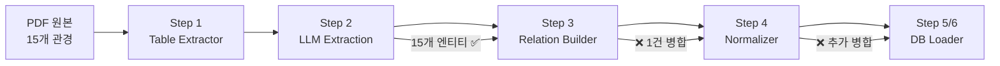

# PE관 데이터 집계 파이프라인 수정 검토보고서

> **작성일:** 2026-02-19  
> **대상:** `step3_relation_builder.py`, `step4_normalizer.py`  
> **상태:** 검토 완료 → 구현 대기

---

## 1. 문제 정의

### 1.1 증상
"가스용 폴리에틸렌(PE)관 접합 및 부설" 공종에 대해 **15개의 관경**(63~400mm)이 존재하지만, 최종 DB에는 **63mm 1건만 저장**됨.

### 1.2 데이터 흐름 추적



### 1.3 LLM 추출 데이터 확인 (backup_20260213_0830)

`llm_entities.json` L280236~280449에서 확인된 실제 데이터:

| 항목 | 값 |
|------|-----|
| **엔티티 수** | 15개 WorkType (63~400mm) |
| **엔티티 name** | 모두 동일: `"가스용 폴리에틸렌(PE)관 접합 및 부설"` |
| **spec 필드** | `"63㎜"`, `"75㎜"`, `"90㎜"`, `"110㎜"`, `"125㎜"`, `"140㎜"`, `"160㎜"`, `"180㎜"`, `"200㎜"`, `"225㎜"`, `"250㎜"`, `"280㎜"`, `"315㎜"`, `"355㎜"`, `"400㎜"` |
| **관계(relationships)** | 단 7건 (모두 spec 없이 동일한 source name 사용) |
| **source_spec 필드** | 관계 JSON에 **존재하지 않음** (grep 결과 0건) |

> [!IMPORTANT]
> LLM이 엔티티는 규격별로 분리 추출했으나, 관계는 1세트(63mm 기준 수량)로만 추출함. `source_spec` 필드가 관계에 없으므로 어떤 규격의 수량인지 식별 불가.

---

## 2. 근본 원인 분석: 4중 연쇄 붕괴 (Quadruple Collapse)

### 2.1 Step 3 — `_entity_key` 병합 (1차 붕괴)

**파일:** `step3_relation_builder.py` L37-40  
**현재 코드:**
```python
def _entity_key(ent: dict) -> str:
    norm = ent.get("normalized_name", ent["name"].replace(" ", ""))
    return f"{ent['type']}::{norm}"
```

**문제:** `type + normalized_name`만으로 키를 생성하여, name이 동일한 15개 PE관 엔티티가 **1개로 병합**됨.

---

### 2.2 Step 4 Phase E — `dedup_key` 재축소 (2차 붕괴)

**파일:** `step4_normalizer.py` L519-524  
**현재 코드:**
```python
dedup_key = (new_src, src_type, new_tgt, tgt_type,
             rel.get("type", ""), qty, unit, per_unit)
```

**문제:** Step 3에서 BELONGS_TO 관계를 15건으로 분리하더라도, `dedup_key`에 spec이 없어 15건이 **다시 1건으로 축소**됨.

| 관계 | source (동일) | target (동일) | type (동일) | qty/unit/per_unit (모두 None) | **결과** |
|------|-------------|-------------|------------|-----|----------|
| 63mm BELONGS_TO | PE관접합부설 | 부속기기 | BELONGS_TO | None/None/None | ✅ 유지 |
| 75mm BELONGS_TO | PE관접합부설 | 부속기기 | BELONGS_TO | None/None/None | ❌ 중복 삭제 |
| 90mm ~ 400mm | (동일) | (동일) | (동일) | (동일) | ❌ 모두 삭제 |

---

### 2.3 Step 4 Phase F — `id_map` 덮어쓰기 (3차 붕괴)

**파일:** `step4_normalizer.py` L544-569  
**현재 코드:**
```python
def phase_f(entities: list[dict]) -> dict[tuple[str, str], str]:
    for ent in entities:
        # ...
        id_map[(etype, ent["name"])] = eid  # ← L558: 마지막 값만 남음
```

**문제:** `id_map` 키가 `(type, name)`이므로, 15개의 PE관 엔티티가 루프를 돌며 같은 키에 ID를 **계속 덮어씌워** 마지막 규격의 ID만 남음. 결과적으로 15개 엔티티 모두 동일한 `entity_id`를 부여받음.

---

### 2.4 Step 4 글로벌 Dedup — entity_id 기반 최종 삭제 (4차 붕괴)

**파일:** `step4_normalizer.py` L685-726  
**현재 코드:**
```python
g_key = (
    rel.get("source_entity_id", ""),
    rel.get("target_entity_id", ""),
    rel.get("type", ""),
    rel.get("quantity"),
    rel.get("unit", ""),
    rel.get("per_unit", ""),
)
```

**문제:** 3차 붕괴로 15개 관계 모두 동일한 `source_entity_id`를 갖게 되어, 글로벌 dedup에서 **최종 1건으로 삭제**.

---

## 3. 수정안 상세 검토

### 3.1 Step 3 수정 — 3곳

#### ① `_entity_key` — spec 포함 복합 키 (✅ 적용)

```diff
 def _entity_key(ent: dict) -> str:
     norm = ent.get("normalized_name", ent["name"].replace(" ", ""))
+    spec = ent.get("spec", "")
+    if ent["type"] in ("WorkType", "Equipment", "Material") and spec:
+        safe_spec = str(spec).replace(" ", "").lower()
+        return f"{ent['type']}::{norm.lower()}::{safe_spec}"
     return f"{ent['type']}::{norm.lower()}"
```

**검토 결과:** `step4_normalizer.py`의 `make_entity_key` (L194-211)와 동일한 전략. 정합성 ✅

#### ② `_rel_key` — properties 내 spec 참조 (✅ 적용)

```diff
 def _rel_key(rel: dict) -> str:
     src = rel['source'].replace(' ','').lower()
     tgt = rel['target'].replace(' ','').lower()
+    props = rel.get("properties") or {}
+    src_spec = str(props.get("source_spec", "")).replace(' ', '').lower()
+    tgt_spec = str(props.get("target_spec", "")).replace(' ', '').lower()
+    if src_spec: src = f"{src}::{src_spec}"
+    if tgt_spec: tgt = f"{tgt}::{tgt_spec}"
     return f"{rel['type']}::{src}::{tgt}"
```

**검토 결과:** 현재 LLM이 관계에 `source_spec`을 추출하지 않으므로 **실질적 효과는 없으나 방어 코드로 안전**. 해 없음 ✅

#### ③ `generate_belongs_to` + `run_step3` — properties 캡슐화 (✅ 적용)

```python
# 관계 생성 시 properties에 spec 은닉
"properties": {
    "section_id": norm_sid,
    "source_spec": spec  # ← 스키마 위반 없이 안전 저장
}

# 중복 제거 키에 spec 포함
key = f"{r['source']}::{r_spec}::{r['target']}"
```

**검토 결과:** 
- 최상위 스키마에 `source_spec` 필드를 추가하지 않고 `properties` dict에 저장 → 스키마 안전 ✅
- `step6_supabase_loader.py` `extract_all_relationships` (L108-109)에서 `properties.update(rel['properties'])` → DB까지 전파 ✅

---

### 3.2 Step 4 수정 — 3곳

#### ① `phase_e` dedup_key에 spec 추가 (✅ 적용)

**현재 (L519-524):**
```python
dedup_key = (new_src, src_type, new_tgt, tgt_type,
             rel.get("type", ""), qty, unit, per_unit)
```

**수정안:**
```python
props = rel.get("properties") or {}
sspec = normalize_spec(props.get("source_spec", ""))
tspec = normalize_spec(props.get("target_spec", ""))
dedup_key = (new_src, src_type, sspec, new_tgt, tgt_type, tspec,
             rel.get("type", ""), qty, unit, per_unit)
```

**검토 결과:**
- `normalize_spec` 함수는 L125에 정의 → 참조 유효 ✅
- spec이 없는 관계(대부분)는 빈 문자열 → 하위 호환성 ✅
- 15개 BELONGS_TO 관계의 `properties.source_spec`이 각각 다르므로 정확히 15건 보존 ✅

#### ② `phase_f` — exact_map + fallback_map 분리 (✅ 적용 가능)

**현재 (L544-569):**
```python
def phase_f(entities) -> dict[tuple[str, str], str]:
    id_map[(etype, ent["name"])] = eid  # 덮어쓰기 발생
    return id_map
```

**수정안:**
```python
def phase_f(entities) -> tuple[dict, dict]:
    exact_map[(etype, ent["name"], spec)] = eid     # 3단 키 (정확 매칭)
    fallback_map[(etype, ent["name"])] = eid         # 2단 키 (최초 1회만)
    return exact_map, fallback_map
```

**검토 결과:**
- 15개 PE관이 각각 고유 ID를 획득 → 2차 붕괴 방어 ✅
- Phase G (L862-888)의 entity_id 재할당은 `old_id → new_id` 매핑이므로 호환 ✅
- `fallback_map`은 spec이 없는 LLM 관계(REQUIRES_LABOR 등)가 고아 노드가 되지 않도록 방어 ✅

#### ③ `main()` — get_eid 헬퍼 + 관계 매핑 (✅ 적용 가능)

**현재 (L662-684):**
```python
id_map = phase_f(deduped_ents)
rel["source_entity_id"] = id_map.get(
    (rel.get("source_type", ""), rel.get("source", "")), ""
)
```

**수정안:**
```python
exact_map, fallback_map = phase_f(deduped_ents)

def get_eid(etype, ename, espec):
    # 1. exact 매칭 (spec 포함)
    eid = exact_map.get((etype, ename, normalize_spec(espec)))
    if eid: return eid
    # 2. fallback (spec 없는 경우)
    return fallback_map.get((etype, ename), "")

# 관계 매핑 시 properties에서 spec 추출
props = rel.get("properties") or {}
sspec = props.get("source_spec", "")
rel["source_entity_id"] = get_eid(src_type, src_name, sspec)
```

**검토 결과:**
- BELONGS_TO: `properties.source_spec` 있음 → exact 매칭으로 정확한 ID 할당 ✅
- REQUIRES_LABOR: `properties.source_spec` 없음 → fallback으로 대표 ID 할당 ✅
- Phase G 재할당(L862-888)과 호환 (old → new 매핑이 처리) ✅

---

## 4. 다운스트림 호환성 검증

### 4.1 Step 5 (step5 없음, step4 → step6 직결)

해당 없음.

### 4.2 Step 6 — `step6_supabase_loader.py`

**`extract_all_relationships` (L83-121):**
```python
properties = {}
for k in ['quantity', 'unit', 'per_unit']:
    v = rel.get(k)
    if v is not None:
        properties[k] = v
if rel.get('properties'):
    properties.update(rel['properties'])  # ← properties 그대로 DB에 전파
```

- `properties.source_spec`이 DB `graph_relationships.properties` JSONB에 안전하게 저장됨 ✅
- 최상위 스키마 필드 추가 없음 → `batch_insert` 호환 ✅

### 4.3 DB 스키마 (`graph_relationships` 테이블)

| 컬럼 | 타입 | 영향 |
|------|------|------|
| `source_id` | TEXT | entity_id 변경 → 자동 반영 ✅ |
| `target_id` | TEXT | 변경 없음 ✅ |
| `relation` | TEXT | 변경 없음 ✅ |
| `properties` | JSONB | `source_spec` 추가 저장 ✅ |

---

## 5. 수정 범위 요약

| # | 파일 | 함수/위치 | 수정 내용 | 판정 |
|---|------|-----------|-----------|------|
| 1 | `step3_relation_builder.py` | `_entity_key` (L37-40) | spec 포함 복합 키 | ✅ 적용 |
| 2 | `step3_relation_builder.py` | `_rel_key` (L43-49) | properties 내 spec 참조 | ✅ 적용 |
| 3 | `step3_relation_builder.py` | `generate_belongs_to` (L224-314) | properties에 spec 캡슐화 | ✅ 적용 |
| 4 | `step3_relation_builder.py` | `run_step3` BELONGS_TO 보강 (L499-532) | properties 기반 중복 방지 | ✅ 적용 |
| 5 | `step4_normalizer.py` | `phase_e` dedup_key (L519-524) | spec 포함 dedup 키 | ✅ 적용 |
| 6 | `step4_normalizer.py` | `phase_f` (L544-569) | exact_map + fallback_map | ✅ 적용 |
| 7 | `step4_normalizer.py` | `main()` 관계 ID 매핑 (L662-684) | get_eid 헬퍼 + spec 매핑 | ✅ 적용 |

---

## 6. 근본적 한계 및 향후 로드맵

### 6.1 현재 한계
- LLM이 관계를 규격별로 분리 추출하지 않음 (REQUIRES_LABOR 등 1세트만 제공)
- 현 수정안으로는 **엔티티 15건 보존 + BELONGS_TO 15건 보존**은 달성하지만
- **REQUIRES_LABOR 등은 fallback ID로 대표 1건에만 매핑**됨

### 6.2 향후 개선 방향
1. **Step 2 LLM 프롬프트 개선:** 규격별 관계 분리 추출 유도
2. **DB 엣지 쿼리 강화:** `MATCH (s:WorkType {name, spec})` 복합키 매칭
3. **RAG 검색 로직:** `properties.source_spec` 활용 필터링

---

## 7. 검증 계획

### 7.1 파이프라인 재실행 후 확인 항목

| 검증 항목 | 기대값 | 확인 방법 |
|-----------|--------|-----------|
| `merged_entities.json` PE관 엔티티 수 | 15개 | grep `"가스용 폴리에틸렌"` |
| BELONGS_TO 관계 수 (PE관 → 부속기기) | 15개 | grep `BELONGS_TO` + source `PE관` |
| `normalized_entities.json` PE관 엔티티 수 | 15개 | 최종 output 확인 |
| Phase E 중복 제거 수 | 기존 대비 감소 | 콘솔 로그 확인 |
| 글로벌 dedup 수 | 기존 대비 감소 | 콘솔 로그 확인 |
| DB `graph_entities` PE관 행 수 | 15개 | SQL 쿼리 |
| DB `graph_relationships` PE관 BELONGS_TO | 15개 | SQL 쿼리 |
