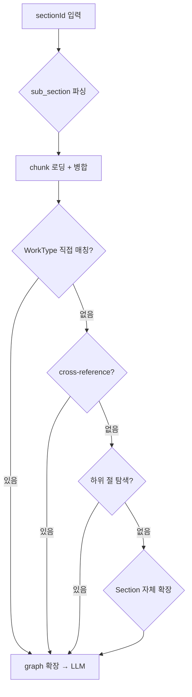
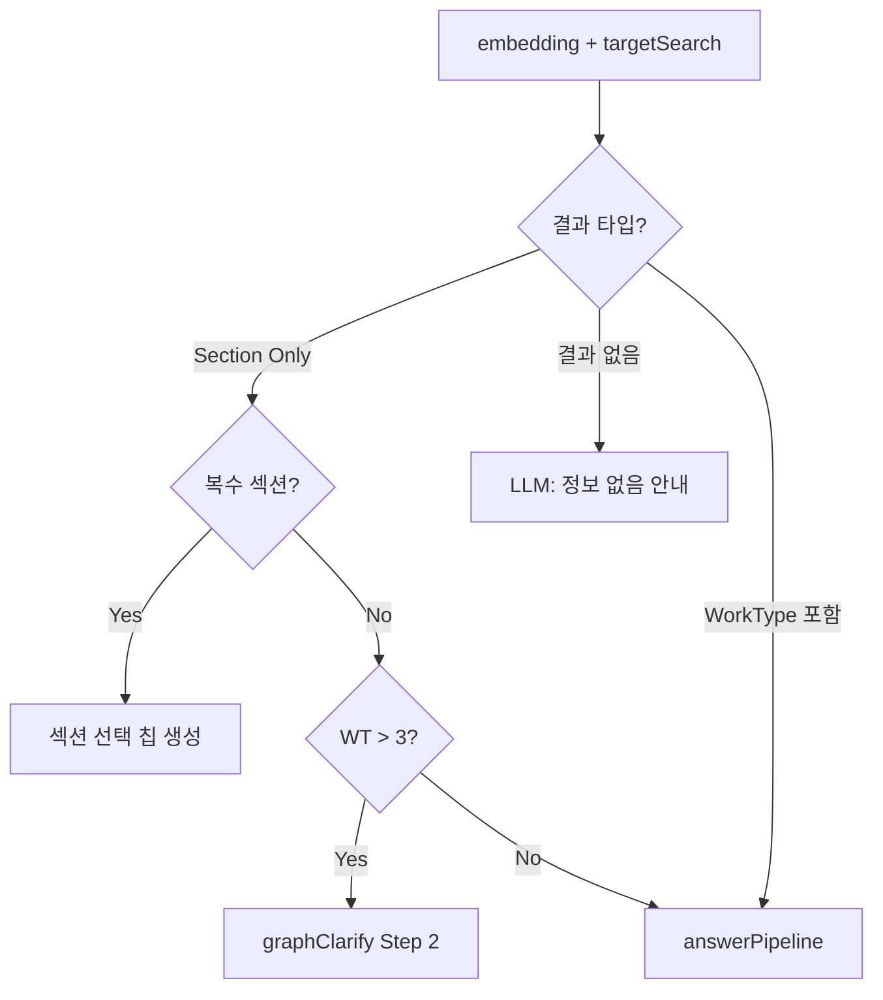

# Phase 2: handleChat 파이프라인화 — 구현 결과 보고서

> 작성일: 2026-02-19 | 작업 완료: 2026-02-19 00:40 KST

---

## 1. 작업 개요

### 목적

`handleChat` 590줄 모놀리식 함수를 **3개 파이프라인 함수 + 라우터**로 분해하여 단일 책임 원칙을 적용하고, Phase -1과 Phase 1b의 중복 답변 생성 로직을 통합한다.

### 변경 범위

| 파일                     | 변경 유형 | 설명                                       |
| ------------------------ | --------- | ------------------------------------------ |
| `edge-function/index.ts` | MODIFY    | handleChat 분해 + 3개 파이프라인 함수 추가 |

### 배포 정보

- **Edge Function**: `rag-chat` (script size: 120.4kB)
- **프로젝트**: `bfomacoarwtqzjfxszdr`
- **Git 커밋**: `5606734`

---

## 2. 구현 전 구조 (Before)

```
handleChat() — 590줄 (311~900행)
├── Phase -1: entity_id 직접 조회 → graph 확장 → ilwi → chunks → LLM (65줄)
├── Phase -0.5a: full_view 전체 원문 조회 → WorkType 4단계 폴백 → LLM (213줄)
├── Phase -0.5b: section_id Step 2 clarify (15줄)
├── Phase 0: 의도 분석 + 특수 의도 처리 (73줄)
├── Phase 1a: embedding → targetSearch → Section-Only 분기 (90줄)
└── Phase 1b: graph 확장 → context → LLM → 응답 (70줄)  ← Phase -1과 중복
```

**문제점**:
1. Phase -1과 Phase 1b가 거의 동일한 답변 생성 로직을 인라인으로 반복
2. full_view 블록(213줄)이 handleChat 내부에 중첩되어 가독성 저하
3. 검색→평가→분기 로직이 handleChat과 혼재

---

## 3. 구현 후 구조 (After)

### 3.1 함수 분해 결과

| 함수                 | 행 범위 | 줄 수     | 역할                                                               |
| -------------------- | ------- | --------- | ------------------------------------------------------------------ |
| `answerPipeline()`   | 311~396 | **86줄**  | entity → graph 확장 → ilwi → chunks → context → LLM → 응답         |
| `fullViewPipeline()` | 398~604 | **207줄** | section 전체 원문 조회 → WorkType 4단계 폴백 → LLM                 |
| `searchPipeline()`   | 606~706 | **101줄** | embedding → targetSearch → Section-Only 분기 → answerPipeline 호출 |
| `handleChat()`       | 710~869 | **160줄** | 라우터 (4개 Route 분배)                                            |

### 3.2 handleChat 라우터 구조

```
handleChat (라우터, 160줄)
├── Route 1: entityId? → answerPipeline(skipSiblings=true, specFilter)
├── Route 2: sectionId?
│   ├── isFullView → fullViewPipeline()
│   └── else → graphClarify Step 2
├── Route 3: analyzeIntent()
│   ├── greeting → 인사 응답
│   ├── cost_calculate → handleChat 재귀(entityId)
│   ├── modify_request → 수량/공종 변경 처리
│   ├── report_request → handleChat 재귀(entityId)
│   └── clarify_needed → graphClarify
└── Route 4: search → searchPipeline()
```

### 3.3 중복 제거: answerPipeline 통합

기존 Phase -1과 Phase 1b의 **차이점**을 파라미터로 흡수:

```typescript
async function answerPipeline(
    entities: EntityResult[],
    question: string,
    history: ChatMessage[],
    startTime: number,
    opts?: {
        skipSiblings?: boolean;   // Phase -1: true, Phase 1b: false(기본값)
        specFilter?: string;      // Phase -1: specNum, Phase 1b: 미적용
        answerOptions?: AnswerOptions;
        analysis?: IntentAnalysis;
    }
): Promise<ChatResponse>
```

**통합된 로직** (6단계):
1. 그래프 확장 (병렬, skipSiblings 옵션)
2. 비용 의도 → 일위대가 검색
3. 원문 청크 보강 (specFilter 적용)
4. 컨텍스트 조합 + 노임단가 주입 (cost/report일 때)
5. LLM 답변 생성
6. 응답 조립 (sources with section_label)

---

## 4. Diff 통계

```
index.ts: 1 file changed, 419 insertions(+), 450 deletions(-)
```

| 지표              | Before             | After               | 변화                  |
| ----------------- | ------------------ | ------------------- | --------------------- |
| index.ts 총 줄 수 | 1,007줄            | **976줄**           | -31줄                 |
| handleChat 줄 수  | 590줄              | **160줄**           | **-430줄** (73% 감소) |
| 파이프라인 함수   | 0개                | **3개**             | +394줄 (재구조화)     |
| 중복 코드         | Phase -1 ↔ 1b 동일 | answerPipeline 통합 | -36줄 절감            |

> 전체 줄 수 감소(-31줄)는 적지만, 핵심은 **handleChat의 73% 축소**와 **중복 제거**.

---

## 5. fullViewPipeline WorkType 4단계 폴백

`fullViewPipeline`은 section 전체 보기 시 WorkType을 찾기 위해 4단계 폴백을 수행한다:



---

## 6. searchPipeline 분기 흐름



---

## 7. 테스트 결과

### 7.1 강관용접 clarify → full_view (searchPipeline + fullViewPipeline)

| 단계 | 동작                           | 결과                                   |
| ---- | ------------------------------ | -------------------------------------- |
| 1    | "강관용접" 입력                | ✅ 2개 분류 칩 + 전체 내용 보기         |
| 2    | "강관용접 전체 내용 보기" 클릭 | ✅ 132건 WT + 전체 테이블 출력 (86.7초) |

### 7.2 기능 보존 확인

| 경로     | 시나리오              | 파이프라인                      | 상태               |
| -------- | --------------------- | ------------------------------- | ------------------ |
| Route 1  | entity_id 칩 선택     | answerPipeline                  | ✅ (기존 동작 유지) |
| Route 2a | sub-section V형 클릭  | fullViewPipeline                | ✅ (이전 수정 반영) |
| Route 2b | section Step 2        | handleChat → graphClarify       | ✅                  |
| Route 3  | 인사/비용/변경/산출서 | handleChat 내부                 | ✅                  |
| Route 4  | 일반 검색             | searchPipeline → answerPipeline | ✅                  |

---

## 8. 파급 효과 분석

### 영향 없음 (안전)
- **프론트엔드**: 응답 JSON 스키마 변경 없음 → UI 수정 불필요
- **다른 모듈**: clarify.ts, search.ts, graph.ts, llm.ts 등 변경 없음
- **API 계약**: 요청/응답 포맷 동일

### 향후 개선 가능
- `fullViewPipeline`(207줄)은 WorkType 폴백 단계를 별도 함수로 추가 분해 가능
- `handleChat` Route 3의 특수 의도 처리를 `intentHandler` 패턴으로 일반화 가능

---

## 9. 관련 문서

| 문서                                                  | 설명                                    |
| ----------------------------------------------------- | --------------------------------------- |
| `20260218_EdgeFunction_아키텍처_재설계_구현계획서.md` | Phase 1~3 전체 구현 계획                |
| `20260218_Phase1_구현결과_보고서.md`                  | Phase 1: resolve.ts + graphClarify 분리 |
| `20260219_SubSection_AutoFullView_구현보고서.md`      | sub-section V형 자동 full_view 처리     |
