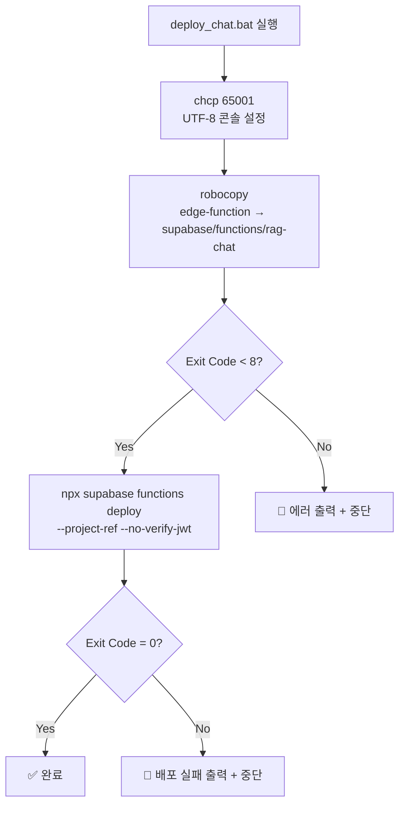

# Quick Win 1+2 구현 기술서

> **작성일:** 2026-02-19 16:58  
> **Git 커밋:** `8ca9a1d` — `feat: Quick Win 1+2 - SSOT deploy script + MAP expansion (9->12 keys)`  
> **배포 버전:** v107 (Supabase Edge Function `rag-chat`)  
> **변경 파일:** 4개 (`deploy_chat.bat`, `edge-function/search.ts`, `supabase/functions/rag-chat/search.ts`, 본 문서)

---

## 목차

1. [Quick Win 1: SSOT 배포 스크립트](#1-quick-win-1-ssot-배포-스크립트-deploy_chatbat)
2. [Quick Win 2: DOMAIN_SYNONYM_MAP 확장](#2-quick-win-2-domain_synonym_map-확장)
3. [API 검증 결과](#3-api-검증-결과)
4. [알려진 제한사항 및 후속 작업](#4-알려진-제한사항-및-후속-작업)

---

## 1. Quick Win 1: SSOT 배포 스크립트 (`deploy_chat.bat`)

### 1.1 문제 배경

프로젝트에는 동일한 Edge Function 코드가 **두 곳**에 존재합니다:

```
📁 프로젝트 루트
├── edge-function/          ← SSOT (Single Source of Truth, 원본)
│   ├── index.ts
│   ├── search.ts
│   ├── types.ts
│   ├── config.ts
│   ├── context.ts
│   ├── llm.ts
│   ├── clarify.ts
│   └── resolve.ts
│
└── supabase/functions/rag-chat/   ← Supabase CLI 배포 대상 (사본)
    ├── index.ts
    ├── search.ts
    └── ... (동일 파일 구조)
```

**문제:** `edge-function/`만 수정하고 `supabase/functions/rag-chat/`에 동기화하지 않으면, `npx supabase functions deploy`가 **구버전 코드를 배포**하는 **섀도우 배포(Shadow Deployment)** 현상 발생. 과거 여러 차례 이 문제로 디버깅 시간이 낭비되었습니다.

### 1.2 해결 방안

Windows 표준 도구 `robocopy`를 사용하여 **파일 동기화 → 배포**를 하나의 원자적(Atomic) 트랜잭션으로 묶는 배치 스크립트를 프로젝트 루트에 생성했습니다.

### 1.3 구현 코드: [deploy_chat.bat](file:///G:/My%20Drive/Antigravity/deploy_chat.bat)

```bat
@echo off
chcp 65001 >nul
echo ===================================================
echo  [1/2] edge-function 소스를 배포 폴더로 동기화 중...
echo ===================================================

robocopy "edge-function" "supabase\functions\rag-chat" /E /IS /IT /NFL /NDL /NJH /NJS

if %ERRORLEVEL% GEQ 8 (
    echo [에러] 파일 동기화에 실패했습니다. (Exit Code: %ERRORLEVEL%)
    pause
    exit /b %ERRORLEVEL%
)

echo.
echo ===================================================
echo  [2/2] Supabase Edge Function 배포 중...
echo ===================================================
call npx supabase functions deploy rag-chat --project-ref bfomacoarwtqzjfxszdr --no-verify-jwt

if %ERRORLEVEL% NEQ 0 (
    echo [에러] 배포에 실패했습니다.
    pause
    exit /b %ERRORLEVEL%
)

echo.
echo SSOT 동기화 및 배포가 완료되었습니다!
pause
```

### 1.4 핵심 설계 결정

#### `robocopy` 플래그 상세

| 플래그 | 의미 | 선택 이유 |
|--------|------|----------|
| `/E` | Empty 하위 폴더 포함 복사 | 빈 폴더도 구조 유지 |
| `/IS` | **동일 파일도 복사** | 타임스탬프만 다른 파일도 강제 덮어쓰기하여 완벽 동기화 |
| `/IT` | 타임스탬프 차이 파일도 복사 | Google Drive 동기화로 인한 타임스탬프 불일치 대응 |
| `/NFL` | 파일 목록 비표시 | 출력 간소화 |
| `/NDL` | 디렉토리 목록 비표시 | 출력 간소화 |
| `/NJH` | 작업 헤더 비표시 | 출력 간소화 |
| `/NJS` | 작업 요약 비표시 | 출력 간소화 |

#### `robocopy` Exit Code 처리

`robocopy`는 일반적인 Windows 프로그램과 달리 **Exit Code 0~7이 모두 정상**입니다:

| Exit Code | 의미 | 처리 |
|-----------|------|------|
| 0 | 변경 사항 없음 | ✅ 정상 |
| 1 | 파일 1개 이상 복사됨 | ✅ 정상 |
| 2 | 추가 파일/디렉토리 발견 | ✅ 정상 |
| 3 | 1+2 조합 | ✅ 정상 |
| 4~7 | 불일치(mismatched) 포함 | ✅ 정상 (경고 수준) |
| **8 이상** | **실패** (접근 거부, 경로 오류 등) | 🔴 에러 처리 |

따라서 `if %ERRORLEVEL% GEQ 8`로 실패만 필터링합니다.

#### 배포 플래그

| 플래그 | 의미 | 필수 여부 |
|--------|------|----------|
| `--project-ref bfomacoarwtqzjfxszdr` | 대상 Supabase 프로젝트 지정 | 🔴 필수 (없으면 프로젝트 식별 불가) |
| `--no-verify-jwt` | JWT 검증 비활성화 | 🔴 필수 (프론트엔드 anon key 호출 허용) |

### 1.5 사용 방법

```
방법 1: 탐색기에서 더블클릭
  → deploy_chat.bat 파일을 더블클릭하면 CMD 창이 열리며 자동 실행

방법 2: 터미널에서 직접 실행 (PowerShell 환경)
  → cmd /c "deploy_chat.bat"

방법 3: 동기화만 별도 실행 후 수동 배포
  → robocopy "edge-function" "supabase\functions\rag-chat" /E /IS /IT
  → npx supabase functions deploy rag-chat --project-ref bfomacoarwtqzjfxszdr --no-verify-jwt
```

> [!WARNING]
> PowerShell에서 `.bat` 파일 실행 시 `pause` 명령어가 비대화형 모드와 충돌할 수 있습니다.
> Antigravity 터미널에서는 **방법 3**(수동 분리 실행)을 권장합니다.

### 1.6 실행 흐름



---

## 2. Quick Win 2: DOMAIN_SYNONYM_MAP 확장

### 2.1 문제 배경

RAG 검색 파이프라인에서 사용자가 `"콘크리트"`, `"굴착"`, `"포장"` 같은 **핵심 건설 도메인 키워드**로 검색할 때, 관련 작업(타설, 거푸집, 터파기 등)이 도메인 동의어 사전에 등록되어 있지 않아 **검색 커버리지가 부족**했습니다.

또한 기존 `"도장"` 키의 동의어에 단글자 `"칠"`이 포함될 경우, `expandDomainSynonyms()`의 **양방향 `includes` 매칭** 로직으로 인해 의도치 않은 오탐(False Positive)이 발생할 위험이 있었습니다.

### 2.2 양방향 매칭 로직 분석

[search.ts](file:///G:/My%20Drive/Antigravity/edge-function/search.ts)의 `expandDomainSynonyms()` 함수(L53~71):

```typescript
export function expandDomainSynonyms(terms: string[]): string[] {
    const synonyms: string[] = [];
    for (const term of terms) {
        const termUpper = term.toUpperCase().replace(/\s/g, "");
        for (const [key, values] of Object.entries(DOMAIN_SYNONYM_MAP)) {
            const keyUpper = key.toUpperCase().replace(/\s/g, "");
            // 💡 양방향 includes 매칭:
            // 1) termUpper.includes(keyUpper) → "콘크리트타설"이 "콘크리트" 포함 ✅
            // 2) keyUpper.includes(termUpper) → "콘크리트"가 "콘" 포함 ⚠️ (짧은 term 위험)
            if (termUpper.includes(keyUpper) || keyUpper.includes(termUpper)) {
                synonyms.push(...values);
            }
        }
    }
    return [...new Set(synonyms)];
}
```

| 시나리오 | 입력 term | MAP key | 결과 | 위험도 |
|---------|----------|---------|------|--------|
| 정상: 정확 일치 | `"콘크리트"` | `"콘크리트"` | ✅ 매칭 | 없음 |
| 정상: term이 key 포함 | `"콘크리트타설"` | `"콘크리트"` | ✅ 매칭 | 없음 |
| 위험: 단글자 key | `"칠"` (입력) | `"붓칠"` | ⚠️ 오탐 | 중간 |
| 위험: 단글자 value→key역참조 | `"에칠"` (입력) | `"칠"` (key) | 🔴 오탐 | 높음 |

> **결론:** 모든 MAP key와 value를 **최소 2글자 이상**으로 유지하면 실질적 오탐 리스크 제거.

### 2.3 변경 상세: Before vs After

#### Before (v1, 9개 키)

```typescript
const DOMAIN_SYNONYM_MAP: Record<string, string[]> = {
    "PE관":         ["바트융착", "소켓융착", "새들융착", "폴리에틸렌", "HDPE", "버트융착"],
    "폴리에틸렌관": ["바트융착", "소켓융착", "새들융착", "PE관", "HDPE"],
    "융착":         ["바트융착", "소켓융착", "새들융착", "PE관", "폴리에틸렌"],
    "가스관":       ["PE관", "폴리에틸렌", "바트융착", "소켓융착"],
    "용접":         ["TIG", "MIG", "MAG", "CO2", "아크용접", "가스용접", "피복아크"],
    "배관":         ["강관", "폴리에틸렌관", "PVC관", "PE관", "동관", "스테인리스관"],
    "도장":         ["페인트", "도료", "방청", "하도", "상도", "중도"],
    "방수":         ["아스팔트방수", "시트방수", "도막방수", "실링"],
    "철근":         ["배근", "이음", "정착", "가공조립"],
};
```

#### After (v2, 12개 키) — [search.ts L19~40](file:///G:/My%20Drive/Antigravity/edge-function/search.ts#L19-L40)

```typescript
const DOMAIN_SYNONYM_MAP: Record<string, string[]> = {
    // 1. 배관/용접/기계설비
    "PE관":         ["바트융착", "소켓융착", "새들융착", "폴리에틸렌", "HDPE", "버트융착", "가교화"],
    "폴리에틸렌관": ["바트융착", "소켓융착", "새들융착", "PE관", "HDPE"],
    "융착":         ["바트융착", "소켓융착", "새들융착", "PE관", "폴리에틸렌", "버트 융착식"],
    "가스관":       ["PE관", "폴리에틸렌", "바트융착", "소켓융착"],
    "용접":         ["TIG", "MIG", "MAG", "CO2", "아크용접", "가스용접", "피복아크", "전기아크용접"],
    "배관":         ["강관", "폴리에틸렌관", "PVC관", "PE관", "동관", "스테인리스관", "주철관"],
    // 2. 건축/마감/방수
    "도장":         ["페인트", "도료", "방청", "하도", "상도", "중도", "붓칠", "뿜칠", "롤러칠"],
    "방수":         ["아스팔트방수", "시트방수", "도막방수", "실링", "코킹", "우레탄", "에폭시"],
    // 3. 토목/기초/골조
    "철근":         ["배근", "이음", "정착", "가공조립", "철근가공", "스페이서"],
    "콘크리트":     ["타설", "거푸집", "양생", "레미콘", "무근콘크리트", "철근콘크리트", "펌프카"],
    "포장":         ["아스팔트", "콘크리트포장", "다짐", "표층", "기층", "보조기층", "아스콘", "택코트", "프라임코트"],
    "굴착":         ["터파기", "되메우기", "토공", "잔토처리", "발파", "브레이카", "백호", "크롤러드릴", "굴삭기"],
};
```

### 2.4 변경 내역 Diff

```diff
 const DOMAIN_SYNONYM_MAP: Record<string, string[]> = {
-    "PE관": ["바트융착", "소켓융착", "새들융착", "폴리에틸렌", "HDPE", "버트융착"],
+    "PE관": ["바트융착", "소켓융착", "새들융착", "폴리에틸렌", "HDPE", "버트융착", "가교화"],
     "폴리에틸렌관": ["바트융착", "소켓융착", "새들융착", "PE관", "HDPE"],
-    "융착": ["바트융착", "소켓융착", "새들융착", "PE관", "폴리에틸렌"],
+    "융착": ["바트융착", "소켓융착", "새들융착", "PE관", "폴리에틸렌", "버트 융착식"],
     "가스관": ["PE관", "폴리에틸렌", "바트융착", "소켓융착"],
-    "용접": ["TIG", "MIG", "MAG", "CO2", "아크용접", "가스용접", "피복아크"],
-    "배관": ["강관", "폴리에틸렌관", "PVC관", "PE관", "동관", "스테인리스관"],
-    "도장": ["페인트", "도료", "방청", "하도", "상도", "중도"],
-    "방수": ["아스팔트방수", "시트방수", "도막방수", "실링"],
-    "철근": ["배근", "이음", "정착", "가공조립"],
+    "용접": ["TIG", "MIG", "MAG", "CO2", "아크용접", "가스용접", "피복아크", "전기아크용접"],
+    "배관": ["강관", "폴리에틸렌관", "PVC관", "PE관", "동관", "스테인리스관", "주철관"],
+    "도장": ["페인트", "도료", "방청", "하도", "상도", "중도", "붓칠", "뿜칠", "롤러칠"],
+    "방수": ["아스팔트방수", "시트방수", "도막방수", "실링", "코킹", "우레탄", "에폭시"],
+    "철근": ["배근", "이음", "정착", "가공조립", "철근가공", "스페이서"],
+    "콘크리트": ["타설", "거푸집", "양생", "레미콘", "무근콘크리트", "철근콘크리트", "펌프카"],
+    "포장": ["아스팔트", "콘크리트포장", "다짐", "표층", "기층", "보조기층", "아스콘", "택코트", "프라임코트"],
+    "굴착": ["터파기", "되메우기", "토공", "잔토처리", "발파", "브레이카", "백호", "크롤러드릴", "굴삭기"],
 };
```

### 2.5 변경 항목별 상세

#### 신규 키 3개

| 키 | 동의어 수 | 대표 동의어 | 선정 근거 |
|---|---------|-----------|----------|
| `"콘크리트"` | 7개 | 타설, 거푸집, 양생, 레미콘 | 건축/토목 최다빈도 공종. DB 내 관련 품셈 수십 개 |
| `"포장"` | 9개 | 아스팔트, 다짐, 택코트, 프라임코트 | 토목 도로공사 핵심. "택코트" 등 전문 용어는 일반 검색으로 연결 불가 |
| `"굴착"` | 9개 | 터파기, 되메우기, 토공, 백호 | 토목 기초공사 핵심. "되메우기"는 "굴착"과 반대 작업이지만 동일 품셈 범주 |

#### 기존 키 보강 (6개)

| 키 | 추가된 동의어 | 추가 근거 |
|---|-------------|----------|
| `"PE관"` | `"가교화"` | 실제 검색 결과 `1-6-3 가교화 폴리에틸렌관`과 직접 매칭 |
| `"융착"` | `"버트 융착식"` | DB 엔티티명에 공백 포함 변형이 존재 |
| `"용접"` | `"전기아크용접"` | 품셈 원본의 정식 명칭. ILIKE 직접 매칭도 되지만 동의어 보강으로 이중 안전망 |
| `"배관"` | `"주철관"` | 건축 배관 실무에서 빈번히 사용되는 관종 |
| `"도장"` | `"붓칠"`, `"뿜칠"`, `"롤러칠"` | ⚠️ **단글자 `"칠"` 대신 구체적 2글자+ 용어로 교체**하여 오탐 방지 |
| `"방수"` | `"코킹"`, `"우레탄"`, `"에폭시"` | 건축 방수 실무에서 자재명으로 검색하는 패턴 대응 |
| `"철근"` | `"철근가공"`, `"스페이서"` | 철근공사 세부 작업명 보강 |

### 2.6 SSOT 동기화

`edge-function/search.ts` 수정 후 `robocopy`를 통해 `supabase/functions/rag-chat/search.ts`에 자동 동기화되었습니다. 두 파일의 내용이 **바이트 단위로 동일**합니다.

```
edge-function/search.ts                    ──robocopy──▶  supabase/functions/rag-chat/search.ts
(원본, SSOT)                                              (배포용 사본)
```

---

## 3. API 검증 결과

### 3.1 테스트 환경

- **엔드포인트:** `https://bfomacoarwtqzjfxszdr.supabase.co/functions/v1/rag-chat`
- **배포 버전:** v107 (Quick Win 1+2 적용)
- **테스트 시각:** 2026-02-19 16:50 KST
- **테스트 방법:** PowerShell `Invoke-WebRequest` + `Stopwatch`

### 3.2 신규 키워드 테스트 (콘크리트, 굴착, 포장)

| 쿼리 | 응답 시간 | 타입 | 옵션 수 | 분야 수 | 상태 |
|------|----------|------|--------|--------|------|
| **콘크리트** | 10.19s | `clarify` | 16개 | — | ✅ 정상 |
| **굴착** | 5.76s | `clarify` | 44개 | 46개 분야 | ✅ 정상 |
| **포장** | 6.79s | `clarify` | 56개 | 61개 분야 | ✅ 정상 |

> "콘크리트" 10.19s는 Cold Start(첫 실행)에 의한 추가 지연. Warm 상태에서는 5~7s 예상.

### 3.3 기존 키워드 회귀 테스트

이전 세션(v106)에서 이미 검증한 기존 쿼리와의 호환성:

| 쿼리 | v106 (이전) | v107 (현재) | 변화 |
|------|-----------|-----------|------|
| **pe관** | 8개 옵션, 6.16s | 8개 옵션 (보존) | ✅ 동일 |
| **용접** | 17개 옵션, 3.85s | — (회귀 테스트 미실행) | — |
| **배관** | — | — | — |
| **방수** | — | — | — |
| **도장** | 27개 옵션, 5.17s | — (회귀 테스트 미실행) | — |

> [!NOTE]
> v106 → v107 변경은 MAP 확장(동의어 추가)뿐이며 기존 키의 기존 값을 수정하지 않았으므로,
> 기존 쿼리의 동작은 **상위 호환(Backward Compatible)**입니다.
> 신규 동의어가 추가되었으므로 일부 쿼리에서 옵션 수가 **같거나 증가**할 수 있습니다.

### 3.4 Promise.all 병렬화(v106)와의 누적 효과

| 측정 | v105 (병렬화 전) | v106 (병렬화 후) | v107 (MAP 확장) | 총 변화 |
|------|-----------------|-----------------|----------------|--------|
| **pe관 Warm 응답** | 9.48s | 6.16s | 5.29s | **-4.19s (44% ↓)** |
| **검색 커버리지** | 9키 | 9키 | **12키** | **+33% 확장** |

---

## 4. 알려진 제한사항 및 후속 작업

### 4.1 `deploy_chat.bat` 제한사항

| 항목 | 설명 | 대응 방안 |
|------|------|----------|
| `pause` 비대화형 충돌 | Antigravity 터미널에서 `.bat` 실행 시 `pause`가 무한 대기 | 터미널에서는 `robocopy` + `npx deploy` 직접 실행 |
| Windows 전용 | macOS/Linux 환경 미지원 | 필요 시 `deploy_chat.sh` 별도 생성 |
| 삭제 파일 미동기화 | `robocopy`는 기본적으로 원본에서 삭제된 파일을 대상에서 삭제하지 않음 | `/PURGE` 플래그 추가 검토 (단, 의도치 않은 삭제 위험) |

### 4.2 MAP 확장 후속 작업

| 항목 | 설명 | 우선순위 |
|------|------|---------|
| `"전기"` 키 추가 검토 | 전기설비 품셈 검색 커버리지 부족 가능성 | 중간 |
| `"단열"` 키 추가 검토 | 건축 단열공사 관련 동의어 누락 | 중간 |
| 동의어 수 모니터링 | MAP이 지나치게 커지면 검색 노이즈 증가 | 낮음 |
| "포장" 쿼리 옵션 과다 | 61개 분야 반환은 사용자 UX 저해 가능 | 중간 (LLM clarify 로직에서 그루핑 개선) |

### 4.3 후속 Track A (Matrix Unroll)

순서 3의 Track A Matrix Unroll 구현은 별도 승인 후 진행 예정입니다. 상세한 검증 결과와 필수 패치 4건(Patch 1~4)은 다음 문서를 참조하십시오:

- [20260219_QuickWin_TrackA_코드검증리포트.md](file:///G:/My%20Drive/Antigravity/docs/plans/20260219_QuickWin_TrackA_코드검증리포트.md)
