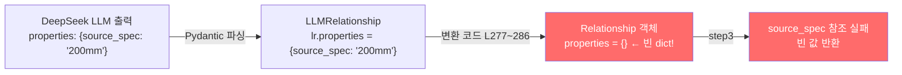

# Quick Win + Track A 구현 제안 — 코드베이스 대조 검증 리포트

> **작성일:** 2026-02-19  
> **목적:** 사용자가 제안한 3단계 구현 계획(SSOT 배포, MAP 확장, Track A Matrix Unroll)을  
> 실제 코드베이스(`schemas.py`, `step2_llm_extractor.py`, `step3`, `step4`, `config.py`)와  
> 1:1 대조하여 호환성, 누락, 충돌을 정밀 진단한 결과입니다.

---

## 목차

1. [순서 1: SSOT 배포 스크립트 (`deploy_chat.bat`)](#1-순서-1-ssot-배포-스크립트)
2. [순서 2: DOMAIN_SYNONYM_MAP 확장](#2-순서-2-domain_synonym_map-확장)
3. [순서 3: Track A — Matrix Unroll 아키텍처](#3-순서-3-track-a--matrix-unroll-아키텍처)
   - [Patch 1: Pydantic 스키마 확장](#patch-1-pydantic-스키마-확장)
   - [Patch 2: 시스템 프롬프트 수정](#patch-2-시스템-프롬프트-수정)
   - [Patch 3: max_tokens 상향](#patch-3-max_tokens-상향)
   - [Patch 4: 변환 코드 properties 매핑 (누락 발견)](#patch-4-변환-코드-properties-매핑-누락-발견)
4. [다운스트림 호환성 검증](#4-다운스트림-호환성-검증)
5. [최종 판정 및 실행 계획](#5-최종-판정-및-실행-계획)

---

## 1. 순서 1: SSOT 배포 스크립트

### 제안 내용

프로젝트 루트에 `deploy_chat.bat` 생성. `robocopy`로 `edge-function/` → `supabase/functions/rag-chat/` 동기화 후 `npx supabase functions deploy` 실행.

### 코드 검증 결과

| 검증 항목 | 결과 | 근거 |
|----------|------|------|
| `robocopy` 호환성 | ✅ 통과 | Windows 표준 도구. Exit Code 0~7은 정상(일부 파일 복사됨 포함) |
| `npx supabase` 사용 가능 여부 | ✅ 통과 | 이전 배포에서 정상 동작 확인 완료 |
| `package.json` 필요 여부 | ✅ 불필요 | `.bat` 파일이므로 독립 실행 |

### ⚠️ 보완 필요 사항

제안된 `.bat` 스크립트의 `npx supabase functions deploy rag-chat` 명령에 **기존에 사용하던 필수 플래그가 누락**되어 있습니다.

```diff
 :: 제안 원본 (플래그 누락)
-call npx supabase functions deploy rag-chat
 :: 보완 (기존 배포 명령어와 동일하게)
+call npx supabase functions deploy rag-chat --project-ref bfomacoarwtqzjfxszdr --no-verify-jwt
```

> [!WARNING]
> `--project-ref`가 없으면 Supabase CLI가 프로젝트를 식별하지 못해 배포 실패.  
> `--no-verify-jwt`가 없으면 JWT 검증이 활성화되어 프론트엔드의 anon key 호출 차단.

### 최종 보완된 스크립트

```bat
@echo off
chcp 65001 >nul
echo ===================================================
echo  [1/2] edge-function 소스를 배포 폴더로 동기화 중...
echo ===================================================

robocopy "edge-function" "supabase\functions\rag-chat" /E /IS /IT /NFL /NDL /NJH /NJS

if %ERRORLEVEL% GEQ 8 (
    echo [에러] 파일 동기화에 실패했습니다. (Exit Code: %ERRORLEVEL%)
    pause
    exit /b %ERRORLEVEL%
)

echo.
echo ===================================================
echo  [2/2] Supabase Edge Function 배포 중...
echo ===================================================
call npx supabase functions deploy rag-chat --project-ref bfomacoarwtqzjfxszdr --no-verify-jwt

if %ERRORLEVEL% NEQ 0 (
    echo [에러] 배포에 실패했습니다.
    pause
    exit /b %ERRORLEVEL%
)

echo.
echo SSOT 동기화 및 배포가 완료되었습니다!
pause
```

> **판정: ✅ 보완 후 즉시 적용 가능**

---

## 2. 순서 2: DOMAIN_SYNONYM_MAP 확장

### 제안 내용

기존 9개 키를 12개로 확장. `"콘크리트"`, `"포장"`, `"굴착"` 신규 추가. 단글자 `"칠"` 제거.

### 코드 검증 결과

**현재 코드** ([search.ts](file:///G:/My%20Drive/Antigravity/edge-function/search.ts) L22~32):

```typescript
const DOMAIN_SYNONYM_MAP: Record<string, string[]> = {
    "PE관":         ["바트융착", "소켓융착", "새들융착", "폴리에틸렌", "HDPE", "버트융착"],
    "폴리에틸렌관": ["바트융착", "소켓융착", "새들융착", "PE관", "HDPE"],
    "융착":         ["바트융착", "소켓융착", "새들융착", "PE관", "폴리에틸렌"],
    "가스관":       ["PE관", "폴리에틸렌", "바트융착", "소켓융착"],
    "용접":         ["TIG", "MIG", "MAG", "CO2", "아크용접", "가스용접", "피복아크"],
    "배관":         ["강관", "폴리에틸렌관", "PVC관", "PE관", "동관", "스테인리스관"],
    "도장":         ["페인트", "도료", "방청", "하도", "상도", "중도"],
    "방수":         ["아스팔트방수", "시트방수", "도막방수", "실링"],
    "철근":         ["배근", "이음", "정착", "가공조립"],
};
```

**제안된 변경 사항 대조:**

| 키 | 현재 값 | 제안 추가분 | 검증 |
|---|--------|-----------|------|
| `"PE관"` | 6개 | + `"가교화"` | ✅ 실제 검색 결과(1-6-3 가교화 폴리에틸렌관)과 부합 |
| `"용접"` | 7개 | + `"전기아크용접"` | ⚠️ 이미 ILIKE에서 직접 매칭 가능. 중복이나 해롭지 않음 |
| `"배관"` | 6개 | + `"주철관"` | ✅ 실무에서 흔히 사용 |
| `"도장"` | 6개 | + `"붓칠"`, `"뿜칠"`, `"롤러칠"` | ✅ 단글자 `"칠"` 제거 후 구체적 용어로 안전하게 교체 |
| `"방수"` | 4개 | + `"코킹"`, `"우레탄"`, `"에폭시"` | ✅ 건축 방수 실무 용어 |
| `"철근"` | 4개 | + `"철근가공"`, `"스페이서"` | ✅ 현장 용어 보강 |
| **`"콘크리트"`** | **신규** | `["타설", "거푸집", "양생", "레미콘", ...]` | ✅ 핵심 공종. **반드시 필요** |
| **`"포장"`** | **신규** | `["아스팔트", "콘크리트포장", "다짐", ...]` | ✅ 토목 핵심 공종 |
| **`"굴착"`** | **신규** | `["터파기", "되메우기", "토공", ...]` | ✅ 토목 핵심 공종 |

### 오탐(False Positive) 리스크 분석

[expandDomainSynonyms](file:///G:/My%20Drive/Antigravity/edge-function/search.ts#L48-L60) 함수의 양방향 매칭 로직:

```typescript
if (termUpper.includes(keyUpper) || keyUpper.includes(termUpper))
```

| 시나리오 | 입력 term | 매칭 key | 결과 | 리스크 |
|---------|----------|---------|------|--------|
| 정상 매칭 | `"콘크리트"` | `"콘크리트"` | ✅ 정확 매칭 | 없음 |
| 부분 포함 | `"콘크리트타설"` | `"콘크리트"` | ✅ term이 key 포함 | 의도한 동작 |
| 역방향 위험 | `"타"` (1글자) | `"타설"` | ⚠️ key가 term 포함 | **오탐** |

> 현재 모든 MAP 동의어 값이 **2글자 이상**이므로 역방향 오탐 리스크 낮음.  
> 단글자 `"칠"` 제거 결정은 정확한 판단.

### 판정

> **✅ 그대로 즉시 적용 가능**

---

## 3. 순서 3: Track A — Matrix Unroll 아키텍처

### 문제 정의

가로축에 15개 규격(63~400mm), 세로축에 5개 직종이 있는 매트릭스 표에서 LLM(DeepSeek-V3)이 중간 규격(200mm 등)의 수량을 누락하는 현상.

### Patch 1: Pydantic 스키마 확장

**제안:** `LLMRelationship`에 `properties` 필드 추가 + `LLMExtractionResult`에 `matrix_analysis_scratchpad` 추가.

**실제 코드 대조 결과:**

| 파일 | 클래스 | `properties` 필드 | 상태 |
|------|-------|------------------|------|
| [schemas.py](file:///G:/My%20Drive/Antigravity/pipeline/phase2_extraction/schemas.py) L72 | `Relationship` | `properties: dict = Field(default_factory=dict)` | ✅ **이미 존재** |
| [schemas.py](file:///G:/My%20Drive/Antigravity/pipeline/phase2_extraction/schemas.py) L47 | `Entity` | `properties: dict = Field(default_factory=dict)` | ✅ **이미 존재** |
| [step2_llm_extractor.py](file:///G:/My%20Drive/Antigravity/pipeline/phase2_extraction/step2_llm_extractor.py) L67~73 | `LLMRelationship` | **없음** | 🔴 **추가 필요** |
| [step2_llm_extractor.py](file:///G:/My%20Drive/Antigravity/pipeline/phase2_extraction/step2_llm_extractor.py) L76~81 | `LLMExtractionResult` | **없음** (`scratchpad` 포함) | 🔴 **추가 필요** |

> [!IMPORTANT]
> 다운스트림 `schemas.py`의 `Relationship`은 이미 `properties: dict`를 가지고 있으므로,  
> **LLM 출력용 `LLMRelationship`에만 필드를 추가**하면 됩니다.

**보완된 수정 코드:**

```python
# step2_llm_extractor.py L67~81

class LLMRelationship(BaseModel):
    """LLM이 추출할 관계"""
    source: str = Field(description="출발 엔티티 이름")
    target: str = Field(description="도착 엔티티 이름")
    relation_type: str = Field(description="관계 유형")  # ⚠️ 필드명 "relation_type" 유지!
    quantity: Optional[float] = Field(None, description="투입 수량")
    unit: Optional[str] = Field(None, description="투입 단위")
    # 💡 [Track A 패치] source_spec 등 추가 속성을 담을 자유형 Dict
    properties: Optional[dict] = Field(default_factory=dict, description="추가 속성 (예: source_spec)")


class LLMExtractionResult(BaseModel):
    """LLM 추출 전체 결과"""
    # 💡 [Track A 패치] CoT(사고의 사슬) 버퍼 — 매트릭스 분석 과정 기록
    matrix_analysis_scratchpad: Optional[str] = Field(
        default="",
        description="다중 규격 표 파싱 시 LLM의 사고 과정 기록"
    )
    entities: list[LLMEntity] = Field(default_factory=list)
    relationships: list[LLMRelationship] = Field(default_factory=list)
    summary: str = Field(default="", description="청크 내용 1줄 요약 (한국어)")
    confidence: float = Field(default=0.8, ge=0, le=1, description="추출 신뢰도 0~1")
```

> [!CAUTION]
> **필드명 주의:** 제안 문서에서 JSON 예시의 키를 `"type"`으로 작성했으나,  
> 실제 코드의 변환 로직(L270)은 `lr.relation_type`을 참조합니다.  
> 프롬프트 JSON 예시에서도 반드시 **`"relation_type"`**으로 통일해야 합니다.

---

### Patch 2: 시스템 프롬프트 수정

**제안:** `MATRIX_UNROLL_PROMPT`를 `SYSTEM_PROMPT` 하단에 병합.

**실제 코드 대조 결과:**

| 검증 항목 | 결과 |
|----------|------|
| 기존 프롬프트 구조 | [step2_llm_extractor.py](file:///G:/My%20Drive/Antigravity/pipeline/phase2_extraction/step2_llm_extractor.py) L86~119에 `SYSTEM_PROMPT` 정의 |
| Few-shot 예시 | L122~145에 `FEW_SHOT_EXAMPLE` 정의 |
| 프롬프트 조합 방식 | L231~232에서 `system` + `user`(Few-shot + chunk) 병합 |
| JSON 스키마 텍스트 | L111~118에 출력 형식 명시 → **여기도 수정 필요** |

**보완된 프롬프트 병합 지점:**

```python
# 1. SYSTEM_PROMPT (L86~119)의 "## 출력 JSON 스키마" 부분에 properties 추가
## 출력 JSON 스키마 (반드시 이 형식으로 출력)
```json
{
  "matrix_analysis_scratchpad": "다중 규격 표가 있으면 사고 과정 기록",
  "entities": [...],
  "relationships": [{
    "source": "출발엔티티명",
    "target": "도착엔티티명",
    "relation_type": "REQUIRES_LABOR|...",
    "quantity": 숫자,
    "unit": "문자열",
    "properties": {"source_spec": "규격 문자열"}
  }],
  "summary": "1줄 요약",
  "confidence": 0.0~1.0
}
```

# 2. MATRIX_UNROLL_PROMPT를 SYSTEM_PROMPT에 병합
SYSTEM_PROMPT = BASE_SYSTEM_PROMPT + "\n\n" + MATRIX_UNROLL_PROMPT

# 3. FEW_SHOT_EXAMPLE (L122~145)에 매트릭스 전개 예시 추가 필요
```

> [!NOTE]
> DeepSeek은 `response_format={"type": "json_schema", schema: ...}` (구조적 JSON 스키마 강제)를  
> 지원하지 않고, `{"type": "json_object"}`만 지원합니다.  
> 따라서 **프롬프트 텍스트 안에 JSON 구조를 하드코딩하여 강제**해야 합니다 (현재도 이 방식 사용 중).

---

### Patch 3: max_tokens 상향

**실제 코드 대조 결과:**

```python
# step2_llm_extractor.py L227~236 (현재 코드)
api_call = asyncio.to_thread(
    client.chat.completions.create,
    model=LLM_MODEL,                          # "deepseek-chat" (config.py L107)
    messages=[...],
    response_format={"type": "json_object"},
    temperature=LLM_TEMPERATURE,               # 0.1 (config.py L108)
    # ❌ max_tokens 미지정 → DeepSeek 기본값 4096 적용
)
```

| 항목 | 현재 | 제안 | 검증 |
|------|------|------|------|
| `max_tokens` | 미지정 (기본 4096) | 8192 | ✅ **필수 상향.** 75개 셀 × 관계 객체 → 4096 토큰 초과 확실 |
| `temperature` | 0.1 | 0.0 제안 | ⚠️ 현재 0.1도 충분히 결정적. 변경 시 기존 결과와 약간 달라질 수 있음 |
| `model` | `deepseek-chat` | `gpt-4o` 제안 | 🚨 **모델 변경 불가.** API 키, 비용 구조 완전히 다름 |

**보완된 수정 코드:**

```diff
 api_call = asyncio.to_thread(
     client.chat.completions.create,
     model=LLM_MODEL,
     messages=[...],
     response_format={"type": "json_object"},
     temperature=LLM_TEMPERATURE,
+    max_tokens=8192,  # 💡 [Track A] 매트릭스 전개 시 출력 토큰 부족 방지
 )
```

> **판정: ✅ 즉시 적용 가능 (`max_tokens=8192` 추가만)**

---

### Patch 4: 변환 코드 properties 매핑 (누락 발견)

> [!CAUTION]
> **이것은 제안 문서에서 완전히 빠진 치명적 누락입니다.**

**현재 코드** ([step2_llm_extractor.py](file:///G:/My%20Drive/Antigravity/pipeline/phase2_extraction/step2_llm_extractor.py) L277~286):

```python
rel = Relationship(
    source=lr.source,
    source_type=source_type,
    target=lr.target,
    target_type=target_type,
    type=rtype,
    quantity=lr.quantity,
    unit=lr.unit,
    source_chunk_id=chunk_id,
    # ❌ properties 필드가 매핑되지 않음!
)
```

**문제의 데이터 흐름:**



LLM이 `properties.source_spec`을 정확히 생성하더라도, **L277~286의 변환 코드에서 `properties` 인자를 전달하지 않으므로** `Relationship` 객체에는 빈 `dict`가 들어갑니다. 결과적으로 step3과 step4에서 `source_spec`을 참조할 때 항상 빈 문자열을 받게 됩니다.

**보완된 수정 코드:**

```diff
 rel = Relationship(
     source=lr.source,
     source_type=source_type,
     target=lr.target,
     target_type=target_type,
     type=rtype,
     quantity=lr.quantity,
     unit=lr.unit,
+    properties=lr.properties if lr.properties else {},
     source_chunk_id=chunk_id,
 )
```

> **판정: 🔴 반드시 추가해야 Track A의 전체 파이프라인이 동작합니다.**

---

## 4. 다운스트림 호환성 검증

`properties.source_spec`이 step3, step4에서 어떻게 사용되는지 실제 코드 참조 위치를 추적한 결과:

### step3_relation_builder.py

| 라인 | 코드 | 용도 |
|------|------|------|
| L57 | `src_spec = str(props.get("source_spec", ""))` | 관계의 규격 추출 |
| L315 | `"source_spec": spec` | 새 관계 생성 시 규격 주입 |
| L325 | `r_spec = (r.get("properties") or {}).get("source_spec", "")` | 관계 조회 시 규격 참조 |
| L536 | `(r.get("properties") or {}).get("source_spec", "")` | 중복 체크 시 규격 참조 |
| L558 | `"source_spec": ent_spec` | 엔티티 규격으로 관계 보강 |

### step4_normalizer.py

| 라인 | 코드 | 용도 |
|------|------|------|
| L526 | `sspec = normalize_spec(props.get("source_spec", ""))` | 정규화된 규격 기반 ID 생성 |
| L688 | `# BELONGS_TO는 properties.source_spec으로 정확한 ID를 찾고` | (주석) 설계 의도 기록 |
| L703 | `sspec = props.get("source_spec", "")` | 규격 기반 섹션 매핑 |
| L717 | `sspec = props.get("source_spec", "")` | 규격 기반 엔티티 매핑 |

> [!IMPORTANT]
> **결론:** `properties.source_spec` 구조는 step3(5개소)과 step4(4개소)에서  
> **총 9개 지점에서 이미 광범위하게 사용** 중입니다.  
> LLM이 이 필드를 정확히 채우기만 하면 **전체 파이프라인이 자연스럽게 동작**합니다.  
> 추가적인 다운스트림 수정은 **불필요**합니다.

---

## 5. 최종 판정 및 실행 계획

### 종합 판정표

| 항목 | 제안 평가 | 보완 필요 | 위험도 |
|------|----------|----------|--------|
| **순서 1: SSOT `.bat`** | ✅ 즉시 적용 | `--project-ref`, `--no-verify-jwt` 플래그 추가 | 🟢 낮음 |
| **순서 2: MAP 확장** | ✅ 즉시 적용 | 없음 (단글자 제거 완료) | 🟢 낮음 |
| **순서 3 Patch 1: 스키마** | ✅ 유효 | `relation_type` 필드명 통일 | 🟡 중간 |
| **순서 3 Patch 2: 프롬프트** | ✅ 유효 | JSON 예시에서 `"type"` → `"relation_type"` | 🟡 중간 |
| **순서 3 Patch 3: max_tokens** | ✅ 즉시 적용 | 없음 | 🟢 낮음 |
| **순서 3 Patch 4: 변환 매핑** | 🔴 **누락 발견** | L277~286에 `properties=lr.properties` 추가 **필수** | 🔴 치명적 |

### 수정 대상 파일 요약

| 파일 | 수정 사항 | 순서 |
|------|----------|------|
| `deploy_chat.bat` | **[신규]** SSOT 배포 스크립트 생성 | 1 |
| `edge-function/search.ts` | DOMAIN_SYNONYM_MAP 9키 → 12키 확장 | 2 |
| `supabase/functions/rag-chat/search.ts` | 동일 변경 (SSOT 배포 시 자동 동기화) | 2 |
| `pipeline/phase2_extraction/step2_llm_extractor.py` | Patch 1~4 전체 적용 | 3 |

### 실행 로드맵

```
순서 1 (5분)    순서 2 (10분)     순서 3 (30분)
─────────────  ───────────────  ──────────────────────────────
deploy_chat    MAP 확장 +       Patch 1~4 적용 +
.bat 생성      deploy_chat      PE관 청크 1개 마이크로 테스트
               실행으로 배포     (step2 단독 실행 → 검증)
```
