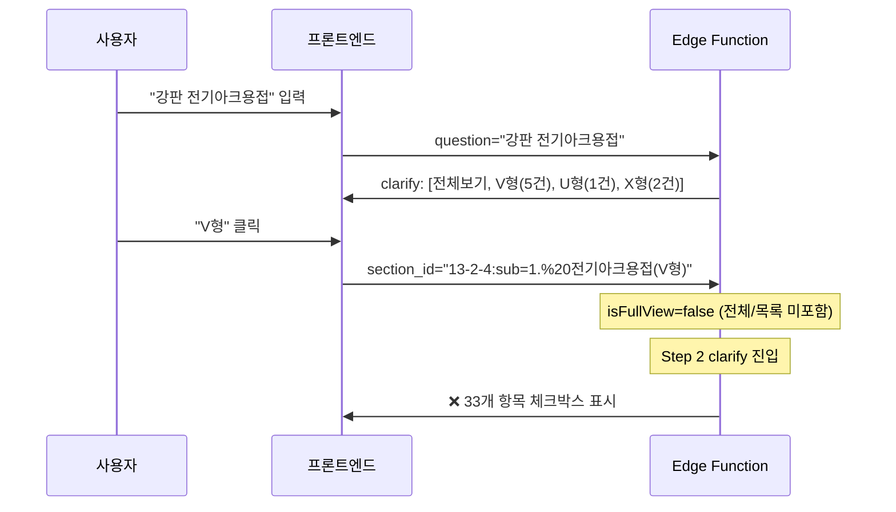
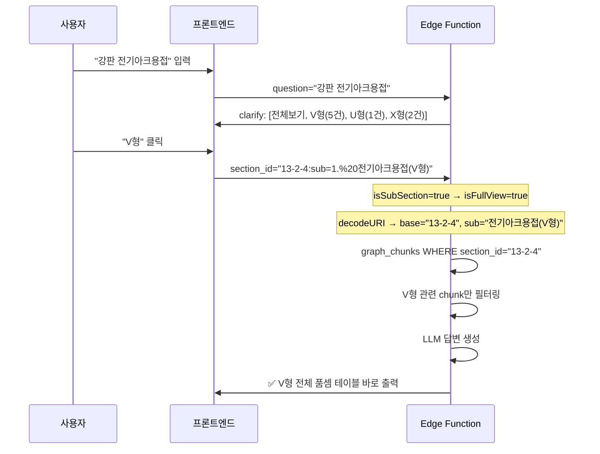

# Sub-Section 클릭 시 자동 Full View 처리 구현 보고서

**작성일**: 2026-02-19  
**대상 파일**: `edge-function/index.ts`, `edge-function/llm.ts`  
**배포**: Supabase Edge Function `rag-chat` (v87)

---

## 1. 문제 정의

### 1.1 증상
강판 전기아크용접 검색 시 sub-section 개별 옵션(V형, U형, X형 등)을 클릭하면:
1. **바로 데이터 테이블이 출력되지 않고** 33개 항목의 체크박스 선택 화면이 추가로 나타남
2. 이전 배포에서는 **"원문 데이터를 찾을 수 없습니다"** 에러가 발생

### 1.2 영향 범위
sub-section 분류가 있는 모든 품셈 데이터에 영향:
- 강판 전기아크용접 (V형, U형, X형, Fillet)
- 강관용접 (피복아크, TIG 등)
- 기타 하위 분류가 있는 품셈

---

## 2. 근본 원인 분석 (Root Cause)

### 2.1 문제 1: 추가 선택 단계 발생

**원인**: `index.ts`의 `handleChat` 함수 내 `isFullView` 판정 로직

```typescript
// ❌ 기존 코드 (396행)
const isFullView = question.includes("전체") || question.includes("목록");
```

sub-section 옵션 클릭 시 전달되는 query는 `"강판 전기아크용접 1. 전기아크용접(V형) 품셈"`으로, "전체"/"목록" 키워드가 포함되지 않아 `isFullView = false` → Step 2 clarify 경로로 빠져서 33개 항목 선택 화면이 나타남.

### 2.2 문제 2: "원문 없음" 에러

**원인**: `section_id` 값의 불일치

| 위치            | section_id 값                                                                        |
| --------------- | ------------------------------------------------------------------------------------ |
| 프론트엔드 전달 | `13-2-4:sub=1.%20%EC%A0%84%EA%B8%B0%EC%95%84%ED%81%AC%EC%9A%A9%EC%A0%91(V%ED%98%95)` |
| DB 저장         | `13-2-4`                                                                             |

```typescript
// ❌ 기존 코드 (407행) — URL 인코딩된 전체 sectionId로 조회
.eq("section_id", sectionId)  // "13-2-4:sub=..." → 매칭 실패
```

프론트엔드에서 sub-section 정보를 `:sub=` 접미사로 붙여 전달하지만, DB의 `graph_chunks.section_id`에는 base id(`13-2-4`)만 저장되어 있어 조회 결과 0건 → "원문 없음" 에러 발생.

---

## 3. 수정 내용

### 3.1 수정 1: sub-section 자동 full_view 처리 (`index.ts` 395-399행)

```diff
  // full_view: 섹션 전체 원문을 컨텍스트로 답변 생성
- const isFullView = question.includes("전체") || question.includes("목록");
+ // Why: sub_section 클릭(":sub=" 포함)은 사용자가 이미 특정 분류를 선택한 것
+ //       → 추가 선택 없이 바로 해당 sub_section의 전체 데이터를 출력
+ const isSubSection = sectionId.includes(":sub=");
+ const isFullView = isSubSection || question.includes("전체") || question.includes("목록");
```

**설계 근거**: 사용자가 "1. 전기아크용접(V형)"을 클릭한 것은 이미 분류를 선택한 것이므로, 추가 선택 단계 없이 해당 sub-section의 전체 데이터를 바로 LLM에 전달하여 답변을 생성해야 함.

### 3.2 수정 2: base section_id 추출 + URL 디코딩 (`index.ts` 400-413행)

```diff
+ // ── sub_section 파싱: "13-2-4:sub=1. 전기아크용접(V형)" → base="13-2-4", sub 키워드 추출
+ // Why: DB의 section_id는 "13-2-4"이므로 ":sub=" 이전의 base id로 조회해야 매칭됨
+ //       프론트엔드에서 URL 인코딩된 상태로 전달될 수 있으므로 디코딩 필수
+ const decodedSectionId = decodeURIComponent(sectionId);
+ const subMatch = decodedSectionId.match(/^(.+?):sub=(.+)$/);
+ const baseSectionId = subMatch ? subMatch[1] : decodedSectionId;
+ const subKeyword = subMatch ? subMatch[2].replace(/^\d+\.\s*/, '') : null;
```

**파싱 결과 예시**:

| 입력 sectionId                      | baseSectionId | subKeyword          |
| ----------------------------------- | ------------- | ------------------- |
| `13-2-4:sub=1.%20전기아크용접(V형)` | `13-2-4`      | `전기아크용접(V형)` |
| `13-2-3:sub=2.%20TIG용접`           | `13-2-3`      | `TIG용접`           |
| `13-2-4` (전체 보기)                | `13-2-4`      | `null`              |

### 3.3 수정 3: DB 조회에서 baseSectionId 사용 (7곳)

full_view 블록 내 모든 DB 조회에서 `sectionId` → `baseSectionId`로 변경:

| 위치 (행번호) | 용도                           | 변경                                   |
| ------------- | ------------------------------ | -------------------------------------- |
| 407           | `graph_chunks` 조회            | `.eq("section_id", baseSectionId)`     |
| 455           | `graph_entities` WorkType 조회 | `.eq("source_section", baseSectionId)` |
| 479           | cross-reference 로그           | `baseSectionId` 출력                   |
| 495           | cross-reference 필터           | `sid !== baseSectionId`                |
| 515           | 하위 절 탐색 변수명            | `childBaseSectionId` (충돌 방지)       |
| 561           | Section 엔티티 조회            | `.eq("source_section", baseSectionId)` |
| 606-608       | 에러 메시지                    | `baseSectionId` 표시                   |

### 3.4 수정 4: max_tokens 증가 (`llm.ts`)

```diff
- max_tokens: 2048,
+ max_tokens: 4096,
```

**이유**: 강관용접 등 데이터가 많은 품셈은 전체 테이블이 2048 토큰에 잘리는 문제 발생. 4096으로 증가하여 모든 데이터 완전 출력.

---

## 4. 처리 흐름 (Before vs After)

### Before (수정 전)


### After (수정 후)


---

## 5. 테스트 결과

### 5.1 "전체 내용 보기" 클릭 — ✅ 정상 (기존 기능 유지)
- V형, U형, X형, Fillet 전체 테이블 출력
- 데이터 잘림 없음 (max_tokens 4096 적용)

### 5.2 "1. 전기아크용접(V형)" 개별 클릭 — ✅ 수정 후 정상

| 검증 항목             | 결과                                                      |
| --------------------- | --------------------------------------------------------- |
| 바로 데이터 출력 여부 | ✅ 추가 선택 없이 바로 테이블 출력                         |
| 표 제목               | [표 13-2-4] 강판 전기아크용접 — 1. 전기아크용접(V형)      |
| 두께 범위             | 3, 5, 6, 11, 12, 13, 15mm (7개)                           |
| 자세별 구분           | 하향, 횡향, 입향 (3종)                                    |
| 데이터 항목           | 용접봉사용량(kg), 용접공(인), 특별인부(인), 소요전력(kWh) |
| 참고사항              | "본 품은 하향식 용접을 기준으로 한 품입니다" 등 4항목     |
| 출처 표시             | 기계설비부문 > 제13장 플랜트설비공사 > 강판 전기아크용접  |
| 데이터 잘림           | ✅ 없음 (완전 출력)                                        |

---

## 6. 파급 효과 분석 (Side Effect)

### 6.1 긍정적 영향
- sub-section이 있는 **모든 품셈** (강관용접, 강판용접 등)에서 개별 옵션 클릭 시 바로 데이터 출력
- 사용자 클릭 수 감소: 3단계(검색 → 분류 선택 → 전체 보기) → 2단계(검색 → 분류 선택)

### 6.2 주의 사항
- `isFullView` 조건 확장으로 **sub-section이 없는 일반 section_id**에는 영향 없음 (`:sub=` 포함 여부로 분기)
- `decodeURIComponent`는 이미 디코딩된 문자열에 대해서도 안전하게 동작
- `baseSectionId`와 기존 `sectionId`가 동일한 경우(sub 없을 때) 기존 로직과 동일하게 동작

---

## 7. 변경 파일 목록

| 파일                     | 변경 유형 | 주요 변경                                             |
| ------------------------ | --------- | ----------------------------------------------------- |
| `edge-function/index.ts` | 수정      | isFullView 조건 확장, base/sub 파싱, DB 조회 7곳 수정 |
| `edge-function/llm.ts`   | 수정      | max_tokens 2048 → 4096                                |
