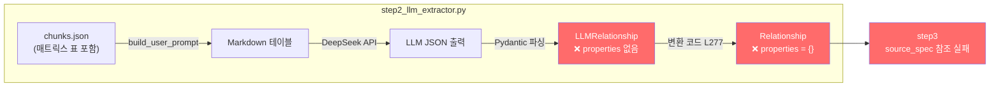
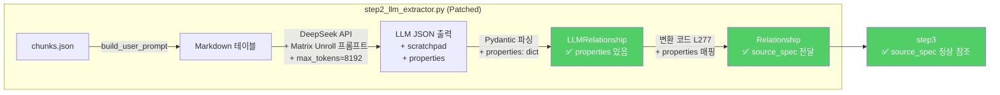
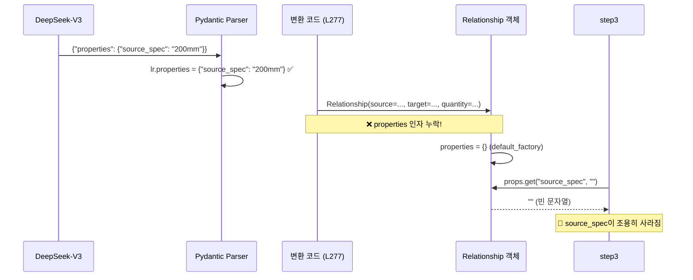

# Track A: LLM Matrix Unroll 구현 기술서

> **작성일:** 2026-02-19  
> **대상 파일:** `pipeline/phase2_extraction/step2_llm_extractor.py`  
> **관련 검증 문서:** [코드검증리포트](file:///G:/My%20Drive/Antigravity/docs/plans/20260219_QuickWin_TrackA_코드검증리포트.md)  
> **선행 작업:** Quick Win 1+2 완료 (커밋 `8ca9a1d`)

---

## 목차

1. [문제 정의](#1-문제-정의)
2. [아키텍처 개요](#2-아키텍처-개요)
3. [수정 대상 파일 및 라인](#3-수정-대상-파일-및-라인)
4. [Patch 1: Pydantic 스키마 확장](#4-patch-1-pydantic-스키마-확장)
5. [Patch 2: 시스템 프롬프트 수정](#5-patch-2-시스템-프롬프트-수정)
6. [Patch 3: max_tokens 상향](#6-patch-3-max_tokens-상향)
7. [Patch 4: 변환 코드 properties 매핑](#7-patch-4-변환-코드-properties-매핑)
8. [다운스트림 호환성 증거](#8-다운스트림-호환성-증거)
9. [마이크로 테스트 절차](#9-마이크로-테스트-절차)
10. [리스크 및 롤백 계획](#10-리스크-및-롤백-계획)

---

## 1. 문제 정의

### 1.1 현상

건설 표준품셈의 매트릭스(2D) 표에서 LLM(DeepSeek-V3)이 **중간 규격의 수량을 누락**합니다.

**예시: 가스용 PE관 접합 및 부설 테이블**

| 구분     | 63mm  | 75mm  | 100mm | 150mm | **200mm** | 250mm | 300mm | 400mm |
| -------- | ----- | ----- | ----- | ----- | --------- | ----- | ----- | ----- |
| 배관공   | 0.184 | 0.197 | 0.234 | 0.312 | **0.521** | 0.645 | 0.782 | 1.024 |
| 특별인부 | 0.052 | 0.056 | 0.067 | 0.089 | **0.113** | 0.139 | 0.168 | 0.220 |
| 보통인부 | 0.103 | 0.110 | 0.131 | 0.174 | **0.225** | 0.278 | 0.336 | 0.440 |

**현재 LLM 출력 (문제):**

```json
{
  "relationships": [
    {"source": "가스용 PE관 접합", "target": "배관공", "quantity": 0.184, "unit": "인"},
    {"source": "가스용 PE관 접합", "target": "배관공", "quantity": 1.024, "unit": "인"}
  ]
}
```

- ❌ 63mm와 400mm만 추출, **중간 6개 규격(75~300mm)이 모두 누락**
- ❌ "배관공" → 동일 target에 대한 복수 수량이 어떤 규격인지 **식별 불가**

### 1.2 근본 원인

1. **JSON 스키마에 `properties` 필드 누락:** `LLMRelationship`에 규격(spec)을 기록할 공간이 없음
2. **프롬프트에 매트릭스 전개 지침 없음:** LLM이 2D 표를 임의로 압축
3. **출력 토큰 제한:** `max_tokens` 미지정 → DeepSeek 기본 4,096 적용. API 최대 상한은 **8,192**. 15규격 × 5직종 = 75개 관계 객체(~11,750 토큰) 생성 시 상한 초과
4. **변환 코드 누락:** LLM이 `properties`를 생성해도 `Relationship` 객체에 전달되지 않음 (Silent Drop)

### 1.3 기대 결과

수정 후 LLM 출력:

```json
{
  "matrix_analysis_scratchpad": "8개 규격(63~400mm) × 3개 직종 = 24개 관계. 모두 전개.",
  "relationships": [
    {"source": "가스용 PE관 접합", "target": "배관공", "relation_type": "REQUIRES_LABOR",
     "quantity": 0.184, "unit": "인", "properties": {"source_spec": "63mm"}},
    {"source": "가스용 PE관 접합", "target": "배관공", "relation_type": "REQUIRES_LABOR",
     "quantity": 0.521, "unit": "인", "properties": {"source_spec": "200mm"}},
    ...
  ]
}
```

- ✅ **모든 규격이 개별 관계 객체로 100% 전개(Unroll)**
- ✅ `properties.source_spec`으로 각 수량의 정확한 규격 추적 가능

---

## 2. 아키텍처 개요

### 2.1 데이터 흐름 (수정 전)



### 2.2 데이터 흐름 (수정 후)



---

## 3. 수정 대상 파일 및 라인

모든 수정은 **단일 파일** `step2_llm_extractor.py`에 집중됩니다.

| Patch | 수정 위치 | 현재 코드                                | 수정 내용                                                  |
| ----- | --------- | ---------------------------------------- | ---------------------------------------------------------- |
| **1** | L67~81    | `LLMRelationship`, `LLMExtractionResult` | `properties` 필드 + `scratchpad` 필드 추가                 |
| **2** | L86~145   | `SYSTEM_PROMPT` + `FEW_SHOT_EXAMPLE`     | 매트릭스 전개 규칙 + JSON 스키마 보강 + Few-shot 예시 추가 |
| **3** | L227~236  | API 호출부                               | `max_tokens=8192` 추가                                     |
| **4** | L277~286  | `Relationship()` 생성                    | `properties=lr.properties` 매핑 추가                       |

> [!IMPORTANT]
> `schemas.py`, `step3_relation_builder.py`, `step4_normalizer.py`는 **수정 불필요**.  
> `Relationship.properties: dict` 필드(L72)와 `source_spec` 참조 로직이 이미 존재합니다.

---

## 4. Patch 1: Pydantic 스키마 확장

### 4.1 현재 코드 ([step2_llm_extractor.py L67~81](file:///G:/My%20Drive/Antigravity/pipeline/phase2_extraction/step2_llm_extractor.py#L67-L81))

```python
class LLMRelationship(BaseModel):
    """LLM이 추출할 관계"""
    source: str = Field(description="출발 엔티티 이름")
    target: str = Field(description="도착 엔티티 이름")
    relation_type: str = Field(description="관계: REQUIRES_LABOR, ...")
    quantity: Optional[float] = Field(None, description="투입 수량")
    unit: Optional[str] = Field(None, description="투입 단위")


class LLMExtractionResult(BaseModel):
    """LLM 추출 전체 결과"""
    entities: list[LLMEntity] = Field(default_factory=list)
    relationships: list[LLMRelationship] = Field(default_factory=list)
    summary: str = Field(default="", description="청크 내용 1줄 요약 (한국어)")
    confidence: float = Field(default=0.8, ge=0, le=1, description="추출 신뢰도 0~1")
```

### 4.2 수정 후 코드

```python
class LLMRelationship(BaseModel):
    """LLM이 추출할 관계"""
    source: str = Field(description="출발 엔티티 이름")
    target: str = Field(description="도착 엔티티 이름")
    relation_type: str = Field(description="관계: REQUIRES_LABOR, REQUIRES_EQUIPMENT, USES_MATERIAL, HAS_NOTE, APPLIES_STANDARD 중 하나")
    quantity: Optional[float] = Field(None, description="투입 수량")
    unit: Optional[str] = Field(None, description="투입 단위")
    # 💡 [Track A] 규격별 수량 추적을 위한 자유형 Dict
    # Why: 매트릭스(2D) 표에서 동일 source-target 쌍이 규격별로 다른 수량을 가질 때
    #       {"source_spec": "200mm"} 형태로 규격을 기록하여 관계를 고유하게 식별
    properties: Optional[dict] = Field(default_factory=dict, description="추가 속성 (source_spec 등)")


class LLMExtractionResult(BaseModel):
    """LLM 추출 전체 결과"""
    # 💡 [Track A] Chain-of-Thought 버퍼
    # Why: 매트릭스 표 파싱 시 LLM이 "몇 개 규격을 전개할 것인지" 사고 과정을 기록
    #       이를 통해 누락 여부를 사후 검증할 수 있음 (디버깅용, 파이프라인에 영향 없음)
    matrix_analysis_scratchpad: Optional[str] = Field(
        default="",
        description="다중 규격 표 파싱 시 LLM의 사고 과정 기록"
    )
    entities: list[LLMEntity] = Field(default_factory=list)
    relationships: list[LLMRelationship] = Field(default_factory=list)
    summary: str = Field(default="", description="청크 내용 1줄 요약 (한국어)")
    confidence: float = Field(default=0.8, ge=0, le=1, description="추출 신뢰도 0~1")
```

### 4.3 변경 영향 분석

| 항목                             | 영향                                                                                                 |
| -------------------------------- | ---------------------------------------------------------------------------------------------------- |
| `Pydantic model_validate_json()` | `Optional` + `default` 설정이므로 **기존 LLM 출력(properties 미포함)도 정상 파싱**. 하위 호환성 100% |
| `matrix_analysis_scratchpad`     | `Optional[str] = ""` 이므로 LLM이 미생성 시 빈 문자열. 에러 없음                                     |
| 기존 단위 테스트                 | 기존 스키마의 필수 필드 미변경. **테스트 영향 없음**                                                 |

> [!NOTE]
> `properties` 필드를 `dict`가 아닌 `Optional[dict]`로 선언하는 이유:  
> DeepSeek이 `"properties": null`을 출력할 가능성이 있으며, `dict` 타입은 `null`을 거부합니다.  
> `Optional[dict] = Field(default_factory=dict)`는 `null` → `{}`로 안전하게 변환합니다.

---

## 5. Patch 2: 시스템 프롬프트 수정

### 5.1 수정 대상: SYSTEM_PROMPT ([L86~119](file:///G:/My%20Drive/Antigravity/pipeline/phase2_extraction/step2_llm_extractor.py#L86-L119))

#### 5.1.1 JSON 스키마 섹션 교체 (L111~118)

**현재:**

```python
## 출력 JSON 스키마 (반드시 이 형식으로 출력)
```json
{
  "entities": [{...}],
  "relationships": [{"source": "...", "target": "...", "relation_type": "...", "quantity": 숫자, "unit": "문자열"}],
  "summary": "1줄 요약",
  "confidence": 0.0~1.0
}
```

**수정 후:**

```python
## 출력 JSON 스키마 (반드시 이 형식으로 출력)
```json
{
  "matrix_analysis_scratchpad": "다중 규격 표가 있으면 사고 과정을 여기에 기록",
  "entities": [{"type": "WorkType|Labor|Equipment|Material|Note|Standard", "name": "문자열", "spec": "문자열 or null", "unit": "문자열 or null", "quantity": 숫자 or null}],
  "relationships": [{
    "source": "출발엔티티명",
    "target": "도착엔티티명",
    "relation_type": "REQUIRES_LABOR|REQUIRES_EQUIPMENT|USES_MATERIAL|HAS_NOTE|APPLIES_STANDARD",
    "quantity": 숫자 or null,
    "unit": "문자열 or null",
    "properties": {"source_spec": "해당 수량의 규격 (예: 200mm)"}
  }],
  "summary": "1줄 요약 (한국어)",
  "confidence": 0.0~1.0
}
```

> [!CAUTION]
> **필드명 `relation_type` 유지 필수!**  
> 변환 코드(L270)에서 `lr.relation_type`으로 참조합니다.  
> 프롬프트 JSON 예시에서 `"type"`으로 쓰면 LLM이 `"type"` 키를 생성하여  
> Pydantic이 `relation_type`을 `None`으로 파싱 → `RelationType(None)` → `ValueError` → 관계 전체 Drop.

#### 5.1.2 규칙 섹션에 매트릭스 전개 규칙 추가 (L103~109 이후)

```python
## 규칙
1. 원본 텍스트에 **실제로 존재하는** 이름과 수치만 추출한다 (할루시네이션 금지)
2. 수량은 반드시 원본의 숫자를 그대로 사용한다
3. 같은 엔티티를 다른 이름으로 중복 추출하지 않는다
4. 테이블이 있으면 행/열 구조를 정확히 해석한다
5. '1m³당', '100m당' 등 기준 단위도 추출한다
6. 확실하지 않은 정보는 confidence를 낮게 설정한다
# ──── 이하 신규 추가 ────
7. 🚨 **[매트릭스 표 전개 규칙]** 가로축에 여러 규격(63mm, 75mm, 200mm 등)이 나열된 표는
   절대 중간 규격을 생략하거나 "등"으로 묶지 마십시오.
   **모든 규격에 대해 독립된 관계(relationship) 객체를 100% 전개(Unroll)**해야 합니다.
8. 각 관계의 `properties.source_spec`에 해당 수량의 **정확한 규격 문자열**을 반드시 기록하십시오.
9. 매트릭스 표가 감지되면 `matrix_analysis_scratchpad`에 "[규격 수] × [직종 수] = [총 관계 수]"
   형태로 사고 과정을 기록한 뒤 전개를 시작하십시오.
```

### 5.2 수정 대상: FEW_SHOT_EXAMPLE ([L122~145](file:///G:/My%20Drive/Antigravity/pipeline/phase2_extraction/step2_llm_extractor.py#L122-L145))

기존 단일 청크 예시 **유지** + 매트릭스 전개 예시 **추가**.

```python
FEW_SHOT_EXAMPLE = """
## 예시 1: 단일 규격 (기존)

### 입력
섹션: 콘크리트 타설 (레미콘 25-24-15)
텍스트: "1m³당 특별인부 0.33인, 보통인부 0.67인, 콘크리트공 0.15인"

### 출력
{
  "matrix_analysis_scratchpad": "",
  "entities": [
    {"type": "WorkType", "name": "콘크리트 타설", "spec": "레미콘 25-24-15", "unit": "m³", "quantity": null},
    {"type": "Labor", "name": "특별인부", "spec": null, "unit": "인", "quantity": 0.33},
    {"type": "Labor", "name": "보통인부", "spec": null, "unit": "인", "quantity": 0.67},
    {"type": "Labor", "name": "콘크리트공", "spec": null, "unit": "인", "quantity": 0.15}
  ],
  "relationships": [
    {"source": "콘크리트 타설", "target": "특별인부", "relation_type": "REQUIRES_LABOR", "quantity": 0.33, "unit": "인", "properties": {"source_spec": "레미콘 25-24-15"}},
    {"source": "콘크리트 타설", "target": "보통인부", "relation_type": "REQUIRES_LABOR", "quantity": 0.67, "unit": "인", "properties": {"source_spec": "레미콘 25-24-15"}},
    {"source": "콘크리트 타설", "target": "콘크리트공", "relation_type": "REQUIRES_LABOR", "quantity": 0.15, "unit": "인", "properties": {"source_spec": "레미콘 25-24-15"}}
  ],
  "summary": "콘크리트 타설(레미콘 25-24-15) 1m³당 인력투입 기준",
  "confidence": 0.95
}

## 예시 2: 매트릭스 표 전개 (🚨 핵심)

### 입력
섹션: 가스용 폴리에틸렌(PE)관 접합 및 부설

| 구분     | 63mm  | 200mm |
| -------- | ----- | ----- |
| 배관공   | 0.184 | 0.521 |
| 특별인부 | 0.052 | 0.113 |

### 출력
{
  "matrix_analysis_scratchpad": "2개 규격(63mm, 200mm) × 2개 직종(배관공, 특별인부) = 4개 관계. 모두 전개.",
  "entities": [
    {"type": "WorkType", "name": "가스용 폴리에틸렌(PE)관 접합 및 부설", "spec": null, "unit": null, "quantity": null},
    {"type": "Labor", "name": "배관공", "spec": null, "unit": "인", "quantity": null},
    {"type": "Labor", "name": "특별인부", "spec": null, "unit": "인", "quantity": null}
  ],
  "relationships": [
    {"source": "가스용 폴리에틸렌(PE)관 접합 및 부설", "target": "배관공", "relation_type": "REQUIRES_LABOR", "quantity": 0.184, "unit": "인", "properties": {"source_spec": "63mm"}},
    {"source": "가스용 폴리에틸렌(PE)관 접합 및 부설", "target": "배관공", "relation_type": "REQUIRES_LABOR", "quantity": 0.521, "unit": "인", "properties": {"source_spec": "200mm"}},
    {"source": "가스용 폴리에틸렌(PE)관 접합 및 부설", "target": "특별인부", "relation_type": "REQUIRES_LABOR", "quantity": 0.052, "unit": "인", "properties": {"source_spec": "63mm"}},
    {"source": "가스용 폴리에틸렌(PE)관 접합 및 부설", "target": "특별인부", "relation_type": "REQUIRES_LABOR", "quantity": 0.113, "unit": "인", "properties": {"source_spec": "200mm"}}
  ],
  "summary": "가스용 PE관 접합 규격별(63mm, 200mm) 인력투입 기준 — 전체 전개",
  "confidence": 0.95
}
"""
```

### 5.3 프롬프트 조합 방식 확인

현재 L231~232에서 프롬프트를 조합하는 방식:

```python
messages=[
    {"role": "system", "content": SYSTEM_PROMPT},
    {"role": "user", "content": FEW_SHOT_EXAMPLE + "\n\n---\n\n" + user_prompt},
],
```

**이 구조는 유지됩니다.** `SYSTEM_PROMPT`에 매트릭스 규칙을 추가하고, `FEW_SHOT_EXAMPLE`에 예시 2를 추가하면 자동으로 LLM에 전달됩니다.

---

## 6. Patch 3: max_tokens 상향

### 6.1 현재 코드 ([L227~236](file:///G:/My%20Drive/Antigravity/pipeline/phase2_extraction/step2_llm_extractor.py#L227-L236))

```python
api_call = asyncio.to_thread(
    client.chat.completions.create,
    model=LLM_MODEL,
    messages=[
        {"role": "system", "content": SYSTEM_PROMPT},
        {"role": "user", "content": FEW_SHOT_EXAMPLE + "\n\n---\n\n" + user_prompt},
    ],
    response_format={"type": "json_object"},
    temperature=LLM_TEMPERATURE,
)
```

### 6.2 수정 후 코드

```diff
 api_call = asyncio.to_thread(
     client.chat.completions.create,
     model=LLM_MODEL,
     messages=[
         {"role": "system", "content": SYSTEM_PROMPT},
         {"role": "user", "content": FEW_SHOT_EXAMPLE + "\n\n---\n\n" + user_prompt},
     ],
     response_format={"type": "json_object"},
     temperature=LLM_TEMPERATURE,
+    max_tokens=8192,  # 💡 [Track A] 매트릭스 전개 시 출력 토큰 부족(Truncation) 방지
 )
```

### 6.3 토큰 계산 근거

| 항목                            | 산출                                                                  |
| ------------------------------- | --------------------------------------------------------------------- |
| 매트릭스 표 최대 규모           | 15규격(가로) × 5직종(세로) = **75 관계**                              |
| 관계 1건 JSON 크기              | ~150 토큰 (source, target, relation_type, quantity, unit, properties) |
| 75건 총 토큰                    | ~11,250 토큰                                                          |
| entities + summary + scratchpad | ~500 토큰                                                             |
| **총 예상**                     | **~11,750 토큰**                                                      |
| 현재 기본값                     | 4,096 토큰 → ❌ **부족**                                               |
| 제안값 8,192                    | ✅ API 허용 **최대 상한** — 일반 케이스(10규격 이하) 완전 커버         |
| 극단 케이스 (15×5)              | ~11,750 토큰 → ❌ **API 상한 초과** — 청크 분할 필요                   |

> [!NOTE]
> DeepSeek-V3(`deepseek-chat`)의 출력 토큰은 **4,096 (기본) ~ 8,192 (최대)**입니다.  
> (공식 문서: [Models & Pricing](https://api-docs.deepseek.com/quick_start/pricing))  
> `max_tokens=8192`는 API가 허용하는 **절대 상한**이므로 이 이상 상향은 불가능합니다.  
> 15규격 이상의 극단적 매트릭스에서 잘림(Truncation)이 발생할 경우,  
> **청크를 규격 기준으로 분할(Split)하여 2회 호출**로 대응합니다 (§10.1 리스크 대응 참조).

### 6.4 비용 영향

| 항목                   | 현재 (4096)      | 수정 후 (8192)            | 변화                        |
| ---------------------- | ---------------- | ------------------------- | --------------------------- |
| DeepSeek-V3 출력 단가  | $0.28/100만 토큰 | 동일                      | -                           |
| 평균 청크당 출력       | ~1,500 토큰      | ~3,000 토큰 (매트릭스 시) | +$0.0004/청크               |
| 전체 690청크 추가 비용 | -                | -                         | **~$0.28 추가** (무시 가능) |

---

## 7. Patch 4: 변환 코드 properties 매핑

### 7.1 현재 코드 ([L277~286](file:///G:/My%20Drive/Antigravity/pipeline/phase2_extraction/step2_llm_extractor.py#L277-L286))

```python
rel = Relationship(
    source=lr.source,
    source_type=source_type,
    target=lr.target,
    target_type=target_type,
    type=rtype,
    quantity=lr.quantity,
    unit=lr.unit,
    source_chunk_id=chunk_id,
)
```

### 7.2 수정 후 코드

```diff
 rel = Relationship(
     source=lr.source,
     source_type=source_type,
     target=lr.target,
     target_type=target_type,
     type=rtype,
     quantity=lr.quantity,
     unit=lr.unit,
+    properties=lr.properties if lr.properties else {},
     source_chunk_id=chunk_id,
 )
```

### 7.3 이 패치가 없으면 어떻게 되는가



> [!CAUTION]
> **Patch 1~3만 적용하고 Patch 4를 누락하면**, LLM은 올바른 `source_spec`을 생성하지만  
> 변환 단계에서 **조용히 버려집니다(Silent Drop)**. 에러 로그도 남지 않아 디버깅이 매우 어렵습니다.
> 
> **Patch 4는 전체 Track A의 핵심 연결 고리입니다.**

---

## 8. 다운스트림 호환성 증거

LLM이 `properties.source_spec`을 올바르게 채우고, Patch 4로 `Relationship` 객체에 전달되면, **추가 수정 없이** step3과 step4가 자동으로 활용합니다.

### 8.1 step3_relation_builder.py

| 라인                                                                                                         | 코드                                      | 용도                                                                                     |
| ------------------------------------------------------------------------------------------------------------ | ----------------------------------------- | ---------------------------------------------------------------------------------------- |
| [L50~65](file:///G:/My%20Drive/Antigravity/pipeline/phase2_extraction/step3_relation_builder.py#L50-L65)     | `_rel_key()` 함수                         | `source_spec`을 관계 고유 키에 포함하여 **동일 source-target의 규격별 관계를 개별 보존** |
| [L57](file:///G:/My%20Drive/Antigravity/pipeline/phase2_extraction/step3_relation_builder.py#L57)            | `src_spec = props.get("source_spec", "")` | properties에서 규격 추출                                                                 |
| [L312~316](file:///G:/My%20Drive/Antigravity/pipeline/phase2_extraction/step3_relation_builder.py#L312-L316) | BELONGS_TO 관계 생성                      | `"source_spec": spec`으로 properties에 규격 주입                                         |
| [L321~329](file:///G:/My%20Drive/Antigravity/pipeline/phase2_extraction/step3_relation_builder.py#L321-L329) | 중복 제거                                 | `source_spec` 포함 키로 dedup → PE관 15건 분리 유지                                      |

**핵심 코드:**

```python
def _rel_key(rel: dict) -> str:
    props = rel.get("properties") or {}
    src_spec = str(props.get("source_spec", "")).replace(' ', '').lower()
    # ...
    if src_spec:
        src = f"{src}::{src_spec}"
    return f"{rel['type']}::{src}::{tgt}"
```

> `source_spec`이 있으면 관계 키에 포함 → 같은 source-target이라도 **규격이 다르면 별개 관계로 보존**.
> 이것이 바로 Track A에서 원하는 동작입니다.

### 8.2 step4_normalizer.py

| 라인                                                                                          | 코드                                           | 용도                                                       |
| --------------------------------------------------------------------------------------------- | ---------------------------------------------- | ---------------------------------------------------------- |
| [L526](file:///G:/My%20Drive/Antigravity/pipeline/phase2_extraction/step4_normalizer.py#L526) | `normalize_spec(props.get("source_spec", ""))` | 정규화된 규격 기반 ID 생성                                 |
| [L688](file:///G:/My%20Drive/Antigravity/pipeline/phase2_extraction/step4_normalizer.py#L688) | (주석)                                         | `BELONGS_TO는 properties.source_spec으로 정확한 ID를 찾고` |
| [L703](file:///G:/My%20Drive/Antigravity/pipeline/phase2_extraction/step4_normalizer.py#L703) | `sspec = props.get("source_spec", "")`         | 규격 기반 섹션 매핑                                        |
| [L717](file:///G:/My%20Drive/Antigravity/pipeline/phase2_extraction/step4_normalizer.py#L717) | `sspec = props.get("source_spec", "")`         | 규격 기반 엔티티 매핑                                      |

> **step3(5개) + step4(4개) = 총 9개 지점**에서 `properties.source_spec`을 참조 중. 다운스트림 수정 **불필요**.

---

## 9. 마이크로 테스트 절차

### 9.1 테스트 목적

Patch 1~4 적용 후, **실제 PE관 청크 1개**로 DeepSeek-V3의 매트릭스 전개를 검증합니다.

### 9.2 사전 조건

```bash
# 1. chunks.json 백업
cp pipeline/phase1_output/chunks.json pipeline/phase1_output/chunks.json.bak

# 2. PE관 매트릭스 청크 1개만 추출 (테스트용)
python -c "
import json
data = json.load(open('pipeline/phase1_output/chunks.json', encoding='utf-8'))
# 매트릭스 표가 포함된 PE관 청크 (다중 규격 헤더 존재)
pe = [c for c in data if c.get('tables') and any(
    len(t.get('headers', [])) > 5 for t in c.get('tables', [])
) and ('PE' in c.get('title', '') or '폴리에틸렌' in c.get('title', ''))]
print(f'매트릭스 PE관 청크: {len(pe)}개')
if pe:
    json.dump(pe[:1], open('pipeline/phase1_output/chunks_test.json', 'w', encoding='utf-8'),
              ensure_ascii=False, indent=2)
    print(f'테스트 청크 저장: {pe[0][\"chunk_id\"]}')
"
```

### 9.3 테스트 실행

```bash
# step2만 단독 실행 (테스트 청크 사용)
# config.py의 CHUNKS_FILE을 임시로 chunks_test.json으로 변경하거나,
# 환경변수로 오버라이드

python pipeline/phase2_extraction/step2_llm_extractor.py
```

### 9.4 검증 항목

출력된 `llm_entities.json`에서 다음을 확인:

| #   | 검증 항목                          | 기대값                                | 확인 방법             |
| --- | ---------------------------------- | ------------------------------------- | --------------------- |
| 1   | `matrix_analysis_scratchpad` 존재  | 비어있지 않은 문자열                  | JSON 최상단 필드 확인 |
| 2   | `scratchpad` 내용                  | "N개 규격 × M개 직종 = K개 관계" 형태 | 텍스트 패턴 확인      |
| 3   | `relationships` 수                 | 규격 수 × 직종 수 (예: 8 × 3 = 24)    | `len(relationships)`  |
| 4   | 각 관계의 `properties.source_spec` | 비어있지 않은 규격 문자열             | 모든 관계에서 확인    |
| 5   | 200mm `source_spec` 존재           | `"200mm"` 값을 가진 관계 존재         | `grep "200mm"`        |
| 6   | 수량 정확성                        | 원본 테이블 수치와 1:1 대응           | 수동 대조             |

```python
# 검증 스크립트
import json
data = json.load(open('pipeline/phase2_output/llm_entities.json', encoding='utf-8'))
for ext in data.get('extractions', []):
    print(f"--- {ext['chunk_id']} ---")
    print(f"scratchpad: {ext.get('matrix_analysis_scratchpad', 'N/A')}")
    for r in ext.get('relationships', []):
        spec = (r.get('properties') or {}).get('source_spec', '???')
        print(f"  {r['source'][:20]} → {r['target'][:10]} | qty={r.get('quantity')} | spec={spec}")
```

### 9.5 성공 기준

| 기준        | 조건                                                                             |
| ----------- | -------------------------------------------------------------------------------- |
| **Pass**    | 200mm를 포함한 **모든 규격**의 수량이 개별 관계로 추출됨                         |
| **Partial** | 일부 규격 누락 (3개 이하) → 프롬프트 강화 후 재시도                              |
| **Fail**    | `properties`가 빈 dict → Patch 4 누락 확인, `scratchpad` 비어있음 → Patch 2 확인 |

---

## 10. 리스크 및 롤백 계획

### 10.1 리스크 매트릭스

| 리스크                                 | 확률      | 영향 | 대응                                                                                                   |
| -------------------------------------- | --------- | ---- | ------------------------------------------------------------------------------------------------------ |
| DeepSeek이 `properties` 키를 무시      | 중간      | 높음 | Few-shot 예시 강화 + `temperature=0.0`                                                                 |
| 출력 토큰 8192 초과 (극단적 15규격 표) | 낮음      | 중간 | API 상한이 8,192이므로 상향 불가 → **청크를 규격 기준으로 분할(예: 앞 8규격 / 뒤 7규격)하여 2회 호출** |
| `relation_type` ↔ `type` 혼동          | 낮음      | 높음 | 프롬프트 JSON 예시에서 `relation_type` 명시 + Few-shot 일관                                            |
| Pydantic 파싱 에러 (예상치 못한 필드)  | 매우 낮음 | 중간 | `model_validate_json` 에러 로그 확인                                                                   |
| 비용 증가                              | 매우 낮음 | 낮음 | 690청크 × 추가 $0.0004 = $0.28 (무시 가능)                                                             |

### 10.2 롤백 계획

```bash
# 1. chunks.json 복원
cp pipeline/phase1_output/chunks.json.bak pipeline/phase1_output/chunks.json

# 2. step2_llm_extractor.py Git 복원
git checkout -- pipeline/phase2_extraction/step2_llm_extractor.py

# 3. 기존 llm_entities.json에서 재실행
# (step3, step4는 properties 유무에 관계없이 안전하게 동작)
```

### 10.3 부분 롤백 (Patch별)

| Patch                | 롤백 영향                                                            |
| -------------------- | -------------------------------------------------------------------- |
| Patch 1 (스키마)     | `Optional` + `default` 이므로 제거해도 기존 데이터 호환              |
| Patch 2 (프롬프트)   | 프롬프트 원복 시 기존 동작으로 완전 복귀                             |
| Patch 3 (max_tokens) | 제거 시 기본 4096으로 복귀. 기능에 영향 없음                         |
| Patch 4 (매핑)       | 제거 시 `properties={}` 기본값으로 복귀. step3/4 에러 없음 (빈 spec) |
