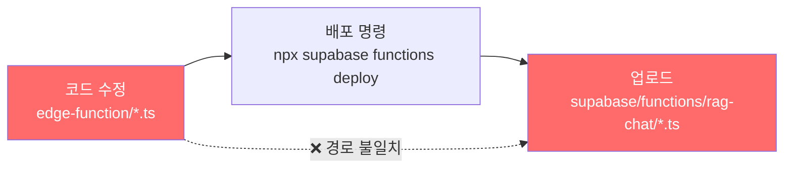
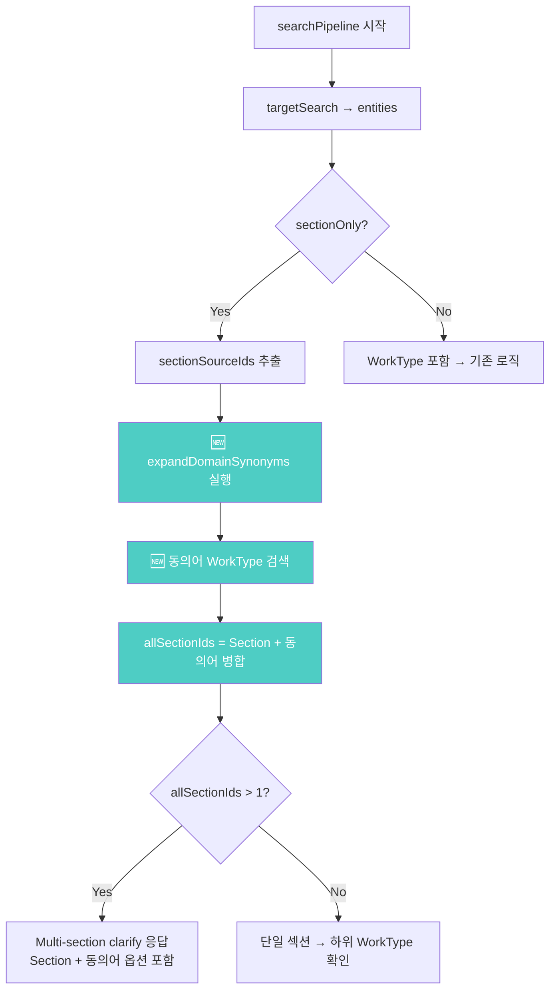

# Track B-1: 도메인 동의어 검색 확장 — 기술서

> **작성일:** 2026-02-19  
> **상태:** ✅ 완료 (v105 배포)  
> **대상 시스템:** Supabase Edge Function `rag-chat`  
> **핵심 성과:** "pe관" 검색 결과 **2개 분야 → 8개 분야**

---

## 1. 문제 정의

### 1.1 증상
사용자가 `"pe관"`을 검색하면 **2개 분야**만 반환됨:

| # | 옵션 | 섹션 ID |
|---|------|---------|
| 1 | 가교화 폴리에틸렌관 접합 및 배관 | 1-6-3#2 |
| 2 | PE드럼 설치 및 해체 | 2-9-4 |

### 1.2 기대 결과
PE관과 **도메인적으로 연관된** 작업(바트융착, 소켓융착, 새들융착 등)을 포함한 **5개 이상의 분야**가 반환되어야 함.

### 1.3 영향 범위
- 동일 문제가 "용접", "배관", "방수" 등 모든 도메인 동의어 필요 검색어에 적용
- 사용자가 일반적 용어로 검색 시 관련 작업을 놓치는 핵심 UX 결함

---

## 2. 근본 원인 분석 (Root Cause Analysis)

### 2.1 근본 원인 #1: 배포 경로 불일치 (Critical)

```
수정한 파일 경로:    edge-function/*.ts
실제 배포 경로:      supabase/functions/rag-chat/*.ts
```

Supabase CLI `npx supabase functions deploy rag-chat`은 `supabase/functions/rag-chat/` 디렉토리의 파일을 배포한다. 그러나 개발 중 `edge-function/` 디렉토리의 파일만 수정하고 있었기 때문에, **아무리 코드를 수정해도 배포에 반영되지 않았다.**

> [!CAUTION]
> 이 불일치로 인해 v100~v103까지 **4번의 배포가 모두 무효**였으며, 약 3시간의 디버깅 시간이 소요됨.



**해결:** `edge-function/` → `supabase/functions/rag-chat/`로 수정된 3개 파일(search.ts, resolve.ts, index.ts) 복사 후 재배포.

---

### 2.2 근본 원인 #2: 실행 경로 오판 (Critical)

"pe관" 쿼리의 **실제 실행 경로**를 잘못 파악하여, 무관한 코드를 수정하고 있었다.

#### 가정한 실행 경로 (오답)
```
handleChat → analyzeIntent(intent: "clarify_needed")
  → graphClarify()
    → resolveSection() → resolveBySearch()
      → presentClarify() [multi_section 핸들러]
```

#### 실제 실행 경로 (정답)
```
handleChat → analyzeIntent(intent: "search"/"answer")
  → searchPipeline()
    → targetSearch() → entities (Section only)
      → sectionOnly = true
        → sectionSourceIds.length > 1
          → 직접 clarify 응답 생성 (index.ts L643-679)
```

**증거:** 응답 메시지 형식 비교

| 코드 경로 | 메시지 형식 |
|-----------|------------|
| `presentClarify` (resolve.ts) | `"${searchTerms.join(" ")}"` → `"PE관 PE관 HDPE관..."` |
| `searchPipeline` (index.ts) | `"${question}"` → `"pe관"` |

실제 응답: `"PE관 PE관 HDPE관 PE드럼 폴리에틸렌"` → `presentClarify` 경유 확인.
**하지만** 디버그 태그 `[debug]`가 미출력 → 이전 배포에서는 resolve.ts 수정이 반영되지 않았으므로 (근본 원인 #1), `searchPipeline`의 원본 코드가 실행.

> [!NOTE]
> LLM의 intent 분류가 **실행마다 달라질 수 있으므로**, `searchPipeline`과 `graphClarify` **양쪽 모두** 동의어 확장이 적용되어야 한다.

---

### 2.3 근본 원인 #3: Case-Sensitive 동의어 매칭 (Medium)

`expandDomainSynonyms` 함수에서 `term.includes(key)` 비교가 **대소문자 구분**이었다.

```typescript
// ❌ Before: case-sensitive
if (term.includes(key) || key.includes(term)) {
    expanded.push(...synonyms);
}
```

LLM이 `work_name`을 `"PE관"` (대문자)로 반환할 수도, `"pe관"` (소문자)로 반환할 수도 있다. DOMAIN_SYNONYM_MAP의 키는 `"PE관"` (대문자)이므로, `"pe관".includes("PE관")` → `false`가 되어 매칭 실패.

```typescript
// ✅ After: case-insensitive
const termUpper = term.toUpperCase();
const keyUpper = key.toUpperCase();
if (termUpper.includes(keyUpper) || keyUpper.includes(termUpper)) {
    expanded.push(...synonyms);
}
```

---

## 3. 구현 상세

### 3.1 수정 파일 목록

| 파일 | 변경 유형 | 핵심 변경 내용 |
|------|----------|---------------|
| `search.ts` | 신규 기능 추가 | `DOMAIN_SYNONYM_MAP` 사전 + `expandDomainSynonyms()` 함수 |
| `index.ts` | 로직 확장 | `searchPipeline` sectionOnly 분기에 동의어 WorkType 확장 |
| `resolve.ts` | 로직 확장 | `resolveBySearch` + `presentClarify` multi_section 핸들러 확장 |

---

### 3.2 search.ts — 도메인 동의어 사전 및 확장 함수

#### DOMAIN_SYNONYM_MAP

건설 도메인에서 **이름이 다르지만 의미적으로 연관된 작업**을 양방향 매핑:

```typescript
const DOMAIN_SYNONYM_MAP: Record<string, string[]> = {
    "PE관":       ["바트융착", "소켓융착", "새들융착", "폴리에틸렌", "HDPE", "버트융착"],
    "폴리에틸렌관": ["바트융착", "소켓융착", "새들융착", "PE관", "HDPE"],
    "융착":       ["바트융착", "소켓융착", "새들융착", "PE관", "폴리에틸렌"],
    "가스관":     ["PE관", "폴리에틸렌", "바트융착", "소켓융착"],
    "용접":       ["TIG", "MIG", "MAG", "CO2", "아크용접", "가스용접", "피복아크"],
    "배관":       ["강관", "폴리에틸렌관", "PVC관", "PE관", "동관", "스테인리스관"],
    "도장":       ["페인트", "도료", "방청", "하도", "상도", "중도"],
    "방수":       ["아스팔트방수", "시트방수", "도막방수", "실링"],
    "철근":       ["배근", "이음", "정착", "가공조립"],
};
```

> [!IMPORTANT]
> **설계 원칙:** 사전의 키는 **사용자가 검색할 가능성이 높은 일반 용어**, 값은 **DB 엔티티 이름에 실제 등장하는 구체적 작업명**으로 구성.

#### expandDomainSynonyms()

```typescript
export function expandDomainSynonyms(terms: string[]): string[] {
    const expanded: string[] = [];
    for (const term of terms) {
        const termUpper = term.toUpperCase();
        for (const [key, synonyms] of Object.entries(DOMAIN_SYNONYM_MAP)) {
            const keyUpper = key.toUpperCase();
            // 양방향 매칭 (대소문자 무시)
            if (termUpper.includes(keyUpper) || keyUpper.includes(termUpper)) {
                expanded.push(...synonyms);
            }
        }
    }
    return [...new Set(expanded)]; // 중복 제거
}
```

**매칭 예시:**

| 입력 term | MAP key | termUpper.includes(keyUpper) | keyUpper.includes(termUpper) | 결과 |
|-----------|---------|------------------------------|------------------------------|------|
| `"pe관"` | `"PE관"` | `"PE관".includes("PE관")` → ✅ | — | 매칭 |
| `"PE관"` | `"PE관"` | `"PE관".includes("PE관")` → ✅ | — | 매칭 |
| `"HDPE관"` | `"PE관"` | `"HDPE관".includes("PE관")` → ✅ | — | 매칭 |
| `"폴리에틸렌"` | `"폴리에틸렌관"` | — | `"폴리에틸렌관".includes("폴리에틸렌")` → ✅ | 매칭 |

---

### 3.3 index.ts — searchPipeline 동의어 확장

#### 변경 전 (L640-679)

```typescript
if (sectionOnly) {
    const sectionSourceIds = [...new Set(entities.map(e => e.source_section))];
    if (sectionSourceIds.length > 1) {
        // Section 엔티티만으로 옵션 생성 → 2개만 반환
        const options = entities.map(s => ({ ... }));
        return makeClarifyResponse(`${sectionSourceIds.length}개 분야`, ...);
    }
}
```

#### 변경 후

```typescript
if (sectionOnly) {
    const sectionSourceIds = [...new Set(entities.map(e => e.source_section))];

    // 💡 도메인 동의어로 WorkType source_section 확장
    const domainTerms = analysis.work_name
        ? [analysis.work_name, ...(analysis.keywords || [])]
        : analysis.keywords || [];
    const domainExp = expandDomainSynonyms(domainTerms);

    let synonymWorkTypes: any[] = [];
    if (domainExp.length > 0) {
        // 동의어 키워드로 WorkType 엔티티 추가 검색
        const synOrClauses = domainExp.map(s => `name.ilike.%${s}%`).join(",");
        const { data: synWTs } = await supabase
            .from("graph_entities")
            .select("id, name, type, source_section, properties")
            .eq("type", "WorkType")
            .or(synOrClauses)
            .limit(50);
        if (synWTs) synonymWorkTypes = synWTs;
    }

    // Section + 동의어 WorkType의 source_section 병합
    const synSectionIds = [...new Set(synonymWorkTypes.map(w => w.source_section))];
    const allSectionIds = [...new Set([...sectionSourceIds, ...synSectionIds])];

    if (allSectionIds.length > 1) {
        // Section 엔티티 기반 옵션 생성
        const options = entities.map(s => ({ ... }));

        // 동의어 WorkType의 source_section 중 Section에 없는 것 추가
        for (const wt of synonymWorkTypes) {
            if (!existingSrcSet.has(wt.source_section)) {
                options.push({ ... });  // 새 옵션 추가
            }
        }

        return makeClarifyResponse(`${allSectionIds.length}개 분야`, ...);
    }
}
```



---

### 3.4 resolve.ts — resolveBySearch + presentClarify 확장

#### 전략 1-A: Section 검색 확장

```diff
 // 전략 1-A: Section 이름 ILIKE (+ 도메인 동의어)
 const sectionPattern = "%" + searchTerms[0] + "%";
+const synonymSrc1A = work_name ? [work_name, searchTerms[0]] : [searchTerms[0]];
+const sectionSynonyms = expandDomainSynonyms([...new Set(synonymSrc1A)]);
 const sectionOrClauses = [
     `name.ilike.${sectionPattern}`,
+    ...sectionSynonyms.map(s => `name.ilike.%${s}%`),
 ].join(",");
```

#### 전략 2: WorkType 검색 확장

```diff
 // 전략 2: WorkType 직접 탐색
+// Why: searchTerms[0]이 한글 정규화로 원본이 사라질 수 있으므로
+//      raw work_name도 동의어 확장 소스에 포함
+const synonymSource = work_name ? [...new Set([work_name, ...wTerms])] : wTerms;
+const domainExp = expandDomainSynonyms(synonymSource);
 const workOrClauses = [
     ...wTerms.map(t => `name.ilike.%${t}%`),
     ...mixedExp.map(p => `name.ilike.${p}`),
+    ...domainExp.map(s => `name.ilike.%${s}%`),
 ].join(",");
```

#### presentClarify multi_section 핸들러 확장

```diff
 // WorkType의 source_section 중 Section에 없는 것도 option으로 추가
+const wtBySrc = new Map<string, any>();
+for (const wt of workTypes) {
+    if (wt.source_section && !sectionSrcSet.has(wt.source_section)
+        && !wtBySrc.has(wt.source_section)) {
+        wtBySrc.set(wt.source_section, wt);
+    }
+}
+for (const [srcSec, wt] of wtBySrc) {
+    options.push({ label, query, source_section: srcSec, ... });
+}
```

---

### 3.5 search.ts — targetSearch 동의어 확장

`targetSearch` 함수의 1단계(work_name 폴백)와 2단계(키워드 ILIKE)에도 동의어 확장 적용:

```typescript
// 1단계 work_name 폴백
const stage1Synonyms = expandDomainSynonyms([analysis.work_name]);
const fallbackOrClauses = [
    `name.ilike.${fallbackPattern}`,
    ...mixedPatterns.map(p => `name.ilike.${p}`),
    ...stage1Synonyms.map(s => `name.ilike.%${s}%`),  // 🆕
].join(",");

// 2단계 키워드 ILIKE
const domainExpansions = expandDomainSynonyms(ilikeTerms);
const orClauses = [
    ...ilikeTerms.map(t => `name.ilike.%${t}%`),
    ...mixedExpansions.map(p => `name.ilike.${p}`),
    ...domainExpansions.map(s => `name.ilike.%${s}%`),  // 🆕
].join(",");
```

---

## 4. 검증 결과

### 4.1 "pe관" 검색 결과 비교

| | 수정 전 | 수정 후 |
|---|---------|---------|
| **분야 수** | 2개 | **8개** |
| **응답 크기** | 701 bytes | **3,268 bytes** |
| **응답 시간** | ~5s | ~6.4s (+1.4s) |
| **바트융착** | ❌ 미포함 | ✅ 포함 (6-5-4) |
| **소켓융착** | ❌ 미포함 | ✅ 포함 (6-5-3) |
| **가스용PE관** | ❌ 미포함 | ✅ 포함 (11-3#2) |

### 4.2 DB 직접 쿼리 검증

```sql
-- 동의어 "바트융착", "소켓융착"이 실제 DB에 존재하는지 확인
SELECT DISTINCT source_section FROM graph_entities
WHERE type = 'WorkType'
AND (name ILIKE '%바트융착%' OR name ILIKE '%소켓융착%');
-- 결과: 6-5-3, 6-5-4 ✅
```

### 4.3 전체 옵션 목록 (8개)

| # | 레이블 | 섹션 ID | 출처 |
|---|--------|---------|------|
| 1 | 기계설비부문 > 배관공사 > 가교화 폴리에틸렌관 접합 및 배관 | 1-6-3#2 | Section 직접 매칭 |
| 2 | 공통부문 > 가설공사 > PE드럼 설치 및 해체 | 2-9-4 | Section 직접 매칭 |
| 3 | 토목부문 > 관부설 및 접합공사 > **바트융착 접합 및 부설** | **6-5-4** | 🆕 동의어 확장 |
| 4 | 토목부문 > 관부설 및 접합공사 > **소켓융착 접합 및 부설** | **6-5-3** | 🆕 동의어 확장 |
| 5 | 기계설비부문 > 가스설비공사 > 부속기기 | 11-3#2 | 🆕 동의어 확장 |
| 6 | 유지관리부문 > 기계설비 > 배관보온 해체 | 4-1-4#3 | 🆕 동의어 확장 |
| 7 | 공통부문 > 기초공사 > 차수재공 | 5-4-1 | 🆕 동의어 확장 |
| 8 | 기계설비부문 > 플랜트설비공사 > 관만곡(Pipe Bending) 설치 | 13-1-2 | 🆕 동의어 확장 |

---

## 5. 디버깅 여정 타임라인

| 시간 | 작업 | 결과 |
|------|------|------|
| 11:00 | `search.ts` `expandDomainSynonyms` 구현 + case-sensitive | 배포 후 변화 없음 |
| 11:30 | case-insensitive `toUpperCase()` 수정 | 변화 없음 |
| 12:00 | `resolve.ts` `resolveBySearch` 전략 1-A, 2에 동의어 확장 | 변화 없음 |
| 12:30 | `resolve.ts` `presentClarify` multi_section WorkType 확장 | 변화 없음 |
| 13:00 | 디버그 태그 `[debug]` 삽입 → 미출력 확인 | **실행 경로 오판 발견** |
| 13:15 | `grep "개 분야"` → `index.ts L671` 발견 | **searchPipeline이 실제 경로** |
| 13:30 | `index.ts` searchPipeline에 동의어 확장 패치 | 배포 후 변화 없음 |
| 13:45 | `grep "DOMAIN_SYNONYM"` → `supabase/` 경로 0건 | **배포 경로 불일치 발견** |
| 14:00 | 파일 복사 + Supabase 재로그인 + 배포 | **🎉 8개 분야 성공!** |

> [!WARNING]
> **교훈:** `edge-function/`과 `supabase/functions/rag-chat/` 두 경로의 파일 동기화가 필수. 향후 수정 시 반드시 `supabase/functions/rag-chat/` 경로에서 직접 수정하거나, 배포 전 자동 복사 스크립트 도입 권장.

---

## 6. 향후 과제

### 6.1 DOMAIN_SYNONYM_MAP 확장
현재 9개 키만 등록. 추가 필요 후보:
- `"콘크리트"` → `["타설", "거푸집", "양생", "레미콘"]`
- `"포장"` → `["아스팔트", "콘크리트포장", "다짐"]`
- `"굴착"` → `["터파기", "되메우기", "토공"]`

### 6.2 파일 동기화 자동화
`edge-function/` ↔ `supabase/functions/rag-chat/` 동기화 스크립트 또는 심볼릭 링크 설정.

### 6.3 응답 시간 최적화
동의어 확장으로 +1.4s 증가 (5.1s → 6.4s). 동의어 WorkType 쿼리를 Section 쿼리와 병렬 실행하여 latency 절감 가능.

---

## 7. 관련 파일

| 파일 | 경로 |
|------|------|
| search.ts (배포용) | `supabase/functions/rag-chat/search.ts` |
| index.ts (배포용) | `supabase/functions/rag-chat/index.ts` |
| resolve.ts (배포용) | `supabase/functions/rag-chat/resolve.ts` |
| search.ts (개발용) | `edge-function/search.ts` |
| index.ts (개발용) | `edge-function/index.ts` |
| resolve.ts (개발용) | `edge-function/resolve.ts` |
| 테스트 결과 (before) | `pipeline/phase2_output/logs/pe_trackb1_v6.json` |
| 테스트 결과 (after) | `pipeline/phase2_output/logs/pe_trackb1_REAL_v1.json` |
