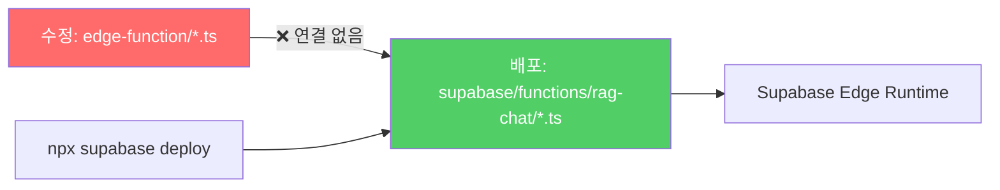
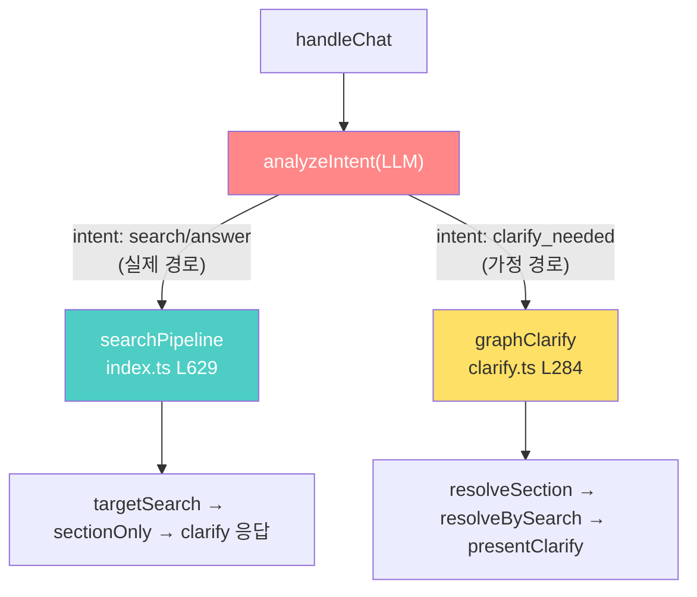
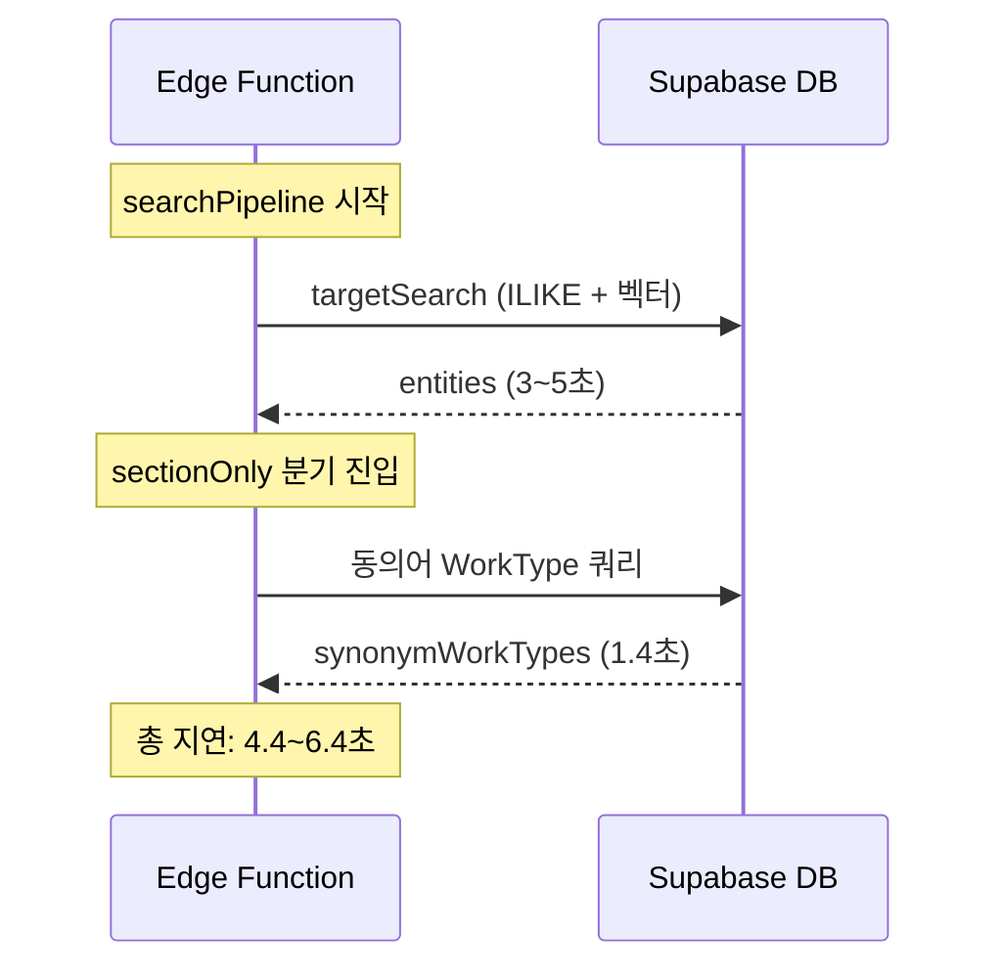
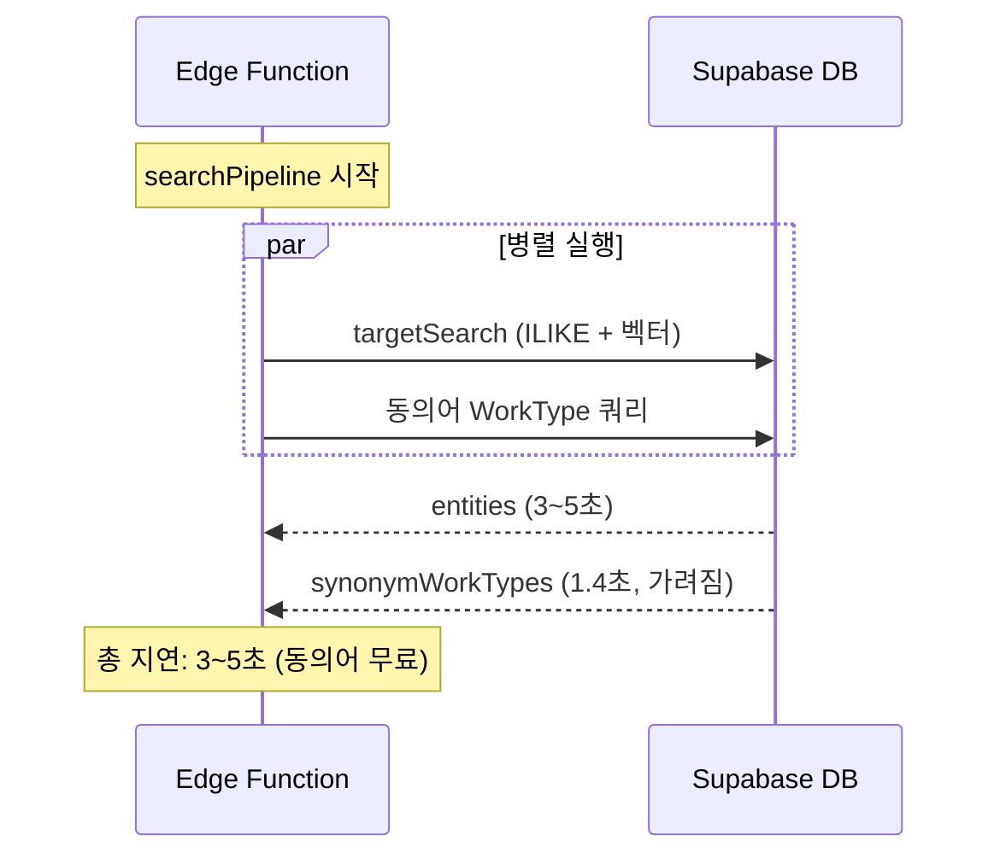

# Track B-1: 아키텍트 Post-Mortem 리뷰 및 최적화 설계

> **작성일:** 2026-02-19  
> **상태:** 트랙 1 구현 승인  
> **선행 문서:** `20260219_TrackB1_도메인동의어검색_기술서.md`

---

## 1. Post-Mortem 평가: 3대 근본 원인 해부

### 1.1 DevOps — 섀도우 배포(Shadow Deployment) 탐지

| 항목 | 내용 |
|------|------|
| **현상** | 코드 수정 후 4회 배포(v100~v103)했으나 런타임 변화 없음 |
| **원인** | 개발 경로(`edge-function/`)와 배포 경로(`supabase/functions/rag-chat/`)가 물리적으로 분리 |
| **탐지 방법** | 디버그 태그 `[debug]`를 코드에 삽입 → 응답에 미출력 확인 → `grep` 검색으로 배포 대상 파일에 수정사항 0건 확인 |
| **등급** | 🔴 Critical — 모든 수정이 무효화됨 |



> [!CAUTION]
> **섀도우 배포의 위험성:** 개발자는 코드가 수정되었다고 확신하지만, 실제 프로덕션에는 구버전이 실행. 디버그 태그 삽입이 유일한 검증 수단이었음.

---

### 1.2 Routing — LLM 비결정적 분기의 양면 방어

| 항목 | 내용 |
|------|------|
| **현상** | `resolve.ts` 패치 후에도 응답 변화 없음 |
| **원인** | LLM `analyzeIntent`가 동일 질문에 `intent: "search"` 또는 `intent: "clarify_needed"`를 **비결정적으로 반환** |
| **실제 경로** | `searchPipeline`(index.ts L629) → `targetSearch` → `sectionOnly` 분기 |
| **오판 경로** | `graphClarify` → `resolveSection` → `resolveBySearch` → `presentClarify` |
| **등급** | 🟡 Medium — 양쪽 모두 패치 필요 |



> [!IMPORTANT]
> **비결정적 라우터 방어 원칙:** LLM 기반 라우팅에서는 **가능한 모든 분기에 동일한 기능을 중복 배치**해야 한다. 한쪽만 패치하면 LLM의 분류 결과에 따라 간헐적으로 기능이 동작/미동작하는 유령 버그(Phantom Bug)가 발생.

---

### 1.3 Semantic Logic — 대소문자 비교 실패

| 항목 | 내용 |
|------|------|
| **현상** | `DOMAIN_SYNONYM_MAP["PE관"]`에 동의어가 등록되어 있으나 `"pe관"` 입력 시 매칭 실패 |
| **원인** | `term.includes(key)` — JavaScript `String.includes()`는 case-sensitive |
| **수정** | `term.toUpperCase().includes(key.toUpperCase())` |
| **등급** | 🟢 Low — 수정 간단하나 임팩트 큼 |

```typescript
// Before (case-sensitive)
if (term.includes(key) || key.includes(term))
// → "pe관".includes("PE관") === false ❌

// After (case-insensitive)
if (termUpper.includes(keyUpper) || keyUpper.includes(termUpper))
// → "PE관".includes("PE관") === true ✅
```

---

## 2. 잔존 기술 부채 및 아키텍처 솔루션

### 2.1 트랙 1: 응답 지연 최적화 (`Promise.all` 병렬화)

> **상태:** ✅ 구현 승인  
> **예상 작업시간:** 15분  
> **예상 효과:** +1.4s → +0.1~0.2s (동의어 쿼리 I/O가 targetSearch에 완전히 가려짐)

#### 문제



`targetSearch`와 동의어 WorkType 쿼리가 **직렬(Sequential)** 실행. 동의어 쿼리는 `targetSearch` 결과에 의존하지 않으므로 병렬화 가능.

#### 솔루션: `Promise.all` 병렬 처리



#### 구현 코드

```typescript
// [index.ts] searchPipeline 도입부

const embedding = await generateEmbedding(question);

// 1. 동의어 재료 즉시 추출 (targetSearch 대기 불필요)
const { expandDomainSynonyms } = await import("./search.ts");
const domainTerms = analysis.work_name
    ? [analysis.work_name, ...(analysis.keywords || [])]
    : analysis.keywords || [];
const domainExp = expandDomainSynonyms(domainTerms);
const synOrClauses = domainExp.length > 0
    ? domainExp.map(s => `name.ilike.%${s}%`).join(",")
    : null;

// 2. 메인 검색 + 동의어 서브 검색을 Promise.all로 병렬 출발
const [entities, synWTsResponse] = await Promise.all([
    targetSearch(analysis, embedding, question),
    synOrClauses
        ? supabase.from("graph_entities")
            .select("id, name, type, source_section, properties")
            .eq("type", "WorkType")
            .or(synOrClauses)
            .limit(50)
        : Promise.resolve({ data: [] as any[], error: null }),
]);

const synonymWorkTypes = synWTsResponse.data || [];

// 3. 이후 sectionOnly 분기에서 이미 확보된 synonymWorkTypes 즉시 사용
const sectionOnly = entities.length > 0 && entities.every(e => e.type === "Section");
if (sectionOnly) {
    const sectionSourceIds = [...new Set(entities.map(e => e.source_section).filter(Boolean))];
    const synSectionIds = [...new Set(synonymWorkTypes.map(w => w.source_section).filter(Boolean))];
    const allSectionIds = [...new Set([...sectionSourceIds, ...synSectionIds])];
    // ... 기존 multi-section 옵션 생성 로직 ...
}
```

> [!NOTE]
> **타입 안전성:** `Promise.resolve({ data: [] as any[], error: null })`로 Supabase 응답 타입과 일치시켜 후속 코드의 타입 추론 오류 방지.

---

### 2.2 트랙 2: 파일 동기화 SSOT 구축

> **상태:** 설계 완료, 트랙 1 후 실행  
> **선호 옵션:** B (NPM 스크립트)

| 옵션 | 방식 | 장점 | 단점 | Windows+GDrive 호환 |
|------|------|------|------|---------------------|
| **A** | Junction 링크 (`mklink /J`) | 원천적 해결, 동기화 불필요 | GDrive 동기화 불안정 가능 | ⚠️ 주의 필요 |
| **B** | NPM deploy 스크립트 | 즉시 적용, 안전 | 수동 실행 필요 | ✅ 완벽 호환 |
| **C** | Git pre-commit hook | 자동화 | Git 의존 | ✅ 호환 |

#### 옵션 B 구현

```json
// package.json
{
  "scripts": {
    "sync": "xcopy /Y /S edge-function\\*.ts supabase\\functions\\rag-chat\\",
    "deploy": "npm run sync && npx supabase functions deploy rag-chat --project-ref bfomacoarwtqzjfxszdr --no-verify-jwt",
    "deploy:check": "npm run sync && fc edge-function\\search.ts supabase\\functions\\rag-chat\\search.ts && echo SYNCED"
  }
}
```

---

### 2.3 트랙 3: Dynamic Ontology (DOMAIN_SYNONYM_MAP DB화)

> **상태:** 설계 완료, MAP 30개 키 도달 시 실행  
> **현재 MAP 크기:** 9개 키 × 평균 6개 동의어 = 54개 매핑

#### 마이그레이션 기준

| MAP 키 수 | 조치 |
|-----------|------|
| ~15개 | 하드코딩 유지 (현재) |
| 15~30개 | 별도 JSON 파일로 분리 (`synonyms.json`) |
| 30개+ | DB 테이블 `domain_synonyms` 신설 + Cold Start 캐싱 |

#### DB 테이블 스키마 (미래)

```sql
CREATE TABLE domain_synonyms (
    id SERIAL PRIMARY KEY,
    term TEXT NOT NULL UNIQUE,        -- "PE관"
    synonyms JSONB NOT NULL,          -- ["바트융착", "소켓융착", ...]
    category TEXT,                    -- "배관", "용접" 등 분류
    is_active BOOLEAN DEFAULT true,
    created_at TIMESTAMPTZ DEFAULT now(),
    updated_at TIMESTAMPTZ DEFAULT now()
);

CREATE INDEX idx_domain_synonyms_term ON domain_synonyms(term);
```

#### Edge Function 로딩 코드 (미래)

```typescript
// Cold Start 시 1회 로딩 + 인메모리 캐싱
let _synonymCache: Record<string, string[]> | null = null;

async function getDomainSynonymMap(): Promise<Record<string, string[]>> {
    if (_synonymCache) return _synonymCache;
    const { data } = await supabase
        .from("domain_synonyms")
        .select("term, synonyms")
        .eq("is_active", true);
    _synonymCache = Object.fromEntries(
        (data || []).map(r => [r.term, r.synonyms])
    );
    return _synonymCache;
}
```

---

## 3. 실행 우선순위

| 순서 | 트랙 | 작업 | 예상 시간 | 효과 |
|------|------|------|----------|------|
| **1** | 응답 최적화 | `Promise.all` 병렬화 | 15분 | 지연 -1.4s |
| **2** | DevOps | NPM deploy 스크립트 | 5분 | 섀도우 배포 방지 |
| **3** | Ontology | MAP 확장 (하드코딩 유지) | 필요시 | 검색 커버리지 ↑ |
| **4** | Track A | 데이터 추출 정밀화 | 수 시간 | 수량/노무량 100% |
