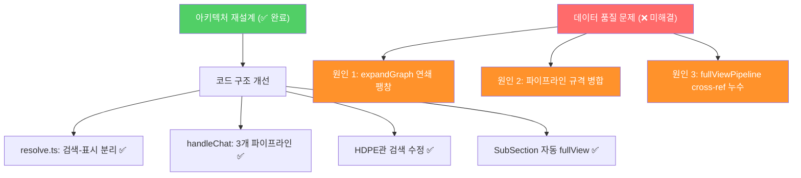

# 아키텍처 재설계 후에도 데이터가 안 나오는 근본 원인 분석

> **결론:** 코드 구조 리팩토링(resolve.ts 분리, handleChat 파이프라인화)은 **정상 완료**되었으나, 데이터 품질 문제는 **코드 구조가 아닌 3개의 독립적 원인**에 의해 발생합니다.

---

## 핵심 요약: 무엇이 잘못되고 있는가



---

## 원인 1: `expandGraph`의 연쇄 팽창 (entities 20건, relations 1059건)

### 문제

`"보일러"` 검색 시 `searchPipeline` → `answerPipeline`으로 진입하면, 검색된 **각 entity마다** `expandGraph`가 호출됩니다.

```
searchPipeline → targetSearch → entities 20건
                                 ↓
answerPipeline → expandGraph × 20 = relations 1059건
```

### 팽창 메커니즘 (graph.ts L34-134)

```typescript
// expandGraph 내부의 expandSectionWorkTypes 함수
async function expandSectionWorkTypes(sourceSection: string): Promise<void> {
    // 1. 해당 section의 WorkType 최대 30건 조회
    const workTypes = await supabase.from("graph_entities")
        .eq("source_section", sourceSection)
        .eq("type", "WorkType")
        .limit(30);
    
    // 2. 각 WorkType마다 get_related_resources RPC 호출 (30건 × N)
    for (const wt of workTypes) {
        const wtRels = await supabase.rpc("get_related_resources", { p_entity_id: wt.id });
        allRelations = allRelations.concat(relevantRels);
        
        // 3. REQUIRES_LABOR가 없으면 unit_costs까지 fallback 조회
        if (!hasLaborRel) {
            await supabase.from("unit_costs").ilike("content", `%${wt.name}%`).limit(1);
        }
    }
}
```

**수치 예시** ("보일러" 검색):

| 단계 | 수량 | 누적 DB 쿼리 |
|------|------|-------------|
| targetSearch entities | 20건 | 1 |
| expandGraph × 20 (1-hop) | 20 RPC | 21 |
| expandSectionWorkTypes × 20 (section 확장) | 20 × 30 = 600 WT | 621 |
| 각 WT의 get_related_resources RPC | 600 RPC | **1,221** |
| unit_costs fallback | ~100 추가 | **~1,321** |

> [!CAUTION]
> **"보일러"는 보일러 드럼(13-5-2), 보일러 급수펌프(13-4-2), 보일러 부속기기(13-5-1) 등 여러 section에 걸쳐 있어, section 확장이 연쇄적으로 발생합니다.**

### 근본 원인

`expandGraph`의 `expandSectionWorkTypes`는 **모든 entity에 대해 무조건 동일 section 전체를 확장**합니다. `skipSectionExpansion=false`가 기본값이므로, `searchPipeline` → `answerPipeline` 경로에서 **20개 entity × 30 WT/section = 600건**의 관계가 팽창합니다.

---

## 원인 2: 파이프라인의 규격별 데이터 병합 붕괴 (PE관 1건 문제)

### 문제

PE관처럼 **동일 공종명 + 15가지 규격**(63~400mm)이 존재하는 데이터에서, 최종 DB에 **1건만 저장**됩니다.

### 병합 연쇄 (4중 붕괴)

| 단계 | 위치 | 키 생성 방식 | 결과 |
|------|------|------------|------|
| 1차 | `step3_relation_builder.py` `_entity_key` | `type::name` (spec 미포함) | 15개 → **1개** |
| 2차 | `step4_normalizer.py` Phase E `dedup_key` | spec 미포함 | 15건 → **1건** |
| 3차 | `step4_normalizer.py` Phase F `id_map` | `(type, name)` → 마지막 ID 덮어쓰기 | 15개 ID → **1개** |
| 4차 | `step4_normalizer.py` 글로벌 dedup | 동일 `entity_id`로 최종 삭제 | **1건만 생존** |

> [!IMPORTANT]
> 이 문제는 `20260219_PE관_데이터집계_파이프라인_수정_검토보고서.md`에서 **정확히 진단**되어 있으나, **상태: 구현 대기**입니다. 아직 코드에 적용되지 않았습니다.

---

## 원인 3: `fullViewPipeline`의 cross-reference 누수

### 문제

`fullViewPipeline`(index.ts L486-514)에서 **동일 title의 다른 section**에서 WorkType을 가져오는 cross-reference 로직이 있습니다.

```typescript
// 3-2: cross-reference (동일 title의 다른 section)
const { data: siblings } = await supabase
    .from("graph_chunks")
    .select("section_id")
    .eq("title", chunk.title);  // ← title이 같으면 무조건 가져옴
```

이 시 `chunk.title`이 "보일러 부속기기 설치"처럼 **범용적인 이름**일 경우, 의도하지 않은 section의 WorkType까지 끌고 옵니다. 이전에 수정한 13-5-2/13-5-3 데이터 오염도 이 패턴과 관련됩니다.

---

## 왜 아키텍처 재설계만으로는 부족한가

아키텍처 재설계가 해결한 문제:

| 해결됨 ✅ | 설명 |
|-----------|------|
| 분기 파편화 | 6개 분기 → `resolveSection` 1개 함수로 통합 |
| 검색-표시 결합 | `resolveSection` + `presentClarify` 분리 |
| handleChat 비대 | 590줄 → 160줄 (3개 파이프라인 추출) |
| sub_section drill-down 누락 | `isSubSection` 자동 감지 |
| HDPE 검색 누락 | OR 검색 + 영문 필터 |

아키텍처 재설계가 **해결하지 못한** 문제:

| 미해결 ❌ | 설명 | 원인 위치 |
|-----------|------|-----------|
| 연쇄 팽창 (entities 20, relations 1059) | `expandGraph`의 무조건적 section 확장 | `graph.ts` |
| PE관 1건 병합 | 파이프라인 `_entity_key` + `dedup_key`에 spec 미포함 | `step3`, `step4` |
| cross-ref 누수 | 동일 title 기반 무조건 확장 | `index.ts` fullViewPipeline |

> **핵심:** 아키텍처 재설계는 **코드 구조의 유지보수성과 확장성**을 개선한 것이지, **검색/확장/데이터 정합성** 문제를 해결하는 것이 아닙니다. 이 3가지는 별도의 수정이 필요합니다.

---

## 수정 방향 제안

### 1. `expandGraph` 팽창 제어 (graph.ts)

```
현재: entity마다 expandSectionWorkTypes → 전체 section WT 조회 (무제한)
제안: 
  - searchPipeline에서 answerPipeline 호출 시 skipSiblings=true 적용
  - 또는 expandSectionWorkTypes에 "동일 source_section 중복 방지" 추가
  - 또는 entities 수를 상위 5건으로 제한 후 expandGraph 호출
```

### 2. 파이프라인 규격 병합 수정 (step3, step4)

```
상태: 검토 완료, 구현 대기 (20260219 PE관 보고서)
수정 범위: 7곳 (_entity_key, _rel_key, generate_belongs_to, phase_e, phase_f, get_eid, main)
→ 재추출 파이프라인 실행 필요
```

### 3. cross-reference 범위 제한 (index.ts fullViewPipeline)

```
현재: chunk.title이 같으면 무조건 sibling 가져옴
제안: chunk.department + chunk.chapter도 일치하는 경우만 cross-ref
```
