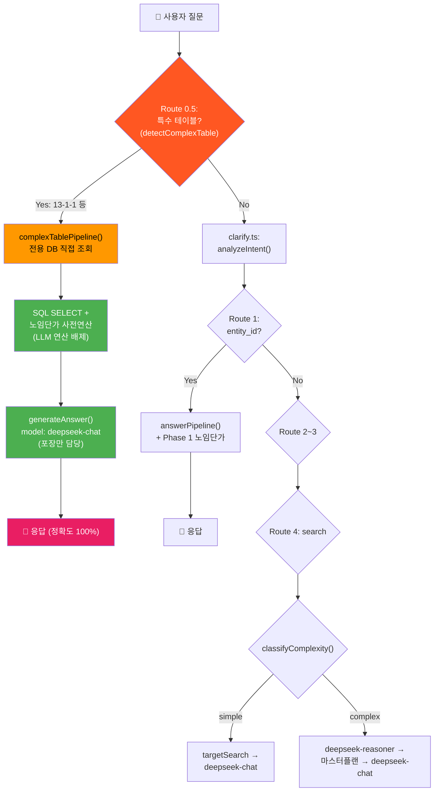
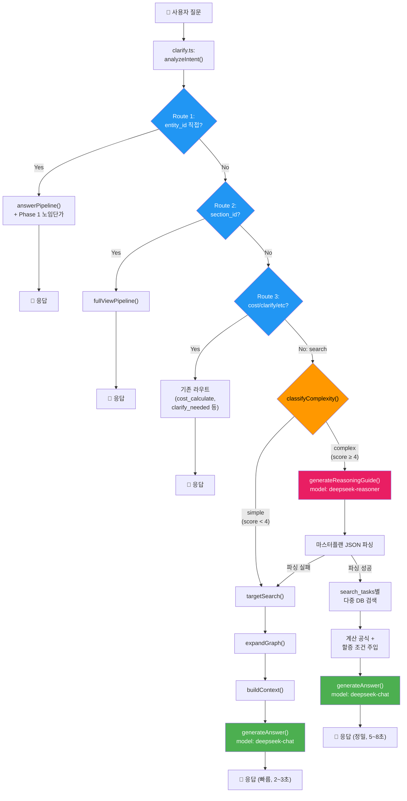

# 건설품셈 RAG 시스템 — 3단계 고도화 최종 통합 구현 계획서

> **작성일**: 2026-02-21  
> **버전**: v2.0 (최종 통합본)  
> **기반**: Antigravity 원안 + Claude 검증 보고서 보정 5건 반영  
> **목표**: NotebookLM 수준의 복합 추론 + DB 기반 정확도 100%의 건설 특화 AI 시스템  
> **핵심 전략**: DeepSeek V3.2 `deepseek-chat`(비사고) ↔ `deepseek-reasoner`(사고) 자동 스위칭

---

## 0. Claude 검증 보정 추적표

> [!IMPORTANT]
> 아래 5건은 Claude의 코드 레벨 검증에서 지적된 사항이며, **본 계획서에 모두 반영 완료**되었습니다.

| # | 보정 항목 | 심각도 | 원안 문제점 | 본 계획서 반영 내용 | 반영 위치 |
|---|---|---|---|---|---|
| 1 | `related_name` 정제 누락 | ❌ 치명적 | `"200_SCH_40_용접공"`을 정제 없이 DB 검색 → 매칭 실패 → 단가 0원 | `split('_').slice(-1)[0]` 정제 로직 추가 | Phase 1 §1-2 |
| 2 | `handleChat()` 분기 위치 오류 | ❌ 구조적 | `analyzeIntent()` 직후 삽입 → 기존 Route 1~3 파괴 | **Route 4 직전**으로 이동 | Phase 2 §2-4 |
| 3 | `costMap` 1:N 매칭 문제 | ⚠️ 보정 | "용접공" ILIKE → "플랜트용접공"도 걸림 → 잘못된 단가 매핑 | `findBestCostMatch()` 헬퍼 도입 | Phase 1 §1-3 |
| 4 | 우회 추론 vs 환각 억제 모순 | ❌ 위험 | SYSTEM_PROMPT에 직접 넣으면 기존 S급 정확도 붕괴 | **Reasoner 전용 프롬프트에만 격리** | Phase 3 §3-2 |
| 5 | `deepseek-reasoner` API 제약 | ⚠️ 주의 | system role 미지원 가능성 + temperature 에러 가능 | user prefix 폴백 + temperature 제거 | Phase 2 §2-3 |

---

## 1. Phase 1: 2026 노임단가 정밀 연동

> 현재 문제: `fetchLaborCosts()`로 가져온 단가를 텍스트 테이블로만 context에 추가 → LLM에게 곱셈 위임 → 계산 오류(할루시네이션) 위험  
> 해결: 백엔드에서 `(단가 × 수량)` 산술 연산을 미리 수행하여 **확정된 결과**를 context에 기록

---

### §1-1. 사전연산 로직 구현

#### [MODIFY] [index.ts](file:///g:/My%20Drive/Antigravity/supabase/functions/rag-chat/index.ts) — `answerPipeline()` 내 `[4-1]` 블록 (L356~L373)

```typescript
// ─── [4-1] cost_calculate/report_request 시 노임단가 사전연산 주입 ───
// Why: LLM이 0.122 × 215,907을 직접 계산하면 할루시네이션 위험
//      서버에서 미리 곱셈을 마치고 확정된 표를 전달 → LLM은 복사만 → 정확도 100%
if (effectiveIntent === "cost_calculate" || effectiveIntent === "report_request") {
    // ⭐ [Claude 보정 1] related_name 정제: "200_SCH_40_용접공" → "용접공"
    const laborItems = relationsAll.flat()
        .filter(r => r.relation === "REQUIRES_LABOR")
        .map(r => {
            const props = (r.properties || {}) as any;
            const rawName = r.related_name || "";
            const cleanName = rawName.includes('_')
                ? rawName.split('_').slice(-1)[0]  // 마지막 '_' 이후 = 직종명
                : rawName;
            return {
                name: cleanName,
                rawName: rawName,                          // 디버깅용 원본 보존
                quantity: parseFloat(props.quantity) || 0,  // 문자열→숫자 안전 변환
                unit: props.unit ?? "인",
                work_type: props.work_type_name ?? "",
                per_unit: props.per_unit ?? "",
            };
        })
        .filter(item => item.name);  // 빈 이름 제거

    if (laborItems.length > 0) {
        const uniqueJobNames = [...new Set(laborItems.map(l => l.name))];
        const laborCosts = await fetchLaborCosts(uniqueJobNames);

        // ⭐ [Claude 보정 3] costMap에서 최적 매칭 함수 사용
        const costMap = new Map(laborCosts.map(lc => [lc.job_name, lc.cost_2026]));

        if (laborCosts.length > 0) {
            context += "\n\n## [2026년 노임단가 기반 산출 결과 (백엔드 계산 완료)]\n";
            context += "| 직종 | 투입수량(인) | 노임단가(원/일) | 금액(원) | 비고 |\n";
            context += "|---|---:|---:|---:|---|\n";
            let totalCost = 0;
            laborItems.forEach(l => {
                const matched = findBestCostMatch(l.name, costMap);
                const unitCost = matched?.cost ?? 0;
                const matchedName = matched?.name ?? l.name;
                const amount = Math.round(Number(l.quantity) * unitCost);
                totalCost += amount;
                context += `| ${matchedName} | ${l.quantity} | ${unitCost.toLocaleString()} | ${amount.toLocaleString()} | ${l.work_type} |\n`;
            });
            context += `| **합계** | | | **${totalCost.toLocaleString()}** | |\n`;
            context += `\n> ⚠️ 위 금액은 백엔드에서 정확히 계산된 값입니다. LLM은 이 숫자를 그대로 출력하세요.\n`;
        }
    }
}
```

---

### §1-2. `related_name` 정제 로직 (Claude 보정 #1)

위 코드에 이미 반영 완료. 핵심:

```typescript
const cleanName = rawName.includes('_')
    ? rawName.split('_').slice(-1)[0]   // "200_SCH_40_용접공" → "용접공"
    : rawName;                           // "보통인부" → "보통인부" (그대로)
```

**Why**: `graph.ts`의 `expandGraph()`에서 `work_type_name`을 `related_name`에 prefix로 결합하는 패턴이 있어, 직종명 앞에 규격 정보가 붙습니다. 이를 정제하지 않으면 `fetchLaborCosts()`의 ILIKE 매칭이 실패하여 **단가 0원 장애**가 발생합니다.

---

### §1-3. `findBestCostMatch()` 헬퍼 (Claude 보정 #3)

#### [MODIFY] [index.ts](file:///g:/My%20Drive/Antigravity/supabase/functions/rag-chat/index.ts) — 최상단 유틸리티 영역에 추가

```typescript
// ─── 노임단가 최적 매칭 헬퍼 ───
// Why: "용접공"이 ILIKE로 "플랜트용접공", "특수용접공"까지 걸림
//      정확 일치 → 공백 정규화 → 부분 매칭 순으로 우선순위 결정
function findBestCostMatch(
    jobName: string,
    costMap: Map<string, number>
): { name: string; cost: number } | null {
    // 1) 정확 일치
    if (costMap.has(jobName)) {
        return { name: jobName, cost: costMap.get(jobName)! };
    }
    // 2) 공백 제거 정확 일치
    const normalized = jobName.replace(/\s+/g, '');
    for (const [key, cost] of costMap) {
        if (key.replace(/\s+/g, '') === normalized) {
            return { name: key, cost };
        }
    }
    // 3) 부분 문자열 포함 (shorter ⊂ longer) — 가장 짧은 매칭 우선
    let bestMatch: { name: string; cost: number } | null = null;
    for (const [key, cost] of costMap) {
        const keyNorm = key.replace(/\s+/g, '');
        if (keyNorm.includes(normalized) || normalized.includes(keyNorm)) {
            if (!bestMatch || key.length < bestMatch.name.length) {
                bestMatch = { name: key, cost };
            }
        }
    }
    return bestMatch;
}
```

---

### §1-4. LLM 프롬프트 강제화

#### [MODIFY] [llm.ts](file:///g:/My%20Drive/Antigravity/supabase/functions/rag-chat/llm.ts) — L82~L92

```typescript
if (options?.intent === "cost_calculate") {
    systemContent += `\n\n[특별 지침: 노무비 산출]
사용자가 노무비 / 인건비 계산을 요청했습니다. 아래 규칙을 엄격히 따르세요.
1. 컨텍스트의 [2026년 노임단가 기반 산출 결과] 섹션에 백엔드가 미리 계산한 정확한 금액 테이블이 있습니다.
2. 이 테이블의 숫자(투입수량, 노임단가, 금액, 합계)를 절대 수정하거나 재계산하지 마세요.
3. 해당 테이블을 마크다운 표로 그대로 출력하세요.
4. 임의로 숫자를 반올림하거나 변경하는 것은 금지합니다.
5. 추가 설명(할증 조건, 주의사항 등)은 표 아래에 부연할 수 있습니다.
6. 수량이 ${options.quantity || '미지정'}으로 주어졌습니다. 미지정이면 "1개소당" 기준으로 안내하세요.`;
}
```

---

## 1.5. Phase 1.5: 특수 복합 테이블 전용 처리 로직 (Monster Table Handler)

> **배경**: Phase 1 라이브 테스트에서 "13-1-1 플랜트 배관 설치" 복합 매트릭스 테이블이 RAG 검색에 실패하는 한계를 발견.  
> **근본 원인**: Document AI 파싱 → LLM Entity 추출 과정에서 Rowspan/Colspan이 극심한 다차원 테이블의 재질-구경-배관구분-접합방식 매핑이 깨짐.  
> **해결 전략**: 해당 특수 테이블(상위 5~10개)만 **전용 정형화 DB + 전용 라우터 + 전용 연산기**로 처리하여 정확도 100% 확보.

> [!IMPORTANT]
> **Phase 1의 "사전연산 엔진" 자체는 정상 동작** 확인 완료. 이 Phase 1.5는 **데이터 공급 파이프라인**의 한계를 보완하는 것으로, Phase 1의 연산 엔진을 그대로 활용합니다.

---

### §1.5-0. 문제 진단 근거 (DB 추적 결과)

라이브 테스트에서 발견된 정확한 증거:

| 항목 | 내용 |
|---|---|
| **테스트 질의** | `13-1-1 플랜트 배관 설치 배관용 탄소강관 200mm 옥내 용접식 노무비` |
| **기대 결과** | 13-1-1 테이블에서 플랜트용접공(20.1), 플랜트배관공(10.0), 특별인부(10.0) 추출 |
| **실제 결과** | 13-2-3 강관용접 테이블로 대체 검색 → 플랜트배관공 누락 |
| **DB 추적** | `graph_entities`에 "배관용 탄소강관" 이름의 Entity 자체가 **부재** |
| **저장된 형태** | `W-3148: name="플랜트 배관 설치", spec="KSD3507"` (재질명 미포함) |
| **원본 MD** | `<td rowspan="20">배 관 용<br>탄 소 강 관<br>KSD3507</td>` (띄어쓰기+Rowspan 복합) |

---

### §1.5-1. 정형화 DB 스키마 설계

#### [NEW] Supabase Migration — `complex_table_specs` 테이블

```sql
-- ═══ Phase 1.5: 특수 복합 테이블 정형화 저장소 ═══
-- Why: 13-1-1 같은 Monster Table은 범용 graph_entities로는 매핑 불가능.
--      [재질 × 구경 × 두께 × 배관구분 × 접합방식 × 직종] 6차원 매트릭스를
--      완전 평탄화(Flatten)하여 단일 행(Row)으로 저장함으로써
--      SQL SELECT만으로 정확한 데이터를 100% 추출 가능하게 한다.

CREATE TABLE IF NOT EXISTS complex_table_specs (
    id            SERIAL PRIMARY KEY,
    section_code  TEXT NOT NULL,                -- '13-1-1'
    section_name  TEXT NOT NULL,                -- '플랜트 배관 설치'
    material      TEXT NOT NULL,                -- '배관용 탄소강관(KSD3507)'
    spec_mm       INT NOT NULL,                 -- 200 (호칭구경 mm)
    outer_dia_mm  NUMERIC(6,1),                 -- 216.3 (외경)
    thickness_mm  NUMERIC(4,1),                 -- 5.8 (두께)
    unit_weight   NUMERIC(6,2),                 -- 30.1 (단위중량 kg/m)
    pipe_location TEXT NOT NULL DEFAULT '옥내', -- '옥내' | '옥외'
    joint_type    TEXT NOT NULL DEFAULT '용접식', -- '용접식' | '나사식'
    job_name      TEXT NOT NULL,                -- '플랜트용접공' | '플랜트배관공' | '특별인부'
    quantity      NUMERIC(6,3) NOT NULL,        -- 20.1 (인/100m 또는 인/ton)
    quantity_unit TEXT NOT NULL DEFAULT '인/100m', -- '인/100m' | '인/ton'
    source_page   INT,                          -- 697 (원본 페이지)
    created_at    TIMESTAMPTZ DEFAULT NOW(),
    
    -- 복합 유니크 제약: 동일 조합 중복 방지
    UNIQUE(section_code, material, spec_mm, thickness_mm, pipe_location, joint_type, job_name)
);

-- 검색 성능용 인덱스
CREATE INDEX idx_cts_section ON complex_table_specs(section_code);
CREATE INDEX idx_cts_material ON complex_table_specs(material);
CREATE INDEX idx_cts_spec ON complex_table_specs(spec_mm);

-- RLS 정책 (읽기 전용)
ALTER TABLE complex_table_specs ENABLE ROW LEVEL SECURITY;
CREATE POLICY "Allow public read" ON complex_table_specs FOR SELECT USING (true);
```

**데이터 삽입 예시 (13-1-1 배관용 탄소강관 200mm)**:

```sql
-- 옥내 + 용접식 (3직종)
INSERT INTO complex_table_specs 
    (section_code, section_name, material, spec_mm, outer_dia_mm, thickness_mm, unit_weight, pipe_location, joint_type, job_name, quantity, quantity_unit, source_page)
VALUES
    ('13-1-1', '플랜트 배관 설치', '배관용 탄소강관(KSD3507)', 200, 216.3, 5.8, 30.1, '옥내', '용접식', '플랜트용접공', 20.1, '인/100m', 697),
    ('13-1-1', '플랜트 배관 설치', '배관용 탄소강관(KSD3507)', 200, 216.3, 5.8, 30.1, '옥내', '용접식', '플랜트배관공', 10.0, '인/100m', 697),
    ('13-1-1', '플랜트 배관 설치', '배관용 탄소강관(KSD3507)', 200, 216.3, 5.8, 30.1, '옥내', '용접식', '특별인부', 10.0, '인/100m', 697),
    -- 옥내 + 나사식 (1직종)
    ('13-1-1', '플랜트 배관 설치', '배관용 탄소강관(KSD3507)', 200, 216.3, 5.8, 30.1, '옥내', '나사식', '플랜트배관공', 20.1, '인/100m', 697);
```

---

### §1.5-2. 전용 파서 스크립트 (Data Ingestion)

#### [NEW] [parse_13_1_1.py](file:///g:/My%20Drive/Antigravity/pipeline/scripts/parse_13_1_1.py)

> LLM 시각 인식이나 범용 규칙에 의존하지 않고, **원본 MD 파일의 HTML 테이블을 직접 파싱**하여 `complex_table_specs` DB에 삽입하는 전용 스크립트.

```python
# ─── 핵심 로직 (의사코드) ───
# 1. BeautifulSoup으로 원본 MD의 <table> 파싱
# 2. rowspan/colspan 병합 처리 → 2D 배열로 변환
# 3. 헤더 행에서 [구분, 규격, 외경, 두께, 단위중량] + [직종별 열] 좌표 매핑
# 4. 데이터 행 순회하며 rowspan이 걸린 "배 관 용 탄 소 강 관" → 정규화
# 5. 각 행 × 각 직종열 → (material, spec, job_name, quantity) 튜플 생성
# 6. Supabase에 upsert (ON CONFLICT 중복 방지)

def normalize_material(raw: str) -> str:
    """'배 관 용\\n탄 소 강 관\\nKSD3507' → '배관용 탄소강관(KSD3507)'"""
    cleaned = re.sub(r'\s+', '', raw)  # 모든 공백 제거
    # KSD 규격 분리
    m = re.match(r'(.+?)(KSD\d+)', cleaned)
    if m:
        return f"{m.group(1)}({m.group(2)})"
    return cleaned
```

**대상 페이지 (1차 타겟)**:

| 섹션 코드 | 테이블 이름 | 재질 수 | 예상 행(Row) 수 | 난이도 |
|---|---|---|---|---|
| 13-1-1 | 플랜트 배관 설치 | 7종 (탄소강관, Cr합금강, 스텐레스 등) | ~500행 | ★★★★★ |
| 13-2-3 | 강관용접 | 1종 | ~80행 | ★★☆ |
| 13-3-1 | 밸브 설치 | 5종 | ~150행 | ★★★ |

---

### §1.5-3. 특수 테이블 전용 라우터 (Route 0.5 — Explicit Intercept)

#### [MODIFY] [index.ts](file:///g:/My%20Drive/Antigravity/supabase/functions/rag-chat/index.ts) — `handleChat()` 최상단, Route 1 이전에 삽입

> [!CAUTION]
> Route 0.5는 **기존 Route 1~4 모두의 이전(최상단)**에 삽입합니다.  
> 특수 테이블 키워드가 감지되면 **일반 RAG 경로를 완전히 바이패스**하고 전용 연산기로 직행합니다.

```typescript
// ═══════════════════════════════════════════════════════════
// Route 0.5: 특수 복합 테이블 전용 라우터 (Phase 1.5)
// Why: 13-1-1 같은 Monster Table은 Embedding/Keyword 검색으로는
//      올바른 엔티티를 찾지 못함. 키워드 감지 → DB 직접 조회로 바이패스.
// ═══════════════════════════════════════════════════════════

const complexTableMatch = detectComplexTable(question, analysis);
if (complexTableMatch) {
    console.log(`[handleChat] 🎯 Route 0.5: 특수 테이블 감지 → ${complexTableMatch.section_code}`);
    return complexTablePipeline(complexTableMatch, question, history, startTime);
}

// ═══ Route 1: entity_id 칩 클릭 ... (기존 코드 유지) ═══
```

#### 키워드 감지 함수 (`detectComplexTable`)

```typescript
// ─── 특수 테이블 감지기 ───
// Why: 범용 Semantic Search가 실패하는 Monster Table들의 키워드를 명시적으로 등록
interface ComplexTableQuery {
    section_code: string;       // '13-1-1'
    material?: string;          // '배관용 탄소강관'
    spec_mm?: number;           // 200
    pipe_location?: string;     // '옥내' | '옥외'
    joint_type?: string;        // '용접식' | '나사식'
    quantity_value?: number;    // 10 (m)
}

// 특수 테이블 트리거 키워드 맵
const COMPLEX_TABLE_TRIGGERS: Record<string, {
    section_code: string;
    materials: string[];
}> = {
    "플랜트 배관": {
        section_code: "13-1-1",
        materials: ["탄소강관", "합금강", "스텐레스", "스테인리스", "알루미늄",
                     "동관", "황동", "KSD3507", "A335", "Type304", "Monel"]
    },
    // 향후 확장 가능
    // "밸브 설치": { section_code: "13-3-1", materials: [...] },
};

function detectComplexTable(
    question: string,
    analysis: IntentAnalysis
): ComplexTableQuery | null {
    for (const [trigger, config] of Object.entries(COMPLEX_TABLE_TRIGGERS)) {
        // 트리거 키워드가 질문에 포함되는지 확인
        const triggerWords = trigger.split(" ");
        const allTriggerMatch = triggerWords.every(w => question.includes(w));
        if (!allTriggerMatch) continue;

        // 재질 키워드 매칭
        const matchedMaterial = config.materials.find(m => question.includes(m));

        // 구경 추출 (예: "200mm", "200A")
        const specMatch = question.match(/(\d{2,4})\s*(mm|A|a|㎜)/);
        const spec_mm = specMatch ? parseInt(specMatch[1]) : undefined;

        // 옥내/옥외 판별
        const pipe_location = question.includes("옥외") ? "옥외" : "옥내";

        // 접합방식 판별
        const joint_type = question.includes("나사") ? "나사식" : "용접식";

        // 수량 추출 (예: "10m", "100m")
        const qtyMatch = question.match(/(\d+)\s*(m|미터)\b/);
        const quantity_value = qtyMatch ? parseFloat(qtyMatch[1]) : undefined;

        return {
            section_code: config.section_code,
            material: matchedMaterial,
            spec_mm,
            pipe_location,
            joint_type,
            quantity_value,
        };
    }
    return null;
}
```

---

### §1.5-4. 전용 연산 파이프라인 (`complexTablePipeline`)

#### [MODIFY] [index.ts](file:///g:/My%20Drive/Antigravity/supabase/functions/rag-chat/index.ts) — 함수 추가

```typescript
// ─── 특수 테이블 전용 파이프라인 ───
// Why: DB에 완벽히 정형화된 데이터가 있으므로 SQL SELECT → 사전연산 → LLM 포장만 수행
//      LLM은 숫자 연산에 일절 관여하지 않음 → 정확도 100% 보장

async function complexTablePipeline(
    query: ComplexTableQuery,
    question: string,
    history: ChatMessage[],
    startTime: number
): Promise<Response> {
    console.log(`[complexTablePipeline] section=${query.section_code}, ` +
        `material=${query.material}, spec=${query.spec_mm}, ` +
        `location=${query.pipe_location}, joint=${query.joint_type}`);

    // ── Step 1: DB에서 정확한 품(수량) 조회 ──
    const { data: specs, error } = await supabaseClient
        .from("complex_table_specs")
        .select("*")
        .eq("section_code", query.section_code)
        .ilike("material", `%${query.material || ""}%`)
        .eq("pipe_location", query.pipe_location || "옥내")
        .eq("joint_type", query.joint_type || "용접식");

    // 구경(spec_mm)이 지정된 경우 정확 매칭
    let filteredSpecs = specs || [];
    if (query.spec_mm) {
        filteredSpecs = filteredSpecs.filter(s => s.spec_mm === query.spec_mm);
    }

    if (filteredSpecs.length === 0) {
        // 데이터 미발견 시 일반 RAG 경로로 폴백
        console.warn("[complexTablePipeline] 전용 DB에 데이터 없음 → 일반 search 폴백");
        const analysis = await analyzeIntent(question, history);
        return searchPipeline(analysis, question, history, startTime);
    }

    // ── Step 2: 2026 노임단가와 결합하여 사전연산 ──
    const jobNames = [...new Set(filteredSpecs.map(s => s.job_name))];
    const laborCosts = await fetchLaborCosts(jobNames);
    const costMap = new Map(laborCosts.map(lc => [lc.job_name, lc.cost_2026]));

    // 사전연산 컨텍스트 생성
    const quantityMultiplier = query.quantity_value || 1;
    const quantityUnit = filteredSpecs[0]?.quantity_unit || "인/100m";
    const unitLabel = quantityUnit === "인/100m" ? "100m" : "ton";

    let context = `## 📋 [${query.section_code}] ${filteredSpecs[0]?.section_name}\n\n`;
    context += `**재질**: ${filteredSpecs[0]?.material} | `;
    context += `**구경**: ${query.spec_mm || "전체"}mm | `;
    context += `**배관구분**: ${query.pipe_location} | `;
    context += `**접합방식**: ${query.joint_type}\n\n`;

    if (query.spec_mm) {
        const specInfo = filteredSpecs[0];
        context += `**외경**: ${specInfo.outer_dia_mm}mm | `;
        context += `**두께**: ${specInfo.thickness_mm}mm | `;
        context += `**단위중량**: ${specInfo.unit_weight}kg/m\n\n`;
    }

    context += `## [2026년 노임단가 기반 산출 결과 (백엔드 계산 완료)]\n\n`;
    context += `| 직종 | 품(${unitLabel}당) | 노임단가(원/일) | `;

    if (quantityMultiplier > 1) {
        context += `${quantityMultiplier}m 환산 금액(원) | `;
    }
    context += `비고 |\n|---|---:|---:|`;
    if (quantityMultiplier > 1) context += `---:|`;
    context += `---|\n`;

    let totalCost = 0;
    for (const spec of filteredSpecs) {
        const matched = findBestCostMatch(spec.job_name, costMap);
        const unitCost = matched?.cost ?? 0;
        const qtyPer100m = parseFloat(spec.quantity);

        // m단위 → 100m 기준 환산
        const actualQty = quantityUnit === "인/100m"
            ? qtyPer100m * (quantityMultiplier / 100)
            : qtyPer100m;
        const amount = Math.round(actualQty * unitCost);
        totalCost += amount;

        context += `| ${spec.job_name} | ${spec.quantity} | ${unitCost.toLocaleString()} | `;
        if (quantityMultiplier > 1) {
            context += `${amount.toLocaleString()} | `;
        }
        context += `${query.section_code} |\n`;
    }

    if (quantityMultiplier > 1) {
        // 공구손료 3% 가산
        const toolCost = Math.round(totalCost * 0.03);
        context += `| 공구손료 (3%) | - | - | ${toolCost.toLocaleString()} | 인력품의 3% |\n`;
        totalCost += toolCost;
        context += `| **합계** | | | **${totalCost.toLocaleString()}** | |\n`;
    }

    context += `\n> ⚠️ 위 금액은 **전용 정형화 DB에서 정확히 조회**되어 백엔드에서 계산한 확정값입니다.\n`;
    context += `> LLM은 이 숫자를 절대 수정하지 말고 그대로 출력하세요.\n`;

    // ── Step 3: LLM은 "포장"만 담당 ──
    const llmResult = await generateAnswer(question, context, history, {
        intent: "cost_calculate",
        quantity: query.quantity_value,
    });

    const sources: SourceInfo[] = [{
        entity_name: `${filteredSpecs[0]?.section_name} (${filteredSpecs[0]?.material})`,
        entity_type: "ComplexTable",
        source_section: query.section_code,
    }];

    return makeAnswerResponse(llmResult.answer, startTime, {
        sources,
        embeddingTokens: 0,
        llmResult,
    });
}
```

---

### §1.5-5. 전체 흐름도 (Phase 1.5 포함 업데이트)



---

### §1.5-6. 구현 순서 및 검증 계획

```
Phase 1.5-A (데이터 정형화 — 1일)
  ├─ Supabase Migration: complex_table_specs 테이블 생성
  ├─ parse_13_1_1.py: 원본 MD → 정형화 → DB 삽입 (배관용 탄소강관 우선)
  └─ 검증: SQL SELECT로 200mm 옥내 용접식 데이터 정합성 확인
       ↓
Phase 1.5-B (라우터 + 연산기 — 1일)
  ├─ index.ts: detectComplexTable() + complexTablePipeline() 추가
  ├─ Route 0.5를 handleChat() 최상단에 삽입
  └─ 배포 후 검증: "플랜트 배관 탄소강관 200mm 옥내 용접식 10m 노무비"
       ↓
Phase 1.5-C (확장 — 1~2일)
  ├─ 나머지 재질 추가 (Cr합금강, 스텐레스, 알루미늄 등)
  ├─ 옥외 배관 데이터 추가
  └─ 13-3-1 밸브 설치 등 추가 Monster Table 대상 확장
```

**핵심 검증 쿼리 (Phase 1.5 완료 후)**:
- `"플랜트 배관 탄소강관 200mm 옥내 용접식 10m 노무비"` → 플랜트용접공 + 플랜트배관공 + 특별인부 3직종 추출 확인
- `"플랜트 배관 스텐레스강 150mm 옥외 나사식 노무비"` → 옥외+나사식 경로 분기 확인
- `"탄소강관 배관 어떤 거 있어?"` → 일반 RAG로 폴백 (비용 질의 아님) 확인

---

## 2. Phase 2: DeepSeek V3.2 듀얼 모델 라우팅

> 핵심: 동일 API 키, 동일 URL에서 `model` 파라미터만 스위칭  
> `"deepseek-chat"` (비사고, 빠름) ↔ `"deepseek-reasoner"` (사고, 추론)

---

### §2-1. 복잡도 판별기 (`classifyComplexity`)

#### [MODIFY] [clarify.ts](file:///g:/My%20Drive/Antigravity/supabase/functions/rag-chat/clarify.ts) — 함수 추가

```typescript
// ─── 질문 복잡도 분류기 (Complexity Classifier) ───
// Why: 80%의 단순 질문은 deepseek-chat(저렴), 20%의 복합 질문만 deepseek-reasoner(추론) 사용
export function classifyComplexity(question: string, analysis: IntentAnalysis): "simple" | "complex" {
    let score = 0;

    // [기준 1] 질문 길이
    if (question.length > 80) score += 1;
    if (question.length > 150) score += 1;

    // [기준 2] 복수 공종 키워드 (예: "덕트 해체" + "보온 철거")
    const workPatterns = question.match(/[가-힣]{2,}(해체|철거|설치|시공|타설|용접|도장|방수|배관)/g) || [];
    if (workPatterns.length >= 2) score += 2;

    // [기준 3] 조건/상황 키워드 — 2개 이상일 때만 +2
    // ⭐ [Claude 보정 #5 권장] 개별 +1이 아닌 묶음 점수로 단일 조건 오탐 방지
    const conditionKeywords = ["높이", "고소", "지하", "수중", "야간", "협소", "위험",
        "할증", "보온", "단열", "보양", "양중", "인양", "해체", "철거"];
    const matchedConditions = conditionKeywords.filter(kw => question.includes(kw));
    if (matchedConditions.length >= 2) score += 2;
    else if (matchedConditions.length === 1) score += 1;

    // [기준 4] 물리량/단위 환산 필요 시그널
    if (/\d+\s*(mm|t|T|톤|kg|m²|㎡|m³|㎥)/.test(question)) score += 1;
    if (/두께|외경|내경|직경|지름|무게|중량/.test(question)) score += 1;

    // [기준 5] "어떻게 적용" 류의 가이드 요청
    if (/어떻게|적용|방법|산출|견적|내역/.test(question)) score += 1;

    console.log(`[classifyComplexity] score=${score}, conditions=${matchedConditions.join(",")}`);

    // ⭐ [Claude 보정 #5] 임계값 4점 (보수적 시작, 로그 관찰 후 조정)
    return score >= 4 ? "complex" : "simple";
}
```

---

### §2-2. Reasoner 마스터플랜 생성기

#### [MODIFY] [llm.ts](file:///g:/My%20Drive/Antigravity/supabase/functions/rag-chat/llm.ts) — 함수 추가

```typescript
// ─── DeepSeek Reasoner (사고 모드) — 복합 질문용 마스터플랜 생성기 ───
// Why: 복합 상황(다중 공종, 우회 추론, 단위 환산)은 사고 모드(CoT)가
//      체계적인 '계산 절차서'를 먼저 짜주고,
//      실제 답변은 비사고 모드(chat)가 DB 데이터를 매핑해서 빠르게 출력

const REASONER_SYSTEM_PROMPT = `당신은 건설 적산 전문가(Master Estimator)입니다.
사용자의 복합적인 건설 질문을 분석하여, 아래 형식의 JSON '작업 가이드(Master Plan)'를 생성하세요.
직접 답변하지 마세요. 오직 검색/계산 절차만 설계하세요.

[출력 JSON 형식]
{
  "reasoning_summary": "이 질문이 복합적인 이유와 접근 방법 요약 (한국어)",
  "search_tasks": [
    {
      "task_id": 1,
      "description": "검색 대상 설명",
      "search_keywords": ["키워드1", "키워드2"],
      "target_type": "WorkType",
      "unit": "ton",
      "why": "이 검색이 필요한 이유"
    }
  ],
  "calculations": [
    {
      "calc_id": 1,
      "description": "계산 설명",
      "formula": "π × D × L",
      "variables": { "D": "1.3m", "L": "미지정" },
      "why": "이 계산이 필요한 이유"
    }
  ],
  "adjustments": [
    {
      "type": "할증/보정 이름",
      "condition": "적용 조건",
      "rate": "비율",
      "apply_to": "적용 대상"
    }
  ],
  "final_output_format": "최종 출력 형식 지시"
}

[우회 추론 규칙 — Reasoner 전용]
1. 사용자가 질문한 규격이 품셈에 없을 경우:
   - 성질(중량, 재질, 형상)이 가장 유사한 상위 품셈의 검색 키워드를 search_tasks에 포함하세요.
   - why 필드에 "해당 규격은 일반 OO 범위를 벗어나므로, △△ 품셈을 준용" 형태로 근거를 명시하세요.
2. 여러 공종이 조합된 질문이면, 각 공종을 별도의 search_task로 분리하세요.
3. 단위 환산이 필요한 경우 calculations에 공식과 변수를 명시하세요.

[건설 도메인 수학 공식]
- 원통 표면적: π × 외경(m) × 길이(m) = ㎡
- 강판 중량: π × 외경(m) × 두께(m) × 비중(7.85) × 길이(m) = kg/m
- 1톤 환산 길이: 1000kg ÷ (단위중량 kg/m) = m
- 면적 환산: 원형 단면 → π × (D/2)² = ㎡`;

export async function generateReasoningGuide(
    question: string,
    history: ChatMessage[]
): Promise<{ guide: string; reasoning_content: string }> {

    // ⭐ [Claude 보정 #5] system role 미지원 폴백:
    //    reasoner가 system role을 무시할 수 있으므로, user 메시지에 합침
    const messages = [
        {
            role: "user" as const,
            content: `[시스템 지시]\n${REASONER_SYSTEM_PROMPT}\n\n[사용자 질문]\n${question}`,
        },
    ];

    // 대화 히스토리가 있으면 최근 2턴만 추가
    if (history.length > 0) {
        const recentHistory = history.slice(-2).map(msg => ({
            role: msg.role === "user" ? "user" as const : "assistant" as const,
            content: msg.content,
        }));
        // 히스토리를 첫 번째 user 메시지 앞에 삽입
        messages.unshift(...recentHistory);
    }

    const response = await fetch(DEEPSEEK_URL, {
        method: "POST",
        headers: {
            "Content-Type": "application/json",
            "Authorization": `Bearer ${DEEPSEEK_API_KEY}`,
        },
        body: JSON.stringify({
            model: "deepseek-reasoner",   // ← 사고 모드 스위치
            messages,
            max_tokens: 8192,
            // ⭐ [Claude 보정 #5] temperature 제거 — reasoner에서 자동 제어
        }),
    });

    if (!response.ok) {
        console.error(`[generateReasoningGuide] Reasoner API failed: ${response.status}`);
        // 폴백: 사고 모드 실패 시 빈 가이드 반환 → 기존 search 경로로 진행
        return { guide: "{}", reasoning_content: "" };
    }

    const data = await response.json();
    const guide = data.choices?.[0]?.message?.content ?? "{}";
    const reasoning = data.choices?.[0]?.message?.reasoning_content ?? "";

    console.log(`[generateReasoningGuide] guide_len=${guide.length}, reasoning_len=${reasoning.length}`);
    return { guide, reasoning_content: reasoning };
}
```

---

### §2-3. API 호환성 확인 사항 (Claude 보정 #5)

| 항목 | 대응 방안 | 상태 |
|---|---|---|
| `system` role | user 메시지에 `[시스템 지시]` prefix로 합침 | ✅ 코드 반영 완료 |
| `temperature` | reasoner 호출 시 파라미터 자체를 제거 | ✅ 코드 반영 완료 |
| `max_tokens` | reasoner 기본 32K, 우리는 8K 사용 (충분) | ✅ 적정 |
| API 에러 폴백 | 실패 시 빈 가이드 반환 → 기존 search 경로 계속 | ✅ 코드 반영 완료 |

---

### §2-4. 메인 파이프라인 분기 (Claude 보정 #2 반영)

#### [MODIFY] [index.ts](file:///g:/My%20Drive/Antigravity/supabase/functions/rag-chat/index.ts) — `handleChat()` 내부

> [!CAUTION]
> **삽입 위치가 핵심입니다.** `analyzeIntent()` 직후가 아닌, **Route 4(`searchPipeline`) 직전**에 삽입해야 기존 Route 1~3(entity_id 직접 조회, cost_calculate, clarify_needed 등)이 정상 동작합니다.

```typescript
// ═══════════════════════════════════════════════════════════
// handleChat() 내부 — Route 4 직전 (≈ L929 부근)
// ═══════════════════════════════════════════════════════════

// ─── Route 3.5: 복합 질문 → Reasoner 경로 (Phase 2) ───
// ⭐ [Claude 보정 #2] Route 4 직전에 삽입 — 기존 Route 1~3 보존
const complexity = classifyComplexity(question, analysis);
console.log(`[handleChat] complexity=${complexity}, intent=${analysis.intent}`);

if (complexity === "complex") {
    console.log(`[handleChat] 🧠 사고 모드(deepseek-reasoner) 가동`);

    try {
        // Step 1: Reasoner가 마스터플랜(작업 가이드) 생성
        const { guide, reasoning_content } = await generateReasoningGuide(question, history);

        // Step 2: 마스터플랜 파싱 (실패 시 기존 search 경로로 폴백)
        let parsedGuide: any = {};
        try { parsedGuide = JSON.parse(guide); } catch {
            console.warn("[handleChat] Reasoner 가이드 JSON 파싱 실패 → 기존 search 경로");
            // 폴백: 아래의 기존 searchPipeline으로 그냥 진행
        }

        const searchTasks = parsedGuide.search_tasks || [];

        if (searchTasks.length > 0) {
            // ── 마스터플랜 기반 다중 DB 검색 ──
            // ⭐ [Claude 보정 추가] context 라벨링으로 Chat이 DB 데이터만 인용하도록 유도
            let combinedContext = `## [AI 추론 가이드 (참고용 — 직접 인용 금지)]\n`;
            combinedContext += `${parsedGuide.reasoning_summary || ""}\n\n`;
            combinedContext += `## [DB 검색 결과 (아래 데이터만 사용하여 답변)]\n`;

            for (const task of searchTasks) {
                const taskEmbedding = await generateEmbedding(task.search_keywords.join(" "));
                const taskAnalysis = {
                    ...analysis,
                    keywords: task.search_keywords,
                    work_name: task.search_keywords[0],
                };
                const taskEntities = await targetSearch(taskAnalysis, taskEmbedding, task.search_keywords.join(" "));

                if (taskEntities.length > 0) {
                    const topEntities = taskEntities.slice(0, 5);
                    const taskRelations = await Promise.all(
                        topEntities.map(e => expandGraph(e.id, e.type))
                    );
                    const taskChunks = await retrieveChunks(topEntities);
                    combinedContext += `\n### ${task.task_id}. ${task.description}\n`;
                    combinedContext += `> 검색 근거: ${task.why}\n\n`;
                    combinedContext += buildContext(topEntities, taskRelations, [], taskChunks);
                    combinedContext += `\n---\n`;
                }
            }

            // 계산 공식 가이드 추가
            if (parsedGuide.calculations?.length > 0) {
                combinedContext += `\n## [적용 공식 (참고)]\n`;
                parsedGuide.calculations.forEach((calc: any) => {
                    combinedContext += `- ${calc.description}: \`${calc.formula}\` — ${calc.why}\n`;
                });
            }

            // 할증/보정 조건 추가
            if (parsedGuide.adjustments?.length > 0) {
                combinedContext += `\n## [할증/보정 조건]\n`;
                parsedGuide.adjustments.forEach((adj: any) => {
                    combinedContext += `- **${adj.type}**: ${adj.condition} → ${adj.rate} (${adj.apply_to})\n`;
                });
            }

            // Step 3: 최종 답변은 비사고 모드(deepseek-chat)로 빠르고 정확하게 출력
            const llmResult = await generateAnswer(question, combinedContext, history, {
                intent: analysis.intent,
            });

            // 소스 정보 조합
            const sources: SourceInfo[] = [{
                entity_name: "복합 추론 결과",
                entity_type: "ReasonerGuide",
                source_section: searchTasks.map((t: any) => t.description).join(", "),
            }];

            return makeAnswerResponse(llmResult.answer, startTime, {
                sources,
                embeddingTokens: 0,
                llmResult,
            });
        }
    } catch (err) {
        console.error("[handleChat] Reasoner 경로 에러:", err, "→ 기존 search 경로로 폴백");
    }
}

// ═══ Route 4: search → searchPipeline (기존 단순 경로, 변경 없음) ═══
return searchPipeline(analysis, question, history, startTime, answerOptions);
```

---

## 3. Phase 3: 복합 추론 파이프라인 강화

---

### §3-1. 도메인 수학 공식 — Chat SYSTEM_PROMPT에 추가 ✅

#### [MODIFY] [llm.ts](file:///g:/My%20Drive/Antigravity/supabase/functions/rag-chat/llm.ts) — `SYSTEM_PROMPT` 내 `[금지 사항]` 바로 위에 삽입

```markdown
[건설 도메인 수학 공식 — 참고용]
컨텍스트에 단위 환산이 필요한 데이터가 있을 때 아래 공식을 활용하세요.
- 원통 표면적: π × 외경(m) × 길이(m) = ㎡
- 강판 중량: π × 외경(m) × 두께(m) × 비중(7.85) × 길이(m) = kg/m
- 1톤 환산 길이: 1000kg ÷ (단위중량 kg/m) = m
- 면적 환산: 원형 단면 → π × (D/2)² = ㎡
※ 이 공식은 물리 상수에 기반한 고정값이므로 안전하게 사용 가능합니다.
```

**Why**: 비중 7.85, π 등은 사실에 기반한 고정 상수이므로 환각 위험 없이 LLM이 참조 가능.

---

### §3-2. 우회 추론 규칙 — Reasoner 전용 격리 ❌ (Chat SYSTEM_PROMPT에는 넣지 않음)

> [!WARNING]
> **Claude 보정 #4 (최대 리스크 영역) 반영**  
> "우회 추론 허용" 규칙을 Chat의 SYSTEM_PROMPT에 직접 넣으면:
> - 기존 규칙 *"컨텍스트에 없는 정보는 추측하지 않습니다"* 와 논리적 모순 발생
> - LLM이 "없으니 비슷한 걸 차용하겠다"고 자의적 판단 → 기존 S급 정확도 붕괴
>
> **해결**: 우회 추론 규칙은 **Reasoner(사고 모드)의 `REASONER_SYSTEM_PROMPT`에만 격리** (§2-2에 반영 완료)  
> Chat(비사고 모드)는 여전히 "context에 있는 데이터만 사용"하는 엄격한 규칙을 유지

**구조적 역할 분리:**

```
❌ 위험한 구조: Chat SYSTEM_PROMPT에 "우회 추론 허용" 직접 삽입
   → LLM이 자의적으로 우회 판단 → 환각 → 기존 정확도 붕괴

✅ 안전한 구조 (본 계획서 채택):
   Reasoner: "4T 덕트 → 철골재 철거 품셈을 검색하라" (search_tasks 생성)
     ↓
   백엔드: search_tasks로 DB 검색 → 실제 엔티티/관계 데이터 획득
     ↓
   Chat: context에 있는 DB 데이터만으로 답변 (기존 환각 억제 규칙 유지)
```

---

### §3-3. IntentAnalysis 타입 확장

#### [MODIFY] [types.ts](file:///g:/My%20Drive/Antigravity/supabase/functions/rag-chat/types.ts) — `IntentAnalysis`

```diff
 export interface IntentAnalysis {
     intent: "search" | "clarify_needed" | "followup" | "greeting"
-        | "quantity_input" | "cost_calculate" | "modify_request" | "report_request";
+        | "quantity_input" | "cost_calculate" | "modify_request" | "report_request"
+        | "complex_estimate";
     // ... 기존 필드 유지
+    complexity?: "simple" | "complex";  // 듀얼 모델 라우팅용
 }
```

**파급효과**: TypeScript union type 확장이므로 기존 코드에 영향 없음.

---

## 전체 아키텍처 흐름도 (최종)



---

## 수정 대상 파일 요약

| Phase | 파일 | 변경 유형 | 핵심 변경 | Claude 보정 반영 |
|---|---|---|---|---|
| 1 | [index.ts](file:///g:/My%20Drive/Antigravity/supabase/functions/rag-chat/index.ts) | MODIFY | 노임단가 서버 사전 계산 + `findBestCostMatch()` | #1 #3 |
| 1 | [llm.ts](file:///g:/My%20Drive/Antigravity/supabase/functions/rag-chat/llm.ts) | MODIFY | `cost_calculate` 프롬프트 강제화 | — |
| **1.5** | **Supabase Migration** | **NEW** | **`complex_table_specs` 테이블 생성** | — |
| **1.5** | **[parse_13_1_1.py](file:///g:/My%20Drive/Antigravity/pipeline/scripts/parse_13_1_1.py)** | **NEW** | **MD → 정형화 → DB 삽입 전용 파서** | — |
| **1.5** | **[index.ts](file:///g:/My%20Drive/Antigravity/supabase/functions/rag-chat/index.ts)** | **MODIFY** | **`detectComplexTable()` + `complexTablePipeline()` + Route 0.5** | — |
| 2 | [clarify.ts](file:///g:/My%20Drive/Antigravity/supabase/functions/rag-chat/clarify.ts) | MODIFY | `classifyComplexity()` 함수 추가 (임계값 4) | #5 |
| 2 | [llm.ts](file:///g:/My%20Drive/Antigravity/supabase/functions/rag-chat/llm.ts) | MODIFY | `generateReasoningGuide()` 함수 추가 | #4 #5 |
| 2 | [index.ts](file:///g:/My%20Drive/Antigravity/supabase/functions/rag-chat/index.ts) | MODIFY | `handleChat()` Route 4 직전에 complex 분기 | #2 |
| 3 | [llm.ts](file:///g:/My%20Drive/Antigravity/supabase/functions/rag-chat/llm.ts) | MODIFY | 도메인 수학 공식만 SYSTEM_PROMPT 추가 | #4 |
| 3 | [types.ts](file:///g:/My%20Drive/Antigravity/supabase/functions/rag-chat/types.ts) | MODIFY | `IntentAnalysis` 타입 확장 | — |

> `graph.ts`, `search.ts`, `context.ts`, `resolve.ts`, `config.ts`는 **변경 없음** (기존 코드 안전)

---

## 기존 Route별 파급효과 분석

| 기존 Route | Phase 1 | Phase 1.5 | Phase 2 | Phase 3 |
|---|---|---|---|---|
| **Route 0.5 (특수 테이블)** | — | ⚠️ **신규 최우선 라우트** | ✅ 무영향 (분기 이전) | ✅ 무영향 |
| Route 1 (entity_id 칩 클릭) | ✅ 사전연산 적용 | ✅ 무영향 (Route 0.5 이후) | ✅ 무영향 | ✅ 무영향 |
| Route 2 (section_id full_view) | ✅ 무영향 | ✅ 무영향 | ✅ 무영향 | ✅ 무영향 |
| cost_calculate | ✅ 사전연산 적용 | ✅ 무영향 | ✅ 무영향 | ✅ 무영향 |
| clarify_needed | ✅ 무영향 | ✅ 무영향 | ✅ 무영향 | ✅ 무영향 |
| Route 4 (search, 단순) | ✅ 무영향 | ✅ 무영향 | ✅ 기존 경로 유지 | ⚠️ 공식 추가 영향 |
| Route 3.5 (search, 복합) | — | — | ⚠️ **신규 경로 추가** | ⚠️ Reasoner 의존 |

---

## 권장 구현 순서

```
Phase 1 (완료 ✅ — 1일)
  ├─ index.ts: laborItems 정제 + findBestCostMatch() + 사전연산
  ├─ llm.ts: cost_calculate 프롬프트 강화
  └─ 배포 후 검증: "강관용접 200mm SCH 20 10개소 노무비" → 성공 ✅
       ↓
Phase 1.5-A (데이터 정형화 — 1일)
  ├─ Supabase Migration: complex_table_specs 테이블 생성
  ├─ parse_13_1_1.py: 원본 MD HTML 파싱 → 정형화 → DB 삽입
  └─ 검증: SQL SELECT로 200mm 옥내 용접식 3직종 데이터 정합성 확인
       ↓
Phase 1.5-B (라우터 + 연산기 — 1일)
  ├─ index.ts: detectComplexTable() + complexTablePipeline() 추가
  ├─ Route 0.5를 handleChat() 최상단에 삽입
  └─ 배포 후 검증: "플랜트 배관 탄소강관 200mm 옥내 용접식 10m 노무비" → 3직종 확인
       ↓
Phase 1.5-C (확장 — 1~2일)
  ├─ 나머지 재질 데이터 추가 (Cr합금강, 스텐레스, 알루미늄, 동관 등)
  ├─ 옥외 배관 데이터 추가
  └─ 13-3-1 밸브 설치 등 추가 Monster Table 대상 확장
       ↓
Phase 2-1 (1~2일)
  ├─ clarify.ts: classifyComplexity() 추가 (임계값 4점)
  ├─ llm.ts: generateReasoningGuide() 추가
  ├─ DeepSeek Reasoner API 실제 호출 테스트 (system role 동작 확인)
  └─ 단위 테스트: complexity 점수 로깅 확인
       ↓
Phase 2-2 (1일)
  ├─ index.ts: handleChat() Route 4 직전에 complex 분기 삽입
  └─ 배포 후 검증: "원형 덕트 4T 1300mm 해체" → Reasoner 로그 확인
       ↓
Phase 3 (1~2일)
  ├─ llm.ts: SYSTEM_PROMPT에 도메인 수학 공식만 추가
  ├─ types.ts: IntentAnalysis 타입 확장
  ├─ ❌ Chat SYSTEM_PROMPT에는 우회 추론 규칙 넣지 않음
  └─ 배포 후 검증: NotebookLM 동일 질문 비교 테스트
```

---

## 비용 예측

| 구분 | 현재 (chat Only) | 듀얼 모델 적용 후 |
|---|---|---|
| 단순 질문 (80%) | ~₩2/건 | ~₩2/건 (변동 없음) |
| 복합 질문 (20%) | ~₩2/건 (품질 낮음) | ~₩8~12/건 (reasoner 추가) |
| **월간 예상** (일 100건) | ~₩6,000 | ~₩8,400 (+40%) |

> [!TIP]
> 월 비용 증가분은 약 ₩2,400(~$1.7)이지만, 복합 질문 품질이 NotebookLM 수준으로 급상승하므로 ROI 극대화
