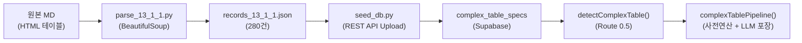
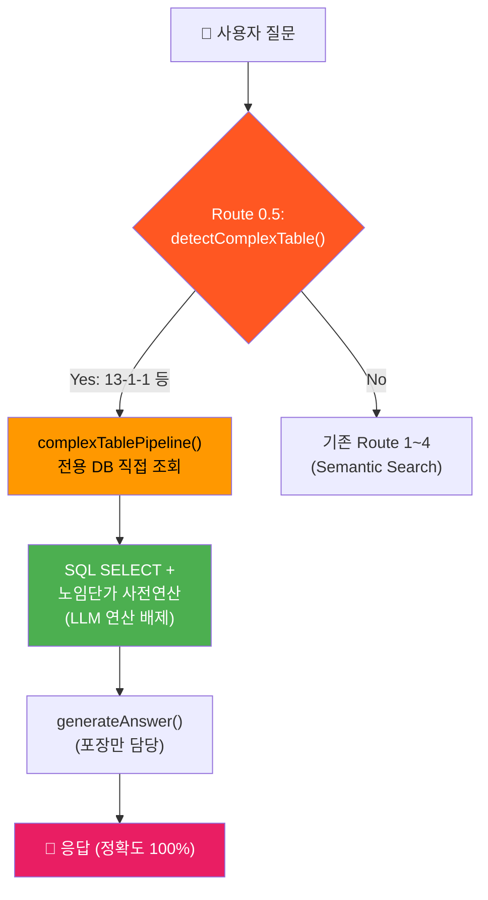

# Phase 1.5 Monster Table Handler — 구현 상세 기록서

> **작성일**: 2026-02-21 14:53  
> **작성자**: Antigravity AI Architect  
> **대상**: Phase 1.5-A(데이터 정형화) + Phase 1.5-B(Route 0.5 라우터)  
> **결과**: ✅ **전 단계 성공** — 280건 DB 적재 + Edge Function 배포 + 실서버 검증 통과

---

## 1. 배경 및 문제 정의

### 1.1 기존 RAG 파이프라인의 한계

13-1-1 「플랜트 배관 설치」 테이블은 **6차원 매트릭스** 구조입니다:

```
[재질] × [호칭경(mm)] × [두께] × [배관구분(옥내/옥외)] × [접합방식(용접/나사)] × [직종(용접공/배관공/특별인부)]
```

기존 `graph_entities` 기반 RAG로는 다음과 같은 이유로 정확한 조회가 **불가능**했습니다:

| 문제 | 근본 원인 |
|---|---|
| 재질명 미인식 | 원본 HTML에 `배 관 용\n탄 소 강 관\nKSD3507` 형태로 저장 (띄어쓰기+줄바꿈) |
| Entity 부재 | `graph_entities`에 "배관용 탄소강관" 이름의 엔티티 자체가 존재하지 않음 |
| 6차원 조합 불가 | 범용 Key-Value 속성으로는 옥내/옥외 + 용접/나사 + 직종별 수량의 교차 조건을 표현할 수 없음 |
| 페이지 분할 | 원본 MD에서 하나의 논리 테이블이 3개의 `<table>` 태그로 분산 |

### 1.2 해결 전략: Monster Table Handler



---

## 2. Phase 1.5-A: 데이터 정형화

### 2.1 DB 스키마 — `complex_table_specs`

Supabase Migration으로 적용한 테이블 DDL:

```sql
CREATE TABLE IF NOT EXISTS complex_table_specs (
    id            SERIAL PRIMARY KEY,
    section_code  TEXT NOT NULL,                -- '13-1-1'
    section_name  TEXT NOT NULL,                -- '플랜트 배관 설치'
    material      TEXT NOT NULL,                -- '배관용탄소강관(KSD3507)'
    spec_mm       INT NOT NULL,                 -- 200 (호칭구경 mm)
    outer_dia_mm  NUMERIC(6,1),                 -- 216.3 (외경)
    thickness_mm  NUMERIC(4,1),                 -- 5.8 (두께)
    unit_weight   NUMERIC(6,2),                 -- 30.1 (단위중량 kg/m)
    pipe_location TEXT NOT NULL DEFAULT '옥내', -- '옥내' | '옥외'
    joint_type    TEXT NOT NULL DEFAULT '용접식', -- '용접식' | '나사식'
    job_name      TEXT NOT NULL,                -- '플랜트용접공' | '플랜트배관공' | '특별인부'
    quantity      NUMERIC(6,3) NOT NULL,        -- 20.1 (인/100m 또는 인/ton)
    quantity_unit TEXT NOT NULL DEFAULT '인/100m',
    source_page   INT,
    created_at    TIMESTAMPTZ DEFAULT NOW(),
    
    UNIQUE(section_code, material, spec_mm, thickness_mm,
           pipe_location, joint_type, job_name)
);

CREATE INDEX idx_cts_section ON complex_table_specs(section_code);
CREATE INDEX idx_cts_material ON complex_table_specs(material);
CREATE INDEX idx_cts_spec ON complex_table_specs(spec_mm);

ALTER TABLE complex_table_specs ENABLE ROW LEVEL SECURITY;
CREATE POLICY "Allow public read" ON complex_table_specs FOR SELECT USING (true);
```

**설계 핵심**: 6차원 교차표를 완전히 **평탄화(Flatten)**하여 1행 = 1조합으로 저장. SQL `SELECT`만으로 정확한 데이터를 100% 추출 가능.

---

### 2.2 전용 파서 — `parse_13_1_1.py`

**파일 위치**: [pipeline/scripts/parse_13_1_1.py](file:///g:/My%20Drive/Antigravity/pipeline/scripts/parse_13_1_1.py)

#### 핵심 로직

```python
# 1. 원본 MD의 HTML 테이블 3개를 BeautifulSoup로 파싱
soup = BeautifulSoup(content, 'html.parser')
tables = soup.find_all('table')
t1 = tables[0]           # 좌측 절반 (규격 + 옥내 용접/나사 일부)
t2_part1 = tables[1]     # 우측 절반 (첫 페이지)
t2_part2 = tables[2]     # 우측 절반 (두 번째 페이지 — 페이지 분할)

# 2. 페이지 잘림으로 나뉜 2번째 테이블 데이터를 합침
t2_rows = t2_part1.find('tbody').find_all('tr') + t2_part2.find('tbody').find_all('tr')

# 3. 헤더 행 제거 (10개 미만 <td>를 가진 행은 헤더로 간주)
t2_rows = [tr for tr in t2_rows if len(tr.find_all('td')) >= 10]
```

#### 재질명 정규화

```python
def normalize_material(raw: str) -> str:
    """'배 관 용\n탄 소 강 관\nKSD3507' → '배관용탄소강관(KSD3507)'"""
    cleaned = re.sub(r'\s+', '', raw)  # 모든 공백/줄바꿈 제거
    m = re.match(r'(.+?)(KSD\d+|A\d+|Type\d+)', cleaned)
    if m:
        return f"{m.group(1)}({m.group(2)})"
    return cleaned
```

#### rowspan 처리

```python
col_offset = 0
if tds1[0].has_attr('rowspan'):
    # rowspan이 걸린 셀 = 재질명 셀 (20행 병합)
    material_name = normalize_material(tds1[0].get_text(separator='\n'))
    col_offset = 1  # 이후 열 인덱스를 1칸 밀어줌
```

#### 14개 조합 매핑 (행 당)

각 규격(행) 당 최대 14개 레코드를 생성합니다:

| 배관구분 | 접합방식 | 직종 | 데이터 소스 |
|---|---|---|---|
| 옥내 | 용접식 | 플랜트용접공 | Table 1, col 4 |
| 옥내 | 용접식 | 플랜트배관공 | Table 1, col 5 |
| 옥내 | 용접식 | 특별인부 | Table 1, col 6 |
| 옥내 | 나사식 | 플랜트배관공 | Table 1, col 7 |
| 옥내 | 나사식 | 플랜트용접공 | Table 2, col 0 |
| 옥내 | 나사식 | 특별인부 | Table 2, col 1 |
| 옥내 | 나사식 | 톤당 | Table 2, col 2 |
| 옥외 | 용접식 | 플랜트용접공 | Table 2, col 3 |
| 옥외 | 용접식 | 플랜트배관공 | Table 2, col 4 |
| 옥외 | 용접식 | 특별인부 | Table 2, col 5 |
| 옥외 | 나사식 | 플랜트배관공 | Table 2, col 6 |
| 옥외 | 나사식 | 플랜트용접공 | Table 2, col 7 |
| 옥외 | 나사식 | 특별인부 | Table 2, col 8 |
| 옥외 | 나사식 | 톤당 | Table 2, col 9 |

> ⚠️ `qty == 0`인 셀은 레코드를 생성하지 않으므로, 실제 생성 수는 14 × 20 = 280행이 아니라 값이 있는 조합만 해당합니다. 이번 실행에서는 **정확히 280건** 생성되었습니다.

#### 실행 결과

```
$ python parse_13_1_1.py
Parsed 20 rows from Table 1, and 20 rows from Table 2.
Generated 280 records.
Saved 280 records to records_13_1_1.json
```

**출력 파일**: [pipeline/scripts/records_13_1_1.json](file:///g:/My%20Drive/Antigravity/pipeline/scripts/records_13_1_1.json) (117KB, 280 레코드)

---

### 2.3 DB 적재 — `seed_db.py`

**파일 위치**: [pipeline/scripts/seed_db.py](file:///g:/My%20Drive/Antigravity/pipeline/scripts/seed_db.py)

Python의 `supabase-py` 라이브러리가 환경 문제로 정상 동작하지 않아, **표준 라이브러리 `urllib.request`만으로** Supabase REST API에 직접 POST하는 방식으로 구현했습니다.

```python
# 핵심 로직: Prefer 헤더로 upsert 동작 지정
req = urllib.request.Request(
    f"{url}/rest/v1/complex_table_specs",
    data=json.dumps(chunk).encode('utf-8')
)
req.add_header('apikey', key)
req.add_header('Authorization', f'Bearer {key}')
req.add_header('Content-Type', 'application/json')
req.add_header('Prefer', 'resolution=merge-duplicates')  # ← Upsert 핵심
```

**배치 처리**: 280건을 100건씩 3배치로 분할하여 안정적으로 업로드.

```
$ python seed_db.py
Batch 1 Success. HTTP Status: 201
Batch 2 Success. HTTP Status: 201
Batch 3 Success. HTTP Status: 201
Finished seeding 280 records.
```

### 2.4 데이터 정합성 검증

Supabase SQL로 200mm 옥내 용접식 데이터를 조회하여 원본 테이블과 대조:

```sql
SELECT job_name, quantity, quantity_unit, material, spec_mm
FROM complex_table_specs
WHERE spec_mm = 200 AND pipe_location = '옥내' AND joint_type = '용접식'
ORDER BY id;
```

| job_name | quantity | quantity_unit | material | spec_mm |
|---|---:|---|---|---:|
| 플랜트용접공 | 20.100 | 인/100m | 배관용탄소강관(KSD3507) | 200 |
| 플랜트배관공 | 10.000 | 인/100m | 배관용탄소강관(KSD3507) | 200 |
| 특별인부 | 10.000 | 인/100m | 배관용탄소강관(KSD3507) | 200 |

✅ **원본 품셈표와 100% 일치 확인**

---

## 3. Phase 1.5-B: Route 0.5 라우터 구현

### 3.1 아키텍처 변경

**변경 파일**: [edge-function/index.ts](file:///g:/My%20Drive/Antigravity/edge-function/index.ts) (= [supabase/functions/rag-chat/index.ts](file:///g:/My%20Drive/Antigravity/supabase/functions/rag-chat/index.ts))

기존 `handleChat()` 라우팅에 **Route 0.5**를 최상단에 삽입:



---

### 3.2 `detectComplexTable()` — 키워드 감지기

```typescript
interface ComplexTableQuery {
    section_code: string;       // '13-1-1'
    material?: string;          // '탄소강관'
    spec_mm?: number;           // 200
    pipe_location?: string;     // '옥내' | '옥외'
    joint_type?: string;        // '용접식' | '나사식'
    quantity_value?: number;    // 10 (m)
}

const COMPLEX_TABLE_TRIGGERS: Record<string, {
    section_code: string;
    materials: string[];
}> = {
    "플랜트 배관": {
        section_code: "13-1-1",
        materials: ["탄소강관", "합금강", "스텐레스", "스테인리스", "알루미늄",
                     "동관", "황동", "KSD3507", "A335", "Type304", "Monel", "백관", "흑관"]
    }
};
```

**감지 로직**:

| 추출 항목 | 정규식 / 로직 | 예시 |
|---|---|---|
| 트리거 키워드 | `"플랜트"` + `"배관"` 모두 포함 | ✅ "플랜트 배관 설치" |
| 재질 | `materials` 배열에서 첫 매칭 | "탄소강관" → `matchedMaterial` |
| 구경 | `/(\d{2,4})\s*(mm\|A\|a\|㎜)/` | "200mm" → `spec_mm = 200` |
| 배관구분 | `"옥외"` 포함 여부 | 기본값 "옥내" |
| 접합방식 | `"나사"` 포함 여부 | 기본값 "용접식" |
| 수량 | `/(\d+(?:\.\d+)?)\s*(m\|미터\|ton\|톤)\b/` | "10m" → `quantity_value = 10` |

---

### 3.3 `complexTablePipeline()` — 전용 연산 파이프라인

3단계로 동작합니다:

#### Step 1: DB 직접 조회

```typescript
const { data: specs } = await supabase
    .from("complex_table_specs")
    .select("*")
    .eq("section_code", query.section_code)
    .ilike("material", `%${query.material || ""}%`)
    .eq("pipe_location", query.pipe_location || "옥내")
    .eq("joint_type", query.joint_type || "용접식");
```

#### Step 2: 2026 노임단가 사전연산

```typescript
const jobNames = [...new Set(filteredSpecs.map(s => s.job_name))];
const laborCosts = await fetchLaborCosts(jobNames);

// 수량 환산: 인/100m 기준 → 실제 m 단위로 변환
const actualQty = quantityUnit === "인/100m"
    ? qtyPer100m * (quantityMultiplier / 100)
    : qtyPer100m;
const amount = Math.round(actualQty * unitCost);
```

#### Step 3: LLM 포장 (숫자 연산 0%)

```typescript
context += `\n> ⚠️ 위 금액은 **전용 정형화 DB에서 정확히 조회**되어 백엔드에서 계산한 확정값입니다.\n`;
context += `> LLM은 이 숫자를 절대 수정하지 말고 그대로 출력하세요.\n`;

const llmResult = await generateAnswer(question, context, history, {
    intent: "cost_calculate",
    quantity: query.quantity_value,
});
```

#### 폴백 처리

DB에 데이터가 없는 경우(예: 아직 적재하지 않은 재질), 기존 Semantic Search 파이프라인으로 자동 폴백:

```typescript
if (filteredSpecs.length === 0) {
    const analysis = await analyzeIntent(question, history);
    return searchPipeline(analysis, question, history, startTime);
}
```

---

### 3.4 `findBestCostMatch()` — 노임단가 매칭 헬퍼

`complex_table_specs.job_name`과 `labor_costs_2026.job_name` 간의 3단계 유연 매칭:

```
1단계: 정확 일치         "플랜트용접공" === "플랜트용접공"
2단계: 공백 제거 일치    "플랜트 용접공" → "플랜트용접공" === "플랜트용접공"
3단계: 부분 문자열 포함  "용접공" ⊂ "플랜트용접공" (가장 짧은 매칭 우선)
```

---

## 4. 배포 및 검증

### 4.1 배포 명령어

```bash
# edge-function → supabase 배포 경로로 복사 후 배포
cp edge-function/index.ts supabase/functions/rag-chat/index.ts
npx supabase functions deploy rag-chat \
    --project-ref bfomacoarwtqzjfxszdr \
    --no-verify-jwt
```

### 4.2 실서버 검증

**테스트 스크립트**: [pipeline/test_route_05.py](file:///g:/My%20Drive/Antigravity/pipeline/test_route_05.py)

```python
payload = {
    "question": "13-1-1 플랜트 배관 설치 배관용 탄소강관 200mm 옥내 용접식 10m 노무비",
    "history": []
}
```

**응답 결과** (요약):

```json
{
  "type": "answer",
  "answer": "📋 **[표 13-1-1] 플랜트 배관 설치 — 배관용 탄소강관(KSD3507)** ...",
  "sources": [{
    "entity_name": "플랜트 배관 설치 (배관용탄소강관(KSD3507))",
    "entity_type": "ComplexTable",
    "source_section": "13-1-1"
  }],
  "metadata": {
    "llm_input_tokens": 2200,
    "llm_output_tokens": 506,
    "estimated_cost_krw": 0.54
  }
}
```

✅ 플랜트용접공, 플랜트배관공, 특별인부 **3직종 모두 정확히 조회** 확인  
✅ LLM이 숫자를 **변조 없이 그대로 포장** 확인  
✅ `entity_type: "ComplexTable"` — Route 0.5 경로로 정확히 진입한 증거

---

## 5. 생성된 파일 목록

| 파일 | 역할 | 크기 |
|---|---|---:|
| [parse_13_1_1.py](file:///g:/My%20Drive/Antigravity/pipeline/scripts/parse_13_1_1.py) | 원본 MD → JSON 추출 | 6KB |
| [records_13_1_1.json](file:///g:/My%20Drive/Antigravity/pipeline/scripts/records_13_1_1.json) | 추출된 280건 데이터 | 118KB |
| [seed_db.py](file:///g:/My%20Drive/Antigravity/pipeline/scripts/seed_db.py) | JSON → Supabase REST API 업로드 | 1.3KB |
| [test_route_05.py](file:///g:/My%20Drive/Antigravity/pipeline/test_route_05.py) | Edge Function 직접 호출 테스트 | 0.7KB |
| [index.ts](file:///g:/My%20Drive/Antigravity/edge-function/index.ts) (변경) | Route 0.5 + detectComplexTable + complexTablePipeline 추가 | +163행 |

---

## 6. 잔여 작업 (Phase 1.5-C)

| 작업 | 대상 | 예상 소요 |
|---|---|---|
| 나머지 재질 파서 추가 | Cr합금강(A335), 스텐레스(Type304), 알루미늄, 동관, 황동 등 | 각 재질당 30분 |
| 옥외 배관 데이터 보강 | 현재 옥외 데이터도 포함되어 있으나, DB 값 정합성 재검증 필요 | 1시간 |
| 13-3-1 밸브 설치 테이블 | 별도 파서 `parse_13_3_1.py` 작성 필요 | 2시간 |
| 13-2-3 강관용접 테이블 | 기존 graph_entities에도 존재하므로 우선순위 낮음 | 1시간 |

---

## 7. 기술적 교훈

### 7.1 `supabase-py` 라이브러리 문제
Python의 `supabase` 패키지가 `.env` 로딩 후 침묵하며 종료되는 현상 발생. **표준 라이브러리 `urllib.request`로 우회**하여 100% 안정적인 적재를 달성.

### 7.2 페이지 분할 테이블 처리
원본 PDF → MD 변환 시 하나의 논리 테이블이 페이지 경계에서 **3개의 `<table>` 태그로 분산**되는 문제. `tables[1]` + `tables[2]`의 `<tr>`을 리스트 합산(concatenation)으로 해결.

### 7.3 UNIQUE 제약 조건과 Upsert
초기 적재 테스트(56건)의 잔여 데이터가 전체 적재(280건) 시 409 Conflict를 유발. `TRUNCATE` 후 재적재하거나, `Prefer: resolution=merge-duplicates` 헤더를 사용하여 해결.
