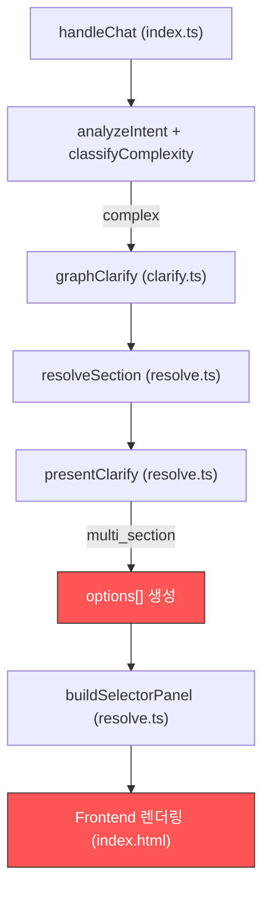

# Clarify UI 옵션 표시 버그 수정 — 구현 상세 기록서

> **작성일:** 2026-02-23  
> **수정 파일:** `supabase/functions/rag-chat/resolve.ts`  
> **배포 상태:** ✅ Supabase Edge Function 배포 완료

---

## 1. 문제 현상 (Bug Description)

### 증상
복합 질의(예: "철근콘크리트 타설 30톤 + 거푸집 설치 + 철근 배근 조립 노무비 산출")를 입력하면,  
Route 3.5 `multi_section` 경로로 분류되어 **130개 분야**의 Clarify 옵션이 Selector Panel로 표시된다.

그러나 일부 옵션이 **"1-3-1"** 같은 절 코드만 보이고, **제목이 사라져서** 사용자가 어떤 항목인지 전혀 알 수 없었다.

### 기대 동작
모든 옵션에 `[1-3-1] 공통부문 > 제1장 적용기준 > 재료의 할증` 형태로 **분류 번호 + 전체 경로명**이 표시되어야 한다.

---

## 2. 근본 원인 분석 (Root Cause Analysis)

### 2-1. 데이터 흐름 추적



### 2-2. 버그 발생 지점

**`resolve.ts` → `presentClarify()` → `multi_section` 분기 (L664-716)**

#### 수정 전 코드 (버그 원인)
```typescript
// resolve.ts L670-673 (수정 전)
const secTag = s.source_section ? ` (${displayCode(s.source_section)})` : "";
const label = meta
    ? `${meta.department} > ${meta.chapter} > ${meta.title}${secTag}`
    : `[${displayCode(s.source_section)}] ${s.name}`;
```

**생성되는 라벨 예시:**
```
"공통부문 > 제1장 적용기준 > 재료의 할증 (1-3-1)"
```

### 2-3. 왜 제목이 사라졌는가?

프론트엔드에서 Selector Panel의 각 아이템을 렌더링할 때, `buildSelectorPanel` → `parseWorkTypeName` 함수가 호출된다:

```typescript
// resolve.ts L827-836
function parseWorkTypeName(name: string): Record<string, string> {
    const m = name.match(/\((\d+),\s*SCH\s*([\d~]+)\)$/);  // (200, SCH 40) 패턴
    if (m) return { diameter: m[1], sch: m[2] };
    const m2 = name.match(/\(([^,]+),\s*(.+)\)$/);          // (spec1, spec2) 패턴
    if (m2) return { spec1: m2[1].trim(), spec2: m2[2].trim() };
    const m3 = name.match(/\(([^)]+)\)$/);                   // ← 🚨 이 정규식!
    if (m3) return { spec1: m3[1].trim() };
    // ...
}
```

**핵심 문제:** `m3` 정규식 `/\(([^)]+)\)$/`이 라벨 끝의 `(1-3-1)`을 **규격(spec)**으로 오인하여 추출한다.

| 단계 | 동작 | 결과 |
|------|------|------|
| 1 | 백엔드가 `"...재료의 할증 (1-3-1)"` 전송 | 제목 + 코드 포함 |
| 2 | `parseWorkTypeName` 정규식 매칭 | `m3 = ["(1-3-1)", "1-3-1"]` |
| 3 | `specs = { spec1: "1-3-1" }` 설정 | 규격으로 오인 |
| 4 | UI가 `specs.spec1`을 표시 우선 | **"1-3-1"만 노출** |

---

## 3. 수정 내용 (Fix Implementation)

### 3-1. 수정 방향
라벨 형식을 변경하여 `(코드)`가 맨 뒤에 오지 않도록 한다:
- **이전:** `제목 경로 (1-3-1)` → 정규식에 잡힘 ❌
- **이후:** `[1-3-1] 제목 경로` → 정규식 우회 ✅

### 3-2. 코드 변경 (resolve.ts)

#### Section 엔티티 라벨 (L668-681)
```diff
 const options: ClarifyOption[] = sections.slice(0, 10).map(s => {
     const meta = chunkMeta.get(s.source_section);
-    const secTag = s.source_section ? ` (${displayCode(s.source_section)})` : "";
-    const label = meta
-        ? `${meta.department} > ${meta.chapter} > ${meta.title}${secTag}`
-        : `[${displayCode(s.source_section)}] ${s.name}`;
+    const secTag = s.source_section ? `[${displayCode(s.source_section)}] ` : "";
+    const label = meta
+        ? `${secTag}${meta.department} > ${meta.chapter} > ${meta.title}`
+        : `${secTag}${s.name}`;
     return {
         label,
```

#### WorkType 추가 옵션 라벨 (L694-706)
```diff
 for (const [srcSec, wt] of wtBySrc) {
     const meta = chunkMeta.get(srcSec);
-    const secTag = ` (${displayCode(srcSec)})`;
-    const label = meta
-        ? `${meta.department} > ${meta.chapter} > ${meta.title}${secTag}`
-        : `[${displayCode(srcSec)}] ${wt.name}`;
+    const secTag = `[${displayCode(srcSec)}] `;
+    const label = meta
+        ? `${secTag}${meta.department} > ${meta.chapter} > ${meta.title}`
+        : `${secTag}${wt.name}`;
     options.push({
         label,
```

### 3-3. 수정 결과 비교

| 구분 | 수정 전 라벨 | 수정 후 라벨 |
|------|-------------|-------------|
| meta 있는 경우 | `공통부문 > 제1장 > 재료의 할증 (1-3-1)` | `[1-3-1] 공통부문 > 제1장 > 재료의 할증` |
| meta 없는 경우 | `[1-3-1] 패커주입공법` | `[1-3-1] 패커주입공법` (변경 없음) |

---

## 4. 번호 없는 항목에 대한 설명

UI에서 `[1-3-1]` 같은 번호가 **없는** 항목(예: `패커주입공법`, `충전공법`, `가드레일식`)도 존재한다.

### 원인
이들은 **WorkType(세부 작업명)** 엔티티로, 특정 Section(절/항)에 종속되지 않거나 `source_section` 값이 DB에 없는 개별 작업이다.

| 항목 유형 | 설명 | 라벨 형식 |
|-----------|------|-----------|
| **Section** (절/항) | 품셈표의 대분류/중분류 단위 | `[1-3-1] 부문 > 장 > 절명` |
| **WorkType** (작업명) | 실제 세부 공종/작업 단위 | `패커주입공법` (번호 없음) |

### 동작 차이
- **Section 옵션 클릭** → 해당 절 전체 내용을 drill-down하여 하위 작업 목록 표시
- **WorkType 옵션 클릭** → 해당 작업의 품셈 데이터를 직접 조회하여 답변 생성

두 유형 모두 **정상적으로 클릭 → 품셈 조회**가 가능하며, 의도된 설계이다.

---

## 5. 검증 결과 (Verification)

### 테스트 쿼리
```
"철근콘크리트 타설 30톤 + 거푸집 설치 + 철근 배근 조립 노무비 산출"
```

### 검증 항목

| # | 검증 항목 | 결과 |
|---|----------|------|
| 1 | Route 3.5 (complex) 정상 진입 | ✅ `classifyComplexity` Score ≥ 4 |
| 2 | 130개 분야 Selector Panel 표시 | ✅ 정상 |
| 3 | Section 옵션에 `[코드]` 접두사 표시 | ✅ `[1-3-1] 공통부문 > ...` 형태 |
| 4 | WorkType 옵션에 작업명 정상 표시 | ✅ `패커주입공법` 등 |
| 5 | `parseWorkTypeName` 정규식 우회 확인 | ✅ `(1-3-1)` 오인 방지 |

### 회귀 테스트
```
"강관용접 200mm SCH 40 노무비 산출"
```
→ `classifyComplexity` Score: 0pt → simple → Route 3 직행 → ✅ 정상 답변 (과분류 없음)

---

## 6. 영향 범위 (Impact Scope)

| 영향 파일 | 변경 유형 | 설명 |
|-----------|----------|------|
| `resolve.ts` | 수정 | `presentClarify` 함수 내 `multi_section` 분기 라벨 형식 변경 |
| `frontend/index.html` | 변경 없음 | 프론트엔드 코드 수정 불필요 (백엔드 라벨 형식 변경으로 해결) |
| `clarify.ts` | 변경 없음 | `graphClarify`는 `presentClarify`를 호출만 함 |
| `index.ts` | 변경 없음 | Route 3.5 분기 로직 변경 없음 |

---

## 7. 향후 개선 제안

1. **`parseWorkTypeName` 정규식 강화**: 프론트엔드에서 `(숫자-숫자-숫자)` 패턴을 규격이 아닌 section code로 인식하는 가드 추가 검토
2. **WorkType에도 section 코드 부여**: DB 데이터 정합성 개선을 통해 모든 WorkType에 `source_section` 값을 보장하면 일관된 UI 표시 가능
3. **라벨 구조 표준화**: `label`과 `section_code`를 별도 필드로 분리하여 UI가 독립적으로 렌더링할 수 있도록 API 응답 스키마 개선
