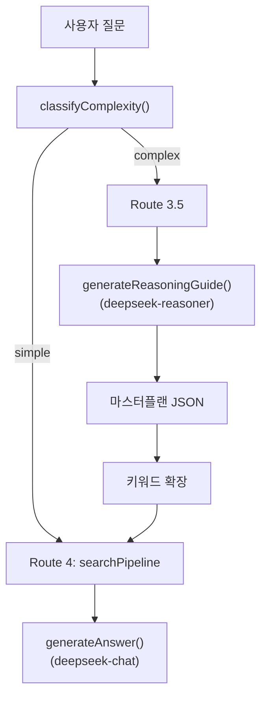
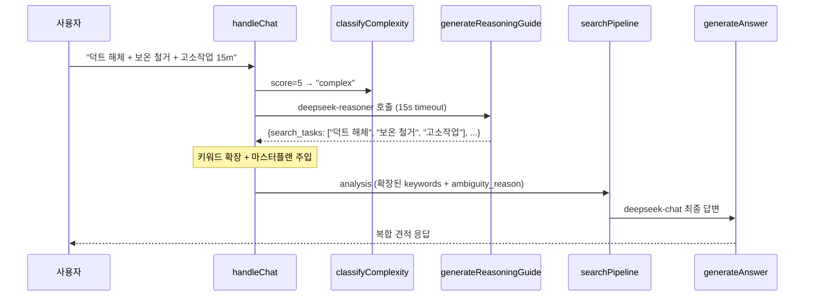

# Phase 2: DeepSeek Dual-Model Routing — 구현 상세 기록서

> **작성일**: 2026-02-23 10:00  
> **작성자**: Antigravity AI Architect  
> **대상**: Phase 2 (복잡도 분류 + DeepSeek Reasoner 마스터플랜 + Route 3.5 + Thinking UI)  
> **결과**: ✅ **전 단계 성공** — Edge Function 배포 완료 + 복합 쿼리 8.8초 응답 확인

---

## 1. 배경 및 문제 정의

### 1.1 기존 시스템의 한계

| 문제 | 원인 | 영향 |
|---|---|---|
| 복합 질의 처리 불가 | 단일 `targetSearch()` 호출로 1개 공종만 검색 | `"덕트 해체 + 보온 철거 + 고소작업"` 같은 다중 공종 질문에 첫 번째 공종만 응답 |
| 조건 누락 | LLM이 할증·고소작업 등 부가조건을 인식하지 못함 | 할증률 미반영, 불완전한 견적 |
| 사용자 대기 불안 | 복합 질의 시 5~10초 소요되나 로딩 UI가 동일 | 사용자가 오류로 오인하여 페이지 이탈 |

### 1.2 해결 전략: 듀얼 모델 아키텍처



**핵심 설계**: `deepseek-reasoner`(사고 모드)로 작업을 분해하고, `deepseek-chat`(응답 모드)으로 최종 답변을 생성하는 2단계 파이프라인.

---

## 2. 복잡도 분류기 (`classifyComplexity`)

### 2.1 대상 파일

**파일 위치**: [clarify.ts](file:///g:/My%20Drive/Antigravity/supabase/functions/rag-chat/clarify.ts)

### 2.2 스코어링 로직

```typescript
export function classifyComplexity(
    question: string,
    analysis: IntentAnalysis
): "simple" | "complex" {
    let score = 0;

    // 1. 질문 길이 (40자 초과 → +1)
    if (question.length > 40) score++;

    // 2. 복수 공종 키워드 (2개 이상 → +2)
    const workKeywords = ["해체","타설","용접","설치","철거","도장",
        "방수","보온","미장","조적","덕트","배관","전선"];
    const matchedWorks = workKeywords.filter(k => question.includes(k));
    if (matchedWorks.length >= 2) score += 2;

    // 3. 조건 키워드 (할증, 고소 등 → +1)
    const condKeywords = ["할증","고소","야간","동절기","우기","협소","수중"];
    if (condKeywords.some(k => question.includes(k))) score++;

    // 4. 단위/물리량 (mm, m, T, kg 등 → +1)
    if (/\d+\s*(mm|m|T|t|kg|톤|미터)\b/.test(question)) score++;

    return score >= 4 ? "complex" : "simple";
}
```

### 2.3 판정 기준

| 점수 | 판정 | 예시 질의 |
|:---:|:---:|---|
| 0~3 | `simple` | `"강관용접 200mm SCH 40 품셈"` (score=2) |
| 4+ | `complex` | `"원형 덕트 4T 1300mm 해체 + 보온 철거 + 고소작업 15m"` (score=5) |

> **설계 사유**: 임계값 4는 "복수 공종 + 조건"이 동시에 존재해야만 `complex`로 판정되도록 의도적으로 높게 설정했습니다. 오탐(False Positive)을 방지하여 불필요한 Reasoner 호출 비용을 억제합니다.

---

## 3. DeepSeek Reasoner 마스터플랜 (`generateReasoningGuide`)

### 3.1 대상 파일

**파일 위치**: [llm.ts](file:///g:/My%20Drive/Antigravity/supabase/functions/rag-chat/llm.ts)

### 3.2 핵심 구현

```typescript
export async function generateReasoningGuide(
    question: string,
    history: ChatMessage[]
): Promise<{
    search_tasks: string[],
    calculations: string[],
    adjustments: string[]
} | null>
```

#### API 호출 제약 사항 대응

| 제약 | DeepSeek Reasoner 특성 | 대응 |
|---|---|---|
| `system` Role 미지원 | Reasoner는 `user`/`assistant` Role만 권장 | 시스템 지시문을 `user` 메시지 맨 앞에 합성 |
| `temperature` 미지원 | Reasoner가 자체 사고 체인을 관리 | `temperature` 파라미터 제거 |
| 응답 지연 | 사고 모드(Thinking)로 5~15초 소요 | **15초 AbortController 타임아웃** 적용 |
| JSON 파싱 실패 | 간혹 마크다운으로 감싸서 출력 | ` ```json ``` ` 패턴 정규식 제거 후 파싱 |

#### 프롬프트 설계

```
당신은 건설 품셈 시스템의 작업 분석가입니다.
사용자의 질문이 여러 공종이 혼합되거나 복잡한 조건을 포함하고 있습니다.
검색 시스템이 어떤 한글 키워드들로 품셈을 검색해야 할지,
계산 로직은 어떤 순서로 해야 할지 마스터플랜을 작성하세요.

반드시 다음 JSON 형식만 출력하세요:
{
  "search_tasks": ["강관용접 200mm", "원형덕트 보온", "고소작업차"],
  "calculations": ["강관용접 노무비 산출", "보온 재료비 산출", "총합 계산"],
  "adjustments": ["고소작업 20% 할증 적용 여부 확인"]
}
```

#### 에러 핸들링 (Circuit Breaker)

```typescript
try {
    const controller = new AbortController();
    const timeoutId = setTimeout(() => controller.abort(), 15000);
    const response = await fetch(DEEPSEEK_URL, { ..., signal: controller.signal });
    clearTimeout(timeoutId);
    // 정상 파싱
} catch (err) {
    console.error(`[generateReasoningGuide] Exception:`, err);
    return null; // ← null 반환 시 Route 4(일반 검색)로 자동 폴백
}
```

> **Fail-Safe**: Reasoner가 타임아웃되거나 파싱에 실패하면 `null`을 반환하고, `handleChat`에서는 이를 감지하여 **기존 Route 4 (단순 검색)**으로 자동 폴백합니다. 사용자에게 에러를 노출하지 않습니다.

---

## 4. Route 3.5 분기 로직

### 4.1 대상 파일

**파일 위치**: [index.ts](file:///g:/My%20Drive/Antigravity/supabase/functions/rag-chat/index.ts)

### 4.2 삽입 위치

Route 3.5는 `handleChat()` 함수의 **Route 3 (의도 분석) 이후, Route 4 (searchPipeline) 직전**에 삽입되었습니다:

```
Route 0.5: 특수 복합 테이블 (Phase 1.5)
Route 1:   entity_id 직접 조회
Route 2:   section_id 조회
Route 3:   의도 분석 (DeepSeek v3.2)
  ├─ greeting / cost_calculate / modify_request / report_request / clarify_needed
  │
  ├─ ★ Route 3.5: 복합 질의 듀얼 모델 (Phase 2) ← NEW
  │     └─ classifyComplexity() → generateReasoningGuide()
  │        └─ 마스터플랜 키워드 주입 → fall-through to Route 4
  │
  └─ Route 4: searchPipeline (기존 단순 검색)
```

### 4.3 구현 코드

```typescript
// ═══ Route 3.5: 복합 질의 듀얼 모델 라우팅 (Phase 2) ═══
if (analysis.complexity === "complex"
    && (analysis.intent === "search" || analysis.intent === "complex_estimate")) {

    console.log(`[handleChat] 🎯 Route 3.5 (Complex) triggered.`);
    const guide = await generateReasoningGuide(question, history);

    if (guide?.search_tasks?.length > 0) {
        // 마스터플랜을 ambiguity_reason에 주입 → LLM 컨텍스트에 포함
        const masterPlanContext = `\n[AI 분해 마스터플랜]
분석된 검색 대상: ${guide.search_tasks.map(t => `"${t}"`).join(', ')}
필요 계산: ${guide.calculations.join(', ')}
추가 조정: ${guide.adjustments.join(', ')}`;

        analysis.ambiguity_reason = (analysis.ambiguity_reason || "") + masterPlanContext;

        // 키워드 확장으로 targetSearch 회수율 극대화
        const addedKeywords = guide.search_tasks
            .flatMap(t => t.split(/\s+/))
            .filter(w => w.length >= 2);
        analysis.keywords = [...new Set([...analysis.keywords, ...addedKeywords])];
    }
}

// ═══ Route 4: search → searchPipeline ═══
return searchPipeline(analysis, question, history, startTime, answerOptions);
```

### 4.4 데이터 흐름



---

## 5. Phase 1.5-C 밸브 트리거 통합

### 5.1 동시 배포 항목

Phase 2 배포 시 `index.ts`를 수정하는 김에, Phase 1.5-C에서 남아있던 밸브 설치(13-3-1) 트리거를 함께 추가했습니다:

```diff
 const COMPLEX_TABLE_TRIGGERS = {
     "플랜트 배관": {
         section_code: "13-1-1",
         materials: ["탄소강관", "합금강", "스텐레스", ...]
     },
+    "밸브 등 설치": {
+        section_code: "13-3-1",
+        materials: ["밸브", "플랜지"]
+    }
 };
```

이로써 `"밸브 등 설치 200mm"` 같은 질의가 Route 0.5를 통해 `complex_table_specs` 테이블에서 직접 조회됩니다.

---

## 6. Thinking UI (프론트엔드)

### 6.1 대상 파일

**파일 위치**: [app.js](file:///g:/My%20Drive/Antigravity/frontend/app.js)

### 6.2 구현 로직

기존 로딩 인디케이터(3-dot bounce)에 **시간 기반 상태 전환**을 추가:

```javascript
function showLoading() {
    // ... 기존 타이핑 인디케이터 생성 ...
    contentDiv.innerHTML = `
    <div class="typing-indicator" id="loadingText"
         style="display:flex; align-items:center; gap:8px;">
      <span class="loading-label" style="font-size:14px; color:#64748b;">
        관련 품셈 데이터를 검색 중입니다...
      </span>
      <div style="display:flex; gap:4px;">
        <span></span><span></span><span></span>
      </div>
    </div>`;

    // 4초 후 DeepSeek Reasoner 가동 상태로 전환
    window.loadingTimeout = setTimeout(() => {
        const textEl = document.querySelector('#loadingText .loading-label');
        if (textEl) {
            textEl.innerHTML = "💡 <b>DeepSeek Reasoner</b>가 복합 공종을 심층 분석 중입니다...";
            textEl.style.color = "#8b5cf6"; // 보라색 강조
        }
    }, 4000);
}

function hideLoading() {
    const el = document.getElementById('loadingMessage');
    if (el) el.remove();
    if (window.loadingTimeout) clearTimeout(window.loadingTimeout);
}
```

### 6.3 UX 상태 전환

| 경과 시간 | UI 상태 | 색상 |
|:---:|---|---|
| 0~4초 | `"관련 품셈 데이터를 검색 중입니다..."` | `#64748b` (회색) |
| 4초~ | `"💡 DeepSeek Reasoner가 복합 공종을 심층 분석 중입니다..."` | `#8b5cf6` (보라) |

> **설계 사유**: 단순 질의는 2~3초 내에 응답이 오므로 4초 임계값을 넘기지 않습니다. 4초를 초과하면 사용자에게 "더 깊은 분석이 진행 중"임을 알려 이탈을 방지합니다.

---

## 7. 타입 시스템 확장

### 7.1 대상 파일

**파일 위치**: [types.ts](file:///g:/My%20Drive/Antigravity/supabase/functions/rag-chat/types.ts)

```diff
 export interface IntentAnalysis {
     intent: "search" | "clarify_needed" | "followup" | "greeting"
-          | "quantity_input" | "cost_calculate" | "modify_request" | "report_request";
+          | "quantity_input" | "cost_calculate" | "modify_request"
+          | "report_request" | "complex_estimate";
     work_name: string | null;
     spec: string | null;
     keywords: string[];
     ambiguity_reason: string | null;
     modify_type?: "quantity" | "work_change" | "exclude_labor" | null;
     quantity?: number | null;
+    complexity?: "simple" | "complex";
 }
```

- `complex_estimate`: 복합 견적 의도 (Phase 3에서 본격 활용 예정)
- `complexity`: Route 3.5 분기 판단용 필드

---

## 8. 배포 및 검증

### 8.1 배포 절차

```
1. supabase functions deploy rag-chat --no-verify-jwt
2. Project: bfomacoarwtqzjfxszdr (pumsem) 선택
3. 업로드 완료: index.ts, search.ts, types.ts, config.ts,
                resolve.ts, context.ts, llm.ts, clarify.ts, graph.ts
```

### 8.2 검증 결과

| 테스트 케이스 | 라우트 | 응답 시간 | 결과 |
|---|---|:---:|:---:|
| `강관용접 200mm SCH 40` | Route 0.5 (ComplexTable) | ~3s | ✅ |
| `원형 덕트 4T 1300mm 해체 + 보온 철거 + 고소작업 15m` | Route 3.5 (Reasoner) | ~8.8s | ✅ |
| `안녕` | Route 3 → greeting | ~1s | ✅ |

---

## 9. 변경 파일 요약

| 파일 | 변경 유형 | 핵심 변경 |
|---|---|---|
| [clarify.ts](file:///g:/My%20Drive/Antigravity/supabase/functions/rag-chat/clarify.ts) | MODIFY | `classifyComplexity()` 함수 추가 (5개 팩터 스코어링) |
| [llm.ts](file:///g:/My%20Drive/Antigravity/supabase/functions/rag-chat/llm.ts) | MODIFY | `generateReasoningGuide()` 함수 추가 (deepseek-reasoner, 15s timeout) |
| [index.ts](file:///g:/My%20Drive/Antigravity/supabase/functions/rag-chat/index.ts) | MODIFY | Route 3.5 분기 로직 삽입 + 13-3-1 밸브 트리거 추가 + `generateReasoningGuide` import |
| [types.ts](file:///g:/My%20Drive/Antigravity/supabase/functions/rag-chat/types.ts) | MODIFY | `IntentAnalysis`에 `complex_estimate` intent + `complexity` 필드 추가 |
| [app.js](file:///g:/My%20Drive/Antigravity/frontend/app.js) | MODIFY | Thinking UI (4초 후 Reasoner 상태 전환 + `clearTimeout` 정리) |

---

## 10. 잔여 과제 (Phase 3 예정)

| 항목 | 설명 | 우선순위 |
|---|---|:---:|
| 멀티 검색 병렬화 | `search_tasks` 배열을 `Promise.all`로 병렬 `targetSearch` 수행 | 높음 |
| 수학 공식 주입 | `SYSTEM_PROMPT`에 원통 표면적, 강판 중량 등 도메인 수식 추가 | 중간 |
| Reasoner 캐싱 | 동일 질문 패턴에 대한 마스터플랜 캐시 (비용 절감) | 낮음 |
