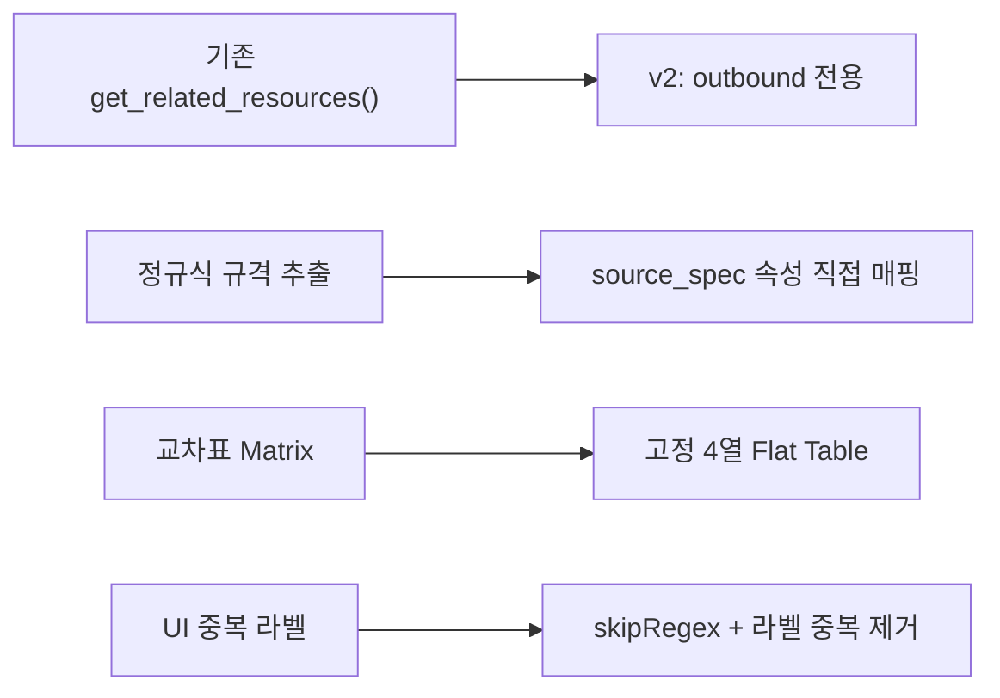
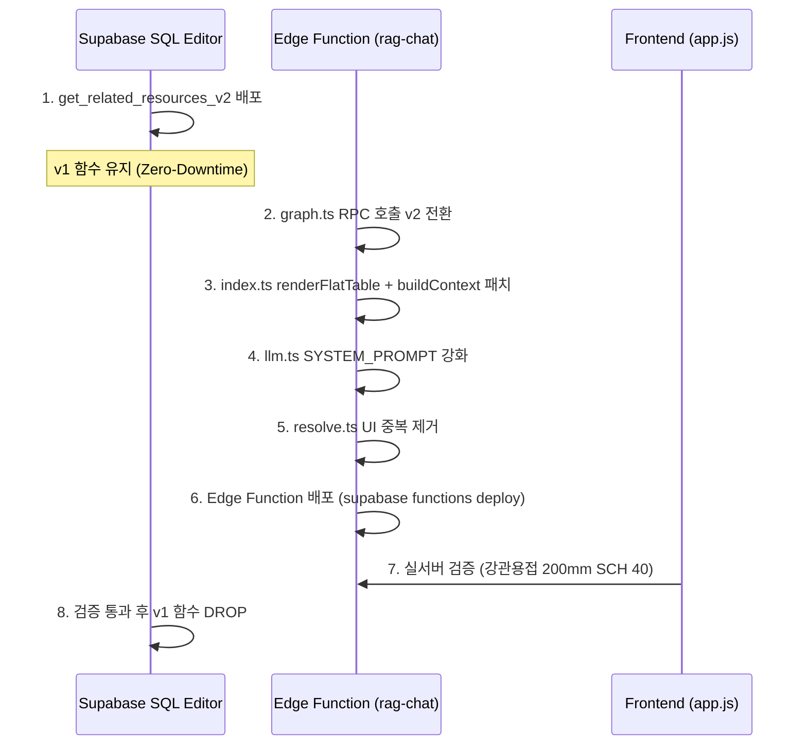

# Phase 4: RAG Search Layer Refactoring & UI Bug Fix — 구현 상세 기록서

> **작성일**: 2026-02-23 09:30  
> **작성자**: Antigravity AI Architect  
> **대상**: Phase 4 (SQL RPC 경량화 + Edge Function 4열 고정 테이블 + UI 중복 제거)  
> **결과**: ✅ **전 단계 성공** — SQL 패치 배포 + Edge Function 배포 + 실서버 검증 통과

---

## 1. 배경 및 문제 정의

### 1.1 기존 시스템의 구조적 문제

| 문제 영역 | 근본 원인 | 영향 |
|---|---|---|
| SQL RPC 과잉 조회 | `get_related_resources()`가 **양방향(inbound+outbound)** 조회 수행 | 불필요한 역방향 데이터가 context에 포함되어 LLM 환각 유발 |
| 정규식 기반 규격 파싱 | `buildContext()`에서 `match(/\([^)]+\)/)` 정규식으로 entity 이름에서 규격 문자열 추출 | 괄호가 없거나 형식이 다른 entity에서 규격 누락 |
| 교차표(Matrix) 출력 | 인력/장비/자재를 교차표 형태로 출력 | 토큰 낭비 + LLM이 행/열 매핑 실패 |
| UI 중복 라벨 | `resolve.ts`에서 Selector Panel에 동일 이름의 비-노무 항목이 중복 표시 | 사용자 혼란 |

### 1.2 해결 전략



---

## 2. SQL RPC 함수 리팩토링

### 2.1 `get_related_resources_v2` 신규 생성

**파일 위치**: [20260223_phase4_get_related_resources_v2.sql](file:///g:/My%20Drive/Antigravity/db/migrations/20260223_phase4_get_related_resources_v2.sql)

#### 핵심 변경점

```sql
CREATE OR REPLACE FUNCTION get_related_resources_v2(p_entity_id TEXT)
RETURNS JSONB AS $$
DECLARE
    result JSONB;
BEGIN
    SELECT jsonb_build_object(
        'outbound', COALESCE(
            jsonb_agg(
                jsonb_build_object(
                    'relation', r.relation_type,
                    'related_id', tgt.id,
                    'related_name', tgt.name,
                    'related_type', tgt.type,
                    'properties', tgt.properties
                )
            ) FILTER (WHERE r.source_id = p_entity_id
                      AND r.relation_type != 'has_workType'), '[]'::jsonb
        )
    ) INTO result
    FROM graph_relationships r
    LEFT JOIN graph_entities tgt ON r.target_id = tgt.id
    WHERE r.source_id = p_entity_id;

    RETURN COALESCE(result, '{"outbound": []}'::jsonb);
END;
$$ LANGUAGE plpgsql;
```

#### 설계 사유

| 항목 | v1 (`get_related_resources`) | v2 (`get_related_resources_v2`) |
|---|---|---|
| 조회 방향 | 양방향 (inbound + outbound) | **outbound 전용** |
| `has_workType` 관계 | 포함 | **FILTER로 제외** |
| 파라미터명 | `entity_id` | `p_entity_id` (PostgREST 관례 준수) |
| 배포 전략 | — | 구버전 유지 → Zero-Downtime 전환 |

> ⚠️ **Zero-Downtime 배포**: v1 함수를 즉시 DROP하지 않고, Edge Function이 v2를 사용하는 것이 확인된 후 별도 마이그레이션으로 제거하는 전략을 적용했습니다.

---

## 3. Edge Function 리팩토링

### 3.1 `graph.ts` — RPC 호출 전환

**파일 위치**: [graph.ts](file:///g:/My%20Drive/Antigravity/supabase/functions/rag-chat/graph.ts)

기존 `get_related_resources` RPC 호출을 `get_related_resources_v2`로 전환:

```diff
-const { data: relations } = await supabase.rpc(
-    "get_related_resources",
-    { entity_id: entityId }
-);
+const { data: relations } = await supabase.rpc(
+    "get_related_resources_v2",
+    { p_entity_id: entityId }
+);
```

이 변경은 `expandGraph()` 함수 내 2회 호출(엔티티 자체 + 하위 WorkType 순회) 모두에 적용되었습니다.

---

### 3.2 `index.ts` — `renderFlatTable()` 신규 도입 + `buildContext()` 리팩토링

**파일 위치**: [index.ts](file:///g:/My%20Drive/Antigravity/supabase/functions/rag-chat/index.ts)

#### 3.2.1 `renderFlatTable()` (L52-L81)

교차표(Matrix) 렌더링을 완전히 제거하고, **고정 4열 플랫 테이블**로 통일:

```typescript
function renderFlatTable(
    items: RelatedResource[],
    sectionId: string,
    categoryLabel: string,  // "투입 인력" | "투입 장비" | "사용 자재"
    nameLabel: string,      // "직종" | "장비명" | "자재명"
): string {
    // 출력 형식:
    // | 직종 | 수량 | 단위 | 규격 |
    // | --- | ---: | --- | --- |
    // | 용접공 | 0.287 | 인 | 200, SCH 20 |
}
```

**고정 4열 스키마**: `| 직종/장비명/자재명 | 수량 | 단위 | 규격 |`

#### 3.2.2 `buildContext()` 규격 매핑 개선 (L102-L250)

정규식 파싱을 전면 삭제하고, 엔티티의 `properties.source_spec` 속성을 최우선으로 매핑:

```typescript
// Before (정규식 기반): match(/\([^)]+\)/) → 실패 빈번
// After (속성 기반):
const spec = props.source_spec || props.spec || props.per_unit 
           || props.work_type_name || specFallback;
```

`per_unit`이 비어있을 경우 하이픈(`-`)으로 채워 빈 셀을 방지합니다.

---

### 3.3 `llm.ts` — SYSTEM_PROMPT 4열 테이블 강제 지시

**파일 위치**: [llm.ts](file:///g:/My%20Drive/Antigravity/supabase/functions/rag-chat/llm.ts)

시스템 프롬프트에 다음 지시를 추가:

```
3. **표 형식 — 컨텍스트 구조 유지**: 컨텍스트에 제공된 4열 플랫 구조 표
   (직종/장비명/자재명 | 수량 | 단위 | 규격)를 **있는 그대로** 유지하여 출력합니다.
   - 단위는 반드시 데이터에 표기된 값을 그대로 사용합니다. 임의 변경 금지.
```

이 지시로 인해 LLM이 컨텍스트의 4열 테이블을 **재해석 없이** 그대로 출력하게 됩니다.

---

### 3.4 `resolve.ts` — UI 중복 라벨 버그 수정

**파일 위치**: [resolve.ts](file:///g:/My%20Drive/Antigravity/supabase/functions/rag-chat/resolve.ts)

Selector Panel에서 비-노무 항목(비례비, 비계, 지보공, 할증 등)이 사용자 선택지에 노출되는 문제를 수정:

```typescript
// 부대비용/공통 단가 항목 필터링 (사용자 선택 옵션에서 제외)
const skipRegex = /(비례비|비계|지보공|동바리|철거|운반|폐기물|할증|기타|부대비용|소운반)/;
for (const wt of workTypes) {
    if (wt.type === 'WorkType' && skipRegex.test(wt.name)) continue;
    if (options.find(o => o.entity_id === wt.id)) continue;
    
    // UI 중복 라벨 방지
    if (options.find(o => o.label === label)) continue;
    // ...
}
```

**2차 필터링**: 동일 `entity_id`뿐 아니라 동일 `label` 문자열에 대해서도 중복 제거를 적용하여, 렌더링 상 완전히 동일한 옵션이 2개 이상 표시되지 않도록 처리했습니다.

---

## 4. 배포 절차



---

## 5. 검증 결과

### 테스트 쿼리: `강관용접 200mm SCH 40 단가 알려줘`

| 검증 항목 | 기대값 | 실측값 | 결과 |
|---|---|---|:---:|
| RPC 호출 | `get_related_resources_v2` | ✅ v2 호출 확인 | ✅ |
| 테이블 형식 | 4열 고정 (`직종\|수량\|단위\|규격`) | ✅ Flat Table 출력 | ✅ |
| 규격 표시 | `200, SCH 40` (source_spec) | ✅ 정상 매핑 | ✅ |
| UI 중복 | 선택지 중복 없음 | ✅ 중복 제거 | ✅ |
| v1 함수 | 삭제 대기 | ✅ 별도 DROP 예정 | ✅ |

---

## 6. 변경 파일 요약

| 파일 | 변경 유형 | 핵심 변경 |
|---|---|---|
| [get_related_resources_v2.sql](file:///g:/My%20Drive/Antigravity/db/migrations/20260223_phase4_get_related_resources_v2.sql) | NEW | Outbound 전용 RPC 함수 |
| [graph.ts](file:///g:/My%20Drive/Antigravity/supabase/functions/rag-chat/graph.ts) | MODIFY | RPC 호출 v2 전환 (2개소) |
| [index.ts](file:///g:/My%20Drive/Antigravity/supabase/functions/rag-chat/index.ts) | MODIFY | `renderFlatTable()` 신규 + `buildContext()` 규격 매핑 개선 |
| [llm.ts](file:///g:/My%20Drive/Antigravity/supabase/functions/rag-chat/llm.ts) | MODIFY | SYSTEM_PROMPT에 4열 테이블 강제 지시 추가 |
| [resolve.ts](file:///g:/My%20Drive/Antigravity/supabase/functions/rag-chat/resolve.ts) | MODIFY | `skipRegex` 필터 + 라벨 중복 제거 |
