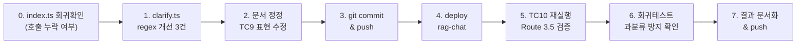

# 리뷰 기반 개선작업 상세 구현서

> **작성일**: 2026-02-23 12:00  
> **근거 문서**: 통합테스트 2차리뷰 검증결과 + 검토의견  
> **범위**: classifyComplexity 개선 3건 + 성능 진단 계측 1건 + 문서 정정 1건  
> **우선순위**: P0(즉시) → P1(Phase 3 착수 전) → P2(Phase 3 진행 중)

---

## 작업 요약

| # | 작업 | 파일 | 우선순위 | 예상 난이도 |
|:---:|---|---|:---:|:---:|
| 1 | `classifyComplexity` regex 개선 (3건) | `clarify.ts` | P0 | ⭐ 낮음 |
| 2 | 검증결과 문서 정오표 수정 | `통합테스트_2차리뷰_검증결과.md` | P0 | ⭐ 낮음 |
| 3 | 성능 계측 (`latency_breakdown`) 추가 | `index.ts`, `types.ts` | P1 | ⭐⭐ 보통 |
| 4 | Edge Function 재배포 + 검증 테스트 | — | P0 | ⭐ 낮음 |

---

## 작업 1: `classifyComplexity` 개선 (P0)

### 1.1 변경 대상

**파일**: `supabase/functions/rag-chat/clarify.ts` (L33-64)

### 1.2 변경 내용 3건

#### 변경 A: 한글 물리량 단위 추가

**현재 코드 (L55)**:
```typescript
const unitMatches = question.match(/\d+(mm|t|ton|m|㎡|㎥|개소|본|T|kg)/gi);
```

**수정 코드**:
```typescript
const unitMatches = question.match(/\d+(mm|t|ton|톤|m|㎡|㎥|개소|본|T|kg|cm)/gi);
```

**변경 이유**: TC10에서 '30톤'이 매칭되지 않았음. 한글 '톤'과 'cm' 추가.

**영향 분석**:

| 질의 예시 | 변경 전 | 변경 후 |
|---|---|---|
| "강관 200mm 30톤" | 1개 매칭(200mm) | 2개 매칭(200mm, 30톤) → +1pt |
| "밸브 15cm 설치" | 0개 매칭 | 1개 매칭(15cm) |
| "콘크리트 30톤 타설" | 0개 매칭 | 1개 매칭(30톤) |

---

#### 변경 B: `+` 연산자 감지 (+1pt)

**추가 위치**: L58 다음 (5번 규칙 앞)

```typescript
// 4.5. '+' 연산자로 명시적 다중 공종 요청 (+1pt)
if (question.includes('+')) score += 1;
```

**변경 이유**: "A + B + C" 패턴은 사용자가 명시적으로 다중 공종을 요청하는 것이므로 복잡도 가산이 타당함.

**영향 분석**:

| 질의 예시 | 변경 전 | 변경 후 |
|---|---|---|
| "덕트 해체 + 보온 철거" | 점수 변경 없음 | +1pt 추가 |
| "강관용접 200mm SCH 40" | '+'없음 → 영향 없음 | 영향 없음 ✅ |

---

#### 변경 C: `산출` 키워드 — 조건부 +1pt (검토의견 반영)

**원안**: `산출`을 복합 명시 키워드(+2pt)에 추가  
**검토의견**: 과분류 위험 → +1pt이나 조건부 적용 권고

**채택안: 독립 규칙 +1pt (공종 2개 이상과 결합 시에만)**

```typescript
// 5.5. '산출/산정' + 복수 공종 조합 시 (+1pt)
if (/산출|산정/.test(question) && workMatchCount >= 2) score += 1;
```

> ⚠️ 주의: 이 규칙은 **기존 규칙 2(workMatchCount ≥ 2 → +2pt)와 별도**로 적용됩니다.  
> 단순 "강관용접 200mm 노무비 산출"은 workMatchCount=1이므로 가산되지 않습니다.

**과분류 방지 검증**:

| 질의 | 공종수 | 산출 | 가산 | 결과 |
|---|:---:|:---:|:---:|---|
| "강관용접 200mm 노무비 산출" | 1 (용접) | ✅ | ❌ 미적용 | simple 유지 ✅ |
| "타설 + 거푸집 설치 노무비 산출" | 2 (타설+설치) | ✅ | ✅ +1pt | complex 전환 ✅ |
| "배관보온 철거 산출" | 2 (보온+철거) | ✅ | ✅ +1pt | complex 전환 ✅ |

---

### 1.3 TC10 점수 재산출 (개선 후)

```
"철근콘크리트 타설 30톤 + 거푸집 설치 + 철근 배근 조립 노무비 산출"

변경 전:
  길이(36자): +1, 공종(타설+설치): +2, 조건: 0, 물리량(30톤 미매칭): 0 = 3pt → simple

변경 후:
  길이(36자): +1
  공종(타설+설치): +2
  조건: 0
  물리량(30톤 매칭): 0 (1개뿐이라 +0)
  '+' 연산자: +1          ← 변경 B
  산출+공종2개: +1        ← 변경 C
  합계: 5pt → complex ✅
```

---

### 1.4 전체 수정 코드 (최종)

```typescript
export function classifyComplexity(question: string, analysis: IntentAnalysis): "simple" | "complex" {
    let score = 0;

    // 1. 질문 길이 (1점: 30자 이상, 2점: 60자 이상)
    if (question.length >= 60) score += 2;
    else if (question.length >= 30) score += 1;

    // 2. 복수 공종 키워드 (+2점)
    const workKeywords = ["해체", "철거", "타설", "용접", "설치", "제작", "보온", "배관", "미장", "조적"];
    let workMatchCount = 0;
    for (const kw of workKeywords) {
        if (question.includes(kw)) workMatchCount++;
    }
    if (workMatchCount >= 2) score += 2;

    // 3. 조건 키워드 (+1점)
    const conditionKeywords = ["고소작업", "고소", "할증", "야간", "지하", "공간"];
    if (conditionKeywords.some(kw => question.includes(kw))) score += 1;

    // 4. 물리량/단위 다중 포함 (+1점)
    const unitMatches = question.match(/\d+(mm|t|ton|톤|m|㎡|㎥|개소|본|T|kg|cm)/gi);
    if (unitMatches && unitMatches.length >= 2) score += 1;

    // 4.5. '+' 연산자로 명시적 다중 공종 요청 (+1점)
    if (question.includes('+')) score += 1;

    // 5. 연산/복합 명시 키워드 (+2점)
    if (/합산|포함해서|전체|총액|계산해/i.test(question)) score += 2;

    // 5.5. '산출/산정' + 복수 공종 조합 시 (+1pt) — 단독 사용 시 과분류 방지
    if (/산출|산정/.test(question) && workMatchCount >= 2) score += 1;

    const isComplex = score >= 4 ? "complex" : "simple";
    console.log(`[classifyComplexity] Score: ${score} -> ${isComplex} (User query: "${question}")`);

    return isComplex;
}
```

---

## 작업 2: 검증결과 문서 정오표 수정 (P0)

### 대상 파일
`docs/plans/20260223_통합테스트_2차리뷰_검증결과.md`

### 수정 내용

**정오표 섹션 — TC9 발화 근거 표현 수정**:

```diff
- "TC9: 4pt → complex 확정"
+ "TC9: 코드 분석상 4pt → complex (서버 로그 미확인)"
```

---

## 작업 3: 성능 계측 `latency_breakdown` 추가 (P1)

### 3.1 목적

TC5(20.6s), TC7(41.1s)의 병목 원인을 정량적으로 특정하기 위해 `search_info`에 단계별 소요시간을 추가합니다.

### 3.2 변경 대상

**파일 1**: `supabase/functions/rag-chat/types.ts`

```typescript
// SearchInfo 인터페이스에 추가
interface SearchInfo {
    entities_found: number;
    relations_expanded: number;
    ilwi_matched: number;
    chunks_retrieved: number;
    latency_ms: number;
    // ↓ 추가
    latency_breakdown?: {
        intent_ms: number;      // analyzeIntent 소요시간
        reasoner_ms?: number;   // generateReasoningGuide (Route 3.5일 때만)
        embed_ms: number;       // 임베딩 생성
        search_ms: number;      // targetSearch + expandGraph
        llm_ms: number;         // generateAnswer
    };
}
```

**파일 2**: `supabase/functions/rag-chat/index.ts` — `handleChat` 및 `searchPipeline` 내부

```typescript
// handleChat 내 계측 예시
const t0 = Date.now();
const analysis = await analyzeIntent(question, history, sessionContext);
const intentMs = Date.now() - t0;

// ... Route 3.5
const t1 = Date.now();
const guide = await generateReasoningGuide(question, history);
const reasonerMs = Date.now() - t1;

// searchPipeline 내부에서도 동일 패턴
const t2 = Date.now();
const embedding = await generateEmbedding(question);
const embedMs = Date.now() - t2;

// 최종 search_info에 breakdown 삽입
search_info: {
    ...기존필드,
    latency_breakdown: { intent_ms: intentMs, reasoner_ms: reasonerMs, embed_ms: embedMs, ... }
}
```

### 3.3 영향 범위

- 기존 API 응답 구조에 **optional 필드 추가**이므로 프론트엔드 호환성 영향 없음
- `latency_breakdown`은 디버그/개발 단계에서만 활용하며, 프로덕션에서는 무시 가능

---

## 작업 4: 재배포 및 검증 (P0)

### 4.1 배포

```bash
npx supabase functions deploy rag-chat --project-ref bfomacoarwtqzjfxszdr --no-verify-jwt
```

### 4.2 검증 테스트 (TC10 재실행)

작업 1 적용 후 TC10을 재실행하여 Route 3.5 발화를 확인합니다:

```
질의: "철근콘크리트 타설 30톤 + 거푸집 설치 + 철근 배근 조립 노무비 산출"
기대: score = 5pt → complex → Route 3.5 triggered
검증: 응답시간이 기존 8.7s보다 증가 (Reasoner 호출) + Supabase 로그에서 확인
```

### 4.3 회귀 테스트 (과분류 방지)

```
질의: "강관용접 200mm SCH 40 노무비 산출"
기대: score = 0(길이 24자, <30? → 0) + 0(용접1개) + 0 + 0(200mm→1개뿐) + 0(+없음) + 0(산출+공종1개) = 0pt → simple
검증: Route 4로 직행, 이전과 동일 응답
```

---

## 실행 순서



| 단계 | 예상 소요 | 비고 |
|:---:|:---:|---|
| 0 | 1분 | `index.ts` unstaged 회귀 방지 (import 및 호출 원복) |
| 1~3 | 3분 | 코드 수정 + 커밋 |
| 4 | 1분 | Supabase 배포 |
| 5~6 | 3분 | API 호출 2건 |
| 7 | 2분 | 결과 기록 |
| **합계** | **~10분** | |

---

## 작업 3 (P1: latency_breakdown)은 Phase 3 착수 시 별도 진행

Phase 3에서 `searchPipeline` 리팩터링이 예정되어 있으므로, 계측 코드를 그때 함께 삽입하는 것이 효율적입니다. 현 시점에서는 P0 작업(classifyComplexity + 문서 정정 + 배포 + 검증)만 즉시 실행합니다.
