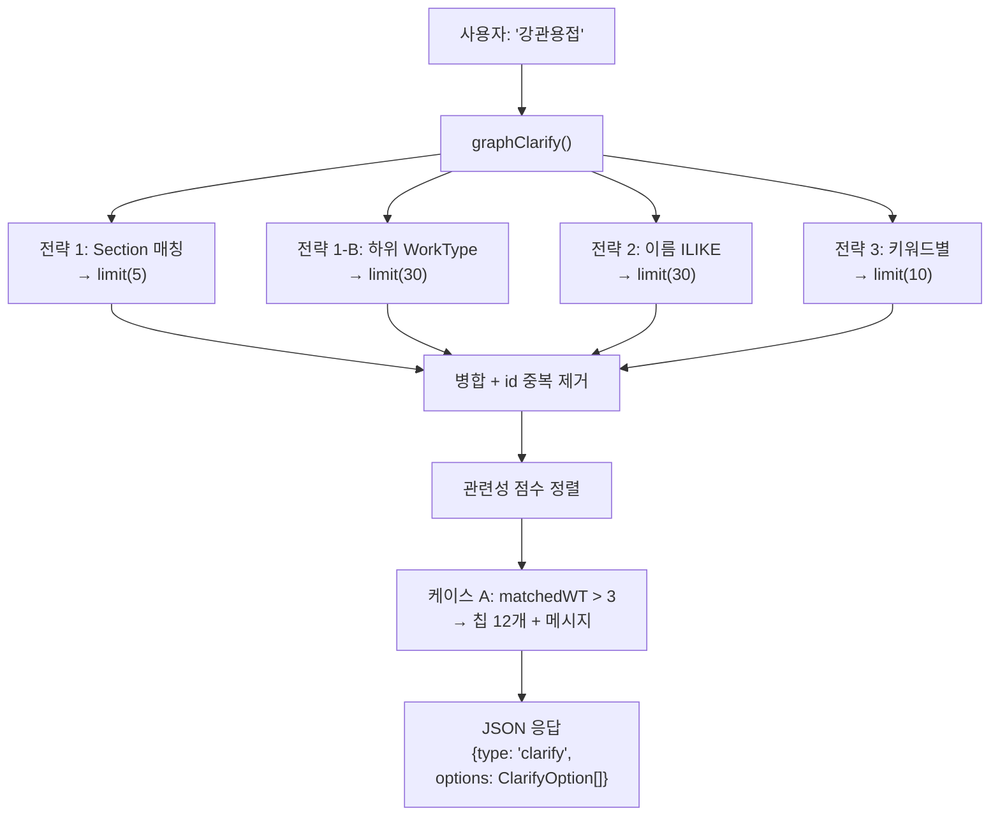
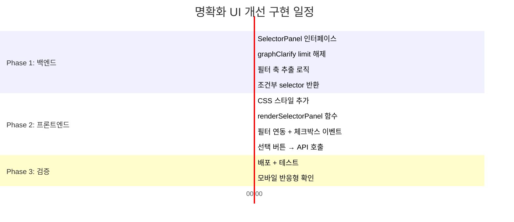

# 명확화 UI 개선: 드롭다운/체크박스 방식 상세 검토 보고서

**작성일**: 2026-02-14  
**대상 파일**: `index.html` (프론트엔드), `index.ts` (백엔드 Edge Function)  
**요청**: 현재 flat chip 방식 → 드롭다운/체크박스 + 선택 버튼 방식으로 개선

---

## 1. 현재 구조 분석

### 1-1. 백엔드 데이터 흐름



### 1-2. 프론트엔드 렌더링

| 구성 요소          | 현재 구현                                | 위치     |
| ------------------ | ---------------------------------------- | -------- |
| **칩 컨테이너**    | `.clarify-chips` (flex-wrap)             | L569~575 |
| **칩 버튼**        | `.clarify-chip` (pill shape, 3종 스타일) | L577~629 |
| **칩 클릭 핸들러** | `handleClarifyClick()` → 즉시 API 호출   | L961~972 |
| **메시지 렌더링**  | `addClarifyMessage()` → 칩 루프 생성     | L911~958 |

### 1-3. 현재 한계점

| #   | 문제                        | 원인                              | 영향                                     |
| --- | --------------------------- | --------------------------------- | ---------------------------------------- |
| 1   | **DB 122건 중 40건만 노출** | `limit(30)` × 2 전략 병합         | 사용자가 원하는 규격을 못 찾을 수 있음   |
| 2   | **칩 12개 제한**            | `if (options.length >= 12) break` | 호칭경 15~125mm만 표시, 200~600mm 미노출 |
| 3   | **정렬 없음**               | DB 기본 순서(이름 알파벳)         | 15 → 100 → 125 순, 호칭경 크기순 아님    |
| 4   | **시각적 과부하**           | 12개 pill 버튼이 화면 가득        | 스크롤 없이 한눈에 파악 어려움           |
| 5   | **필터 불가**               | 호칭경, SCH 조건 선택 불가        | 원하는 조합을 직접 찾아야 함             |
| 6   | **다중 선택 불가**          | 칩 클릭 → 즉시 전송               | 여러 규격 비교 조회 불가능               |

---

## 2. 사용자 제안 분석

### 2-1. 제안 내용 정리

> "강관용접 전체보기나 엔티티 항목들을 선택하면 밑으로 해당 절들이 드롭박스나 체크박스로 생성되고,
> 해당 절이나 엔티티를 클릭하고 선택 버튼을 누르면 그것을 보여주는 형식"

핵심 변경 3가지:

1. **계층 탐색**: 칩 → 하위 옵션이 드롭다운으로 펼쳐지는 2단계 구조
2. **다중 선택**: 체크박스로 여러 항목 선택 가능  
3. **확정 액션**: "선택" 버튼을 눌러야 조회 실행 (즉시 전송 아님)

### 2-2. 장점 평가

| 장점                     | 설명                                        | 현재 대비 개선도 |
| ------------------------ | ------------------------------------------- | ---------------- |
| **122건 전체 탐색 가능** | 드롭다운은 스크롤로 전체 목록 표시          | ★★★★★            |
| **필터링**               | 호칭경/SCH 2축 필터로 원하는 조합 즉시 도달 | ★★★★★            |
| **다중 선택**            | 여러 규격을 한번에 조회 → 비교 가능         | ★★★★☆            |
| **시각적 정돈**          | flat chip 12개 → 구조화된 패널 1개          | ★★★★☆            |
| **실수 방지**            | 즉시 전송 아닌 확인 후 전송                 | ★★★☆☆            |

### 2-3. 리스크 및 고려사항

| 리스크               | 심각도 | 대응 방안                                                             |
| -------------------- | ------ | --------------------------------------------------------------------- |
| **모바일 UX 저하**   | 🟡 중간 | 드롭다운이 작은 화면에서 사용 어려움 → 모바일은 bottomsheet 방식 검토 |
| **구현 복잡도 증가** | 🟡 중간 | HTML/CSS/JS 200~300줄 추가, 백엔드 limit 해제 필요                    |
| **응답 시간 증가**   | 🟢 낮음 | limit(30→200)으로 변경 시 SQL 쿼리 ~50ms 증가 (무시 가능)             |
| **기존 UX 파괴**     | 🔴 높음 | 단순 질문(Section 2~3개)에도 복잡한 UI → 조건부 적용 필요             |
| **채팅 맥락 오염**   | 🟡 중간 | 선택 패널이 채팅 흐름의 일부로 들어가야 함 → DOM 구조 설계 중요       |

---

## 3. 구현 설계

### 3-1. UI 구조 (제안)

```
┌─────────────────────────────────────────────┐
│ 🤖 기계설비부문 > 제13장 > 강관용접         │
│    품셈은 122개 작업으로 분류되어 있습니다.  │
│    아래에서 규격을 선택해 주세요.            │
├─────────────────────────────────────────────┤
│  ┌─────────────┐  ┌──────────┐              │
│  │호칭경(mm) ▼ │  │ SCH    ▼ │   🔍 필터    │
│  │ ☑ 전체선택  │  │ ☑ 전체   │              │
│  │ ☐ 15        │  │ ☐ 20     │              │
│  │ ☐ 20        │  │ ☐ 30     │              │
│  │ ☐ 25        │  │ ☐ 40     │              │
│  │ ☐ 32        │  │ ☐ 60     │              │
│  │ ...         │  │ ☐ 80     │              │
│  └─────────────┘  │ ☐ 100    │              │
│                   │ ☐ 120    │              │
│                   │ ☐ 140    │              │
│                   │ ☐ 160    │              │
│                   └──────────┘              │
├─────────────────────────────────────────────┤
│  매칭 결과: 9건                             │
│  ┌─ ☐ 강관용접(100, SCH 40)  ──────────┐   │
│  ├─ ☐ 강관용접(100, SCH 80)  ──────────┤   │
│  ├─ ☐ 강관용접(100, SCH 120) ──────────┤   │
│  ├─ ☐ 강관용접(100, SCH 160) ──────────┤   │
│  └──────────────────────────────────────┘   │
│                                             │
│  ┌──────────────┐  ┌────────────────────┐   │
│  │ 📋 전체보기  │  │ 🔎 선택항목 조회(2)│   │
│  └──────────────┘  └────────────────────┘   │
└─────────────────────────────────────────────┘
```

### 3-2. 적용 조건 (조건부 렌더링)

> [!IMPORTANT]
> 모든 clarify 응답에 드롭다운 UI를 적용하면 간단한 2~3개 선택에도 과도한 UI가 노출됩니다.

| 조건                                             | 적용 UI                 | 이유                         |
| ------------------------------------------------ | ----------------------- | ---------------------------- |
| `options.length ≤ 6`                             | **기존 chip 방식 유지** | 소수 선택은 chip이 더 직관적 |
| `options.length > 6` 또는 `option_type=selector` | **드롭다운 패널 방식**  | 다수 항목은 구조화 필요      |
| 섹션 선택 (Step 1, 2~3개)                        | **기존 chip 방식 유지** | 분야 선택은 chip으로 충분    |

### 3-3. 데이터 구조 변경

#### 백엔드 (`index.ts`)

```typescript
// 현재 ClarifyOption
interface ClarifyOption {
    label: string;
    query: string;
    entity_id?: string;
    source_section?: string;
    section_id?: string;
    option_type?: 'section' | 'worktype' | 'full_view';
}

// 신규: SelectorPanel (drilldown UI용)
interface SelectorPanel {
    panel_type: 'spec_selector';   // 향후 확장: 'section_tree'
    section_path: string;          // "기계설비부문 > 제13장 > 강관용접"
    total_count: number;           // 122
    filters: FilterAxis[];         // 호칭경, SCH 등 필터 축
    items: SelectorItem[];         // 전체 항목 목록
}

interface FilterAxis {
    label: string;                 // "호칭경(mm)"
    key: string;                   // "spec1" (파싱 키)
    values: string[];              // ["15","20","25",...]
}

interface SelectorItem {
    entity_id: string;
    name: string;
    spec1?: string;                // 호칭경 "100"
    spec2?: string;                // SCH "40"
}

// ClarificationInfo 확장
interface ClarificationInfo {
    options: ClarifyOption[];
    reason: string;
    original_query: string;
    selector?: SelectorPanel;      // ← 신규 추가
}
```

#### 프론트엔드 (`index.html`)

```javascript
// addClarifyMessage()에 selector 분기 추가
function addClarifyMessage(message, clarification, searchInfo) {
    // ... 기존 코드 ...

    if (clarification.selector) {
        // 드롭다운 패널 렌더링
        html += renderSelectorPanel(clarification.selector);
    } else if (clarification.options?.length > 0) {
        // 기존 chip 렌더링 (6개 이하)
        html += renderChips(clarification.options);
    }
}
```

### 3-4. 변경 파일 및 예상 작업량

| 파일                | 변경 내용                                                                           | 예상 줄 수      |
| ------------------- | ----------------------------------------------------------------------------------- | --------------- |
| `index.html` (CSS)  | `.selector-panel`, `.filter-dropdown`, `.selector-item`, `.selector-actions` 스타일 | +80줄           |
| `index.html` (JS)   | `renderSelectorPanel()`, `filterItems()`, `handleSelectorSubmit()`, 체크박스 이벤트 | +120줄          |
| `index.ts` (백엔드) | `graphClarify()` 수정: limit 해제, `SelectorPanel` 구성, 필터 축 추출               | +60줄           |
| `index.ts` (응답)   | `ClarificationInfo.selector` 필드 추가                                              | +5줄            |
| **합계**            |                                                                                     | **~265줄 추가** |

### 3-5. 필터 축 자동 추출 로직 (백엔드)

강관용접 `강관용접(100, SCH 40)` 형태에서 규격 값 추출:

```typescript
// 엔티티 이름에서 필터 값 추출
function extractFilterAxes(workTypes: any[]): { filters: FilterAxis[], items: SelectorItem[] } {
    const spec1Set = new Set<string>();
    const spec2Set = new Set<string>();
    const items: SelectorItem[] = [];

    // 이름 패턴: "공종명(spec1, prefix spec2)" 
    // 예: "강관용접(100, SCH 40)" → spec1="100", spec2="SCH 40"
    const pattern = /\((\d+),\s*(.*?)\)$/;

    for (const wt of workTypes) {
        const match = wt.name.match(pattern);
        if (match) {
            spec1Set.add(match[1]);
            spec2Set.add(match[2]);
            items.push({
                entity_id: wt.id,
                name: wt.name,
                spec1: match[1],
                spec2: match[2],
            });
        }
    }

    // 숫자 정렬
    const sortNum = (a: string, b: string) => {
        const na = parseInt(a.replace(/\D/g, ''));
        const nb = parseInt(b.replace(/\D/g, ''));
        return na - nb;
    };

    return {
        filters: [
            { label: '호칭경(mm)', key: 'spec1', values: [...spec1Set].sort(sortNum) },
            { label: 'SCH', key: 'spec2', values: [...spec2Set].sort(sortNum) },
        ],
        items,
    };
}
```

---

## 4. 구현 단계



**예상 소요 시간**: 약 **2시간 30분**

---

## 5. 대안 비교

| 접근 방식                                     | 장점                                      | 단점                                | 추천도 |
| --------------------------------------------- | ----------------------------------------- | ----------------------------------- | ------ |
| **A. 드롭다운 필터 + 체크박스 (사용자 제안)** | 전체 데이터 탐색, 다중 선택, 직관적 필터  | 구현 복잡, 기존 UX 대비 큰 변화     | ⭐⭐⭐⭐⭐  |
| **B. 기존 chip + 페이지네이션**               | 간단한 구현, 기존 UX 유지                 | 다중 선택 불가, 필터 없음           | ⭐⭐⭐☆☆  |
| **C. 검색 가능 리스트 (단일 드롭다운)**       | 중간 복잡도, 타이핑 검색 가능             | 다중 선택 없음, 모바일 불편         | ⭐⭐⭐☆☆  |
| **D. 2축 매트릭스 그리드**                    | 호칭경×SCH 교차표로 전체 조합 한눈에 파악 | 구현 복잡, 데이터 없는 셀 처리 필요 | ⭐⭐⭐⭐☆  |

> [!TIP]
> **권장**: A안(사용자 제안)을 기본으로 하되, **6개 이하 옵션은 기존 chip 유지** (조건부 적용).
> 향후 D안(매트릭스 그리드)도 강관용접처럼 2축 규격이 있는 경우 추가 적용 가능.

---

## 6. 결론 및 권장 사항

### 사용자 제안의 타당성: **✅ 매우 적합**

현재 시스템의 핵심 한계(122건 중 12개만 표시, 필터 없음, 다중 선택 불가)를 정확히 해결하는 제안입니다.

### 구현 시 핵심 원칙

1. **조건부 적용**: options > 6개일 때만 Selector Panel, 그 외는 기존 chip 유지
2. **호칭경×SCH 2축 필터**: 이름 패턴에서 자동 추출 (수동 데이터 등록 불필요)
3. **다중 선택 → 일괄 조회**: 선택된 entity_id 배열을 백엔드로 전송
4. **반응형**: 데스크톱은 나란히 배치, 모바일은 아코디언/바텀시트로 전환

### 다음 단계

| 단계 | 내용                                         | 의존성         |
| ---- | -------------------------------------------- | -------------- |
| 1    | 사용자 확인 후 구현 착수                     | 이 보고서 승인 |
| 2    | 백엔드 SelectorPanel 인터페이스 + limit 해제 | 없음           |
| 3    | 프론트엔드 Selector Panel 컴포넌트 작성      | 백엔드 완료    |
| 4    | 배포 + 강관용접/강판용접 테스트              | 3 완료         |

---

## 7. 기술 참고: 현재 코드 위치

| 컴포넌트               | 파일         | 라인        |
| ---------------------- | ------------ | ----------- |
| `graphClarify()`       | `index.ts`   | L1065~L1583 |
| 케이스 A (40개 표시)   | `index.ts`   | L1491~L1532 |
| Step 2 (sectionId)     | `index.ts`   | L1080~L1228 |
| `.clarify-chips` CSS   | `index.html` | L568~L636   |
| `addClarifyMessage()`  | `index.html` | L910~L958   |
| `handleClarifyClick()` | `index.html` | L960~L972   |
