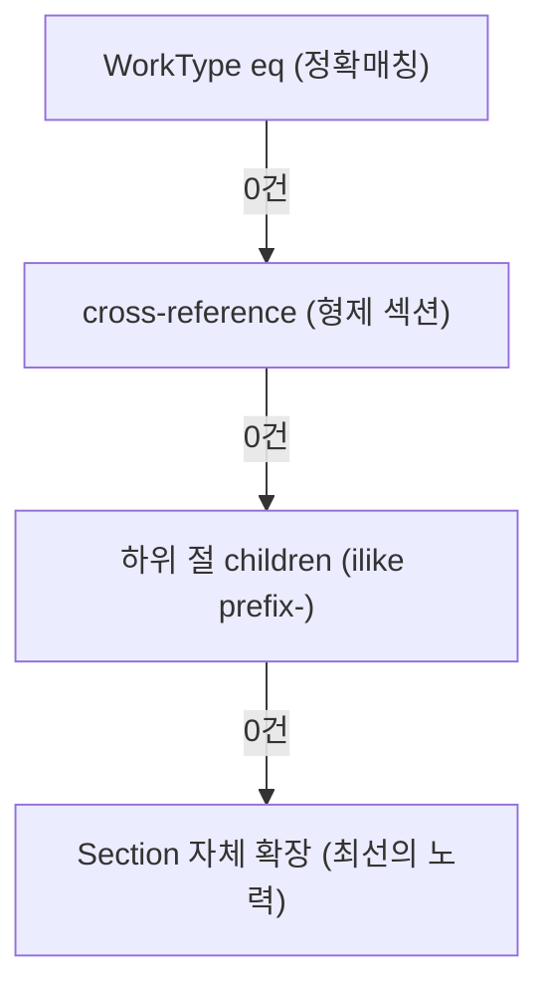

# Edge Function 과설계 진단 보고서

> 대상: `edge-function/` 9개 파일, 총 **228KB**

---

## 파일 규모 요약

| 파일           | Lines |   KB | 최대 함수      | 함수 Lines |
| -------------- | ----: | ---: | -------------- | ---------: |
| **index.ts**   | 1,128 |   54 | `handleChat`   |    **713** |
| **clarify.ts** | 1,170 |   55 | `graphClarify` |    **717** |
| **graph.ts**   |   339 |   15 | `expandGraph`  |        200 |
| search.ts      |     — |   19 |                |            |
| llm.ts         |     — |   11 |                |            |
| types.ts       |     — |    6 |                |            |
| context.ts     |     — |   12 |                |            |
| config.ts      |     — |    3 |                |            |
| embedding.ts   |     — |    2 |                |            |

> [!WARNING]
> `handleChat`(713줄)과 `graphClarify`(717줄)은 단일 함수로서 **과도한 규모**입니다. 일반적으로 하나의 함수는 50~100줄을 넘지 않는 것이 이상적입니다.

---

## 과설계 패턴 6가지

### 1️⃣ 응답 객체 보일러플레이트 반복 (6회)

`handleChat` 내에서 거의 동일한 응답 객체를 **6번** 이상 조립합니다:

```typescript
// 이 패턴이 L396, L617, L631, L682, L700, L1008 등에 반복
return {
    type: "answer",
    answer: ...,
    sources: [...],
    search_info: {
        entities_found: ..., relations_expanded: ...,
        ilwi_matched: ..., chunks_retrieved: ...,
        latency_ms: Date.now() - startTime,
        token_usage: { ... },
    },
};
```

**위험도**: ★★☆ (유지보수 시 응답 구조 변경하면 6곳 동시 수정 필요)
**해결**: `makeResponse()` 헬퍼 함수로 추출

---

### 2️⃣ full_view 4단계 폴백 체인 (L450~L577)



**127줄에 걸친 4단계 폴백.** 각 단계마다:
- Supabase 쿼리 실행
- WorkType 배열 생성
- `expandGraph` 호출
- chunk 텍스트 병합

**위험도**: ★★★ (가장 심각)
- 각 단계에서 `expandGraph`를 호출하지만 `skipSectionExpansion`이 적용되지 않음
- cross-reference에서 비동기 서브쿼리(IIFE)를 `.in()` 안에 인라인으로 삽입 (L488~498)

**해결**: `resolveWorkTypes(sectionId)` 함수로 추출하여 폴백 전략을 선형화

---

### 3️⃣ graphClarify 4전략 병렬 + 3케이스 분기 (717줄)

```
전략 1-A: Section ILIKE 정확매칭
전략 1-B: 토큰 분리 ILIKE 폴백
전략 2: WorkType 직접 ILIKE
전략 3: 키워드별 독립 검색 (for loop)
전략 4: chunk text 본문 검색 (조건부)
→ 결과 병합 → 관련성 점수 → 케이스 분기:
  케이스 A: WorkType 다수 (sub_section drill-down 포함)
  케이스 B: Section 1 + WorkType 소수
  케이스 C: 소수 결과 → 확인 질문
```

**위험도**: ★★★
- 전략 3의 `for` loop에서 **N번의 Supabase 쿼리**가 순차 실행됨 (키워드 수만큼)
- 전략 4는 복합어 매칭 조건이 복잡하여 언제 실행되는지 파악이 어려움
- sub_section drill-down 코드가 **Step 2와 케이스 A에서 거의 동일하게 중복** (L496~545 ≈ L984~1034)

**해결**: 전략들을 `SearchStrategy` 배열로 추상화, sub_section drill-down을 별도 함수로 추출

---

### 4️⃣ expandGraph RAW_TABLE 폴백 (L102~127)

```typescript
// Phase 1: Labor 관계도 없고 properties에도 quantity 없는 WT → unit_costs 원문 폴백
if (!hasLaborRel && !(wtProps.quantity && wtProps.unit)) {
    const { data: rawData } = await supabase
        .from("unit_costs")     // ← 완전히 다른 테이블!
        .select("content, name")
        .ilike("content", `%${workType.name}%`)
        .limit(1);
    // ...
}
```

**위험도**: ★★☆
- **그래프 확장** 함수 안에서 **원문 테이블 검색**을 하는 것은 책임 혼재 (SRP 위반)
- `ILIKE` 전문 검색은 성능 문제를 유발할 수 있음
- 이 폴백이 실제로 얼마나 발동하는지 알 수 없음

**해결**: `unit_costs` 폴백은 `graph.ts`에서 제거하고, 필요 시 `index.ts`의 context 조합 단계에서 별도 처리

---

### 5️⃣ handleChat 내 Section-Only 분기 (L816~904)

`handleChat`의 Phase 1 검색 결과가 Section만 있을 때:
- **L823~867**: 복수 섹션 → 섹션 선택 칩 직접 생성
- **L870~903**: 단일 섹션 → WorkType 확인 후 `graphClarify` 재호출

이 로직은 **`graphClarify`의 Step 1과 거의 동일**합니다:

| handleChat L823~867      | graphClarify L950~977    |
| ------------------------ | ------------------------ |
| `graph_chunks` 메타 조회 | `graph_chunks` 메타 조회 |
| options 배열 생성        | options 배열 생성        |
| section 선택 칩 반환     | section 선택 칩 반환     |

**위험도**: ★★☆
**해결**: `handleChat`의 Section-Only 분기를 제거하고, `graphClarify`에 위임

---

### 6️⃣ 의도별 재귀 호출 패턴 (L704, L716, L780)

```typescript
// cost_calculate → handleChat 재귀 호출
return handleChat(question, history, targetEntityId, undefined, sessionContext, {
    intent: "cost_calculate", ...
});

// modify_request → handleChat 재귀 호출
return handleChat(question, history, sessionContext.last_entity_id, undefined, sessionContext, {
    intent: "cost_calculate", ...
});

// report_request → handleChat 재귀 호출
return handleChat(question, history, targetEntityId, undefined, sessionContext, {
    intent: "report_request", ...
});
```

**위험도**: ★☆☆ (현재 1단계만 재귀하므로 심각하지 않으나)
- 의도 분석 결과를 **다시 handleChat으로 던지는 구조**는 코드 흐름 추적을 어렵게 함
- `answerOptions` 파라미터가 점점 복잡해지는 추세

---

## 정량 분석: 실제 사용되지 않을 수 있는 코드

| 기능                                    |      Lines | 실제 발동 빈도 (추정)           |
| --------------------------------------- | ---------: | ------------------------------- |
| full_view cross-reference (L476~511)    |         35 | 매우 낮음 (WT 0건인 섹션에서만) |
| full_view children 탐색 (L513~576)      |         63 | 낮음 (cross-ref도 실패 시)      |
| RAW_TABLE 폴백 (L102~127)               |         25 | 확인 불가                       |
| 전략 4 chunk text 검색 (L777~809)       |         32 | 낮음 (복합어 미매칭 시만)       |
| modify_request exclude_labor (L733~758) |         25 | 0 (미구현 안내 반환)            |
| report_request (L761~783)               |         22 | 낮음                            |
| **합계 (잠재 미사용)**                  | **~202줄** |                                 |

---

## 권장 리팩토링 우선순위

| 우선순위 | 작업                                          | 효과                           | 난이도 |
| :------: | --------------------------------------------- | ------------------------------ | ------ |
|   🔴 1    | `makeResponse()` 헬퍼 추출                    | ~150줄 감소, 응답 구조 일원화  | 낮음   |
|   🔴 2    | sub_section drill-down 함수 추출              | ~60줄 중복 제거                | 낮음   |
|   🟡 3    | full_view 폴백 체인 `resolveWorkTypes()` 추출 | 127줄 단순화, 가독성 대폭 향상 | 중간   |
|   🟡 4    | Section-Only 분기 → `graphClarify` 위임       | ~50줄 감소, 중복 제거          | 중간   |
|   🟢 5    | RAW_TABLE 폴백 → context 단계로 이동          | SRP 개선                       | 낮음   |
|   🟢 6    | 재귀 호출 → 내부 함수 분기로 변환             | 흐름 단순화                    | 높음   |

> [!TIP]
> 우선순위 1~2만 실행해도 **~210줄 감소** + 유지보수성 크게 향상됩니다.
> 기능 변경 없이 순수 리팩토링이므로 **파급 효과(Side Effect) 최소**입니다.

---

## 결론

현재 코드는 **점진적 기능 추가 과정에서 누적된 "if-else 지층"** 형태입니다. 각 수정이 독립적으로는 합리적이었으나, 전체적으로 보면:

1. **단일 함수가 너무 많은 책임을 담당** (handleChat: 의도분석→검색→폴백→context→LLM→응답)
2. **동일 패턴의 코드가 여러 곳에 복제** (응답 조립, sub_section drill-down, section 선택)
3. **폴백 체인이 깊어** 실제 실행 경로를 예측하기 어려움

**현재 기능에는 문제가 없으나**, 다음 기능 추가 시 복잡도가 급격히 증가할 위험이 있습니다.
