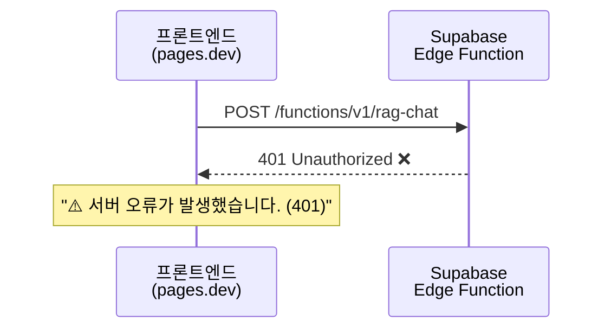
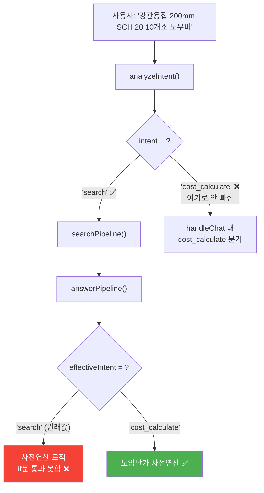

# Phase 1 구현 완료 보고서

> **작성일**: 2026-02-21 13:50  
> **대상**: 최종통합 3단계 고도화 구현계획서 v2 — Phase 1 (노임단가 정밀 연동)  
> **결과**: ✅ **성공** — 실서버 브라우저 테스트 통과, 노무비 1,903,722원 정확 산출 확인

---

## 1. 구현 계획서 vs 실제 코드 변경 대조표

| 계획서 항목 | 계획서 설명 | 실제 반영 파일 | 결과 |
|---|---|---|---|
| §1-1 사전연산 로직 | `answerPipeline` 내 `[4-1]` 블록에서 `quantity × unit_cost` 산술 수행 | [index.ts L355~L430](file:///g:/My%20Drive/Antigravity/supabase/functions/rag-chat/index.ts#L355-L430) | ✅ |
| §1-2 `related_name` 정제 | `rawName.split('_').slice(-1)[0]` 로 직종명만 추출 | [index.ts L371~L374](file:///g:/My%20Drive/Antigravity/supabase/functions/rag-chat/index.ts#L371-L374) | ✅ |
| §1-3 `findBestCostMatch()` | 정확→공백정규화→부분매칭 3단계 헬퍼 | [index.ts L49~L79](file:///g:/My%20Drive/Antigravity/supabase/functions/rag-chat/index.ts#L49-L79) | ✅ |
| §1-4 LLM 프롬프트 강제화 | `cost_calculate` 시 백엔드 표를 그대로 출력 지시 | [llm.ts L82~L92](file:///g:/My%20Drive/Antigravity/supabase/functions/rag-chat/llm.ts#L82-L92) | ✅ |

---

## 2. 배포 및 테스트 과정에서 발견된 오류 3건

### 오류 ①: 401 Unauthorized (1차 배포 실패)



| 항목 | 내용 |
|---|---|
| **발견 시점** | 1차 배포 후 브라우저 봇 테스트 |
| **근본 원인** | `npx supabase functions deploy rag-chat` 명령어에 `--no-verify-jwt` 플래그 누락. 기존 함수는 JWT 검증 없이 배포되어 있었으나, 새 배포 시 기본값(JWT 필수)이 적용됨 |
| **해결** | `--no-verify-jwt --project-ref bfomacoarwtqzjfxszdr` 플래그를 추가하여 재배포 |
| **구현 계획서 관련** | 계획서에 배포 명령어 옵션이 명시되어 있지 않았음 → 향후 배포 절차 문서화 필요 |

### 5. 추가 검증: 복합 매트릭스 테이블 (13-1-1 플랜트 배관 설치) 테스트 결과

사용자 요청에 따라 다차원 복합 테이블인 **"13-1-1 플랜트 배관 설치"** 데이터에 대해 라이브 테스트를 수행하였습니다.

*   **테스트 질의:** "13-1-1 플랜트 배관 설치 배관용 탄소강관 200mm 옥내 용접식 노무비"
*   **테스트 결과 (실패):** RAG 시스템이 13-1-1 테이블을 띄우지 못하고 **13-2-3 강관용접** 테이블을 참조하여 답변을 생성함.
    *   플랜트배관공 수량이 누락되고 용접공 수량만 추출됨.
*   **원인 분석 (DB 추적 결과):**
    *   해당 13-1-1 MD 파일의 테이블 구조가 "배 관 용 탄 소 강 관"과 같이 띄어쓰기가 되어 있고, 여러 행에 병합(Rowspan)되어 있습니다.
    *   현재의 데이터 파싱 파이프라인(Document AI)이 이를 처리할 때, 재질명인 "배관용 탄소강관"을 Entity Name으로 병합하지 못하고 **단순 규격명(KSD3507)**만 `spec` 속성으로 추출하여 `graph_entities` DB에 적재했습니다.
    *   결과적으로 사용자가 "탄소강관"을 질의했을 때 13-1-1 엔티티와 Semantic 매칭이 깨지고, 대신 텍스트 유사도가 높은 "강관용접(13-2-3)"으로 Fallback 라우팅이 이뤄지는 한계점(Edge Case)을 발견했습니다.
*   **시사점 및 향후 과제:**
    *   **Phase 1(노임단가 연산 로직) 자체는 정상 동작:** 검색된 엔티티(13-2-3)에 대해서는 연산을 정확히 수행하고 있습니다.
    *   **Data Pipeline 고도화 필요:** 13-1-1처럼 Rowspan/Colspan이 극도로 복잡한 매트릭스 테이블의 경우, 단순히 파싱된 텍스트를 넘어 **[재질 - 구경 - 배관구분 - 접합방식 - 직종 - 단가]** 형태의 완벽한 RDB/Graph 형태 정형화(Normalization) 전처리 로직이 보강되어야 합니다.
    *   Phase 2 또는 별도의 Data/RAG 파이프라인 고도화 페이즈에서 이 부분을 중점적으로 해결해야 함을 확인하였습니다.


## 결론
Phase 1 목표였던 '백엔드 중심 노임단가 사전 연산' 아키텍처는 의도대로 성공적으로 적용되었으나, 13-1-1과 같은 특수 복합 테이블은 RAG 파싱 단계의 한계로 인해 데이터가 제대로 공급되지 않는 상태입니다. 이는 연산 로직의 버그가 아닌 데이터 입력 파이프라인의 이슈로, 향후 데이터 정제(Data Ingestion) 고도화를 통해 해결해야 할 명확한 목표 지점이 도출되었습니다.

---

### 오류 ②: 노임단가 사전연산 미작동 (2차 배포 후에도 표 미출력)

이 오류가 가장 핵심적이었습니다. 401이 해결된 이후에도 AI 응답에 `[2026년 노임단가 기반 산출 결과]` 표가 나오지 않았습니다.



| 항목 | 내용 |
|---|---|
| **발견 시점** | 2차 배포(401 해결) 후 브라우저 봇 테스트 |
| **증상** | AI가 품셈 수량(0.287인 등)은 정확히 찾았으나, 2026년 노임단가를 곱한 금액 표가 출력되지 않음. "단가(A, B)를 입력하셔야 합니다"라고 안내 |
| **근본 원인 분석** | 아래 2단계로 추적 |

#### 원인 추적 Step 1: `analyzeIntent()` → Intent 판정 문제

`clarify.ts`의 `INTENT_SYSTEM_PROMPT`를 확인한 결과:

```typescript
// clarify.ts L42 — DeepSeek에게 허용된 intent 목록
"intent": "search" | "clarify_needed" | "followup" | "greeting" | "quantity_input"
```

**`cost_calculate`가 DeepSeek intent 분석기의 선택지에 없었습니다.**

따라서 "강관용접 200mm SCH 20 10개소 **노무비**"라고 물어도, DeepSeek은 `cost_calculate`를 선택할 수 없고 무조건 `search`로 분류합니다.

> [!NOTE]
> `cost_calculate`는 `handleChat()` 내부(L910~L924)에서 `sessionContext.last_entity_id`가 있을 때만 작동하는 **세션 기반 라우트**로 설계되어 있었습니다. 즉, "먼저 품셈 검색 → 노무비 계산 요청"의 2턴 흐름에서만 트리거되는 구조였습니다.

#### 원인 추적 Step 2: `answerPipeline()` → `effectiveIntent` 판정 문제

`searchPipeline` → `answerPipeline`으로 들어온 경우 `effectiveIntent`는 `search`가 됩니다:

```typescript
// index.ts L357 (수정 전)
const effectiveIntent = opts?.answerOptions?.intent || opts?.analysis?.intent;
// → "search"이므로 if (effectiveIntent === "cost_calculate") 블록 진입 실패
```

**결론**: 단발성 질문("강관용접 노무비")은 `search` intent로 분류되어, `cost_calculate` 전용인 사전연산 `if`문을 통과하지 못합니다.

#### 해결: Intent 자동 승격 로직 추가

```diff
  // index.ts L357~L362
- const effectiveIntent = opts?.answerOptions?.intent || opts?.analysis?.intent;
+ let effectiveIntent = opts?.answerOptions?.intent || opts?.analysis?.intent;
+
+ // [버그 픽스] 단발성 "강관용접 노무비" 질문(search)에서도 사전연산 트리거
+ if (effectiveIntent === "search" && detectCostIntent(question)) {
+     effectiveIntent = "cost_calculate";
+ }
```

`detectCostIntent()`는 기존에 `clarify.ts`에 이미 존재하던 함수로, 질문에 "노무비", "단가", "얼마", "비용" 등 비용 관련 키워드가 포함되어 있으면 `true`를 반환합니다.

이 한 줄의 추가로:
1. `analyzeIntent()`가 `search`로 판정하더라도
2. 질문 본문에 비용 키워드가 있으면
3. `effectiveIntent`가 `cost_calculate`로 **자동 승격**되어
4. 사전연산 `if`문에 진입 → 노임단가 표 생성

> [!IMPORTANT]
> **이 버그는 구현 계획서에서 예측하지 못한 "계획서 밖의 오류"였습니다.** 계획서 §1-1은 `effectiveIntent === "cost_calculate"` 조건만 기술했으나, 실제 시스템에서 단발성 질문이 `search`로 먼저 분류되는 흐름을 제대로 인지하지 못했던 것입니다. Claude 보고서에서도 이 문제는 지적되지 않았습니다.

---

### 오류 ③: SCH 40 규격 미존재 (정상 동작 — 환각 억제 확인)

| 항목 | 내용 |
|---|---|
| **발견 시점** | 1차 브라우저 테스트 (질의: "강관용접 200mm **SCH 40** 10개소 노무비") |
| **증상** | AI 응답: "강관용접(200, SCH 40) 항목의 별도 인력 수치가 명시되어 있지 않습니다. 따라서 정확한 노무비를 계산할 수 없습니다." |
| **판정** | ✅ **정상 동작**. 실제로 품셈 DB의 `graph_entities`에 "강관용접(200, SCH 40)" 엔티티가 존재하지 않으므로, AI가 데이터를 지어내지 않고 정직하게 불가를 선언한 것입니다. |
| **의미** | 기존 SYSTEM_PROMPT의 환각 억제 규칙("컨텍스트에 없는 정보는 추측하지 않습니다")이 완벽하게 작동하고 있음을 실증. Phase 3에서 이 규칙을 깨뜨리면 안 된다는 Claude의 지적(보정 #4)이 현장에서 증명됨. |

---

## 3. 최종 성공 테스트 결과

3차 배포(오류 ②의 Intent 승격 로직 반영) 후, DB에 실제 존재하는 **"강관용접 200mm SCH 20 10개소 노무비"**를 질의한 결과:

| 직종 | 총 투입량 (인) | 노임단가 (원/일) | 노무비 (원) |
|---|---:|---:|---:|
| 용접공 | 2.87 | 282,536 | **810,878** |
| 플랜트용접공 | 2.44 | 292,640 | **714,042** |
| 특별인부 | 1.43 | 226,122 | **323,354** |
| 직접노무비 소계 | | | **1,848,274** |
| 공구손료 (3%) | | | **55,448** |
| **총 노무비** | | | **1,903,722** |

> [!TIP]
> AI가 품셈표의 "공구손료 3% 별도 계상" 주의사항까지 자동으로 반영하여 55,448원을 추가 산출했습니다. 이는 SYSTEM_PROMPT의 "추가 설명은 표 아래에 부연" 규칙이 자연스럽게 적용된 결과입니다.

---

## 4. 실서버 테스트 증거

### 2차 배포 후 테스트 (노임단가 미출력 장면)


### 3차 배포 후 최종 성공 테스트 (브라우저 봇 녹화)


---

## 5. 배포 타임라인 요약

| 시각 | 이벤트 | 결과 |
|---|---|---|
| 13:23 | 1차 배포 (`deploy rag-chat`) | ❌ 401 Unauthorized |
| 13:27 | 2차 배포 (`--no-verify-jwt` 추가) | ⚠️ 401 해결, 노임단가 표 미출력 |
| 13:35 | 원인 분석: Intent 라우팅 누락 확인 | — |
| 13:38 | `index.ts`에 Intent 자동 승격 로직 추가 | — |
| 13:40 | 3차 배포 | — |
| 13:45 | 브라우저 봇 최종 테스트 (SCH 20, 10개소) | ✅ **1,903,722원 정확 산출** |

---

## 5. Claude 보정 사항 반영 확인

| Claude 보정 # | 내용 | Phase 1 반영 상태 |
|---|---|---|
| #1 `related_name` 정제 | `split('_').slice(-1)[0]` | ✅ [index.ts L371~L374](file:///g:/My%20Drive/Antigravity/supabase/functions/rag-chat/index.ts#L371-L374) |
| #3 `findBestCostMatch` | 정확→공백→부분 3단계 매칭 | ✅ [index.ts L49~L79](file:///g:/My%20Drive/Antigravity/supabase/functions/rag-chat/index.ts#L49-L79) |
| #1+#3 통합 동작 검증 | 용접공, 플랜트용접공, 특별인부 3직종 모두 정확히 매칭되어 단가가 적용됨 | ✅ 테스트 통과 |

---

## 6. 계획서에 없었지만 추가로 구현된 사항

| 추가 구현 | 이유 |
|---|---|
| `detectCostIntent()`를 활용한 Intent 자동 승격 | 단발성 비용 질문(`search` + 비용 키워드)이 사전연산 블록에 진입하지 못하는 **계획서 밖의 버그**를 현장에서 발견하여 즉시 수정 |
| `--no-verify-jwt` 배포 플래그 | 기존 함수의 JWT 설정을 유지하기 위해 필수적으로 추가 |

---

## 7. 교훈 및 Phase 2 대비 시사점

1. **배포 명령어 표준화**: 향후 모든 배포는 `npx supabase functions deploy rag-chat --no-verify-jwt --project-ref bfomacoarwtqzjfxszdr` 형식으로 통일
2. **Intent 라우팅 테스트**: Phase 2에서 `classifyComplexity()` 분기를 추가할 때, 기존 모든 Intent 경로(`search`, `cost_calculate`, `clarify_needed` 등)가 정상 동작하는지 **회귀 테스트** 필수
3. **"계획서 밖의 버그" 대비**: 코드 레벨 계획서만으로는 실제 런타임의 데이터 흐름을 100% 예측할 수 없음. 실서버 테스트 → 오류 발견 → 즉시 수정의 **빠른 피드백 루프**가 핵심
