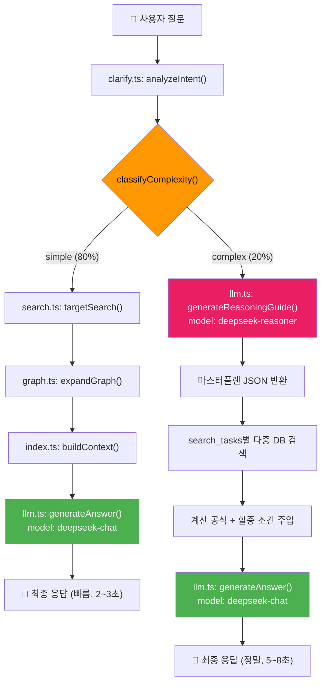

# 건설품셈 RAG 시스템 — 3단계 고도화 구현 계획서

> **작성일**: 2026-02-21  
> **목표**: NotebookLM 수준의 복합 추론 + DB 기반 정확도 100%의 건설 특화 AI 시스템 구축  
> **핵심 전략**: DeepSeek V3.2의 **비사고 모드(deepseek-chat)**와 **사고 모드(deepseek-reasoner)**를 의도(Intent)에 따라 동적으로 전환하는 **듀얼 모델 라우팅(Dual-Model Routing)** 아키텍처 도입

---

## 배경 및 현황 분석

### 현재 시스템 수준 (As-Is)

| 영역 | 수준 | 설명 |
|---|---|---|
| DB 정규화 | **S급** | PDF → 그래프(엔티티-관계) 완전 구조화 |
| 의도 분석 | **A급** | DeepSeek 기반 `analyzeIntent()` + 규칙 폴백 |
| 검색 알고리즘 | **A+급** | 4단계 캐스케이드(키워드→동의어→벡터→청크폴백) |
| 복합 추론 | **C급** | 단일 공종 검색만 가능, 다중 공종 조합/우회 추론 불가 |
| 수학/물리 연산 | **B급** | 단위 환산(면적·중량) 로직 미구현 |

### NotebookLM이 보여준 S급 답변의 핵심 능력 (우리에게 부족한 것)

1. **우회 추론**: 품셈에 없는 규격(1300mm 덕트)을 상위 개념(철골재 철거)으로 자동 치환
2. **다중 공종 분해**: 하나의 질문에서 `[철판 해체]` + `[보온재 해체]` + `[고소작업 할증]`을 분리하여 각각 품셈을 찾아 합산
3. **도메인 수학**: 원통 표면적(`πDL`), 철재 비중(`7.85`), 단위 환산(kg→톤) 등 공학 공식 자율 적용

### 돌파 전략: DeepSeek V3.2 듀얼 모델 라우팅

DeepSeek API는 **동일한 V3.2 기반 모델**을 두 가지 모드로 제공합니다:

| 항목 | `deepseek-chat` (비사고) | `deepseek-reasoner` (사고) |
|---|---|---|
| **모델명 파라미터** | `"deepseek-chat"` | `"deepseek-reasoner"` |
| **Base URL** | `https://api.deepseek.com` (동일) | `https://api.deepseek.com` (동일) |
| **API Key** | 동일한 키 사용 | 동일한 키 사용 |
| **Max Output** | 기본 4K / 최대 8K | 기본 32K / 최대 64K |
| **특징** | 빠르고 저렴, 정형 출력에 적합 | 내부 CoT(Chain-of-Thought) 추론, 수학/논리 강점 |
| **우리 시스템 용도** | 단순 품셈 검색 답변, 최종 표 렌더링 | 복합 질문 분석, 계산 가이드(마스터플랜) 생성 |

> [!IMPORTANT]
> 핵심: 별도 모델을 설치하거나 API 키를 추가할 필요 없이, **`model` 파라미터 한 줄만 바꾸면** 두 모드를 자유자재로 전환할 수 있습니다.

---

## Phase 1: 2026 노임단가 정밀 연동 (기초 체력)

> 현재 `labor_costs` 테이블과 `fetchLaborCosts()` 함수가 있으나, LLM에게 단가를 던져주고 곱셈을 맡기는 구조 → 계산 오류(할루시네이션) 위험

---

### Backend

#### [MODIFY] [index.ts](file:///g:/My%20Drive/Antigravity/supabase/functions/rag-chat/index.ts)

**현재** (L356~L373): `fetchLaborCosts()`로 가져온 단가를 텍스트 테이블로 context에 추가만 함

**변경**: 백엔드에서 `(단가 × 수량)` 산술 연산을 미리 수행하여 **계산 완료된 결과**를 context에 기록

```diff
 // [4-1] cost_calculate/report_request 시 노임단가 주입
 if (effectiveIntent === "cost_calculate" || effectiveIntent === "report_request") {
     const laborNames = relationsAll.flat()
         .filter(r => r.relation === "REQUIRES_LABOR")
-        .map(r => r.related_name)
+        .map(r => ({
+            name: r.related_name,
+            quantity: (r.properties as any)?.quantity ?? 0,
+            unit: (r.properties as any)?.unit ?? "인",
+            work_type: (r.properties as any)?.work_type_name ?? "",
+        }))
         .filter(Boolean);
     if (laborNames.length > 0) {
-        const laborCosts = await fetchLaborCosts(laborNames);
+        const uniqueJobNames = [...new Set(laborNames.map(l => l.name))];
+        const laborCosts = await fetchLaborCosts(uniqueJobNames);
+        const costMap = new Map(laborCosts.map(lc => [lc.job_name, lc.cost_2026]));
         if (laborCosts.length > 0) {
-            context += "\n\n## [2026년 노임단가]\n";
-            context += "| 직종 | 노임단가(원/일) |\n|---|---:|\n";
-            laborCosts.forEach(lc => {
-                context += `| ${lc.job_name} | ${lc.cost_2026.toLocaleString()} |\n`;
+            context += "\n\n## [2026년 노임단가 기반 산출 결과 (백엔드 계산 완료)]\n";
+            context += "| 직종 | 투입수량(인) | 노임단가(원/일) | 금액(원) | 비고 |\n";
+            context += "|---|---:|---:|---:|---|\n";
+            let totalCost = 0;
+            laborNames.forEach(l => {
+                const unitCost = costMap.get(l.name) ?? 0;
+                const amount = Math.round(Number(l.quantity) * unitCost);
+                totalCost += amount;
+                context += `| ${l.name} | ${l.quantity} | ${unitCost.toLocaleString()} | ${amount.toLocaleString()} | ${l.work_type} |\n`;
             });
+            context += `| **합계** | | | **${totalCost.toLocaleString()}** | |\n`;
+            context += `\n> ⚠️ 위 금액은 백엔드에서 정확히 계산된 값입니다. LLM은 이 숫자를 그대로 출력하세요.\n`;
         }
     }
 }
```

**Why**: LLM이 `0.122 × 215,907`을 직접 계산하면 할루시네이션 위험. 서버에서 미리 곱셈을 마치고 확정된 표를 전달하면 LLM은 복사만 하면 됨 → 정확도 100%

---

#### [MODIFY] [llm.ts](file:///g:/My%20Drive/Antigravity/supabase/functions/rag-chat/llm.ts)

**현재** (L82~L92): `cost_calculate` 프롬프트가 LLM에게 계산을 맡김

**변경**: "백엔드가 계산한 표를 그대로 출력하라"는 강제 지시로 교체

```diff
 if (options?.intent === "cost_calculate") {
     systemContent += `\n\n[특별 지침: 노무비 산출]
-사용자가 노무비 / 인건비 계산을 요청했습니다.
-1. 품셈 인력 데이터(직종, 수량, 단위)를 기반으로 노무비를 산출하세요.
+사용자가 노무비 / 인건비 계산을 요청했습니다. 아래 규칙을 엄격히 따르세요.
+1. 컨텍스트의 [2026년 노임단가 기반 산출 결과] 섹션에 백엔드가 미리 계산한 정확한 금액 테이블이 있습니다.
+2. 이 테이블의 숫자(투입수량, 노임단가, 금액, 합계)를 절대 수정하거나 재계산하지 마세요. 그대로 출력하세요.
+3. 임의로 숫자를 반올림하거나 변경하면 안 됩니다.
+4. 추가 설명(할증 조건, 주의사항 등)은 표 아래에 부연할 수 있습니다.
```

---

## Phase 2: DeepSeek V3.2 듀얼 모델 라우팅 (핵심 아키텍처)

> 단순 질문은 `deepseek-chat`(빠르고 저렴), 복합 질문은 `deepseek-reasoner`(사고 모드)로 자동 라우팅

---

### 2-1. 복잡도 판별기 (Complexity Classifier)

#### [MODIFY] [clarify.ts](file:///g:/My%20Drive/Antigravity/supabase/functions/rag-chat/clarify.ts)

**추가할 함수**: `classifyComplexity()` — 질문의 복잡도를 판별하여 어떤 모델을 쓸지 결정

```typescript
// ─── 질문 복잡도 분류기 (Complexity Classifier) ───
// Why: 단순 품셈 검색은 deepseek-chat(비사고), 복합 추론은 deepseek-reasoner(사고) 사용
//      비용 80% 절감 + 복합 질문 성능 극대화
export function classifyComplexity(question: string, analysis: IntentAnalysis): "simple" | "complex" {
    let complexityScore = 0;

    // [기준 1] 질문 길이 (긴 질문 = 조건이 많음)
    if (question.length > 80) complexityScore += 1;
    if (question.length > 150) complexityScore += 1;

    // [기준 2] 복수의 공종 키워드 감지 (예: "덕트 해체" + "보온 철거")
    const workTypeKeywords = question.match(/[가-힣]{2,}(해체|철거|설치|시공|타설|용접|도장|방수|배관)/g) || [];
    if (workTypeKeywords.length >= 2) complexityScore += 2;

    // [기준 3] 조건/상황 키워드 존재
    const conditionKeywords = ["높이", "고소", "지하", "수중", "야간", "협소", "위험",
        "할증", "보온", "단열", "보양", "양중", "인양", "해체", "철거"];
    const matchedConditions = conditionKeywords.filter(kw => question.includes(kw));
    complexityScore += matchedConditions.length;

    // [기준 4] 물리량/단위 환산 필요 시그널
    if (/\d+\s*(mm|t|T|톤|kg|m²|㎡|m³|㎥)/.test(question)) complexityScore += 1;
    // "두께"처럼 물성 기준 키워드
    if (/두께|외경|내경|직경|지름|무게|중량/.test(question)) complexityScore += 1;

    // [기준 5] 비용 관련 복합 질문 (단순 단가 조회 vs 복합 계산)
    if (analysis.intent === "cost_calculate" && matchedConditions.length >= 1) complexityScore += 1;

    // [기준 6] "어떻게 적용" 류의 가이드 요청
    if (/어떻게|적용|방법|기준|산출|견적|내역/.test(question)) complexityScore += 1;

    console.log(`[classifyComplexity] score=${complexityScore}, conditions=${matchedConditions.join(",")}`);

    // 임계값: 3점 이상이면 복합(사고 모드 필요)
    return complexityScore >= 3 ? "complex" : "simple";
}
```

**Why**: 80%의 단순 질문("강관용접 200mm 품셈 알려줘")에 비싼 사고 모드를 낭비하지 않고, 20%의 복합 질문("4T 덕트 해체 + 보온 + 고소작업")에만 추론 엔진을 집중 투입

---

### 2-2. Reasoner 호출 함수 (사고 모드 전용)

#### [MODIFY] [llm.ts](file:///g:/My%20Drive/Antigravity/supabase/functions/rag-chat/llm.ts)

**추가할 함수**: `generateReasoningGuide()` — 복합 질문에 대한 "계산 가이드(마스터플랜)"만 생성

```typescript
// ─── DeepSeek Reasoner (사고 모드) — 복합 질문용 마스터플랜 생성기 ───
// Why: 복합 상황(다중 공종, 우회 추론, 단위 환산)은 사고 모드(CoT)가
//      체계적인 '계산 절차서'를 먼저 짜주고,
//      실제 답변은 비사고 모드(chat)가 DB 데이터를 매핑해서 빠르게 출력

const REASONER_SYSTEM_PROMPT = `당신은 건설 적산 전문가(Master Estimator)입니다.
사용자의 복합적인 건설 질문을 분석하여, 아래 형식의 JSON '작업 가이드(Master Plan)'를 생성하세요.
직접 답변하지 마세요. 오직 검색/계산 절차만 설계하세요.

[출력 JSON 형식]
{
  "reasoning_summary": "이 질문이 복합적인 이유와 접근 방법 요약",
  "search_tasks": [
    {
      "task_id": 1,
      "description": "철판 본체 해체 품셈 검색",
      "search_keywords": ["철골재 철거", "인력 철거", "산소절단"],
      "target_type": "WorkType",
      "unit": "ton",
      "why": "4T 두께 강판은 중량물이므로 철골재 철거 품셈(톤 단위) 적용"
    }
  ],
  "calculations": [
    {
      "calc_id": 1,
      "description": "원형 덕트 표면적 산출",
      "formula": "π × D × L",
      "variables": { "D": "1.3m", "L": "계산 필요" },
      "why": "보온재 해체는 면적(㎡) 단위이므로 원통 겉넓이 필요"
    }
  ],
  "adjustments": [
    {
      "type": "고소작업 할증",
      "condition": "10m 이상 20m 미만",
      "rate": "4~5%",
      "apply_to": "인건비 전체"
    }
  ],
  "final_output_format": "표로 정리: 구분/적용항목/단위/산출방식/비고"
}`;

export async function generateReasoningGuide(
    question: string,
    history: ChatMessage[]
): Promise<{ guide: string; reasoning_content: string }> {
    const messages = [
        { role: "system" as const, content: REASONER_SYSTEM_PROMPT },
        ...history.slice(-3).map(msg => ({
            role: msg.role === "user" ? "user" as const : "assistant" as const,
            content: msg.content,
        })),
        { role: "user" as const, content: question },
    ];

    const response = await fetch(DEEPSEEK_URL, {
        method: "POST",
        headers: {
            "Content-Type": "application/json",
            "Authorization": `Bearer ${DEEPSEEK_API_KEY}`,
        },
        body: JSON.stringify({
            model: "deepseek-reasoner",   // ← 사고 모드 스위치!
            messages,
            max_tokens: 8192,
            // temperature는 reasoner에서 자동 제어됨
        }),
    });

    if (!response.ok) {
        throw new Error(`Reasoner API failed: ${response.status}`);
    }

    const data = await response.json();
    const guide = data.choices?.[0]?.message?.content ?? "{}";
    // reasoner는 reasoning_content 필드에 CoT 사고 과정을 반환
    const reasoning = data.choices?.[0]?.message?.reasoning_content ?? "";

    console.log(`[generateReasoningGuide] guide_len=${guide.length}, reasoning_len=${reasoning.length}`);
    return { guide, reasoning_content: reasoning };
}
```

---

### 2-3. 메인 파이프라인 분기 로직

#### [MODIFY] [index.ts](file:///g:/My%20Drive/Antigravity/supabase/functions/rag-chat/index.ts)

**변경 위치**: `handleChat()` 함수 내, `analyzeIntent()` 호출 직후

```typescript
// ─── Phase 2: 듀얼 모델 라우팅 ───
import { classifyComplexity } from "./clarify.ts";
import { generateReasoningGuide } from "./llm.ts";

// analyzeIntent() 호출 직후 삽입:
const complexity = classifyComplexity(question, analysis);
console.log(`[handleChat] complexity=${complexity}, intent=${analysis.intent}`);

if (complexity === "complex") {
    // ══════ 복합 질문 경로 (Reasoner → 다중 검색 → Chat) ══════
    console.log(`[handleChat] 🧠 사고 모드(deepseek-reasoner) 가동`);

    // Step 1: Reasoner가 마스터플랜(작업 가이드) 생성
    const { guide, reasoning_content } = await generateReasoningGuide(question, history);

    // Step 2: 마스터플랜의 search_tasks를 파싱하여 다중 DB 검색
    let parsedGuide: any = {};
    try { parsedGuide = JSON.parse(guide); } catch { /* 파싱 실패 시 기본 경로 */ }

    const searchTasks = parsedGuide.search_tasks || [];
    let combinedContext = `## [AI 추론 가이드 (사고 모드 산출)]\n${parsedGuide.reasoning_summary || ""}\n\n`;

    // 각 search_task별 DB 검색 수행 (벡터+키워드)
    for (const task of searchTasks) {
        const taskEmbedding = await generateEmbedding(task.search_keywords.join(" "));
        const taskEntities = await targetSearch(
            { ...analysis, keywords: task.search_keywords, work_name: task.search_keywords[0] },
            taskEmbedding,
            task.search_keywords.join(" ")
        );
        if (taskEntities.length > 0) {
            // 각 태스크의 결과를 context에 라벨링하여 추가
            const taskRelations = await Promise.all(
                taskEntities.slice(0, 3).map(e => expandGraph(e.id, e.type))
            );
            combinedContext += `### ${task.task_id}. ${task.description}\n`;
            combinedContext += buildContext(taskEntities.slice(0, 3), taskRelations, [], []);
            combinedContext += `\n---\n`;
        }
    }

    // 계산 공식 가이드 추가
    if (parsedGuide.calculations) {
        combinedContext += `\n## [적용 공식]\n`;
        parsedGuide.calculations.forEach((calc: any) => {
            combinedContext += `- ${calc.description}: \`${calc.formula}\` (${calc.why})\n`;
        });
    }

    // 할증/보정 정보 추가
    if (parsedGuide.adjustments) {
        combinedContext += `\n## [할증/보정 조건]\n`;
        parsedGuide.adjustments.forEach((adj: any) => {
            combinedContext += `- ${adj.type}: ${adj.condition} → ${adj.rate} (${adj.apply_to})\n`;
        });
    }

    // Step 3: 최종 답변은 비사고 모드(deepseek-chat)로 빠르고 정확하게 출력
    const llmResult = await generateAnswer(question, combinedContext, history, {
        intent: analysis.intent,
    });

    return makeAnswerResponse(llmResult.answer, startTime, { /* ... sources */ });
}

// ══════ 단순 질문 경로 (기존 deepseek-chat 그대로) ══════
// ... (기존 로직 유지)
```

---

## Phase 3: 복합 추론 파이프라인 강화 (고급 기능)

> Reasoner가 짜준 가이드 기반으로 DB를 다중 검색하고, 도메인 수학 공식을 적용하는 후처리 단계

---

### 3-1. 시스템 프롬프트에 우회 추론 허용 규칙 추가

#### [MODIFY] [llm.ts](file:///g:/My%20Drive/Antigravity/supabase/functions/rag-chat/llm.ts) — `SYSTEM_PROMPT`

**추가 규칙** (기존 `[금지 사항]` 바로 위에 삽입):

```markdown
[우회 추론 허용 규칙]
1. 사용자가 질문한 규격(예: 1300mm 덕트)이 품셈 DB에 정확히 없을 경우:
   - "해당 규격은 품셈에 없습니다"로 끝내지 말고,
   - 성질(중량, 재질, 형상)이 가장 유사한 상위 품셈을 차용하되,
   - "해당 규격은 일반 OO 범위를 벗어나므로, △△ 품셈을 준용합니다"라고 근거를 명시하세요.
2. 여러 공종을 조합해야 하는 질문이면, 각 공종을 단계별로 분리하여 합산하세요.
3. 단위 환산이 필요하면 공학 공식(πDL, 비중 7.85 등)을 명시적으로 보여주세요.

[건설 도메인 수학 공식]
- 원통 표면적: π × 외경(m) × 길이(m) = ㎡
- 강판 중량: π × 외경(m) × 두께(m) × 비중(7.85) × 길이(m) = kg/m
- 1톤 환산 길이: 1000kg ÷ (단위중량 kg/m) = m
- 면적 환산: 원형 단면 → π × (D/2)² = ㎡
```

---

### 3-2. IntentAnalysis 타입 확장

#### [MODIFY] [types.ts](file:///g:/My%20Drive/Antigravity/supabase/functions/rag-chat/types.ts) — `IntentAnalysis`

```diff
 export interface IntentAnalysis {
-    intent: "search" | "clarify_needed" | "followup" | "greeting" | "quantity_input" | "cost_calculate" | "modify_request" | "report_request";
+    intent: "search" | "clarify_needed" | "followup" | "greeting" | "quantity_input" | "cost_calculate" | "modify_request" | "report_request" | "complex_estimate";
     // ... 기존 필드 유지
+    complexity?: "simple" | "complex";  // 듀얼 모델 라우팅용
 }
```

---

## 전체 아키텍처 흐름도



---

## 수정 대상 파일 요약

| Phase | 파일 | 변경 유형 | 핵심 변경 |
|---|---|---|---|
| 1 | [index.ts](file:///g:/My%20Drive/Antigravity/supabase/functions/rag-chat/index.ts) | MODIFY | 노임단가 서버 사전 계산 로직 |
| 1 | [llm.ts](file:///g:/My%20Drive/Antigravity/supabase/functions/rag-chat/llm.ts) | MODIFY | `cost_calculate` 프롬프트 강제화 |
| 2 | [clarify.ts](file:///g:/My%20Drive/Antigravity/supabase/functions/rag-chat/clarify.ts) | MODIFY | `classifyComplexity()` 함수 추가 |
| 2 | [llm.ts](file:///g:/My%20Drive/Antigravity/supabase/functions/rag-chat/llm.ts) | MODIFY | `generateReasoningGuide()` 함수 추가 |
| 2 | [index.ts](file:///g:/My%20Drive/Antigravity/supabase/functions/rag-chat/index.ts) | MODIFY | `handleChat()` 내 듀얼 모델 분기 로직 |
| 3 | [llm.ts](file:///g:/My%20Drive/Antigravity/supabase/functions/rag-chat/llm.ts) | MODIFY | 우회 추론 허용 규칙 + 도메인 공식 추가 |
| 3 | [types.ts](file:///g:/My%20Drive/Antigravity/supabase/functions/rag-chat/types.ts) | MODIFY | `IntentAnalysis` 타입 확장 |

---

## Verification Plan

### Phase 1 검증
1. 챗봇에 `"강관용접 200mm SCH 40 10개소 노무비 산출해줘"` 입력
2. 응답이 **정확한 숫자 테이블**(서버 사전 계산 값)로 출력되는지 확인
3. 계산기로 `투입수량 × 노임단가 = 금액`을 수동 검증

### Phase 2 검증
1. **단순 질문** `"강관용접 품셈 알려줘"` → `deepseek-chat` 호출 확인 (Edge Function 로그)
2. **복합 질문** `"원형 덕트 4T 1300mm 해체 + 보온 철거 + 고소작업 15m"` → `deepseek-reasoner` 호출 후 `deepseek-chat`으로 최종 출력 확인
3. 응답 시간: 단순 2~3초, 복합 5~8초 이내

### Phase 3 검증
1. NotebookLM에 동일한 질문을 던져서 받은 답변과 우리 시스템의 답변을 나란히 비교
2. 우리 시스템의 금액/수치가 DB 기반으로 더 정확한지 확인

---

## 비용 예측

| 구분 | 현재 (deepseek-chat Only) | 듀얼 모델 적용 후 |
|---|---|---|
| 단순 질문 (80%) | ~₩2/건 | ~₩2/건 (변동 없음) |
| 복합 질문 (20%) | ~₩2/건 (답변 품질 낮음) | ~₩8~12/건 (reasoner 추가 호출) |
| **월간 예상** (일 100건) | ~₩6,000 | ~₩8,400 (+40%) |

> [!TIP]
> 월 비용 증가분은 약 ₩2,400(~$1.7)이지만, 복합 질문의 답변 퀄리티가 NotebookLM 수준으로 급상승하므로 ROI 극대화
