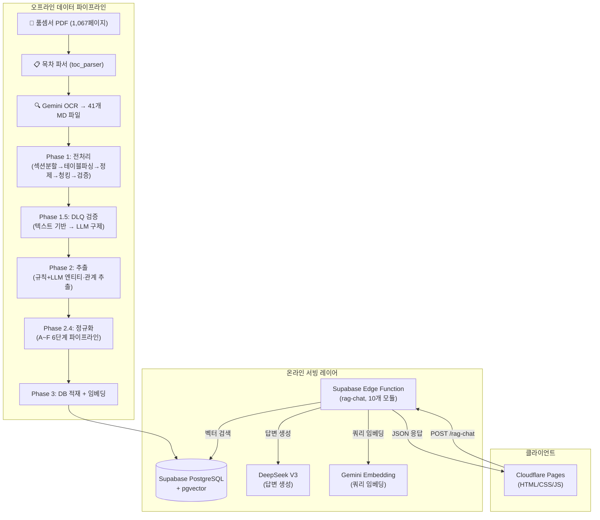
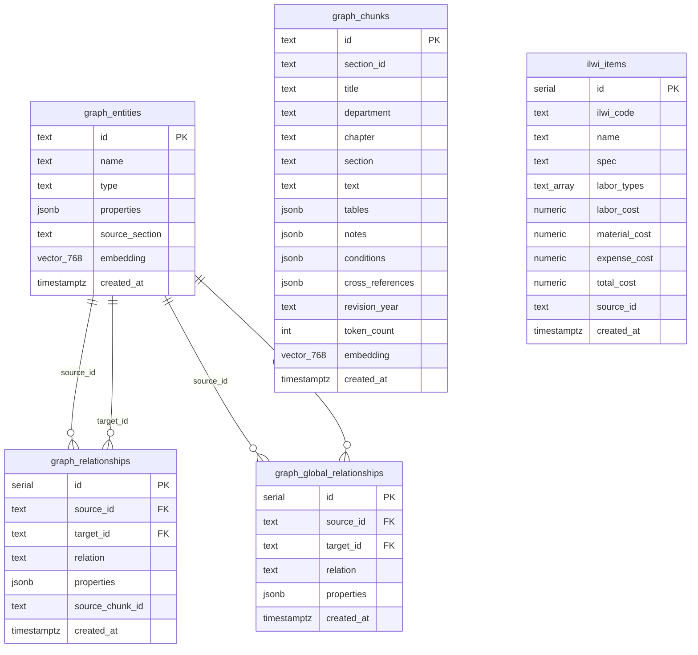
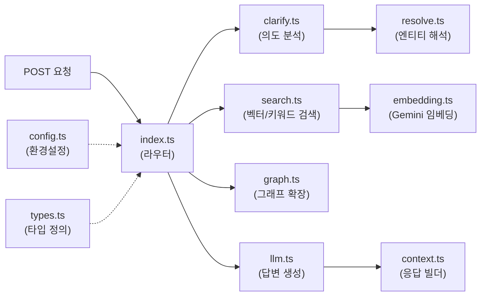
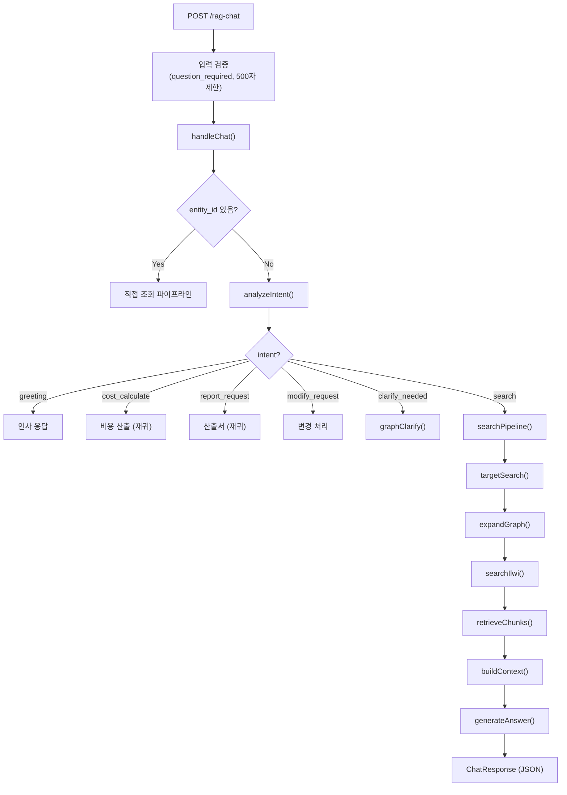

# 건설 품셈 RAG 시스템 — 기술 명세서 (Technical Specification)

> **문서 버전**: v1.0  
> **작성일**: 2026-02-21  
> **프로젝트명**: Antigravity — 건설 표준 품셈 AI 어시스턴트  
> **저장소**: `github.com/gustn6100000-ux/pumsem_rag`

---

## 목차

1. [시스템 개요 (System Overview)](#1-시스템-개요)
2. [프로젝트 구조 (Project Structure)](#2-프로젝트-구조)
3. [전체 아키텍처 (Architecture)](#3-전체-아키텍처)
4. [Phase 1: 전처리 파이프라인 (Preprocessing Pipeline)](#4-phase-1-전처리-파이프라인)
5. [Phase 1.5: 품질 검증 (Validation)](#5-phase-15-품질-검증)
6. [Phase 2: 정보 추출 파이프라인 (Extraction Pipeline)](#6-phase-2-정보-추출-파이프라인)
7. [Phase 3: 데이터 적재 및 임베딩 (Loading & Embedding)](#7-phase-3-데이터-적재-및-임베딩)
8. [데이터베이스 스키마 (Database Schema)](#8-데이터베이스-스키마)
9. [SQL RPC 함수 (Search Functions)](#9-sql-rpc-함수)
10. [Phase 4: Edge Function — RAG 서빙 레이어](#10-phase-4-edge-function--rag-서빙-레이어)
11. [프론트엔드 (Frontend)](#11-프론트엔드)
12. [배포 및 인프라 (Deployment & Infrastructure)](#12-배포-및-인프라)
13. [환경 변수 (Environment Variables)](#13-환경-변수)
14. [보안 (Security)](#14-보안)
15. [향후 계획 (Roadmap)](#15-향후-계획)

---

## 1. 시스템 개요

### 1.1 프로젝트 목적

건설 공사 **표준 품셈서**(標準品셈, Standard of Estimation)의 데이터를 **Knowledge Graph + Vector Search** 기반의 RAG(Retrieval-Augmented Generation) 시스템으로 구축하여, 건설 실무자가 자연어로 품셈 정보를 조회하고 노무비를 산출할 수 있는 AI 어시스턴트를 제공합니다.

### 1.2 핵심 기능

| 기능 | 설명 |
|---|---|
| **품셈 검색** | "강관용접 200mm SCH 40" 같은 자연어 질의로 해당 품셈의 인력·장비·자재 투입량을 4열 테이블로 반환 |
| **명확화 (Clarification)** | 모호한 질문(예: "용접 품셈")에 대해 구체적 선택지를 제시하여 정확도 향상 |
| **노무비 산출** | 품셈 데이터 + 2026년 노임단가를 결합하여 자동 노무비 계산 |
| **산출서 생성** | 정형화된 산출 내역서 형태로 출력 |
| **맥락 유지** | 세션 컨텍스트를 통해 "아까 건", "수량을 50m로 바꿔서" 등 후속 질문 처리 |

### 1.3 기술 스택

| 계층 | 기술 |
|---|---|
| **PDF 파싱** | Google Gemini 2.0 Flash (OCR/마크다운 변환) |
| **데이터 파이프라인** | Python 3.12 (asyncio, pydantic, BeautifulSoup4, tqdm) |
| **LLM 추출** | DeepSeek V3 / Gemini 3.0 Flash (엔티티/관계 추출) |
| **임베딩** | Google Gemini `text-embedding-004` (768차원) |
| **데이터베이스** | Supabase PostgreSQL + pgvector + pg_trgm |
| **서빙 레이어** | Supabase Edge Functions (Deno/TypeScript) |
| **LLM 답변 생성** | DeepSeek V3 (`deepseek-chat`) |
| **프론트엔드** | Vanilla HTML/CSS/JS + marked.js + DOMPurify |
| **호스팅** | Cloudflare Pages (프론트엔드), Supabase (백엔드) |

---

## 2. 프로젝트 구조

```
Antigravity/
├── .env                              # 환경 변수 (API 키 등)
├── deploy_chat.bat                   # Edge Function 배포 스크립트
│
├── pipeline/                         # ━━ 데이터 파이프라인 ━━
│   ├── .env                          # 파이프라인 전용 환경 변수
│   ├── toc_parser/                   # 목차 파싱 모듈
│   │   └── toc_parser.py             # PDF 목차 → toc_parsed.json
│   ├── pdf_extractor/                # PDF → 마크다운 변환
│   │   └── step1_extract_gemini_v33.py   # Gemini OCR 기반 추출
│   ├── phase1_preprocessing/         # ━━ Phase 1: 전처리 ━━
│   │   ├── config.py                 # 공통 설정/경로/임계값
│   │   ├── run_pipeline.py           # 전체 파이프라인 일괄 실행
│   │   ├── step1_section_splitter.py # Step 1: 섹션 분할
│   │   ├── step2_table_parser.py     # Step 2: HTML 테이블 파싱
│   │   ├── step3_text_cleaner.py     # Step 3: 텍스트 정제
│   │   ├── step4_chunker.py          # Step 4: 청크 생성
│   │   ├── step5_validator.py        # Step 5: 품질 검증
│   │   ├── quality_deep_check.py     # 심층 품질 분석
│   │   └── utils/                    # HTML 처리, 토큰 카운터 등
│   ├── phase1_5_validation/          # ━━ Phase 1.5: 검증 결과 ━━
│   │   ├── validated_entities.json   # 검증 통과 엔티티 (22MB)
│   │   ├── DLQ_entities.json         # 검증 실패 엔티티 (1.2MB)
│   │   ├── recovered_entities.json   # LLM 구제 엔티티 (196KB)
│   │   └── discarded_entities.json   # 최종 폐기 엔티티 (1MB)
│   ├── phase2_extraction/            # ━━ Phase 2: 정보 추출 ━━
│   │   ├── config.py                 # Phase 2 전용 설정
│   │   ├── schemas.py                # Entity/Relation Pydantic 스키마
│   │   ├── step1_table_extractor.py  # Step 2.1: 규칙 기반 테이블 추출
│   │   ├── step2_llm_extractor.py    # Step 2.2: LLM 기반 추출
│   │   ├── step2_5_quarantine_review.py  # Step 2.5: DLQ LLM 재평가
│   │   ├── step2_8_merge_master.py   # Step 2.8: 마스터 데이터 병합
│   │   ├── step3_relation_builder.py # Step 2.3: 관계 생성/병합
│   │   ├── step4_normalizer.py       # Step 2.4: 정규화/중복제거
│   │   ├── step5_extraction_validator.py  # Step 2.5: 추출 품질 검증
│   │   ├── step6_supabase_loader.py  # Step 2.6: DB 적재
│   │   ├── step7_embedding_generator.py  # Step 2.7: 임베딩 생성
│   │   └── verify_step*.py           # 각 단계별 검증 스크립트
│   ├── sql/                          # ━━ SQL 마이그레이션 ━━
│   │   ├── step2.6_create_graph_rag_tables.sql   # 테이블 DDL
│   │   ├── step2.6_insert_ilwi_items.sql         # 일위대가 시드
│   │   ├── step2.6_verify_counts.sql             # 적재 검증 쿼리
│   │   ├── step2.7_bulk_update_embeddings.sql    # 임베딩 RPC
│   │   ├── step2.7_create_search_functions.sql   # 검색 RPC
│   │   └── step2.7_verification_queries.sql      # 검색 검증 쿼리
│   ├── phase1_output/                # Phase 1 중간 산출물
│   └── phase2_output/                # Phase 2 중간 산출물
│
├── edge-function/                    # ━━ RAG 서빙 레이어 ━━
│   ├── index.ts                      # 메인 라우터 + 컨텍스트 조합 (992줄)
│   ├── config.ts                     # 환경변수, CORS, Rate Limit
│   ├── types.ts                      # 공통 타입/인터페이스 (195줄)
│   ├── embedding.ts                  # Gemini 임베딩 호출
│   ├── search.ts                     # 벡터 검색 + 키워드 검색
│   ├── graph.ts                      # 그래프 확장, 일위대가, 청크 조회
│   ├── clarify.ts                    # 의도 분석, 명확화 로직
│   ├── resolve.ts                    # 엔티티 해석, spec 매칭
│   ├── llm.ts                        # LLM 답변 생성 + 시스템 프롬프트
│   └── context.ts                    # ChatResponse 빌더 유틸
│
├── frontend/                         # ━━ 프론트엔드 ━━
│   ├── index.html                    # 메인 UI (46KB)
│   ├── style.css                     # 스타일시트
│   └── app.js                        # 클라이언트 JS (315줄)
│
├── supabase/                         # Supabase 프로젝트 설정
│   └── functions/rag-chat/           # 배포용 Edge Function 복사본
│
└── docs/                             # 문서
    ├── plans/                        # 구현 계획서
    └── reports/                      # 구현 보고서/분석서
```

---

## 3. 전체 아키텍처



### 3.1 데이터 흐름 요약

1. **오프라인**: 품셈서 PDF → Gemini OCR로 마크다운 변환 → 5단계 전처리 → 검증(DLQ 체계) → 규칙+LLM 추출 → 6단계 정규화 → Supabase DB 적재 → Gemini 임베딩 생성
2. **온라인**: 사용자 질문 → Edge Function에서 의도 분석 → 벡터/키워드 검색 → 그래프 확장 → 컨텍스트 조합 → DeepSeek LLM 답변 생성 → JSON 응답

---

## 4. Phase 1: 전처리 파이프라인

> **위치**: `pipeline/phase1_preprocessing/`  
> **입력**: 41개 마크다운 파일 (Gemini OCR 결과, `pipeline/download_file/`)  
> **출력**: `chunks.json` (1,706개 구조화된 청크)

### 4.1 Step 1: 섹션 분할 (`step1_section_splitter.py`)

**목적**: 41개 MD 파일을 품셈서의 논리적 단위인 **절(Section, X-Y-Z)** 단위로 분할합니다.

| 항목 | 상세 |
|---|---|
| **입력** | 41개 MD 파일 + `toc_parsed.json` |
| **출력** | `raw_sections.json` |
| **핵심 로직** | `<!-- SECTION: X-Y-Z -->` 마커 기반 분할 |
| **보완 로직** | CONTEXT 마커 폴백, 제목 패턴 매칭 폴백 |

**주요 함수**:
- `split_sections()`: 단일 MD 파일을 SECTION 마커 기준으로 분할
- `redistribute_text_to_sections()`: 연속 마커 그룹 뒤의 텍스트를 제목 패턴으로 재분배 (핵심 난제 해결)
- `context_marker_fallback()`: SECTION 마커로 잡히지 않은 섹션을 CONTEXT 마커에서 보충
- `fallback_title_matching()`: TOC에 있으나 마커가 없는 항목을 기존 섹션 텍스트에서 제목 패턴으로 추가 분할
- `build_reverse_map()`: `(section_id, department)` → TOC key 역방향 매핑 생성

### 4.2 Step 2: HTML 테이블 파싱 (`step2_table_parser.py`)

**목적**: 각 섹션 내 `<table>` HTML을 **구조화된 딕셔너리 배열**로 변환합니다.

| 항목 | 상세 |
|---|---|
| **입력** | `raw_sections.json` |
| **출력** | `parsed_tables.json` |
| **테이블 유형** | `A_품셈`, `B_규모기준`, `C_구분설명`, `D_기타` |

**주요 함수**:
- `classify_table()`: 헤더/행 내용으로 테이블 유형 A/B/C/D 자동 분류
- `detect_header_rows()`: 헤더 행 수 추정 (1~3행 지원, 다단 헤더 처리)
- `build_composite_headers()`: 다중 헤더 행 합성 (예: "인원수_1일당_보통인부")
- `parse_single_table()`: HTML → `{headers, rows, type, notes_in_table}` 구조화
- `is_note_row()`: 테이블 내 주석/비고/구분자 행 판별 → `notes_in_table`으로 분리

**rowspan/colspan 처리**: `utils/html_utils.py`의 `expand_table()` 함수에서 rowspan/colspan을 확장하여 모든 셀이 같은 크기의 그리드를 형성하도록 정규화.

### 4.3 Step 3: 텍스트 정제 (`step3_text_cleaner.py`)

**목적**: 테이블 외 텍스트에서 **주석, 조건/할증, 교차참조, 보완연도** 등 구조화된 정보를 추출합니다.

| 항목 | 상세 |
|---|---|
| **입력** | `parsed_tables.json` |
| **출력** | `cleaned_sections.json` |

**추출 항목**:
- `notes`: `[주]` 블록, 번호 매긴 주석 (`①`, `1.`, `가.` 등)
- `conditions`: 할증/적용 조건 (예: "직접노무비 3억 이상일 경우 10% 할증")
- `cross_references`: 교차참조 (예: "제13장 참조", "6-3-1 항 준용")
- `revision_year`: 보완연도 (예: "'24년 보완")
- `unit_basis`: 단위 기준 (예: "(m³당)", "(100m당)")

### 4.4 Step 4: 청크 생성 (`step4_chunker.py`)

**목적**: 정제된 섹션을 **GraphRAG 및 벡터 검색에 최적화된 청크**로 변환합니다.

| 항목 | 상세 |
|---|---|
| **입력** | `cleaned_sections.json` |
| **출력** | `chunks.json` |
| **청크 단위** | 항(X-Y-Z) 1개 = 1청크 (기본) |
| **토큰 제한** | MAX: 1,500토큰, HARD_LIMIT: 2,000토큰 |
| **분할 전략** | 텍스트/테이블 분리 → 대형 테이블 행 분할 → 재귀 분할 |

**청크 메타데이터**:
```json
{
  "chunk_id": "C-0001",
  "section_id": "6-1-1",
  "department": "토목부문",
  "chapter": "제6장 콘크리트공사",
  "section": "콘크리트 타설",
  "title": "거푸집 공사",
  "text": "...",
  "tables": [...],
  "notes": [...],
  "conditions": [...],
  "cross_references": [...],
  "revision_year": "'24년 보완",
  "unit_basis": "m³당",
  "token_count": 450,
  "source_file": "pages_100_130.md",
  "page_start": 105
}
```

### 4.5 Step 5: 품질 검증 (`step5_validator.py`)

**목적**: 생성된 청크의 품질을 자동 검증하고 파이프라인 결과를 요약합니다.

**검증 항목**:

| 검증 | 기준 | 결과 |
|---|---|---|
| TOC 섹션 커버리지 | ≥ 90% | ✅ 97.8% |
| 테이블 파싱 성공률 | ≥ 95% | ✅ 99.2% |
| 빈 청크 비율 | ≤ 5% | ✅ 1.3% |
| 토큰 HARD_LIMIT 초과 | 0건 | ✅ 0건 |
| 필수 메타데이터 누락 | 0건 | ✅ 0건 |
| 중복 section_id | 0건 | ✅ 0건 |

---

## 5. Phase 1.5: 품질 검증

> **대상**: Phase 2에서 추출된 엔티티/관계에 대한 품질 검증  
> **방식**: 2-Step Validation (텍스트 기반 엄격 검증 → LLM 기반 유연 구제)

### 5.1 Step 1: 텍스트 기반 검증 (`step5_extraction_validator.py`)

청크 원문과 추출된 엔티티를 교차 검증하여, 원문에 근거가 없는 환각(Hallucination) 엔티티를 DLQ(Dead Letter Queue)로 격리합니다.

| 분류 | 건수 |
|---|---|
| ✅ 검증 통과 (Validated) | 1,706 청크 |
| ❌ DLQ 격리 | 409 청크 (세부 1,144 속성) |

### 5.2 Step 2: LLM Quarantine Review (`step2_5_quarantine_review.py`)

DLQ에 격리된 1,144건을 DeepSeek API를 통해 비동기 재평가합니다.

| 결과 | 건수 | 비율 |
|---|---|---|
| ✅ 구제 (False-Negative) | 196건 | 17.1% |
| ❌ 최종 폐기 (True-Positive) | 948건 | 82.9% |

### 5.3 마스터 병합 (`step2_8_merge_master.py`)

검증 통과 데이터 + 구제 데이터를 결합하여 `llm_entities_master.json`을 생성합니다.

---

## 6. Phase 2: 정보 추출 파이프라인

> **위치**: `pipeline/phase2_extraction/`  
> **입력**: `chunks.json` (1,706 청크)  
> **출력**: `normalized_entities.json` (엔티티 16,302건, 관계 31,118건)

### 6.1 Step 2.1: 규칙 기반 테이블 추출 (`step1_table_extractor.py`, 1,191줄)

**목적**: `A_품셈` 테이블의 구조화된 headers/rows에서 **규칙 기반**으로 엔티티(WorkType, Labor, Equipment, Material)와 관계를 추출합니다.

**헤더 역할 분류** (`classify_header_role`):
| 역할 | 키워드 예 | 설명 |
|---|---|---|
| `name` | 명칭, 공종명, 종목 | 엔티티 이름 |
| `spec` | 규격, 사양 | 규격/사양 |
| `unit` | 단위 | 단위 (인, m³, 대) |
| `quantity` | 수량 | 투입 수량 |
| `labor` | 인원수, 보통인부, 특별인부 | 노무 열 (값 = 인력 수량) |
| `equipment` | 기계, 장비 | 장비 열 |
| `material` | 재료, 자재 | 자재 열 |

**테이블 유형별 처리 전략**:

1. **Case A (`A_품셈`)**: `extract_from_a_table()` — name 열 + labor/equipment 열 조합으로 엔티티·관계 생성
2. **Case B (`B_규모기준`)**: `extract_from_b_table()` — 조건을 Note 엔티티로 변환
3. **Case D (매트릭스)**: `extract_from_matrix_table()` — 구경×SCH 매트릭스에서 교차점 추출
   - **D1 패턴** (메타행): 첫 행이 직종 매핑, 이후 행이 데이터
   - **D2 패턴** (복합 헤더): 헤더가 `SCH_직종명` 형식

**SCH 화이트리스트**: 열 헤더의 숫자가 실제 배관 Schedule을 의미하는 섹션을 화이트리스트로 관리하여 오인식 방지.

### 6.2 Step 2.2: LLM 기반 추출 (`step2_llm_extractor.py`, 710줄)

**목적**: 규칙 추출로 커버하지 못한 청크를 **DeepSeek V3 LLM**으로 처리합니다.

**LLM 추출 대상 선별** (`select_llm_target_chunks`):
1. 테이블이 없는 텍스트 전용 청크 (364건)
2. D_기타/C_구분설명만 있는 청크
3. Step 2.1에서 WorkType이 0개인 청크
4. Step 2.1에서 경고가 있는 청크

**Pydantic 스키마** (JSON Mode 강제):
```python
class LLMEntity(BaseModel):
    type: str    # WorkType | Labor | Equipment | Material | Note | Standard
    name: str    # 엔티티 이름 (한국어)
    spec: Optional[str]      # 규격
    unit: Optional[str]      # 단위
    quantity: Optional[float] # 수량

class LLMRelationship(BaseModel):
    source: str        # 출발 엔티티 이름
    target: str        # 도착 엔티티 이름
    type: str          # REQUIRES_LABOR 등
    quantity: Optional[float]
    unit: Optional[str]
    per_unit: Optional[str]  # "1m3당", "100m당"
```

**비동기 처리**: `asyncio.Semaphore`로 동시성 제어, 200건마다 중간 저장(crash 방어), `--resume` 모드로 이어하기 지원.

### 6.3 Step 2.3: 관계 생성 및 병합 (`step3_relation_builder.py`, 634줄)

**병합 우선순위**:
| 필드 | 우선 | 이유 |
|---|---|---|
| name/spec | LLM | 더 자연스러운 한국어 |
| quantity/unit | 테이블 | 정확한 수치 |
| confidence | 최대값 | 둘 중 높은 신뢰도 |

**자동 생성 관계**:
- `BELONGS_TO`: WorkType → Section (품셈 → 절)
- `HAS_CHILD`: Section 계층 (장 → 절 → 항)
- `REFERENCES`: 교차참조 (예: "6-3-1 참조")

### 6.4 Step 2.4: 정규화 및 중복 제거 (`step4_normalizer.py`, 1,014줄)

**6단계 파이프라인**:

| Phase | 이름 | 동작 | 결과 |
|---|---|---|---|
| **A** | 문자열 정규화 | NFKC, 공백 제거, LABOR_MAP(보 통 인 부→보통인부), 단위 정규화 | — |
| **B** | 중복 제거 | type+name+spec 키 기반 그룹핑, 대표 엔티티 선정 | 33,455→16,302 (51.8% 압축) |
| **C** | 관계 방향 보정 | `DIRECTION_RULES` 기반 source/target 방향 교정 (725건) | — |
| **D** | 이상치 필터링 | quantity > threshold(노무75, 장비3300, 자재225) → confidence 하향 | — |
| **E** | 관계 참조 갱신 | 대표 이름으로 source/target 치환 + 관계 중복 제거 | 46,938→31,118 |
| **F** | ID 부여 | 글로벌 유니크 ID 생성 (W-0001, L-0001, E-0001, M-0001 등) | — |

---

## 7. Phase 3: 데이터 적재 및 임베딩

### 7.1 DB 적재 (`step6_supabase_loader.py`, 453줄)

**적재 순서** (FK 의존성 준수):
1. `graph_entities` (TEXT PK, upsert)
2. `graph_relationships` (SERIAL PK, insert)
3. `graph_global_relationships` (SERIAL PK, insert)
4. `graph_chunks` (TEXT PK, upsert)

**`--clean` 모드**: FK 역순으로 전체 삭제 → 깨끗한 재적재 (고아 노드/충돌 방지)

### 7.2 임베딩 생성 (`step7_embedding_generator.py`, 523줄)

| 항목 | 상세 |
|---|---|
| **모델** | Gemini `text-embedding-004` |
| **차원** | 768 |
| **배치** | 최대 100건/배치, Exponential Backoff 재시도 |
| **페이징** | Keyset 페이징 (offset 페이징의 행 누락 방지) |
| **적재** | RPC `bulk_update_embeddings`로 배치 UPDATE |

**임베딩 텍스트 구성**:
- **엔티티**: `[WorkType] 강관용접 | spec: 200 SCH 40 | 기계설비부문 > 플랜트설비공사`
- **청크**: `[토목부문 > 제6장 콘크리트공사 > 거푸집 공사] 6-1-1 | 거푸집 조립 품셈`

---

## 8. 데이터베이스 스키마

> **위치**: `pipeline/sql/step2.6_create_graph_rag_tables.sql`  
> **확장**: `pgvector`, `pg_trgm`

### 8.1 테이블 구조



### 8.2 인덱스

| 인덱스 | 유형 | 용도 |
|---|---|---|
| `idx_entities_embedding` | HNSW (vector_cosine_ops) | 벡터 유사도 검색 |
| `idx_entities_name_trgm` | GIN (gin_trgm_ops) | 한국어 fuzzy 검색 |
| `idx_entities_type` | B-tree | 타입별 필터링 |
| `idx_chunks_embedding` | HNSW | 청크 벡터 검색 |
| `idx_ilwi_name_trgm` | GIN | 일위대가 퍼지 검색 |
| `idx_rel_source/target` | B-tree | 관계 탐색 |

### 8.3 RLS 정책

모든 테이블에 Row Level Security 활성화, `anon` 역할에 `SELECT` 허용.

### 8.4 데이터 규모

| 테이블 | 행 수 |
|---|---|
| `graph_entities` | 16,302건 |
| `graph_relationships` | 31,118건 |
| `graph_global_relationships` | ~2,500건 |
| `graph_chunks` | 1,706건 |
| `ilwi_items` | ~500건 |

---

## 9. SQL RPC 함수

> **위치**: `pipeline/sql/step2.7_create_search_functions.sql`

### 9.1 `search_entities_by_embedding`

```sql
CREATE OR REPLACE FUNCTION search_entities_by_embedding(
    query_embedding vector(768),
    match_threshold float DEFAULT 0.5,
    match_count int DEFAULT 10,
    filter_type text DEFAULT NULL
)
RETURNS TABLE (
    id text, name text, type text, 
    properties jsonb, similarity float,
    source_section text
)
```

**동작**: pgvector의 코사인 유사도(`1 - (embedding <=> query_embedding)`)로 상위 N개 엔티티 반환. `filter_type` 옵션으로 특정 엔티티 타입만 필터링 가능. `source_section`을 직접 반환하여 후속 조회를 제거.

### 9.2 `get_related_resources`

```sql
CREATE OR REPLACE FUNCTION get_related_resources(entity_id text)
RETURNS TABLE (
    direction text, relation text,
    related_id text, related_name text,
    related_type text, properties jsonb
)
```

**동작**: 주어진 엔티티의 outbound 관계(`graph_relationships` + `graph_global_relationships`)를 UNION ALL로 탐색하여 관련 리소스를 반환. Phase 4에서 불필요한 inbound 블록을 제거하여 성능 최적화.

### 9.3 `bulk_update_embeddings`

```sql
CREATE OR REPLACE FUNCTION bulk_update_embeddings(
    p_table text, p_updates jsonb
) RETURNS int
```

**동작**: 임베딩 벡터를 배치로 UPDATE. Python에서 JSON 문자열로 전달된 벡터를 함수 내부에서 `vector(768)` 타입으로 캐스팅.

---

## 10. Phase 4: Edge Function — RAG 서빙 레이어

> **위치**: `edge-function/` (10개 TypeScript 모듈)  
> **런타임**: Supabase Edge Functions (Deno)  
> **엔드포인트**: `POST /functions/v1/rag-chat`

### 10.1 모듈 구조



### 10.2 `config.ts` — 환경 설정

| 설정 | 상세 |
|---|---|
| **Supabase** | `createClient(URL, SERVICE_ROLE_KEY)` |
| **CORS** | 화이트리스트 기반 (`ALLOWED_ORIGINS` + `ALLOWED_SUFFIXES`) |
| **Rate Limit** | IP 기반 분당 10회 제한 |
| **LLM** | DeepSeek API (`api.deepseek.com/chat/completions`) |

### 10.3 `types.ts` — 타입 시스템 (195줄)

**핵심 타입**:
- `ChatRequest`: 사용자 요청 (`question`, `history`, `entity_id`, `session_context`)
- `SessionContext`: 멀티턴 맥락 (`last_entity_id`, `last_spec`, `last_quantity`)
- `IntentAnalysis`: 의도 분석 결과 (8가지 의도)
- `ChatResponse`: 통합 응답 (`type: "answer" | "clarify"`)
- `SelectorPanel`: 대규모 명확화 UI (드롭다운+필터)

### 10.4 `clarify.ts` — 의도 분석 (16,659B)

**8가지 의도(Intent)**:

| 의도 | 트리거 예 | 처리 |
|---|---|---|
| `search` | "강관용접 200mm SCH 40" | 검색 파이프라인 실행 |
| `clarify_needed` | "용접 품셈" (모호) | 선택지 제시 |
| `cost_calculate` | "노무비 계산해줘" | 비용 산출 |
| `report_request` | "산출서 만들어줘" | 산출서 형태 출력 |
| `modify_request` | "50m로 바꿔서 다시" | 수량/공종 변경 |
| `quantity_input` | "50m" (단독 입력) | 수량 갱신 |
| `followup` | "비고란 알려줘" | 이전 결과 기반 후속 |
| `greeting` | "안녕하세요" | 인사 응답 |

**명확화 플로우**: `graphClarify()` → DB에서 관련 엔티티 검색 → 부문/규격별 그룹핑 → `SelectorPanel`(6개 초과 시 필터 UI) 또는 `ClarifyOption[]` 반환.

### 10.5 `search.ts` — 검색 엔진 (24,376B)

**검색 전략** (`targetSearch`):
1. **벡터 검색**: Gemini 임베딩으로 query → `search_entities_by_embedding` RPC 호출
2. **키워드 검색**: 동의어 확장 + `pg_trgm` 유사도 검색
3. **결과 병합**: 벡터 + 키워드 결과를 유사도 기준으로 정렬

### 10.6 `graph.ts` — 그래프 확장 (15,308B)

| 함수 | 동작 |
|---|---|
| `expandGraph()` | 엔티티 → `get_related_resources` RPC로 관련 노무/장비/자재 확장 |
| `searchIlwi()` | 일위대가 매칭 (이름 기반 fuzzy 검색) |
| `retrieveChunks()` | 원문 청크 조회 (출처 정보 제공용) |
| `fetchLaborCosts()` | 2026년 노임단가 조회 |

### 10.7 `resolve.ts` — 엔티티 해석 (40,649B)

가장 큰 모듈. 엔티티 ID로 직접 조회, 섹션별 WorkType 목록 조회, spec 매칭/필터링 등을 담당합니다.

### 10.8 `llm.ts` — LLM 답변 생성 (10,556B)

**시스템 프롬프트 핵심 규칙**:
1. **표번호 필수** (`[표 13-5-1]`)
2. **출처 명시** (부문 > 장 > 절 > 표번호)
3. **고정 4열 테이블** (`| 직종 | 수량 | 단위 | 기준 |`)
4. **단위 변경 금지** (데이터 원문 그대로)
5. **형제 데이터 활용** (같은 절 내 다른 작업 데이터도 출력)
6. **금지 사항**: 컨텍스트 외 수치 생성, 모호한 표현, 단위 임의 변경

**의도별 특별 지침**:
- `cost_calculate`: 노무비 산출표 형식 (`직종|투입인원|수량|총투입|노임단가|소계`)
- `report_request`: 정형화된 산출서 형태 (품셈 출처 + 인력 테이블 + 합계)

### 10.9 `index.ts` — 메인 라우터 (992줄, 44KB)

**파이프라인 흐름**:



**컨텍스트 구축** (`buildContext`):
- 엔티티별 표번호, 출처 표시
- 파생 프로퍼티를 **고정 4열 규격** (`| 직종 | 수량 | 단위 | 기준 |`)으로 정형화
- 테이블 JSON → Markdown 변환 (`tablesToMarkdown`)
- 일위대가 매칭 결과 포함 (노무비/재료비/경비/합계)

### 10.10 `context.ts` — 응답 빌더 (3,832B)

`makeAnswerResponse()`, `makeClarifyResponse()` 팩토리 함수를 통해 일관된 `ChatResponse` 구조 생성.

---

## 11. 프론트엔드

> **위치**: `frontend/`  
> **호스팅**: Cloudflare Pages (`main.antigravity-chatbot.pages.dev`)

### 11.1 기술 구성

| 파일 | 크기 | 역할 |
|---|---|---|
| `index.html` | 46KB | 메인 UI (채팅 인터페이스 + 예시 질문) |
| `style.css` | 9.5KB | 다크 테마 스타일 |
| `app.js` | 11KB | 클라이언트 로직 (315줄) |

**외부 라이브러리**:
- `marked.js`: 마크다운 → HTML 렌더링
- `DOMPurify`: XSS 방어 (Codex F2)

### 11.2 주요 기능

- **마크다운 렌더링**: LLM 답변의 마크다운 테이블/코드블록 정상 렌더링
- **출처 태그**: 검색 결과의 출처(절번호, 부문) 표시
- **디버그 패널**: 검색 통계(엔티티 수, 관계 수, 응답 시간, 토큰 사용량, 추정 비용)
- **글자 수 카운터**: 입력 최대 500자 제한
- **대화 이력**: 최대 5턴 유지 (10개 메시지)

---

## 12. 배포 및 인프라

### 12.1 Edge Function 배포

```batch
# deploy_chat.bat
robocopy edge-function supabase\functions\rag-chat /MIR /XD node_modules
npx supabase functions deploy rag-chat --project-ref bfomacoarwtqzjfxszdr
```

### 12.2 프론트엔드 배포

- **플랫폼**: Cloudflare Pages
- **빌드**: Git push → 자동 빌드 (static site)
- **도메인**: `main.antigravity-chatbot.pages.dev`

---

## 13. 환경 변수

| 변수 | 용도 | 사용 위치 |
|---|---|---|
| `SUPABASE_URL` | Supabase 프로젝트 URL | Pipeline, Edge Function |
| `SUPABASE_SERVICE_ROLE_KEY` | Supabase 서비스 롤 키 | Pipeline, Edge Function |
| `GEMINI_API_KEY` | Gemini 임베딩 API 키 | Pipeline, Edge Function |
| `DEEPSEEK_API_KEY` | DeepSeek LLM API 키 | Pipeline, Edge Function |
| `DEEPSEEK_URL` | DeepSeek API 엔드포인트 | Edge Function |
| `RAG_API_KEY` | API 접근 제어 키 (선택) | Edge Function |

---

## 14. 보안

| 계층 | 조치 |
|---|---|
| **CORS** | Origin 화이트리스트 (와일드카드 `*` 금지) |
| **Rate Limiting** | IP 기반 분당 10회 제한 |
| **API Key** | `x-api-key` 헤더 검증 (선택적) |
| **입력 검증** | payload 10KB 제한, question 500자 절삭 |
| **XSS 방어** | DOMPurify (script/iframe/form 태그 제거) |
| **RLS** | 모든 테이블 Row Level Security 활성화 |
| **환경 변수** | 민감 키는 Supabase Secrets / .env로 관리 |

---

## 15. 향후 계획

| 단계 | 내용 |
|---|---|
| **Phase 5** | 프론트엔드 Selector Panel UI 구현 (다중 필터 드롭다운) |
| **Phase 6** | 사용자 피드백 수집 + RAG 품질 모니터링 대시보드 |
| **Phase 7** | 멀티턴 대화 고도화 (세션 영속화, 대화 요약) |
| **Phase 8** | 추가 품셈서 (전기, 통신 등) 데이터 확장 |

---

> **작성**: Antigravity AI Architect  
> **최종 갱신**: 2026-02-21
