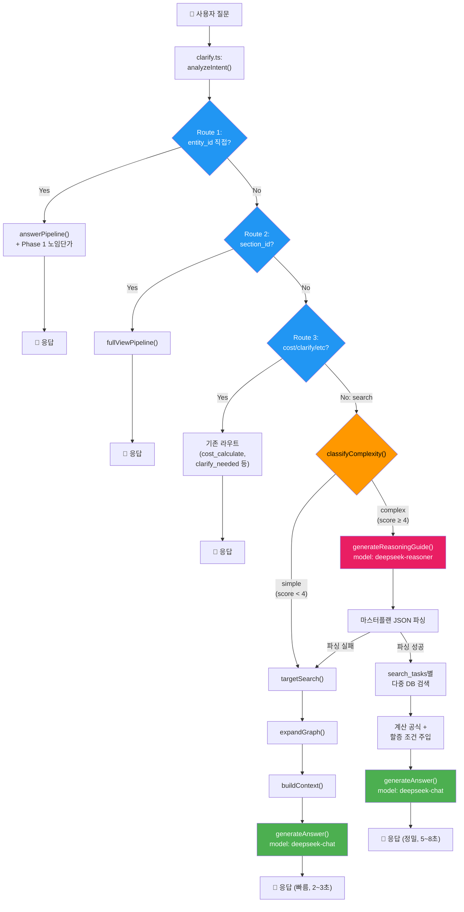

# 건설품셈 RAG 시스템 — 3단계 고도화 최종 통합 구현 계획서

> **작성일**: 2026-02-21  
> **버전**: v2.0 (최종 통합본)  
> **기반**: Antigravity 원안 + Claude 검증 보고서 보정 5건 반영  
> **목표**: NotebookLM 수준의 복합 추론 + DB 기반 정확도 100%의 건설 특화 AI 시스템  
> **핵심 전략**: DeepSeek V3.2 `deepseek-chat`(비사고) ↔ `deepseek-reasoner`(사고) 자동 스위칭

---

## 0. Claude 검증 보정 추적표

> [!IMPORTANT]
> 아래 5건은 Claude의 코드 레벨 검증에서 지적된 사항이며, **본 계획서에 모두 반영 완료**되었습니다.

| # | 보정 항목 | 심각도 | 원안 문제점 | 본 계획서 반영 내용 | 반영 위치 |
|---|---|---|---|---|---|
| 1 | `related_name` 정제 누락 | ❌ 치명적 | `"200_SCH_40_용접공"`을 정제 없이 DB 검색 → 매칭 실패 → 단가 0원 | `split('_').slice(-1)[0]` 정제 로직 추가 | Phase 1 §1-2 |
| 2 | `handleChat()` 분기 위치 오류 | ❌ 구조적 | `analyzeIntent()` 직후 삽입 → 기존 Route 1~3 파괴 | **Route 4 직전**으로 이동 | Phase 2 §2-4 |
| 3 | `costMap` 1:N 매칭 문제 | ⚠️ 보정 | "용접공" ILIKE → "플랜트용접공"도 걸림 → 잘못된 단가 매핑 | `findBestCostMatch()` 헬퍼 도입 | Phase 1 §1-3 |
| 4 | 우회 추론 vs 환각 억제 모순 | ❌ 위험 | SYSTEM_PROMPT에 직접 넣으면 기존 S급 정확도 붕괴 | **Reasoner 전용 프롬프트에만 격리** | Phase 3 §3-2 |
| 5 | `deepseek-reasoner` API 제약 | ⚠️ 주의 | system role 미지원 가능성 + temperature 에러 가능 | user prefix 폴백 + temperature 제거 | Phase 2 §2-3 |

---

## 1. Phase 1: 2026 노임단가 정밀 연동

> 현재 문제: `fetchLaborCosts()`로 가져온 단가를 텍스트 테이블로만 context에 추가 → LLM에게 곱셈 위임 → 계산 오류(할루시네이션) 위험  
> 해결: 백엔드에서 `(단가 × 수량)` 산술 연산을 미리 수행하여 **확정된 결과**를 context에 기록

---

### §1-1. 사전연산 로직 구현

#### [MODIFY] [index.ts](file:///g:/My%20Drive/Antigravity/supabase/functions/rag-chat/index.ts) — `answerPipeline()` 내 `[4-1]` 블록 (L356~L373)

```typescript
// ─── [4-1] cost_calculate/report_request 시 노임단가 사전연산 주입 ───
// Why: LLM이 0.122 × 215,907을 직접 계산하면 할루시네이션 위험
//      서버에서 미리 곱셈을 마치고 확정된 표를 전달 → LLM은 복사만 → 정확도 100%
if (effectiveIntent === "cost_calculate" || effectiveIntent === "report_request") {
    // ⭐ [Claude 보정 1] related_name 정제: "200_SCH_40_용접공" → "용접공"
    const laborItems = relationsAll.flat()
        .filter(r => r.relation === "REQUIRES_LABOR")
        .map(r => {
            const props = (r.properties || {}) as any;
            const rawName = r.related_name || "";
            const cleanName = rawName.includes('_')
                ? rawName.split('_').slice(-1)[0]  // 마지막 '_' 이후 = 직종명
                : rawName;
            return {
                name: cleanName,
                rawName: rawName,                          // 디버깅용 원본 보존
                quantity: parseFloat(props.quantity) || 0,  // 문자열→숫자 안전 변환
                unit: props.unit ?? "인",
                work_type: props.work_type_name ?? "",
                per_unit: props.per_unit ?? "",
            };
        })
        .filter(item => item.name);  // 빈 이름 제거

    if (laborItems.length > 0) {
        const uniqueJobNames = [...new Set(laborItems.map(l => l.name))];
        const laborCosts = await fetchLaborCosts(uniqueJobNames);

        // ⭐ [Claude 보정 3] costMap에서 최적 매칭 함수 사용
        const costMap = new Map(laborCosts.map(lc => [lc.job_name, lc.cost_2026]));

        if (laborCosts.length > 0) {
            context += "\n\n## [2026년 노임단가 기반 산출 결과 (백엔드 계산 완료)]\n";
            context += "| 직종 | 투입수량(인) | 노임단가(원/일) | 금액(원) | 비고 |\n";
            context += "|---|---:|---:|---:|---|\n";
            let totalCost = 0;
            laborItems.forEach(l => {
                const matched = findBestCostMatch(l.name, costMap);
                const unitCost = matched?.cost ?? 0;
                const matchedName = matched?.name ?? l.name;
                const amount = Math.round(Number(l.quantity) * unitCost);
                totalCost += amount;
                context += `| ${matchedName} | ${l.quantity} | ${unitCost.toLocaleString()} | ${amount.toLocaleString()} | ${l.work_type} |\n`;
            });
            context += `| **합계** | | | **${totalCost.toLocaleString()}** | |\n`;
            context += `\n> ⚠️ 위 금액은 백엔드에서 정확히 계산된 값입니다. LLM은 이 숫자를 그대로 출력하세요.\n`;
        }
    }
}
```

---

### §1-2. `related_name` 정제 로직 (Claude 보정 #1)

위 코드에 이미 반영 완료. 핵심:

```typescript
const cleanName = rawName.includes('_')
    ? rawName.split('_').slice(-1)[0]   // "200_SCH_40_용접공" → "용접공"
    : rawName;                           // "보통인부" → "보통인부" (그대로)
```

**Why**: `graph.ts`의 `expandGraph()`에서 `work_type_name`을 `related_name`에 prefix로 결합하는 패턴이 있어, 직종명 앞에 규격 정보가 붙습니다. 이를 정제하지 않으면 `fetchLaborCosts()`의 ILIKE 매칭이 실패하여 **단가 0원 장애**가 발생합니다.

---

### §1-3. `findBestCostMatch()` 헬퍼 (Claude 보정 #3)

#### [MODIFY] [index.ts](file:///g:/My%20Drive/Antigravity/supabase/functions/rag-chat/index.ts) — 최상단 유틸리티 영역에 추가

```typescript
// ─── 노임단가 최적 매칭 헬퍼 ───
// Why: "용접공"이 ILIKE로 "플랜트용접공", "특수용접공"까지 걸림
//      정확 일치 → 공백 정규화 → 부분 매칭 순으로 우선순위 결정
function findBestCostMatch(
    jobName: string,
    costMap: Map<string, number>
): { name: string; cost: number } | null {
    // 1) 정확 일치
    if (costMap.has(jobName)) {
        return { name: jobName, cost: costMap.get(jobName)! };
    }
    // 2) 공백 제거 정확 일치
    const normalized = jobName.replace(/\s+/g, '');
    for (const [key, cost] of costMap) {
        if (key.replace(/\s+/g, '') === normalized) {
            return { name: key, cost };
        }
    }
    // 3) 부분 문자열 포함 (shorter ⊂ longer) — 가장 짧은 매칭 우선
    let bestMatch: { name: string; cost: number } | null = null;
    for (const [key, cost] of costMap) {
        const keyNorm = key.replace(/\s+/g, '');
        if (keyNorm.includes(normalized) || normalized.includes(keyNorm)) {
            if (!bestMatch || key.length < bestMatch.name.length) {
                bestMatch = { name: key, cost };
            }
        }
    }
    return bestMatch;
}
```

---

### §1-4. LLM 프롬프트 강제화

#### [MODIFY] [llm.ts](file:///g:/My%20Drive/Antigravity/supabase/functions/rag-chat/llm.ts) — L82~L92

```typescript
if (options?.intent === "cost_calculate") {
    systemContent += `\n\n[특별 지침: 노무비 산출]
사용자가 노무비 / 인건비 계산을 요청했습니다. 아래 규칙을 엄격히 따르세요.
1. 컨텍스트의 [2026년 노임단가 기반 산출 결과] 섹션에 백엔드가 미리 계산한 정확한 금액 테이블이 있습니다.
2. 이 테이블의 숫자(투입수량, 노임단가, 금액, 합계)를 절대 수정하거나 재계산하지 마세요.
3. 해당 테이블을 마크다운 표로 그대로 출력하세요.
4. 임의로 숫자를 반올림하거나 변경하는 것은 금지합니다.
5. 추가 설명(할증 조건, 주의사항 등)은 표 아래에 부연할 수 있습니다.
6. 수량이 ${options.quantity || '미지정'}으로 주어졌습니다. 미지정이면 "1개소당" 기준으로 안내하세요.`;
}
```

---

## 2. Phase 2: DeepSeek V3.2 듀얼 모델 라우팅

> 핵심: 동일 API 키, 동일 URL에서 `model` 파라미터만 스위칭  
> `"deepseek-chat"` (비사고, 빠름) ↔ `"deepseek-reasoner"` (사고, 추론)

---

### §2-1. 복잡도 판별기 (`classifyComplexity`)

#### [MODIFY] [clarify.ts](file:///g:/My%20Drive/Antigravity/supabase/functions/rag-chat/clarify.ts) — 함수 추가

```typescript
// ─── 질문 복잡도 분류기 (Complexity Classifier) ───
// Why: 80%의 단순 질문은 deepseek-chat(저렴), 20%의 복합 질문만 deepseek-reasoner(추론) 사용
export function classifyComplexity(question: string, analysis: IntentAnalysis): "simple" | "complex" {
    let score = 0;

    // [기준 1] 질문 길이
    if (question.length > 80) score += 1;
    if (question.length > 150) score += 1;

    // [기준 2] 복수 공종 키워드 (예: "덕트 해체" + "보온 철거")
    const workPatterns = question.match(/[가-힣]{2,}(해체|철거|설치|시공|타설|용접|도장|방수|배관)/g) || [];
    if (workPatterns.length >= 2) score += 2;

    // [기준 3] 조건/상황 키워드 — 2개 이상일 때만 +2
    // ⭐ [Claude 보정 #5 권장] 개별 +1이 아닌 묶음 점수로 단일 조건 오탐 방지
    const conditionKeywords = ["높이", "고소", "지하", "수중", "야간", "협소", "위험",
        "할증", "보온", "단열", "보양", "양중", "인양", "해체", "철거"];
    const matchedConditions = conditionKeywords.filter(kw => question.includes(kw));
    if (matchedConditions.length >= 2) score += 2;
    else if (matchedConditions.length === 1) score += 1;

    // [기준 4] 물리량/단위 환산 필요 시그널
    if (/\d+\s*(mm|t|T|톤|kg|m²|㎡|m³|㎥)/.test(question)) score += 1;
    if (/두께|외경|내경|직경|지름|무게|중량/.test(question)) score += 1;

    // [기준 5] "어떻게 적용" 류의 가이드 요청
    if (/어떻게|적용|방법|산출|견적|내역/.test(question)) score += 1;

    console.log(`[classifyComplexity] score=${score}, conditions=${matchedConditions.join(",")}`);

    // ⭐ [Claude 보정 #5] 임계값 4점 (보수적 시작, 로그 관찰 후 조정)
    return score >= 4 ? "complex" : "simple";
}
```

---

### §2-2. Reasoner 마스터플랜 생성기

#### [MODIFY] [llm.ts](file:///g:/My%20Drive/Antigravity/supabase/functions/rag-chat/llm.ts) — 함수 추가

```typescript
// ─── DeepSeek Reasoner (사고 모드) — 복합 질문용 마스터플랜 생성기 ───
// Why: 복합 상황(다중 공종, 우회 추론, 단위 환산)은 사고 모드(CoT)가
//      체계적인 '계산 절차서'를 먼저 짜주고,
//      실제 답변은 비사고 모드(chat)가 DB 데이터를 매핑해서 빠르게 출력

const REASONER_SYSTEM_PROMPT = `당신은 건설 적산 전문가(Master Estimator)입니다.
사용자의 복합적인 건설 질문을 분석하여, 아래 형식의 JSON '작업 가이드(Master Plan)'를 생성하세요.
직접 답변하지 마세요. 오직 검색/계산 절차만 설계하세요.

[출력 JSON 형식]
{
  "reasoning_summary": "이 질문이 복합적인 이유와 접근 방법 요약 (한국어)",
  "search_tasks": [
    {
      "task_id": 1,
      "description": "검색 대상 설명",
      "search_keywords": ["키워드1", "키워드2"],
      "target_type": "WorkType",
      "unit": "ton",
      "why": "이 검색이 필요한 이유"
    }
  ],
  "calculations": [
    {
      "calc_id": 1,
      "description": "계산 설명",
      "formula": "π × D × L",
      "variables": { "D": "1.3m", "L": "미지정" },
      "why": "이 계산이 필요한 이유"
    }
  ],
  "adjustments": [
    {
      "type": "할증/보정 이름",
      "condition": "적용 조건",
      "rate": "비율",
      "apply_to": "적용 대상"
    }
  ],
  "final_output_format": "최종 출력 형식 지시"
}

[우회 추론 규칙 — Reasoner 전용]
1. 사용자가 질문한 규격이 품셈에 없을 경우:
   - 성질(중량, 재질, 형상)이 가장 유사한 상위 품셈의 검색 키워드를 search_tasks에 포함하세요.
   - why 필드에 "해당 규격은 일반 OO 범위를 벗어나므로, △△ 품셈을 준용" 형태로 근거를 명시하세요.
2. 여러 공종이 조합된 질문이면, 각 공종을 별도의 search_task로 분리하세요.
3. 단위 환산이 필요한 경우 calculations에 공식과 변수를 명시하세요.

[건설 도메인 수학 공식]
- 원통 표면적: π × 외경(m) × 길이(m) = ㎡
- 강판 중량: π × 외경(m) × 두께(m) × 비중(7.85) × 길이(m) = kg/m
- 1톤 환산 길이: 1000kg ÷ (단위중량 kg/m) = m
- 면적 환산: 원형 단면 → π × (D/2)² = ㎡`;

export async function generateReasoningGuide(
    question: string,
    history: ChatMessage[]
): Promise<{ guide: string; reasoning_content: string }> {

    // ⭐ [Claude 보정 #5] system role 미지원 폴백:
    //    reasoner가 system role을 무시할 수 있으므로, user 메시지에 합침
    const messages = [
        {
            role: "user" as const,
            content: `[시스템 지시]\n${REASONER_SYSTEM_PROMPT}\n\n[사용자 질문]\n${question}`,
        },
    ];

    // 대화 히스토리가 있으면 최근 2턴만 추가
    if (history.length > 0) {
        const recentHistory = history.slice(-2).map(msg => ({
            role: msg.role === "user" ? "user" as const : "assistant" as const,
            content: msg.content,
        }));
        // 히스토리를 첫 번째 user 메시지 앞에 삽입
        messages.unshift(...recentHistory);
    }

    const response = await fetch(DEEPSEEK_URL, {
        method: "POST",
        headers: {
            "Content-Type": "application/json",
            "Authorization": `Bearer ${DEEPSEEK_API_KEY}`,
        },
        body: JSON.stringify({
            model: "deepseek-reasoner",   // ← 사고 모드 스위치
            messages,
            max_tokens: 8192,
            // ⭐ [Claude 보정 #5] temperature 제거 — reasoner에서 자동 제어
        }),
    });

    if (!response.ok) {
        console.error(`[generateReasoningGuide] Reasoner API failed: ${response.status}`);
        // 폴백: 사고 모드 실패 시 빈 가이드 반환 → 기존 search 경로로 진행
        return { guide: "{}", reasoning_content: "" };
    }

    const data = await response.json();
    const guide = data.choices?.[0]?.message?.content ?? "{}";
    const reasoning = data.choices?.[0]?.message?.reasoning_content ?? "";

    console.log(`[generateReasoningGuide] guide_len=${guide.length}, reasoning_len=${reasoning.length}`);
    return { guide, reasoning_content: reasoning };
}
```

---

### §2-3. API 호환성 확인 사항 (Claude 보정 #5)

| 항목 | 대응 방안 | 상태 |
|---|---|---|
| `system` role | user 메시지에 `[시스템 지시]` prefix로 합침 | ✅ 코드 반영 완료 |
| `temperature` | reasoner 호출 시 파라미터 자체를 제거 | ✅ 코드 반영 완료 |
| `max_tokens` | reasoner 기본 32K, 우리는 8K 사용 (충분) | ✅ 적정 |
| API 에러 폴백 | 실패 시 빈 가이드 반환 → 기존 search 경로 계속 | ✅ 코드 반영 완료 |

---

### §2-4. 메인 파이프라인 분기 (Claude 보정 #2 반영)

#### [MODIFY] [index.ts](file:///g:/My%20Drive/Antigravity/supabase/functions/rag-chat/index.ts) — `handleChat()` 내부

> [!CAUTION]
> **삽입 위치가 핵심입니다.** `analyzeIntent()` 직후가 아닌, **Route 4(`searchPipeline`) 직전**에 삽입해야 기존 Route 1~3(entity_id 직접 조회, cost_calculate, clarify_needed 등)이 정상 동작합니다.

```typescript
// ═══════════════════════════════════════════════════════════
// handleChat() 내부 — Route 4 직전 (≈ L929 부근)
// ═══════════════════════════════════════════════════════════

// ─── Route 3.5: 복합 질문 → Reasoner 경로 (Phase 2) ───
// ⭐ [Claude 보정 #2] Route 4 직전에 삽입 — 기존 Route 1~3 보존
const complexity = classifyComplexity(question, analysis);
console.log(`[handleChat] complexity=${complexity}, intent=${analysis.intent}`);

if (complexity === "complex") {
    console.log(`[handleChat] 🧠 사고 모드(deepseek-reasoner) 가동`);

    try {
        // Step 1: Reasoner가 마스터플랜(작업 가이드) 생성
        const { guide, reasoning_content } = await generateReasoningGuide(question, history);

        // Step 2: 마스터플랜 파싱 (실패 시 기존 search 경로로 폴백)
        let parsedGuide: any = {};
        try { parsedGuide = JSON.parse(guide); } catch {
            console.warn("[handleChat] Reasoner 가이드 JSON 파싱 실패 → 기존 search 경로");
            // 폴백: 아래의 기존 searchPipeline으로 그냥 진행
        }

        const searchTasks = parsedGuide.search_tasks || [];

        if (searchTasks.length > 0) {
            // ── 마스터플랜 기반 다중 DB 검색 ──
            // ⭐ [Claude 보정 추가] context 라벨링으로 Chat이 DB 데이터만 인용하도록 유도
            let combinedContext = `## [AI 추론 가이드 (참고용 — 직접 인용 금지)]\n`;
            combinedContext += `${parsedGuide.reasoning_summary || ""}\n\n`;
            combinedContext += `## [DB 검색 결과 (아래 데이터만 사용하여 답변)]\n`;

            for (const task of searchTasks) {
                const taskEmbedding = await generateEmbedding(task.search_keywords.join(" "));
                const taskAnalysis = {
                    ...analysis,
                    keywords: task.search_keywords,
                    work_name: task.search_keywords[0],
                };
                const taskEntities = await targetSearch(taskAnalysis, taskEmbedding, task.search_keywords.join(" "));

                if (taskEntities.length > 0) {
                    const topEntities = taskEntities.slice(0, 5);
                    const taskRelations = await Promise.all(
                        topEntities.map(e => expandGraph(e.id, e.type))
                    );
                    const taskChunks = await retrieveChunks(topEntities);
                    combinedContext += `\n### ${task.task_id}. ${task.description}\n`;
                    combinedContext += `> 검색 근거: ${task.why}\n\n`;
                    combinedContext += buildContext(topEntities, taskRelations, [], taskChunks);
                    combinedContext += `\n---\n`;
                }
            }

            // 계산 공식 가이드 추가
            if (parsedGuide.calculations?.length > 0) {
                combinedContext += `\n## [적용 공식 (참고)]\n`;
                parsedGuide.calculations.forEach((calc: any) => {
                    combinedContext += `- ${calc.description}: \`${calc.formula}\` — ${calc.why}\n`;
                });
            }

            // 할증/보정 조건 추가
            if (parsedGuide.adjustments?.length > 0) {
                combinedContext += `\n## [할증/보정 조건]\n`;
                parsedGuide.adjustments.forEach((adj: any) => {
                    combinedContext += `- **${adj.type}**: ${adj.condition} → ${adj.rate} (${adj.apply_to})\n`;
                });
            }

            // Step 3: 최종 답변은 비사고 모드(deepseek-chat)로 빠르고 정확하게 출력
            const llmResult = await generateAnswer(question, combinedContext, history, {
                intent: analysis.intent,
            });

            // 소스 정보 조합
            const sources: SourceInfo[] = [{
                entity_name: "복합 추론 결과",
                entity_type: "ReasonerGuide",
                source_section: searchTasks.map((t: any) => t.description).join(", "),
            }];

            return makeAnswerResponse(llmResult.answer, startTime, {
                sources,
                embeddingTokens: 0,
                llmResult,
            });
        }
    } catch (err) {
        console.error("[handleChat] Reasoner 경로 에러:", err, "→ 기존 search 경로로 폴백");
    }
}

// ═══ Route 4: search → searchPipeline (기존 단순 경로, 변경 없음) ═══
return searchPipeline(analysis, question, history, startTime, answerOptions);
```

---

## 3. Phase 3: 복합 추론 파이프라인 강화

---

### §3-1. 도메인 수학 공식 — Chat SYSTEM_PROMPT에 추가 ✅

#### [MODIFY] [llm.ts](file:///g:/My%20Drive/Antigravity/supabase/functions/rag-chat/llm.ts) — `SYSTEM_PROMPT` 내 `[금지 사항]` 바로 위에 삽입

```markdown
[건설 도메인 수학 공식 — 참고용]
컨텍스트에 단위 환산이 필요한 데이터가 있을 때 아래 공식을 활용하세요.
- 원통 표면적: π × 외경(m) × 길이(m) = ㎡
- 강판 중량: π × 외경(m) × 두께(m) × 비중(7.85) × 길이(m) = kg/m
- 1톤 환산 길이: 1000kg ÷ (단위중량 kg/m) = m
- 면적 환산: 원형 단면 → π × (D/2)² = ㎡
※ 이 공식은 물리 상수에 기반한 고정값이므로 안전하게 사용 가능합니다.
```

**Why**: 비중 7.85, π 등은 사실에 기반한 고정 상수이므로 환각 위험 없이 LLM이 참조 가능.

---

### §3-2. 우회 추론 규칙 — Reasoner 전용 격리 ❌ (Chat SYSTEM_PROMPT에는 넣지 않음)

> [!WARNING]
> **Claude 보정 #4 (최대 리스크 영역) 반영**  
> "우회 추론 허용" 규칙을 Chat의 SYSTEM_PROMPT에 직접 넣으면:
> - 기존 규칙 *"컨텍스트에 없는 정보는 추측하지 않습니다"* 와 논리적 모순 발생
> - LLM이 "없으니 비슷한 걸 차용하겠다"고 자의적 판단 → 기존 S급 정확도 붕괴
>
> **해결**: 우회 추론 규칙은 **Reasoner(사고 모드)의 `REASONER_SYSTEM_PROMPT`에만 격리** (§2-2에 반영 완료)  
> Chat(비사고 모드)는 여전히 "context에 있는 데이터만 사용"하는 엄격한 규칙을 유지

**구조적 역할 분리:**

```
❌ 위험한 구조: Chat SYSTEM_PROMPT에 "우회 추론 허용" 직접 삽입
   → LLM이 자의적으로 우회 판단 → 환각 → 기존 정확도 붕괴

✅ 안전한 구조 (본 계획서 채택):
   Reasoner: "4T 덕트 → 철골재 철거 품셈을 검색하라" (search_tasks 생성)
     ↓
   백엔드: search_tasks로 DB 검색 → 실제 엔티티/관계 데이터 획득
     ↓
   Chat: context에 있는 DB 데이터만으로 답변 (기존 환각 억제 규칙 유지)
```

---

### §3-3. IntentAnalysis 타입 확장

#### [MODIFY] [types.ts](file:///g:/My%20Drive/Antigravity/supabase/functions/rag-chat/types.ts) — `IntentAnalysis`

```diff
 export interface IntentAnalysis {
     intent: "search" | "clarify_needed" | "followup" | "greeting"
-        | "quantity_input" | "cost_calculate" | "modify_request" | "report_request";
+        | "quantity_input" | "cost_calculate" | "modify_request" | "report_request"
+        | "complex_estimate";
     // ... 기존 필드 유지
+    complexity?: "simple" | "complex";  // 듀얼 모델 라우팅용
 }
```

**파급효과**: TypeScript union type 확장이므로 기존 코드에 영향 없음.

---

## 전체 아키텍처 흐름도 (최종)



---

## 수정 대상 파일 요약

| Phase | 파일 | 변경 유형 | 핵심 변경 | Claude 보정 반영 |
|---|---|---|---|---|
| 1 | [index.ts](file:///g:/My%20Drive/Antigravity/supabase/functions/rag-chat/index.ts) | MODIFY | 노임단가 서버 사전 계산 + `findBestCostMatch()` | #1 #3 |
| 1 | [llm.ts](file:///g:/My%20Drive/Antigravity/supabase/functions/rag-chat/llm.ts) | MODIFY | `cost_calculate` 프롬프트 강제화 | — |
| 2 | [clarify.ts](file:///g:/My%20Drive/Antigravity/supabase/functions/rag-chat/clarify.ts) | MODIFY | `classifyComplexity()` 함수 추가 (임계값 4) | #5 |
| 2 | [llm.ts](file:///g:/My%20Drive/Antigravity/supabase/functions/rag-chat/llm.ts) | MODIFY | `generateReasoningGuide()` 함수 추가 | #4 #5 |
| 2 | [index.ts](file:///g:/My%20Drive/Antigravity/supabase/functions/rag-chat/index.ts) | MODIFY | `handleChat()` Route 4 직전에 complex 분기 | #2 |
| 3 | [llm.ts](file:///g:/My%20Drive/Antigravity/supabase/functions/rag-chat/llm.ts) | MODIFY | 도메인 수학 공식만 SYSTEM_PROMPT 추가 | #4 |
| 3 | [types.ts](file:///g:/My%20Drive/Antigravity/supabase/functions/rag-chat/types.ts) | MODIFY | `IntentAnalysis` 타입 확장 | — |

> `graph.ts`, `search.ts`, `context.ts`, `resolve.ts`, `config.ts`는 **변경 없음** (기존 코드 안전)

---

## 기존 Route별 파급효과 분석

| 기존 Route | Phase 1 | Phase 2 | Phase 3 |
|---|---|---|---|
| Route 1 (entity_id 칩 클릭) | ✅ 사전연산 적용 | ✅ 무영향 (분기 이전) | ✅ 무영향 |
| Route 2 (section_id full_view) | ✅ 무영향 | ✅ 무영향 (분기 이전) | ✅ 무영향 |
| cost_calculate | ✅ 사전연산 적용 | ✅ 무영향 (분기 이전) | ✅ 무영향 |
| clarify_needed | ✅ 무영향 | ✅ 무영향 (분기 이전) | ✅ 무영향 |
| Route 4 (search, 단순) | ✅ 무영향 | ✅ 기존 경로 유지 | ⚠️ 공식 추가 영향 |
| Route 3.5 (search, 복합) | — | ⚠️ **신규 경로 추가** | ⚠️ Reasoner 의존 |

---

## 권장 구현 순서

```
Phase 1 (즉시 — 1일)
  ├─ index.ts: laborItems 정제 + findBestCostMatch() + 사전연산
  ├─ llm.ts: cost_calculate 프롬프트 강화
  └─ 배포 후 검증: "강관용접 200mm SCH 40 10개소 노무비"
       ↓
Phase 2-1 (1~2일)
  ├─ clarify.ts: classifyComplexity() 추가 (임계값 4점)
  ├─ llm.ts: generateReasoningGuide() 추가
  ├─ DeepSeek Reasoner API 실제 호출 테스트 (system role 동작 확인)
  └─ 단위 테스트: complexity 점수 로깅 확인
       ↓
Phase 2-2 (1일)
  ├─ index.ts: handleChat() Route 4 직전에 complex 분기 삽입
  └─ 배포 후 검증: "원형 덕트 4T 1300mm 해체" → Reasoner 로그 확인
       ↓
Phase 3 (1~2일)
  ├─ llm.ts: SYSTEM_PROMPT에 도메인 수학 공식만 추가
  ├─ types.ts: IntentAnalysis 타입 확장
  ├─ ❌ Chat SYSTEM_PROMPT에는 우회 추론 규칙 넣지 않음
  └─ 배포 후 검증: NotebookLM 동일 질문 비교 테스트
```

---

## 비용 예측

| 구분 | 현재 (chat Only) | 듀얼 모델 적용 후 |
|---|---|---|
| 단순 질문 (80%) | ~₩2/건 | ~₩2/건 (변동 없음) |
| 복합 질문 (20%) | ~₩2/건 (품질 낮음) | ~₩8~12/건 (reasoner 추가) |
| **월간 예상** (일 100건) | ~₩6,000 | ~₩8,400 (+40%) |

> [!TIP]
> 월 비용 증가분은 약 ₩2,400(~$1.7)이지만, 복합 질문 품질이 NotebookLM 수준으로 급상승하므로 ROI 극대화
