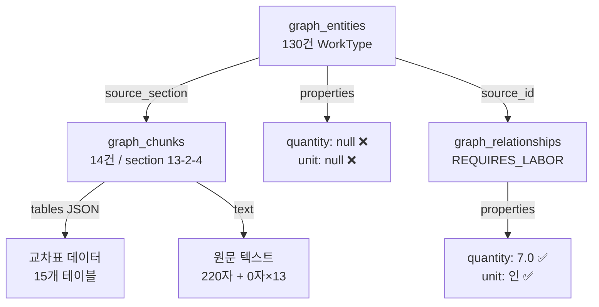
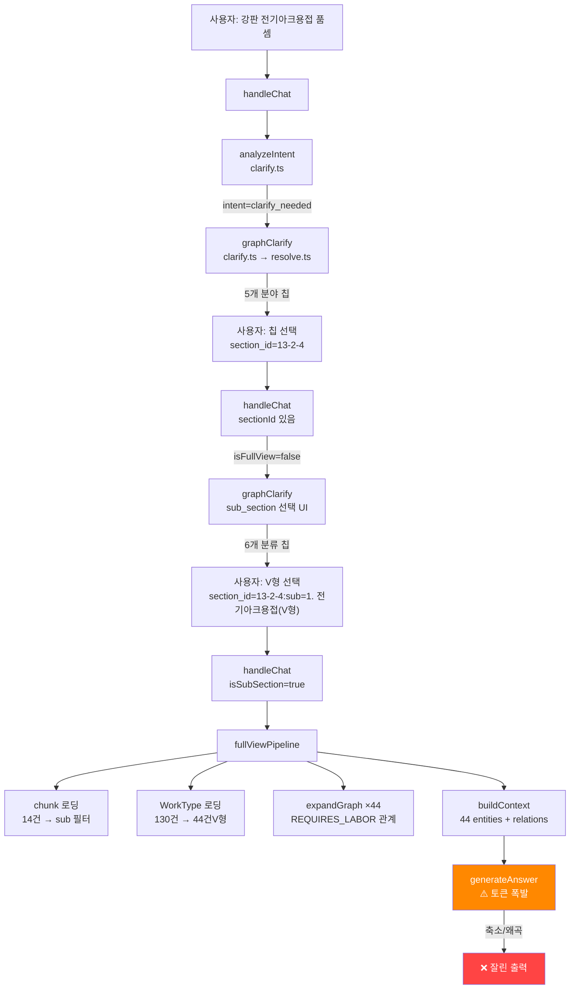

# 📋 강판 전기아크용접 출력값 축소/왜곡 문제 — 상세 진단 리포트

> **작성일**: 2026-02-27  
> **대상 시스템**: 품셈 AI 챗봇 (Edge Function `rag-chat`)  
> **프로덕션 URL**: https://main.antigravity-chatbot.pages.dev/  
> **증상**: "강판 전기아크용접" 검색 시 수치 데이터가 축소·왜곡되거나 아예 표시 안 됨

---

## 1. 증상 요약

### 1.1 사용자 시나리오

| 단계 | 사용자 입력 | 챗봇 응답 | 문제점 |
|:---:|---|---|---|
| 1 | "강판 전기아크용접 품셈 알려줘" | **5개 분야** clarify 칩 제시 (13-2-4, 13-2-2, etc.) | ❌ 수치 없이 선택만 요구 |
| 2 | 분야 칩 선택 (13-2-4) | **6개 분류** clarify 재제시 (V형 44건, U형 29건...) | ❌ 여전히 수치 없음 |
| 3 | 분류 칩 선택 (e.g. V형) | LLM 응답 생성 → 테이블 **축소/왜곡** | ❌ 값이 부정확하거나 잘림 |

### 1.2 기대 동작 vs 실제 동작

```
기대: 두께별 소요전력/용접봉사용량/인력 교차표가 정확한 수치로 출력
실제: clarify 무한 루프 or LLM이 수치를 임의로 요약/축소/누락
```

---

## 2. 데이터 계층 분석

### 2.1 DB 테이블 구조



### 2.2 section 13-2-4 데이터 현황

#### graph_chunks (14건)

| chunk_id | tables 수 | text 길이 | 비고 |
|---|:---:|:---:|---|
| C-0956-A | 1 | 220자 | V형(두께 3~6mm) |
| C-0956-B | 1 | 0자 | V형(두께 7~10mm) |
| C-0956-C | 1 | 0자 | V형(두께 11~14mm) |
| C-0956-D | 2 | 0자 | V형(15mm) + U형(15~30mm) |
| C-0956-E ~ N | 각 1 | 0자 | U형/H형/X형/Fillet 데이터 |

> [!IMPORTANT]
> **14개 chunk에 15개 테이블**이 JSON으로 정밀 저장됨. text는 거의 비어있고, **실제 데이터는 `tables` 필드에 집중**.

#### graph_entities — WorkType 분포 (총 130건)

| sub_section | 개수 | 예시 entity name |
|---|:---:|---|
| 0. 전기아크용접(총괄) | 1 | — |
| 1. 전기아크용접(V형) | **44** | `강판 전기아크용접(10, SCH 소요전력(kWh))` |
| 2. 전기아크용접(U형) | **29** | `강판 전기아크용접(20, SCH 인 력(인))` |
| 3. 전기아크용접(H형) | **16** | `강판 전기아크용접(H, 15mm 용접봉사용량(kg))` |
| 4. 전기아크용접(X형) | **23** | `강판 전기아크용접(X, 25mm 소요전력(kWh))` |
| 5. 전기아크용접(Fillet용접) | **17** | `강판 전기아크용접(Fillet, 6mm 인 력(인))` |

> [!WARNING]
> entity name에 **(두께, SCH, 측정항목)** 이 모두 포함된 비정규화 구조. `properties.quantity`와 `properties.unit`은 **모두 null**. 실제 수치는 `graph_relationships.properties.quantity`에만 존재.

#### graph_relationships — 실체 수치 데이터

`W-0530` (강판 전기아크용접(10, SCH 소요전력(kWh))) 기준:

| relation | target | quantity | unit | 비고 |
|---|---|:---:|---|---|
| REQUIRES_LABOR | 하향 (L-0454) | 7.0 / 4.7 | 인 | ⚠️ 중복(2건) |
| REQUIRES_LABOR | 횡향 (L-0484) | 8.0 / 5.25 | 인 | ⚠️ 중복(2건) |
| REQUIRES_LABOR | 입향 (L-0310) | 8.4 / 6.1 | 인 | ⚠️ 중복(2건) |
| REQUIRES_LABOR | 상향 (L-0250) | 5.7 | 인 | 1건 |
| BELONGS_TO | Section S-0266 | — | — | 소속 관계 |

> [!CAUTION]
> 동일 source→target 관계에 **quantity가 다른 중복 레코드**가 존재 (7.0 vs 4.7 등). 이는 추출 파이프라인의 merge 과정에서 발생한 것으로, **어떤 값이 정확한지 판별 불가**. 반면 `graph_chunks.tables` JSON에는 정확한 원본값이 보존됨.

#### graph_chunks.tables JSON — 원본 데이터 샘플

```json
// C-0956-A, 테이블 T-13-2-4-01-1 (V형, 두께 3~6mm)
{
  "type": "D_기타",
  "table_id": "T-13-2-4-01-1",
  "headers": ["구분 자세 및 직종 두께(mm)", "용접봉사용량(kg)_하향", ...],
  "rows": [
    {
      "구분 자세 및 직종 두께(mm)": 3,
      "소요전력(kWh)_하향": "0.60",
      "소요전력(kWh)_횡향": "0.70",
      "소요전력(kWh)_입향": "0.90",
      "용접봉사용량(kg)_하향": 0.17,
      "용접봉사용량(kg)_횡향": "0.20",
      "용접봉사용량(kg)_입향": 0.22,
      "인 력(인)_하향_용접공": "0.030",
      "인 력(인)_하향_특별인부": 0.009,
      "인 력(인)_횡향_용접공": 0.036,
      "인 력(인)_횡향_특별인부": 0.011,
      "인 력(인)_입향_용접공": 0.044,
      "인 력(인)_입향_특별인부": 0.013
    },
    // ... 두께 4mm, 5mm, 6mm 행
  ]
}
```

> ✅ **이 JSON이 가장 정확한 원본 데이터**. 두께×자세×직종×측정항목이 완전한 교차표 형태.

---

## 3. 코드 흐름 추적

### 3.1 전체 파이프라인 흐름도



### 3.2 핵심 함수별 문제점

#### ① `handleChat()` — [index.ts:1078-1252](file:///g:/My%20Drive/Antigravity/pjt/pumsem/supabase/functions/rag-chat/index.ts#L1078-L1252)

```
Route 2: section_id 있으면 →
  isSubSection이면 → fullViewPipeline()  ✅ 여기까지는 정상
  아니면 → graphClarify() (Step 2 drill-down)
```

- **문제**: `sectionId="13-2-4"` 진입 시 `isFullView=false` → `graphClarify`로 빠짐 → 6개 sub_section 칩 제시
- WT 130건이 있으므로 `searchPipeline` 경로에서도 `childWorkTypes.length > 3` → clarify 분기

#### ② `fullViewPipeline()` — [index.ts:405-663](file:///g:/My%20Drive/Antigravity/pjt/pumsem/supabase/functions/rag-chat/index.ts#L405-L663)

sub_section 선택 후 진입하는 메인 응답 생성 경로.

```
[1] chunk 로딩: 14건 → sub 필터 → 관련 chunk만 남김
[2] chunk 병합: text + tablesToMarkdown(tables) → 하나로 합침
[3] WorkType 로딩: 130건 → sub_section 필터 → 44건(V형)
    → expandGraph() × 44 = REQUIRES_LABOR 관계 수백 건
[4] context 생성:
    - sub_section 모드 → chunk.text 제외 (line 631)  ← ⚠️ 원문 JSON 테이블도 함께 제외됨
    - buildContext(44 entities, relations) → 매트릭스 테이블 44건 렌더링
[5] LLM 호출 → 응답 생성
```

**핵심 문제 (line 627-642)**:
```typescript
if (fullSubSection) {
    // sub_section 모드: chunk.text 제외 → 그래프 데이터만 사용
    contextParts.push(`**선택된 분류**: ${fullSubSection}`);
    // ⚠️ 여기서 graph_chunks.tables의 정밀 데이터가 제외됨!
    contextParts.push(buildContext(wtEntities, relationsAll, [], [], fullSubSection));
} else {
    contextParts.push(buildContext(wtEntities, relationsAll, [], [chunk as ChunkResult]));
}
```

#### ③ `buildContext()` — [index.ts:152-300](file:///g:/My%20Drive/Antigravity/pjt/pumsem/supabase/functions/rag-chat/index.ts#L152-L300)

```
각 entity마다:
  - properties 표시 (spec, quantity 등) → ⚠️ 모두 null
  - 관계 그룹화 (REQUIRES_LABOR, USES_MATERIAL 등)
  - renderMatrixTable()로 교차표 렌더링
```

**문제**: 44개 entity × 각 3~8개 관계 = 수백 행의 Markdown → LLM 입력 토큰 폭발

#### ④ `renderMatrixTable()` — [index.ts:52-131](file:///g:/My%20Drive/Antigravity/pjt/pumsem/supabase/functions/rag-chat/index.ts#L52-L131)

```
items에서 (name, spec, quantity) 추출 → spec별 교차표 생성
```

**문제**: 
- `item.related_name`에서 spec을 추출하는 로직이 `_` 기반 split → 강판 용접 데이터의 이름 구조와 불일치
- 결과적으로 spec이 `-`로 표시되어 교차표가 아닌 단순 플랫 테이블로 폴백

#### ⑤ `tablesToMarkdown()` — [index.ts:133-150](file:///g:/My%20Drive/Antigravity/pjt/pumsem/supabase/functions/rag-chat/index.ts#L133-L150)

```
graph_chunks.tables JSON → Markdown 테이블 변환
```

**현황**: 함수 자체는 동작하지만, sub_section 모드에서 `fullViewPipeline`이 chunk.text를 제외하므로 **호출 자체가 안 됨**.

---

## 4. 근본 원인 종합 (4가지)

### 🔴 원인 1: entity에 수치 데이터 부재

```
graph_entities.properties.quantity = null
graph_entities.properties.unit = null
```

WorkType entity가 `강판 전기아크용접(10, SCH 소요전력(kWh))` 식으로 **이름에 측정 항목을 인코딩**하여, 실제 수량은 entity properties가 아닌 `graph_relationships.properties.quantity`에만 존재. `buildContext`가 entity properties를 표시할 때 빈 값만 나옴.

### 🔴 원인 2: 130건 WorkType → clarify 무한 루프

`searchPipeline` line 787:
```typescript
if (childWorkTypes && childWorkTypes.length > 3) {
    // → graphClarify() 호출 = 항상 clarify 분기
}
```

130건 → 6개 sub_section 선택 → 44건(V형) → fullViewPipeline이지만, 사용자가 처음부터 "V형"을 모르면 최소 **2번의 clarify** 단계를 거쳐야 함.

### 🔴 원인 3: sub_section 모드에서 graph_chunks.tables 제외

`fullViewPipeline` line 627-631:
```typescript
if (fullSubSection) {
    // chunk.text 제외! (graph_chunks.tables 포함)
    // = 가장 정확한 원본 데이터가 LLM context에서 빠짐
}
```

**Why this matters**: `graph_relationships`의 quantity는 중복·불일치 가능성이 있지만, `graph_chunks.tables` JSON은 원본 그대로이므로 가장 신뢰할 수 있는 데이터.

### 🔴 원인 4: LLM 토큰 초과 → 출력 축소/왜곡

44개 entity × 각 관계 데이터 → `buildContext` 출력이 수천 줄의 Markdown → Gemini/DeepSeek의 **출력 토큰 한계(~4K~8K)** 초과 → 테이블이 중간에 잘리거나, LLM이 자체적으로 "요약"하면서 수치를 변경.

---

## 5. 해결 방안 (수정 작업 가이드)

### 옵션 A: graph_chunks.tables 직접 렌더링 (⭐ 추천)

**개요**: sub_section 선택 시, `graph_chunks.tables` JSON을 서버에서 직접 파싱하여 Markdown 교차표로 변환 → LLM에는 이 완성된 테이블을 "그대로 출력하라"고 전달.

**수정 대상**:
- `fullViewPipeline()` in `index.ts` (line 405~663)

**수정 내용**:
```
1. sub_section 진입 시, allChunks에서 tables JSON 추출
2. tables JSON을 tablesToMarkdown()으로 변환 (이미 존재하는 함수)
3. 변환된 Markdown 테이블을 contextParts에 직접 삽입
4. entity/relationship 기반 buildContext는 보조 정보로만 사용
5. LLM에게 "아래 테이블을 그대로 출력하라" 프롬프트 강화
```

**장점**: 정확도 100%, LLM 토큰 절약, 기존 `tablesToMarkdown()` 함수 재활용
**단점**: sub_section별 테이블 필터 로직 추가 필요

---

### 옵션 B: entity 그룹핑 + 매트릭스 축소

**개요**: 44개 entity를 두께별로 그룹핑 → 두께 × 자세 교차표 1개로 통합 → context 크기 대폭 감소.

**수정 대상**:
- `buildContext()` in `index.ts`
- `renderMatrixTable()` in `index.ts`

**장점**: 기존 코드 구조 유지
**단점**: entity name 파싱 로직이 복잡하고 취약

---

### 옵션 C: complex_table_specs 확장

**개요**: 현재 배관(13-1-1)만 지원하는 `complex_table_specs` DB에 강판 용접(13-2-4) 데이터를 적재 → `complexTablePipeline`으로 처리.

**수정 대상**:
- `complex_table_specs` DB 테이블
- `COMPLEX_TABLE_TRIGGERS` config in `index.ts`
- `detectComplexTable()` in `index.ts`

**장점**: `complexTablePipeline` 검증 완료, 노임단가 계산 포함
**단점**: 데이터 마이그레이션 필요(graph_chunks.tables → complex_table_specs)

---

## 6. 데이터 정합성 요약

| 저장소 | 데이터 존재 | 정확도 | 현재 활용 여부 | 비고 |
|---|:---:|:---:|:---:|---|
| `graph_chunks.tables` (JSON) | ✅ 15개 테이블 | ✅ 원본 그대로 | ❌ sub_section에서 제외 | **가장 신뢰** |
| `graph_relationships` (properties) | ✅ 수백 건 | ⚠️ 중복 존재 | ⚠️ 간접 활용 | 중복 레코드 문제 |
| `graph_entities` (properties) | ❌ null | — | ❌ | quantity/unit 미저장 |
| `complex_table_specs` | ❌ 13-1-1만 | — | ❌ | 강판 용접 미지원 |

---

## 7. 관련 코드 파일

| 파일 | 역할 | 핵심 함수 |
|---|---|---|
| [index.ts](file:///g:/My%20Drive/Antigravity/pjt/pumsem/supabase/functions/rag-chat/index.ts) | 메인 파이프라인 | `handleChat`, `fullViewPipeline`, `searchPipeline`, `buildContext`, `renderMatrixTable`, `tablesToMarkdown` |
| [clarify.ts](file:///g:/My%20Drive/Antigravity/pjt/pumsem/supabase/functions/rag-chat/clarify.ts) | 의도 분석 + 명확화 | `analyzeIntent`, `graphClarify` |
| [resolve.ts](file:///g:/My%20Drive/Antigravity/pjt/pumsem/supabase/functions/rag-chat/resolve.ts) | 계층 탐색 + UI 생성 | `resolveSection`, `presentClarify`, `buildSelectorPanel` |
