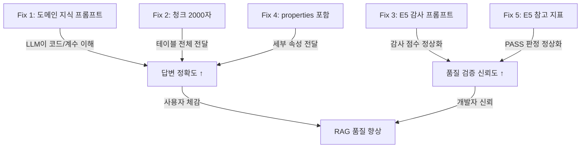

# RAG 답변 품질 진단 및 해결책

> **모드**: M (진단 + 구현)  
> **핵심 문제**: 추출 파이프라인이 아무리 좋아도, **답변 LLM이 컨텍스트를 이해 못하면** 사용자에겐 무의미  
> **분석 대상**: [index.ts](file:///g:/%EB%82%B4%20%EB%93%9C%EB%9D%BC%EC%9D%B4%EB%B8%8C/Antigravity/python_code/supabase/functions/rag-chat/index.ts) (978줄)

---

## Phase 1: 구조적 진단

### 현재 RAG 답변 체인


> 🔴 **빨간 노드가 문제 지점** — F(컨텍스트 조합)와 G(LLM 답변 생성)

### 진단된 5개 문제점

| # | 문제 | 위치 | 심각도 | 영향 |
|---|---|---|---|---|
| **P1** | 컨텍스트에 **도메인 해석 가이드** 없음 | `SYSTEM_PROMPT` | 🔴 HIGH | LLM이 품셈 테이블 구조(계수, 코드체계)를 모름 |
| **P2** | 원문 청크 **500자 절삭** | `retrieveChunks` L481 | 🔴 HIGH | 테이블 데이터가 잘려서 LLM에 불완전 전달 |
| **P3** | E5 감사 프롬프트에 **품셈 도메인 지식** 없음 | `check_E5` | 🟡 MED | 감사 점수가 실제보다 낮게 나옴 (오판) |
| **P4** | 엔티티 `properties` 내용이 context에 **미포함** | `buildContext` L510 | 🟡 MED | 수량/단위/규격 등 핵심 정보 누락 가능 |
| **P5** | LLM 모델이 **Gemini Flash** 고정 | `generateAnswer` L714 | 🟢 LOW | Flash는 복잡 추론에 약함 (비용 대비 OK) |

---

## Phase 2: 5단계 해결책

### Fix 1. 시스템 프롬프트에 도메인 지식 주입 [P1]

**현상**: LLM이 "계수 A~E", "7205-0540" 같은 품셈 고유 코드를 모름  
**해결**: SYSTEM_PROMPT에 품셈 도메인 가이드 추가

#### [MODIFY] [index.ts](file:///g:/%EB%82%B4%20%EB%93%9C%EB%9D%BC%EC%9D%B4%EB%B8%8C/Antigravity/python_code/supabase/functions/rag-chat/index.ts) — `SYSTEM_PROMPT` (L665~L711)

추가할 섹션:

```typescript
// SYSTEM_PROMPT에 아래 섹션 추가:

[품셈 도메인 지식]
1. **품셈서 구조**: 부문 > 장 > 절 > 표번호 형태. 표번호(예: 13-2-3)는 고유 식별자.
2. **표 구조**: 각 표는 공종명 + 규격별 소테이블로 구성.
   - 규격 예: "강관용접(200, SCH 40)" = 호칭경 200mm, 스케줄 40
   - 각 규격 아래 직종/수량/단위 테이블
3. **코드 체계**: "7205-0540" 같은 숫자는 건설기계 분류 코드.
   - 앞 4자리: 대분류, 뒤 4자리: 세분류
4. **계수/보정값**: "계수 A~E" 등은 조건별 보정 계수.
   원본 테이블에서 조건을 찾아 해당 계수를 적용하여 답변.
5. **단위**: "인" = 1인 1일 노동량 (8시간 기준)
   0.122인 = 약 58분(0.122 × 8시간 × 60분)의 노동
6. **컨텍스트에 누락된 정보가 있으면**:
   "원본 품셈에서 일부 데이터가 누락되었을 수 있습니다" 라고 고지.
```

---

### Fix 2. 원문 청크 절삭 제거 [P2]

**현상**: `chunk.text?.substring(0, 500)` — 테이블이 500자에서 잘림  
**영향**: "강관용접 200mm SCH 40 인력?" 질문 시, 해당 규격 행이 잘려서 안 보임

#### [MODIFY] [index.ts](file:///g:/%EB%82%B4%20%EB%93%9C%EB%9D%BC%EC%9D%B4%EB%B8%8C/Antigravity/python_code/supabase/functions/rag-chat/index.ts) — `retrieveChunks` (L478~L482)

```diff
-    // 각 청크 텍스트를 500자로 제한
-    return ((data || []) as ChunkResult[]).map((chunk) => ({
-        ...chunk,
-        text: chunk.text?.substring(0, 500) || "",
-    }));
+    // 청크 텍스트를 2000자로 확장 (테이블 포함 청크 보존)
+    // Why: 품셈 테이블은 규격별 행이 많아 500자면 불완전 전달
+    return ((data || []) as ChunkResult[]).map((chunk) => ({
+        ...chunk,
+        text: chunk.text?.substring(0, 2000) || "",
+    }));
```

> ⚠️ 2000자 확장 시 LLM input 토큰 증가 (~300→1200토큰/청크). 비용 영향 미미.

---

### Fix 3. E5 감사 프롬프트에 품셈 도메인 가이드 추가 [P3]

**현상**: 감사 LLM이 품셈 도메인을 모르므로 정당한 추출을 "불완전"으로 오판  
**해결**: `check_E5`의 감사 프롬프트에 도메인 가이드 삽입

#### [MODIFY] [step5_extraction_validator.py](file:///g:/%EB%82%B4%20%EB%93%9C%EB%9D%BC%EC%9D%B4%EB%B8%8C/Antigravity/python_code/phase2_extraction/step5_extraction_validator.py) — `check_E5` 내 감사 프롬프트

추가할 내용:

```python
# check_E5의 system prompt에 추가:
DOMAIN_GUIDE = """
[품셈 도메인 이해 가이드]
- 품셈서는 건설공사의 표준 투입량을 정의한 기준서입니다.
- 엔티티 타입: WorkType(공종), Material(자재), Equipment(장비), Labor(인력), Note(주의사항), Standard(기준)
- 테이블에서 숫자 코드(예: 7205-0540)는 건설기계 분류코드입니다. LLM이 이 코드에서 장비명을 추론하는 것은 정당합니다.
- "계수 A~E" 같은 보정계수 엔티티는 Note 타입으로 추출하는 것이 올바릅니다.
- 수량 단위 "인"은 1인 1일 노동량을 의미합니다.
- 원본 텍스트에 명시적으로 나타나지 않아도, 테이블 구조/코드에서 추론된 엔티티는 정당한 추출로 평가하세요.
"""
```

---

### Fix 4. 엔티티 properties를 context에 포함 [P4]

**현상**: `buildContext`에서 엔티티의 properties(규격, 수량 등)가 출력 안 됨  
**영향**: LLM이 엔티티의 세부 속성을 알 수 없음

#### [MODIFY] [index.ts](file:///g:/%EB%82%B4%20%EB%93%9C%EB%9D%BC%EC%9D%B4%EB%B8%8C/Antigravity/python_code/supabase/functions/rag-chat/index.ts) — `buildContext` (L510~L514)

```diff
     parts.push(
         `### ${idx + 1}. [표 ${sectionId}] ${entity.name} (${entity.type}, 유사도: ${entity.similarity?.toFixed(3)})`
     );
     parts.push(`**표번호**: ${sectionId}`);
     parts.push(`**출처**: ${sectionLabel}\n`);
+    // 엔티티 속성 표시 (규격, 수량, 단위 등)
+    const props = entity.properties || {};
+    const propEntries = Object.entries(props).filter(([k]) => !['embedding', 'source_chunk_ids'].includes(k));
+    if (propEntries.length > 0) {
+        parts.push(`**속성**: ${propEntries.map(([k, v]) => `${k}=${v}`).join(', ')}\n`);
+    }
```

---

### Fix 5. E5를 참고 지표로 변경 (선택적 PASS 판별) [P1+P3]

**현상**: E5 FAIL이 전체 verdict를 CONDITIONAL_PASS로 만듦  
**해결**: E5를 판정에서 제외하되, 리포트에는 기록

#### [MODIFY] [step5_extraction_validator.py](file:///g:/%EB%82%B4%20%EB%93%9C%EB%9D%BC%EC%9D%B4%EB%B8%8C/Antigravity/python_code/phase2_extraction/step5_extraction_validator.py) — `_judge` 메서드

```python
# E5는 판정에서 제외 (참고 지표)
# Why: LLM 자체 감사의 한계로 도메인 특수 데이터 평가 부정확
def _judge(self, checks):
    # E5 제외한 나머지로 판정
    judge_checks = [c for c in checks if c.name != 'E5']
    ...
```

---

## Integration Check



| Fix | 파급 효과 | 위험 |
|---|---|---|
| Fix 1 | 답변 품질 직접 개선 | 없음 — 프롬프트 추가만 |
| Fix 2 | 테이블 데이터 완전 전달 | LLM input 토큰 증가 (~$0.0001/쿼리) |
| Fix 3 | E5 점수 정상화 (0.57 → 0.75+ 예상) | 감사 비용 변동 없음 |
| Fix 4 | 세부 속성 답변 가능 | context 길이 소폭 증가 |
| Fix 5 | 전체 PASS 정상화 | E5 품질 게이트 약화 (의도적) |

---

## 실행 순서

1. **Fix 1 + Fix 4** → Edge Function 수정 + 재배포 (15분)
2. **Fix 2** → 청크 절삭 확장 (5분, Fix 1과 동시)
3. **RAG 테스트** → 기존 질문으로 답변 비교 (10분)
4. **Fix 3** → E5 감사 프롬프트 개선 (10분)
5. **Fix 5** → E5 판정 제외 (5분)
6. **Step5 재실행** → 개선된 E5 점수 확인 (10분)

> **총 소요: ~55분, 추가 비용: $0 (프롬프트/코드 수정만)**
